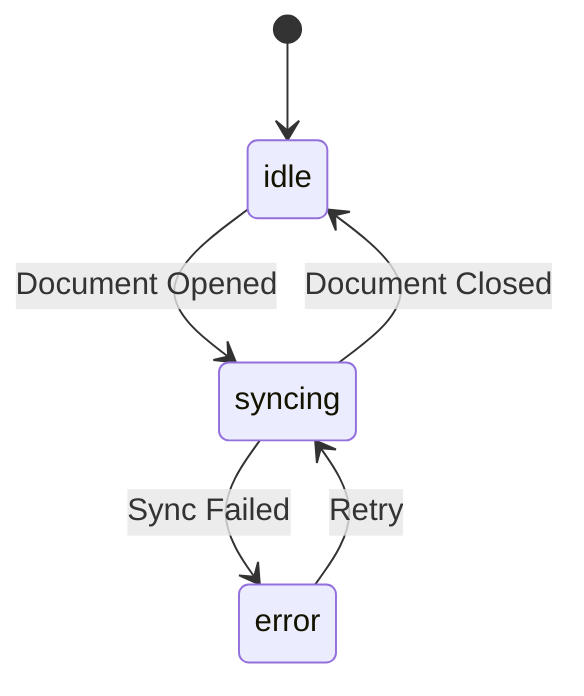

# Spec-Driven Development

Systematic workflow for turning feature ideas into structured specifications, designs, and actionable work items using Claude Agent SDK patterns.

## Workflow Overview

```
┌─────────────────┐     ┌──────────────────┐     ┌─────────────────┐
│  1. Understand  │────>│  2. Research     │────>│  3. Generate    │
│  Feature        │     │  (DeepWiki/C7)   │     │  Requirements   │
└─────────────────┘     └──────────────────┘     └─────────────────┘
                                                         │
                                                         ▼
┌─────────────────┐     ┌──────────────────┐     ┌─────────────────┐
│  6. Tasks       │<────│  5. Tickets      │<────│  4. Design Doc  │
│  (Children)     │     │  (Work Items)    │     │  (Technical)    │
└─────────────────┘     └──────────────────┘     └─────────────────┘
```

## Directory Structure

All spec artifacts are stored in `.omoi_os/`:

```
.omoi_os/
├── requirements/           # Requirements documents
│   ├── feature-name.md     # REQ-XXX-YYY format
│   └── ...
├── designs/                # Technical design documents
│   ├── feature-name.md     # Architecture, data models, APIs
│   └── ...
├── tickets/                # Work item tickets
│   ├── TKT-001.md          # Parent work items
│   └── ...
└── tasks/                  # Child tasks
    ├── TSK-001.md          # Individual actionable tasks
    └── ...
```

## Phase 1: Feature Understanding

### When to Enter This Phase
- User describes a new feature idea
- User wants to plan implementation
- User says "let's build..." or "I want to add..."

### Process

1. **Clarify the Feature**
   Ask targeted questions:
   - What problem does this solve?
   - Who are the users/actors?
   - What are the key interactions?
   - What systems does it touch?
   - What are the constraints?

2. **Confirm Understanding**
   Summarize back to user with:
   - Feature name (kebab-case identifier)
   - One-line description
   - Key user stories
   - Scope boundaries (in/out)

### Example Dialog

```
User: "I want to add real-time collaboration to the editor"

Claude: Let me clarify the feature:

**Feature**: real-time-collaboration
**Description**: Enable multiple users to edit documents simultaneously with live cursors and changes

**User Stories**:
1. As a user, I can see other editors' cursors in real-time
2. As a user, I can see changes appear as others type
3. As a user, I can see who is currently viewing the document

**Scope**:
- IN: Live cursors, text sync, presence indicators
- OUT: Voice/video, commenting (separate feature)

Is this correct? Any changes before I proceed to research?
```

## Phase 2: Research

### Using DeepWiki and Context7

Research libraries and patterns before creating specifications:

```python
# For GitHub repositories (architecture, implementation patterns)
mcp__deepwiki-mcp__read_wiki_structure(repoName="owner/repo")
mcp__deepwiki-mcp__ask_question(
    repoName="owner/repo",
    question="How is real-time collaboration implemented?"
)

# For library documentation (API, best practices)
lib_id = mcp__context7-mcp__resolve-library-id(libraryName="yjs")
mcp__context7-mcp__get-library-docs(
    context7CompatibleLibraryID=lib_id,
    topic="collaboration",
    mode="code"  # or "info" for concepts
)
```

### Research Questions by Feature Type

**Data/Storage Features:**
- What data models are needed?
- What are the storage patterns?
- What are the query patterns?

**API Features:**
- What endpoints are needed?
- What authentication/authorization?
- What error handling?

**Real-time Features:**
- What transport (WebSocket, SSE)?
- What sync algorithm (CRDT, OT)?
- What consistency model?

**Agent Features:**
- What tools are needed?
- What hooks/callbacks?
- What permissions model?

## Phase 3: Requirements Document

### Location
`.omoi_os/requirements/{feature-name}.md`

### Template Structure

See [references/requirements_template.md](references/requirements_template.md) for full template.

### Key Patterns

**Requirement IDs:**
```
REQ-{DOMAIN}-{AREA}-{NUM}

Examples:
REQ-COLLAB-SYNC-001    # Collaboration > Sync > Requirement 1
REQ-AUTH-JWT-002       # Auth > JWT > Requirement 2
REQ-AGENT-TOOL-003     # Agent > Tool > Requirement 3
```

**State Machines (Mermaid):**


**Configuration Tables:**
```markdown
| Parameter | Default | Range | Description |
|-----------|---------|-------|-------------|
| sync_interval_ms | 100 | 50-1000 | Sync frequency |
| max_peers | 10 | 1-50 | Maximum collaborators |
```

**Pydantic Models:**
```python
from pydantic import BaseModel, Field

class CollaboratorPresence(BaseModel):
    user_id: str
    cursor_position: int
    last_seen: datetime
    color: str = Field(description="Assigned cursor color")
```

## Phase 4: Design Document

### Location
`.omoi_os/designs/{feature-name}.md`

### Template Structure

See [references/design_template.md](references/design_template.md) for full template.

### Key Sections

1. **Architecture Overview** (Mermaid flowchart)
2. **Component Responsibilities** (table)
3. **Data Models** (SQL + Pydantic)
4. **API Specifications** (endpoints table)
5. **Integration Points** (external systems)
6. **Implementation Details** (algorithms, pseudocode)

### Claude Agent SDK Integration Patterns

When the feature involves agents, include:

**Custom Tools:**
```python
@tool("sync_document", "Sync document changes", {"doc_id": str, "changes": dict})
async def sync_document(args: dict[str, Any]) -> dict[str, Any]:
    # Implementation
    return {"content": [{"type": "text", "text": f"Synced {len(changes)} changes"}]}
```

**Hooks:**
```python
async def validate_changes(input_data, tool_use_id, context):
    """PreToolUse hook to validate changes before applying."""
    changes = input_data["tool_input"].get("changes", {})
    if not validate_change_format(changes):
        return {
            "hookSpecificOutput": {
                "hookEventName": "PreToolUse",
                "permissionDecision": "deny",
                "permissionDecisionReason": "Invalid change format"
            }
        }
    return {}
```

**Agent Options:**
```python
options = ClaudeAgentOptions(
    system_prompt="You are a document collaboration assistant.",
    mcp_servers={"collab": collab_server},
    allowed_tools=["mcp__collab__sync_document", "mcp__collab__get_peers"],
    hooks={
        "PreToolUse": [HookMatcher(matcher="sync_document", hooks=[validate_changes])]
    },
    max_turns=20,
    max_budget_usd=1.0
)
```

## Phase 5: Tickets

### Location
`.omoi_os/tickets/TKT-{NUM}.md`

### Template Structure

See [references/ticket_template.md](references/ticket_template.md) for full template.

### Ticket Generation Rules

1. **One ticket per major component** from design
2. **Clear acceptance criteria** mapped from requirements
3. **Dependencies** explicitly listed
4. **Estimates** in T-shirt sizes (S/M/L/XL)

### Example Ticket

```markdown
# TKT-001: Implement Sync Engine

**Status**: backlog
**Priority**: HIGH
**Estimate**: L
**Requirements**: REQ-COLLAB-SYNC-001, REQ-COLLAB-SYNC-002
**Design Reference**: designs/real-time-collaboration.md#sync-engine

## Description
Implement the core synchronization engine using CRDT for conflict-free merging.

## Acceptance Criteria
- [ ] CRDT data structure implemented
- [ ] Sync protocol handles concurrent edits
- [ ] P95 sync latency < 100ms

## Dependencies
- TKT-002: WebSocket infrastructure (must complete first)

## Tasks
- TSK-001: Implement CRDT data types
- TSK-002: Build sync protocol
- TSK-003: Add unit tests
```

## Phase 6: Tasks

### Location
`.omoi_os/tasks/TSK-{NUM}.md`

### Template Structure

See [references/task_template.md](references/task_template.md) for full template.

### Task Generation Rules

1. **Atomic units of work** (1-4 hours ideal)
2. **Clear deliverable** (file, test, endpoint)
3. **No ambiguity** in implementation approach
4. **Test requirements** included

### Example Task

```markdown
# TSK-001: Implement CRDT Data Types

**Status**: pending
**Parent Ticket**: TKT-001
**Estimate**: M
**Assignee**: (unassigned)

## Objective
Create CRDT data structures for text collaboration.

## Deliverables
- [ ] `src/collab/crdt.py` - CRDT implementation
- [ ] `tests/collab/test_crdt.py` - Unit tests

## Implementation Notes
Use RGA (Replicated Growable Array) for text sequences.
Reference: https://github.com/yjs/yjs

## Acceptance Criteria
- All unit tests pass
- Handles concurrent inserts at same position
- Maintains consistent ordering across replicas
```

## Interactive Workflow

### Starting a New Feature

```
User: "I want to build a notification system"

Claude: [Phase 1 - Understand]
Let me understand the feature...
[Asks clarifying questions]

Claude: [Phase 2 - Research]
Let me research notification patterns...
[Uses DeepWiki/Context7]

Claude: [Phase 3-6 - Generate]
Here's what I'll create:
1. .omoi_os/requirements/notifications.md
2. .omoi_os/designs/notifications.md
3. .omoi_os/tickets/TKT-00X.md (N tickets)
4. .omoi_os/tasks/TSK-00X.md (M tasks)

Shall I proceed?
```

### Updating Existing Specs

When updating:
1. Read existing spec first
2. Identify what changed
3. Update requirements → design → tickets → tasks (cascade)
4. Note revision in document history

## Best Practices

### Requirements
- Use normative language (SHALL, MUST, SHOULD, MAY)
- Include measurable criteria (latency < Xms)
- Reference related requirements explicitly

### Designs
- Architecture first, then details
- Include both happy path and error handling
- Provide pseudocode for complex algorithms

### Tickets
- Clear scope boundaries
- Explicit dependencies
- Realistic estimates

### Tasks
- Small enough to complete in one session
- Self-contained with all context needed
- Include test expectations

## Scripts

This skill includes utility scripts in `scripts/`:

- `init_feature.py` - Initialize directory structure for new feature
- `generate_ids.py` - Generate next ticket/task IDs
- `validate_specs.py` - Validate spec documents for completeness

## References

- [references/requirements_template.md](references/requirements_template.md) - Full requirements template
- [references/design_template.md](references/design_template.md) - Full design template
- [references/ticket_template.md](references/ticket_template.md) - Ticket template
- [references/task_template.md](references/task_template.md) - Task template
- [references/claude_sdk_patterns.md](references/claude_sdk_patterns.md) - Claude Agent SDK integration patterns
