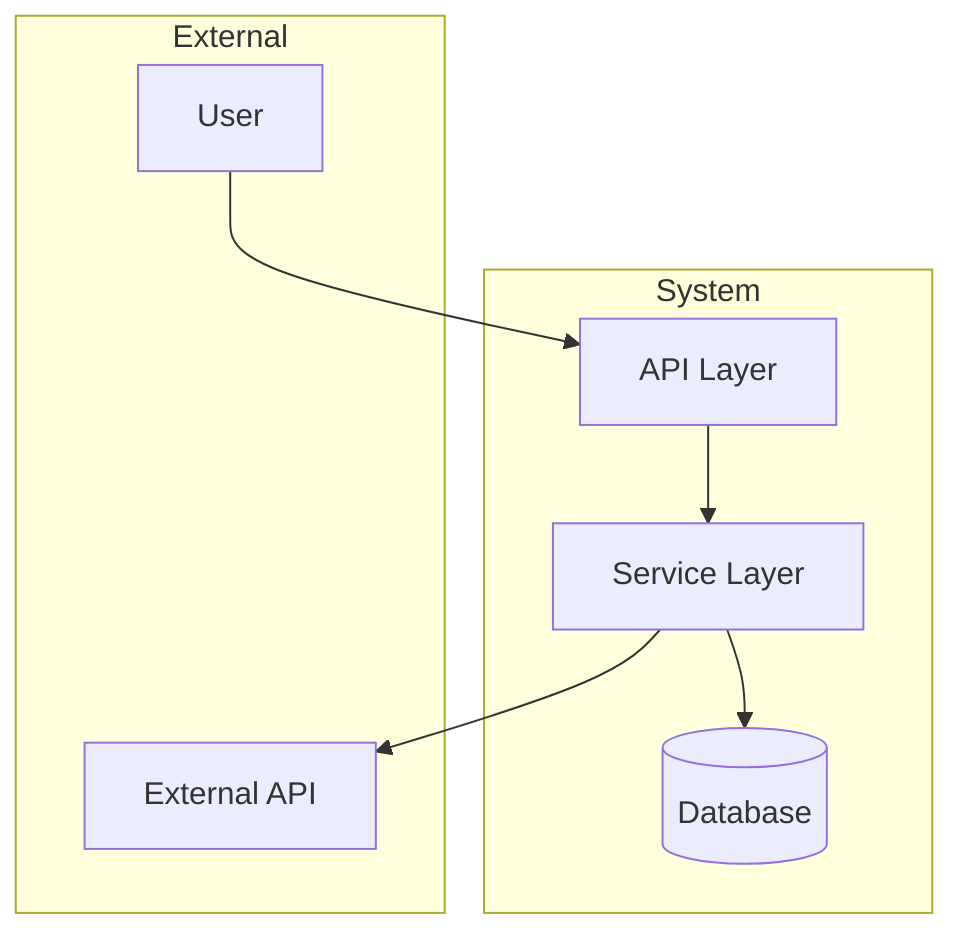
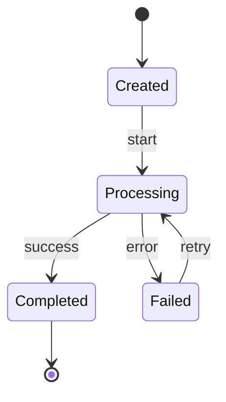

# Spec-Driven Development

A systematic workflow for turning feature ideas into actionable work items that AI agents can execute.

## The Core Flow

```
┌─────────────────────────────────────────────────────────────────────────────┐
│                                                                             │
│   IDEA → DISCOVER → PRD → REQUIREMENTS → DESIGN → TICKETS → TASKS → SYNC   │
│                                                                             │
│   Ask questions   Write the   Define WHAT    Define HOW    Break into      │
│   Understand      vision      must happen    to build it   work items      │
│   the problem                                                               │
│                                                                             │
└─────────────────────────────────────────────────────────────────────────────┘
```

**Output Directory:** All artifacts go in `.omoi_os/`
**Sync Tool:** Use `spec_cli.py` to push to the API

---

## Phase 1: DISCOVER (Most Important!)

### Why This Phase Matters

The quality of everything downstream depends on deeply understanding the problem first. **Never skip discovery.** Rushing to create specs without understanding leads to wasted work.

### Step 1.1: Explore Existing Context

**BEFORE asking questions, gather context:**

```bash
# Check for existing documentation
Read docs/CLAUDE.md
Read docs/architecture/
ls .omoi_os/

# Search for related code
Grep for related service names, models, patterns
Read existing implementations this feature will integrate with

# Check for prior work
ls .omoi_os/requirements/
ls .omoi_os/tickets/
git log --oneline -20
```

### Step 1.2: Ask Discovery Questions (5-15 Questions)

**Structure your questions in categories:**

#### Problem & Value (2-3 questions)
- What specific problem does this solve? What pain exists today?
- What happens if we DON'T build this?
- How will we measure success? What metrics matter?

#### Users & Journeys (2-3 questions)
- Who are the primary users? Secondary?
- What's the happy path user journey?
- What are the edge cases and error scenarios?

#### Scope & Boundaries (2-3 questions)
- What is explicitly IN scope?
- What is explicitly OUT of scope? (Very important!)
- Are there existing features this overlaps with?

#### Technical Context (3-5 questions)
- What existing systems/services will this integrate with?
- What data does this need? Where does it come from?
- Are there performance requirements (latency, throughput, scale)?
- What security/privacy considerations apply?
- Are there any hard technical constraints?

#### Trade-offs & Risks (2-3 questions)
- Are there multiple valid approaches? Which should we explore?
- What are the trade-offs between approaches?
- What could go wrong? What are the risks?
- What's the timeline/priority?

### Step 1.3: Summarize Understanding

After questions are answered, write a summary:

```markdown
## Feature Summary

**Name**: feature-name (kebab-case)
**One-liner**: Brief description of what this does

**Problem Statement**:
[2-3 sentences about the pain point this solves]

**User Stories**:
1. As a [user], I can [action] so that [benefit]
2. As a [user], I can [action] so that [benefit]
3. ...

**Scope**:
- IN: [list what's included]
- OUT: [list what's explicitly excluded]

**Technical Constraints**:
- [constraint 1]
- [constraint 2]

**Risks Identified**:
- [risk 1]
- [risk 2]

**Success Metrics**:
- [metric 1]
- [metric 2]
```

**Get user confirmation before proceeding!**

---

## Phase 2: PRD (Product Requirements Document)

### Purpose

The PRD captures the "why" and "what" at a high level. It's the vision document that everything else traces back to.

### Location

`.omoi_os/docs/prd-{feature-name}.md`

### Template

```markdown
---
id: PRD-{FEATURE}-001
title: {Feature Name} PRD
feature: {feature-name}
created: {date}
updated: {date}
status: draft
author: Claude
---

# {Feature Name}

## Executive Summary

[2-3 paragraph overview of the feature, the problem it solves, and why it matters]

## Problem Statement

### Current State
[Describe the pain point that exists today]

### Desired State
[Describe what the world looks like after this feature ships]

### Impact of Not Building
[What happens if we don't build this?]

## Goals & Success Metrics

### Primary Goals
1. [Goal 1]
2. [Goal 2]

### Success Metrics
| Metric | Current | Target | How Measured |
|--------|---------|--------|--------------|
| [Metric 1] | [baseline] | [target] | [method] |

## User Stories

### Primary User: {User Type}

1. **{Story Title}**
   As a {user}, I want to {action} so that {benefit}.

   Acceptance Criteria:
   - [ ] {criterion 1}
   - [ ] {criterion 2}

2. ...

## Scope

### In Scope
- [Feature/capability 1]
- [Feature/capability 2]

### Out of Scope
- [Explicitly excluded 1]
- [Explicitly excluded 2]

### Future Considerations
- [Things we might add later]

## Constraints

### Technical Constraints
- [Constraint 1]
- [Constraint 2]

### Business Constraints
- [Timeline, budget, etc.]

## Risks & Mitigations

| Risk | Likelihood | Impact | Mitigation |
|------|------------|--------|------------|
| [Risk 1] | High/Med/Low | High/Med/Low | [How to mitigate] |

## Dependencies

- [Dependency 1 - what we need from other teams/systems]
- [Dependency 2]

## Open Questions

- [ ] [Question that still needs answering]
- [ ] [Another question]
```

---

## Phase 3: REQUIREMENTS

### Purpose

Requirements define the specific, testable behaviors the system must have. Use EARS format (Easy Approach to Requirements Syntax).

### Location

`.omoi_os/requirements/{feature-name}.md`

### EARS Format

```
WHEN [trigger/condition], THE SYSTEM SHALL [action/behavior].
```

Examples:
- WHEN a user submits valid credentials, THE SYSTEM SHALL create an authenticated session within 2 seconds.
- WHEN a notification is triggered, THE SYSTEM SHALL deliver it to the user within 5 seconds.
- WHEN an API rate limit is exceeded, THE SYSTEM SHALL return a 429 status with retry-after header.

### Template

```markdown
---
id: REQ-{FEATURE}-001
title: {Feature Name} Requirements
feature: {feature-name}
created: {date}
updated: {date}
status: draft
category: functional
priority: HIGH
prd_ref: docs/prd-{feature-name}.md
design_ref: designs/{feature-name}.md
---

# {Feature Name} Requirements

## Overview

[Brief description of what these requirements cover]

## Functional Requirements

### REQ-{FEATURE}-FUNC-001: {Requirement Title}

**Priority**: HIGH | MEDIUM | LOW
**Category**: Functional

WHEN {trigger condition}, THE SYSTEM SHALL {required behavior}.

**Acceptance Criteria**:
- [ ] {Testable criterion 1}
- [ ] {Testable criterion 2}

**Notes**: {Any additional context}

---

### REQ-{FEATURE}-FUNC-002: {Requirement Title}

...

## Non-Functional Requirements

### REQ-{FEATURE}-PERF-001: {Performance Requirement}

**Priority**: HIGH
**Category**: Performance

THE SYSTEM SHALL {performance requirement with measurable target}.

**Metrics**:
- P50 latency: < X ms
- P99 latency: < Y ms
- Throughput: > Z requests/second

---

### REQ-{FEATURE}-SEC-001: {Security Requirement}

**Priority**: HIGH
**Category**: Security

THE SYSTEM SHALL {security requirement}.

## Traceability

| Requirement ID | PRD Section | Design Section | Ticket |
|----------------|-------------|----------------|--------|
| REQ-{FEATURE}-FUNC-001 | User Stories #1 | Component A | TKT-001 |
```

---

## Phase 4: DESIGN

### Purpose

The design document defines HOW to implement the requirements. It covers architecture, data models, APIs, and implementation details.

### Location

`.omoi_os/designs/{feature-name}.md`

### Template

```markdown
---
id: DESIGN-{FEATURE}-001
title: {Feature Name} Design
feature: {feature-name}
created: {date}
updated: {date}
status: draft
requirements:
  - REQ-{FEATURE}-001
---

# {Feature Name} Design

## Overview

[Brief description of the technical approach]

## Architecture

### System Context



### Component Diagram

[Describe the main components and their responsibilities]

| Component | Responsibility | Technology |
|-----------|---------------|------------|
| {Component 1} | {What it does} | {Stack} |

## Data Model

### Database Schema

```sql
CREATE TABLE {table_name} (
    id UUID PRIMARY KEY DEFAULT gen_random_uuid(),
    {column} {type} {constraints},
    created_at TIMESTAMP WITH TIME ZONE DEFAULT NOW(),
    updated_at TIMESTAMP WITH TIME ZONE DEFAULT NOW()
);

CREATE INDEX idx_{table}_{column} ON {table}({column});
```

### Pydantic Models

```python
from pydantic import BaseModel, Field
from datetime import datetime
from uuid import UUID

class {ModelName}(BaseModel):
    id: UUID
    {field}: {type} = Field(description="{description}")
    created_at: datetime
    updated_at: datetime
```

## API Specification

### Endpoints

| Method | Path | Description | Auth |
|--------|------|-------------|------|
| POST | /api/v1/{resource} | Create resource | Required |
| GET | /api/v1/{resource}/{id} | Get resource | Required |

### Request/Response Examples

#### POST /api/v1/{resource}

**Request:**
```json
{
  "field": "value"
}
```

**Response (201):**
```json
{
  "id": "uuid",
  "field": "value",
  "created_at": "2025-01-01T00:00:00Z"
}
```

**Error Response (400):**
```json
{
  "error": "validation_error",
  "message": "Field X is required"
}
```

## Implementation Details

### Algorithm/Logic

[Describe any complex algorithms or business logic]

```python
# Pseudocode for complex logic
def process_feature(input):
    # Step 1: Validate
    # Step 2: Transform
    # Step 3: Persist
    # Step 4: Notify
    pass
```

### State Machine (if applicable)



## Integration Points

| System | Integration Type | Purpose |
|--------|-----------------|---------|
| {System 1} | REST API | {Why} |
| {System 2} | Event Bus | {Why} |

## Configuration

| Parameter | Default | Range | Description |
|-----------|---------|-------|-------------|
| {param} | {default} | {range} | {description} |

## Testing Strategy

### Unit Tests
- [ ] {Component} - {What to test}

### Integration Tests
- [ ] {Integration point} - {What to test}

### E2E Tests
- [ ] {User journey} - {What to test}

## Security Considerations

- [ ] {Security consideration 1}
- [ ] {Security consideration 2}

## Performance Considerations

- [ ] {Performance consideration 1}
- [ ] {Performance consideration 2}

## Open Questions

- [ ] {Technical question that needs resolution}
```

---

## Phase 5: TICKETS

### Purpose

Tickets are the parent work items that group related tasks. One ticket typically maps to one major component or capability from the design.

### Location

`.omoi_os/tickets/TKT-{NNN}.md`

### ID Convention

Generate sequential IDs: TKT-001, TKT-002, etc.

Check existing: `ls .omoi_os/tickets/`

### Template

```markdown
---
id: TKT-{NNN}
title: {Ticket Title}
status: backlog
priority: HIGH
estimate: M
design_ref: designs/{feature-name}.md
requirements:
  - REQ-{FEATURE}-FUNC-001
  - REQ-{FEATURE}-FUNC-002
dependencies:
  blocked_by: []
  blocks: []
---

# TKT-{NNN}: {Ticket Title}

## Description

[Clear description of what this ticket accomplishes]

## Acceptance Criteria

- [ ] {Criterion 1 - specific and testable}
- [ ] {Criterion 2}
- [ ] {Criterion 3}
- [ ] All tests pass
- [ ] Code reviewed and approved

## Technical Notes

[Any technical context or decisions relevant to implementation]

## Tasks

- TSK-{NNN}: {Task 1 title}
- TSK-{NNN}: {Task 2 title}
- TSK-{NNN}: {Task 3 title}

## Dependencies

**Blocked By**: {List tickets that must complete first, or "None"}
**Blocks**: {List tickets waiting on this one, or "None"}

## Estimate

**Size**: S | M | L | XL
**Rationale**: {Why this estimate}
```

### Ticket Generation Rules

1. **One ticket per major component** from the design
2. **Clear acceptance criteria** mapped from requirements
3. **Dependencies explicitly listed** - what blocks this, what this blocks
4. **Reasonable scope** - if > 5 tasks, consider splitting the ticket

---

## Phase 6: TASKS

### Purpose

Tasks are atomic units of work that an AI agent can complete in a single session. They should be specific, self-contained, and have clear deliverables.

### Location

`.omoi_os/tasks/TSK-{NNN}.md`

### ID Convention

Generate sequential IDs: TSK-001, TSK-002, etc.

Check existing: `ls .omoi_os/tasks/`

### Template

```markdown
---
id: TSK-{NNN}
title: {Task Title}
status: pending
ticket_id: TKT-{NNN}
estimate: S
type: implementation
dependencies:
  depends_on: []
  blocks: []
---

# TSK-{NNN}: {Task Title}

## Objective

[One sentence describing what this task accomplishes]

## Context

[Brief context about why this task exists and how it fits into the bigger picture]

## Deliverables

- [ ] `{path/to/file.py}` - {What this file does}
- [ ] `{path/to/test_file.py}` - {Tests for the above}

## Implementation Notes

[Specific guidance for how to implement this]

```python
# Example code structure or pseudocode
class FeatureService:
    def do_thing(self):
        pass
```

## Acceptance Criteria

- [ ] {Specific, testable criterion}
- [ ] {Another criterion}
- [ ] All new code has tests
- [ ] Tests pass

## Dependencies

**Depends On**: {List task IDs that must complete first, or "None"}
**Blocks**: {List task IDs waiting on this one, or "None"}

## Estimate

**Size**: S (< 2 hours) | M (2-4 hours) | L (4-8 hours)
```

### Task Generation Rules

1. **Atomic** - Can be completed in a single focused session (1-4 hours ideal)
2. **Self-contained** - All context needed is in the task
3. **Clear deliverable** - Specific files, tests, or outcomes
4. **Testable** - Clear acceptance criteria that can be verified
5. **Dependencies explicit** - What must complete before this can start

### Task Types

- `implementation` - Write new code
- `refactor` - Improve existing code
- `test` - Write tests
- `documentation` - Write docs
- `research` - Investigate options
- `bugfix` - Fix a specific bug

---

## Phase 7: SYNC TO API

### Using spec_cli.py

After creating all artifacts locally, sync them to the OmoiOS API:

```bash
# Navigate to scripts directory
cd .claude/skills/spec-driven-dev/scripts

# 1. Validate local specs first
python spec_cli.py validate

# 2. Preview what you have
python spec_cli.py show all

# 3. Find your project ID
python spec_cli.py projects --api-url http://0.0.0.0:18000

# 4. Dry-run sync to see what would change
python spec_cli.py sync diff --project-id <uuid> --api-url http://0.0.0.0:18000

# 5. Push to API
python spec_cli.py sync push --project-id <uuid> --api-url http://0.0.0.0:18000

# 6. Verify in API
python spec_cli.py project <uuid> --api-url http://0.0.0.0:18000
```

### Environment Variables

Set these to avoid passing flags every time:

```bash
export OMOIOS_API_URL="http://0.0.0.0:18000"
export OMOIOS_API_KEY="your-api-key"
```

### Sync Behavior

- **CREATE**: New tickets/tasks are created
- **UPDATE**: Existing items with changed descriptions are updated
- **SKIP**: Items already in sync are skipped

---

## Complete Example Workflow

### User Request

> "I want to add webhook notifications so external systems can subscribe to events"

### Step 1: Discover

```
Claude: Before designing, let me explore the codebase and ask some questions.

[Reads docs/CLAUDE.md, checks .omoi_os/ for existing specs, searches for event-related code]

Found: We have an EventBusService for internal pub/sub. No existing webhook specs.

Now I need to understand the feature better:

**Problem & Value:**
1. What specific external systems need to receive notifications?
2. What events should be subscribable? (task complete, PR ready, agent stuck?)
3. What happens if a webhook delivery fails?

**Scope:**
4. Should users configure webhooks via UI, API, or both?
5. Do we need authentication for webhook endpoints (HMAC signing)?
6. Is retry logic needed? How many retries?

**Technical:**
7. Should webhooks integrate with the existing EventBusService?
8. What's the expected volume of webhook deliveries per day?
9. Do we need rate limiting per subscriber?

**Constraints:**
10. Are there any specific protocols required (Slack, Discord, custom)?
11. What's the timeline for this feature?
```

### Step 2: User Answers

> "We need Slack and Discord initially, plus generic HTTP. Events: task_completed,
> ticket_status_changed, agent_error. HMAC signing required. 3 retries with
> exponential backoff. Use existing EventBusService. Volume: ~1000/day initially."

### Step 3: Create PRD

Write `.omoi_os/docs/prd-webhook-notifications.md`

### Step 4: Create Requirements

Write `.omoi_os/requirements/webhook-notifications.md` with EARS-format requirements

### Step 5: Create Design

Write `.omoi_os/designs/webhook-notifications.md` with architecture, data models, APIs

### Step 6: Create Tickets

- `.omoi_os/tickets/TKT-001.md` - Webhook Infrastructure (models, service, delivery)
- `.omoi_os/tickets/TKT-002.md` - Slack/Discord Formatters

### Step 7: Create Tasks

For TKT-001:
- `TSK-001.md` - Add webhook URL fields to Organization model
- `TSK-002.md` - Create database migration
- `TSK-003.md` - Implement WebhookDeliveryService
- `TSK-004.md` - Implement WebhookNotificationService
- `TSK-005.md` - Update API routes for webhook management
- `TSK-006.md` - Write tests

For TKT-002:
- `TSK-007.md` - Implement SlackWebhookFormatter
- `TSK-008.md` - Implement DiscordWebhookFormatter

### Step 8: Sync to API

```bash
cd .claude/skills/spec-driven-dev/scripts
python spec_cli.py validate
python spec_cli.py sync push --project-id <uuid>
```

---

## Directory Structure Summary

```
.omoi_os/
├── docs/                    # PRDs and high-level documents
│   └── prd-{feature}.md
├── requirements/            # EARS-format requirements
│   └── {feature}.md
├── designs/                 # Technical designs
│   └── {feature}.md
├── tickets/                 # Parent work items
│   ├── TKT-001.md
│   └── TKT-002.md
└── tasks/                   # Atomic work units
    ├── TSK-001.md
    ├── TSK-002.md
    └── ...
```

---

## CLI Reference

### View Local Specs

```bash
python spec_cli.py show all           # Everything
python spec_cli.py show requirements  # Just requirements
python spec_cli.py show designs       # Just designs
python spec_cli.py show tickets       # Just tickets
python spec_cli.py show tasks         # Just tasks
python spec_cli.py show graph         # Task dependency graph
python spec_cli.py show ticket-graph  # Ticket dependency graph
python spec_cli.py show traceability  # Full traceability matrix
python spec_cli.py show ready         # Tasks ready to work on
```

### Validate

```bash
python spec_cli.py validate           # Check for issues
```

### Sync to API

```bash
python spec_cli.py projects                              # List projects
python spec_cli.py sync diff --project-id <uuid>         # Preview changes
python spec_cli.py sync push --project-id <uuid>         # Push to API
python spec_cli.py project <uuid>                        # View project in API
python spec_cli.py api-trace <uuid>                      # Full API traceability
```

---

## Best Practices

### Discovery
- **Never skip questions** - The 5 minutes spent asking saves hours of rework
- **Get explicit scope boundaries** - "Out of scope" is as important as "in scope"
- **Identify risks early** - What could go wrong?

### PRDs
- Write for a human reader who doesn't have context
- Focus on "why" and "what", not "how"
- Keep it concise but complete

### Requirements
- Use EARS format consistently
- Make every requirement testable
- Include acceptance criteria

### Designs
- Architecture diagrams first
- Include data models with actual SQL/Pydantic
- Specify APIs completely

### Tickets
- One component per ticket
- Clear acceptance criteria
- Explicit dependencies

### Tasks
- 1-4 hours of work max
- All context included
- Specific file deliverables

---

## Recovering from Lost Context

If you lose context mid-conversation:

```bash
# 1. Check what exists locally
ls .omoi_os/
cat .omoi_os/docs/prd-*.md
cat .omoi_os/requirements/*.md
cat .omoi_os/designs/*.md

# 2. View the full state
python spec_cli.py show all

# 3. Check what's in the API
python spec_cli.py project <uuid>
```

Then resume from where you left off based on what's complete and what's missing.
