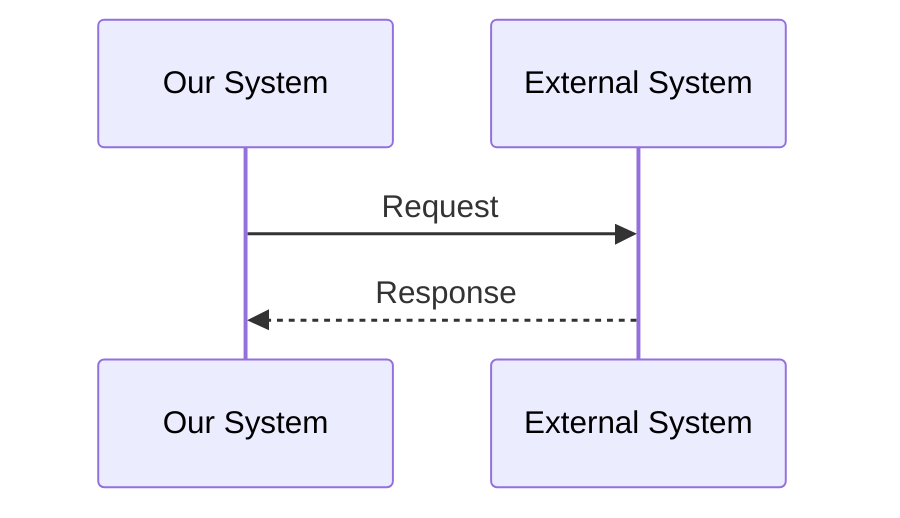
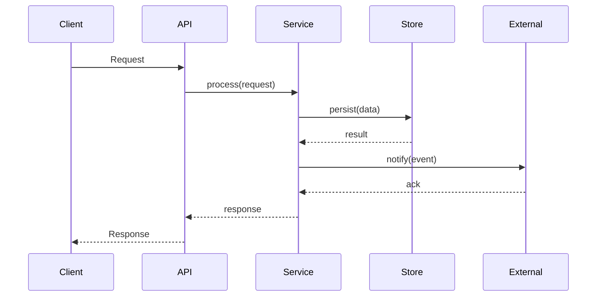

# Design Document Template

Use this template for `.omoi_os/designs/{feature-name}.md` files.

---

```markdown
---
id: DESIGN-{FEATURE}-001
title: {Feature Name} Design
feature: {feature-name}
created: {YYYY-MM-DD}
updated: {YYYY-MM-DD}
status: draft
requirements:
  - REQ-{DOMAIN}-001
  - REQ-{DOMAIN}-002
---

# {Feature Name} - Product Design Document

## Document Overview

{Description of the feature/system being designed}

- **Purpose & Scope**
  - {Goal 1}
  - {Goal 2}
  - {Non-goals/Out of scope}

- **Target Audience**
  - {Audience 1 - e.g., implementation teams}
  - {Audience 2 - e.g., system architects}

- **Related Documents**
  - Requirements: `{path to requirements doc}`
  - Design: `{paths to related design docs}`

---

## Architecture Overview

### High-Level Architecture

```mermaid
flowchart TD
    subgraph Layer1[{Layer Name}]
        C1[Component 1]
        C2[Component 2]
    end

    subgraph Layer2[{Layer Name}]
        C3[Component 3]
        C4[Component 4]
    end

    subgraph External[External Systems]
        E1[External System 1]
        E2[External System 2]
    end

    C1 -->|action| C2
    C2 -->|action| C3
    C3 --> E1
```

### Component Responsibilities

| Component | Layer | Responsibilities |
|-----------|-------|------------------|
| {Component 1} | {Layer} | {Primary responsibilities} |
| {Component 2} | {Layer} | {Primary responsibilities} |
| {Component 3} | {Layer} | {Primary responsibilities} |

### System Boundaries

- **Within scope of {System}**:
  - {Responsibility 1}
  - {Responsibility 2}

- **Out of scope (delegated)**:
  - {Delegated responsibility 1}
  - {Delegated responsibility 2}

---

## Component Details

### {Component Name}

#### Responsibilities
- {Responsibility 1}
- {Responsibility 2}

#### Key Interfaces
- `method_1(param1, param2) -> ReturnType`
- `method_2(param) -> ReturnType`

#### Implementation Notes
{Important implementation details, algorithms, or patterns}

---

## Data Models

### Database Schema

```sql
-- {Entity} table
CREATE TABLE {entities} (
    id UUID PRIMARY KEY DEFAULT gen_random_uuid(),
    name VARCHAR(255) NOT NULL,
    status VARCHAR(50) NOT NULL CHECK (status IN ('active', 'inactive')),
    parent_id UUID REFERENCES {parents}(id) ON DELETE CASCADE,
    metadata JSONB DEFAULT '{}'::JSONB,
    created_at TIMESTAMPTZ NOT NULL DEFAULT NOW(),
    updated_at TIMESTAMPTZ NOT NULL DEFAULT NOW()
);

CREATE INDEX idx_{entities}_status ON {entities}(status);
CREATE INDEX idx_{entities}_parent_id ON {entities}(parent_id);
```

### Pydantic Models

```python
from __future__ import annotations
from datetime import datetime
from enum import Enum
from typing import Dict, List, Optional, Any
from pydantic import BaseModel, Field


class StatusEnum(str, Enum):
    ACTIVE = "active"
    INACTIVE = "inactive"


class {Entity}(BaseModel):
    id: str
    name: str
    status: StatusEnum
    parent_id: Optional[str] = None
    metadata: Dict[str, Any] = Field(default_factory=dict)
    created_at: datetime
    updated_at: datetime


class {Entity}Create(BaseModel):
    name: str
    parent_id: Optional[str] = None
    metadata: Optional[Dict[str, Any]] = None


class {Entity}Update(BaseModel):
    name: Optional[str] = None
    status: Optional[StatusEnum] = None
    metadata: Optional[Dict[str, Any]] = None
```

---

## API Specifications

### REST Endpoints

| Method | Path | Purpose | Request | Response |
|--------|------|---------|---------|----------|
| POST | `/api/{resource}` | Create resource | `{Entity}Create` | `{Entity}` |
| GET | `/api/{resource}/{id}` | Get resource | - | `{Entity}` |
| PUT | `/api/{resource}/{id}` | Update resource | `{Entity}Update` | `{Entity}` |
| DELETE | `/api/{resource}/{id}` | Delete resource | - | `{success: true}` |
| GET | `/api/{resource}` | List resources | `?status=&limit=&offset=` | `{items: [], total}` |

### Request/Response Models

```python
class CreateRequest(BaseModel):
    name: str
    parent_id: Optional[str] = None


class ListResponse(BaseModel):
    items: List[{Entity}]
    total: int
    limit: int
    offset: int
```

### Error Handling

| Status Code | Error Code | Description |
|-------------|------------|-------------|
| 400 | `INVALID_INPUT` | Request validation failed |
| 404 | `NOT_FOUND` | Resource not found |
| 409 | `CONFLICT` | Resource conflict (duplicate, etc.) |
| 500 | `INTERNAL_ERROR` | Internal server error |

---

## Integration Points

### {External System} Integration

- **Purpose**: {Why this integration exists}
- **Protocol**: {REST/GraphQL/WebSocket/etc.}
- **Authentication**: {How auth works}

#### Integration Flow



### Event Contracts

| Event | When Emitted | Payload |
|-------|--------------|---------|
| `{entity}_created` | After creation | `{id, name, created_at}` |
| `{entity}_updated` | After update | `{id, changes, updated_at}` |
| `{entity}_deleted` | After deletion | `{id, deleted_at}` |

---

## Implementation Details

### Core Algorithm

```python
def core_operation(input_data: InputType) -> OutputType:
    """
    {Description of the algorithm}

    Steps:
    1. {Step 1}
    2. {Step 2}
    3. {Step 3}
    """
    # Step 1: {Description}
    result = process_step_1(input_data)

    # Step 2: {Description}
    result = process_step_2(result)

    # Step 3: {Description}
    return finalize(result)
```

### Operation Flow



---

## Configuration

| Parameter | Default | Range | Description |
|-----------|---------|-------|-------------|
| `timeout_seconds` | 30 | 1-300 | Operation timeout |
| `max_retries` | 3 | 0-10 | Maximum retry attempts |
| `batch_size` | 100 | 1-1000 | Batch processing size |

---

## Performance Considerations

### Database Indexing
- {Index 1 purpose}
- {Index 2 purpose}

### Caching Strategy
- {What to cache}
- {Cache TTL}
- {Invalidation strategy}

### Batch Processing
- {When to batch}
- {Batch size considerations}

---

## Security Considerations

### Authentication
- {Auth mechanism}

### Authorization
- {Permission model}

### Data Protection
- {Sensitive data handling}

---

## Related Documents

- **Requirements**: `{path}`
- **Design**: `{paths}`

---

## Quality Checklist

- [ ] All requirements addressed
- [ ] Architecture diagram included
- [ ] API specifications complete
- [ ] Database schemas defined
- [ ] Integration points documented
- [ ] Error handling specified
- [ ] Security considerations addressed

---

## Revision History

| Version | Date | Author | Changes |
|---------|------|--------|---------|
| 1.0 | {YYYY-MM-DD} | {Author} | Initial design |
```

---

## Frontmatter Field Reference

| Field | Type | Required | Description |
|-------|------|----------|-------------|
| `id` | string | Yes | Unique design ID (DESIGN-FEATURE-001) |
| `title` | string | Yes | Human-readable title |
| `feature` | string | Yes | Feature name (kebab-case) |
| `created` | date | Yes | Creation date (YYYY-MM-DD) |
| `updated` | date | Yes | Last update date (YYYY-MM-DD) |
| `status` | string | Yes | draft, review, approved |
| `requirements` | list | No | List of requirement IDs this design implements |
| `tickets` | list | No | Linked ticket IDs for this design |

---

## Design ID Conventions

### Format
```
DESIGN-{FEATURE}-{NUM}
```

### Examples
- `DESIGN-AUTH-001` - Authentication system design
- `DESIGN-WEBHOOK-001` - Webhook notifications design
- `DESIGN-SYNC-001` - Data synchronization design

### Numbering
- Start at 001
- Increment sequentially within feature
- Don't reuse deleted numbers

---

## Best Practices

1. **Architecture First** - Start with high-level before diving into details
2. **Visual Diagrams** - Use Mermaid for architecture, sequences, state machines
3. **Concrete Examples** - Include pseudocode and example payloads
4. **Integration Focus** - Clearly define boundaries and contracts
5. **Traceability** - Link back to requirements throughout
6. **Bidirectional Links** - Reference requirements in frontmatter, link design from requirements
