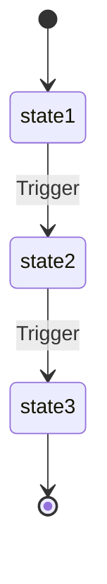

# Requirements Document Template

Use this template for `.omoi_os/requirements/{feature-name}.md` files.

---

```markdown
# {Feature Name} Requirements

**Created**: {YYYY-MM-DD}
**Status**: Draft | Review | Approved
**Purpose**: {One-line purpose statement}
**Related**: {Links to related docs}

---

## Document Overview

{2-3 sentence overview of what this requirements document covers}

**Parent Document**: {Link to parent if applicable}

---

## 1. {First Domain Area}

#### REQ-{DOMAIN}-{AREA}-001: {Requirement Title}
THE SYSTEM SHALL {normative requirement statement}.

{Additional details, rationale, or constraints}

#### REQ-{DOMAIN}-{AREA}-002: {Requirement Title}
THE SYSTEM SHALL {normative requirement statement}.

---

## 2. State Machine (If Applicable)

#### REQ-{DOMAIN}-SM-001: States
{Feature} SHALL support the following states:



#### REQ-{DOMAIN}-SM-002: Transitions
Valid transitions:
```
state1 → state2
state2 → state3 | error
state3 → done
```

#### REQ-{DOMAIN}-SM-003: Guards
- Transition to `state2` requires {condition}.
- Transition to `state3` requires {condition}.

---

## 3. Data Model Requirements

### 3.1 {Entity} Model
#### REQ-{DOMAIN}-DM-001
{Entity} SHALL include the following fields:
- `field1: type` (description)
- `field2: type` (description)
- `field3: type | null` (description)

Update rules:
- On {event}, {action}.
- On {event}, {action}.

### 3.2 {Related Entity} (DB Table)
#### REQ-{DOMAIN}-DM-002
The system SHALL persist {entity} with at least the following fields and constraints:
- `id TEXT PK`
- `parent_id TEXT NOT NULL FK -> parent(id)`
- `status VARCHAR(50) NOT NULL`
- `created_at TIMESTAMP DEFAULT CURRENT_TIMESTAMP`

Foreign keys must be enforced.

---

## 4. Configuration (Normative)

| Parameter | Default | Range | Description |
|-----------|---------|-------|-------------|
| param_1 | value | min-max | Description |
| param_2 | value | bool | Description |
| param_3 | value | min-max | Description |

---

## 5. API (Normative)

### 5.1 Endpoints Table

| Endpoint | Method | Purpose | Request Body (min) | Responses |
|----------|--------|---------|--------------------|-----------|
| /api/{resource} | POST | Create resource | `{ field1, field2 }` | 200: `{ id, status }`; 400: `{ error }` |
| /api/{resource}/{id} | GET | Get resource | - | 200: `{ resource }`; 404: `{ error }` |
| /api/{resource}/{id}/action | POST | Perform action | `{ action_data }` | 200: `{ result }`; 400: `{ error }` |

Notes:
- All responses MUST include a stable `error` field on failure.
- {Additional endpoint constraints}

### 5.2 WebSocket/Event Contracts

| Event | When Emitted | Payload (min) |
|-------|--------------|---------------|
| event_started | {trigger condition} | `{ id, timestamp }` |
| event_completed | {trigger condition} | `{ id, result }` |
| event_failed | {trigger condition} | `{ id, error, reason }` |

---

## 6. SLOs & Performance

#### REQ-{DOMAIN}-SLO-001
{Operation} should complete within {time} under normal conditions.

#### REQ-{DOMAIN}-SLO-002
{Metric} P95 < {threshold}.

---

## 7. Security & Audit

#### REQ-{DOMAIN}-SEC-001
Only {authorized actors} MAY call {protected endpoints}; all actions MUST be audited with actor, resource_id, and result.

---

## 8. Integration Requirements

#### REQ-{DOMAIN}-INT-001: {System} Integration
THE SYSTEM SHALL integrate with {external system} for {purpose}.

Integration points:
- {Integration point 1}
- {Integration point 2}

---

## 9. Pydantic Reference Models

```python
from __future__ import annotations
from datetime import datetime
from enum import Enum
from typing import Any, Dict, List, Optional
from pydantic import BaseModel, Field


class StatusEnum(str, Enum):
    PENDING = "pending"
    ACTIVE = "active"
    COMPLETED = "completed"
    FAILED = "failed"


class {Entity}(BaseModel):
    id: str
    status: StatusEnum
    field1: str
    field2: Optional[str] = None
    created_at: datetime


class {Entity}Request(BaseModel):
    field1: str
    field2: Optional[str] = None


class {Entity}Response(BaseModel):
    status: str
    message: str
    data: Optional[{Entity}] = None
```

---

## Related Documents

- [{Related Feature} Requirements](./{related}.md)
- [{System} Design](../designs/{system}.md)

---

## Revision History

| Version | Date | Author | Changes |
|---------|------|--------|---------|
| 1.0 | {YYYY-MM-DD} | {Author} | Initial draft |
```

---

## Requirement ID Conventions

### Format
```
REQ-{DOMAIN}-{AREA}-{NUM}
```

### Domain Prefixes (Examples)
- `AUTH` - Authentication/Authorization
- `AGENT` - Agent system
- `COLLAB` - Collaboration
- `NOTIF` - Notifications
- `SYNC` - Synchronization
- `VAL` - Validation
- `MON` - Monitoring
- `TKT` - Ticketing
- `TSK` - Tasks

### Area Codes (Examples)
- `SM` - State Machine
- `DM` - Data Model
- `API` - API/Endpoints
- `SEC` - Security
- `SLO` - Service Level Objectives
- `INT` - Integration
- `CFG` - Configuration

### Numbering
- Start at 001
- Increment sequentially within area
- Don't reuse deleted numbers

## Normative Language

Use RFC 2119 keywords:

- **SHALL** / **MUST** - Absolute requirement
- **SHALL NOT** / **MUST NOT** - Absolute prohibition
- **SHOULD** - Recommended but not required
- **SHOULD NOT** - Discouraged but not prohibited
- **MAY** - Optional

## Best Practices

1. **Be Specific** - "latency < 100ms" not "fast response"
2. **Be Testable** - Every requirement should have clear pass/fail criteria
3. **Cross-Reference** - Link related requirements explicitly
4. **Include Rationale** - Explain why, not just what
5. **Version Control** - Track all changes in revision history
