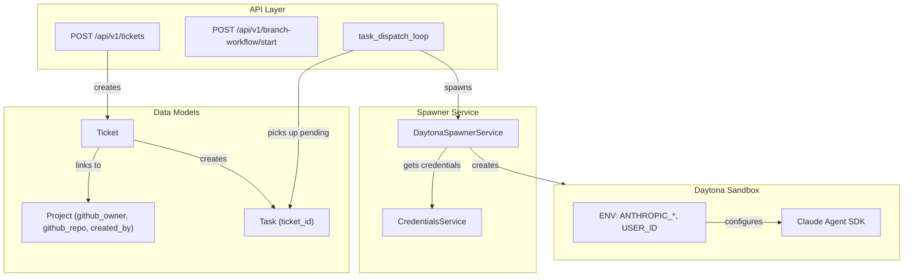

# API Sandbox Execution Test Plan

## Current Architecture



## Gap Analysis

The orchestrator loop has been moved to a standalone worker file: [orchestrator_worker.py](backend/omoi_os/workers/orchestrator_worker.py). This file is run as a separate process via docker compose and auto-reloads on changes.

The current `orchestrator_loop` calls `spawn_for_task()` at line 140 but does NOT pass `USER_ID`:

```python
# Lines 139-145 of orchestrator_worker.py
sandbox_id = await daytona_spawner.spawn_for_task(
    task_id=task_id,
    agent_id=agent_id,
    phase_id=phase_id,
    agent_type=agent_type,
    # MISSING: extra_env={"USER_ID": user_id}
)
```

The spawner already supports this via the `extra_env` parameter.

NOTE: The main.py file was incorrectly modified earlier and those changes should be reverted.

## Implementation Steps

### Step 1: Wire USER_ID Through Orchestrator Worker

Modify `orchestrator_loop` in [orchestrator_worker.py](backend/omoi_os/workers/orchestrator_worker.py) to extract `user_id` from the task's ticket's project:

**Location**: Lines 102-145 of `orchestrator_worker.py`

**Changes** (insert after line 104, before the template lookup):

```python
if task:
    task_id = str(task.id)
    phase_id = task.phase_id or "PHASE_IMPLEMENTATION"

    if sandbox_execution and daytona_spawner:
        # Sandbox mode: spawn a Daytona sandbox for this task
        try:
            # NEW: Extract user_id and repo info from ticket -> project chain
            # This enables per-user credentials in the sandbox
            extra_env: dict[str, str] = {}
            with db.get_session() as session:
                from omoi_os.models.ticket import Ticket

                ticket = session.get(Ticket, task.ticket_id)
                if ticket and ticket.project:
                    if ticket.project.created_by:
                        extra_env["USER_ID"] = str(ticket.project.created_by)
                    if ticket.project.github_owner:
                        extra_env["GITHUB_REPO_OWNER"] = ticket.project.github_owner
                    if ticket.project.github_repo:
                        extra_env["GITHUB_REPO_NAME"] = ticket.project.github_repo

            # Determine agent type from phase
            from omoi_os.agents.templates import get_template_for_phase
            # ... (rest of existing code)

            # Spawn sandbox with user/repo context
            sandbox_id = await daytona_spawner.spawn_for_task(
                task_id=task_id,
                agent_id=agent_id,
                phase_id=phase_id,
                agent_type=agent_type,
                extra_env=extra_env if extra_env else None,  # NEW
            )
```

### Step 1b: Revert main.py Changes

The changes made to main.py should be reverted since the orchestrator loop there is not active.

### Step 2: Create Test Script

Create [scripts/test_api_sandbox_spawn.py](backend/scripts/test_api_sandbox_spawn.py) that:

1. **Prerequisites Check**: Verify API is running at `http://localhost:18000`
2. **Project Setup**: Get or create a project linked to `kivo360/OmoiOS` with user `ffa6776e-b2bc-4e10-b553-f7b915df0896`
3. **Create Ticket**: POST to `/api/v1/tickets` with task description for complex math
4. **Monitor Task**: Poll `/api/v1/tasks` until task is picked up
5. **Monitor Sandbox**: Poll `/api/v1/sandboxes/{id}/events` for results
6. **Create Branch**: Call `/api/v1/branch-workflow/start` to create feature branch
7. **Report Results**: Display sandbox execution output

**Test Task** - Compute binomial coefficient C(50, 25):

```python
# factorial(50) / (factorial(25) * factorial(25))
# Result: 126,410,606,437,752
# This is trivial for Python but impossible for LLMs to compute mentally
```

### Step 3: Create Project via API (if needed)

The test script needs to ensure a Project exists linking:

- `github_owner`: `"kivo360"`
- `github_repo`: `"OmoiOS"`
- `created_by`: `"ffa6776e-b2bc-4e10-b553-f7b915df0896"`

**Option A**: Direct database insert (simpler for testing)

**Option B**: Use `/api/v1/projects` endpoint if it exists

### Step 4: Update Worker Script for Branch Creation

The Claude worker script in the spawner should optionally create a branch before executing. Modify the `_get_claude_worker_script()` method in [daytona_spawner.py](backend/omoi_os/services/daytona_spawner.py) to:

1. Check for `GITHUB_REPO_OWNER` and `GITHUB_REPO_NAME` env vars
2. Clone the repo if specified
3. Create a feature branch (`feature/{task_id}`)
4. Execute the task in that context

## File Changes Summary

| File | Change Type | Description |

|------|-------------|-------------|

| [backend/omoi_os/api/main.py](backend/omoi_os/api/main.py) | Modify | Add user_id/repo extraction in task_dispatch_loop |

| [backend/scripts/test_api_sandbox_spawn.py](backend/scripts/test_api_sandbox_spawn.py) | Create | End-to-end API test script |

| [backend/omoi_os/services/daytona_spawner.py](backend/omoi_os/services/daytona_spawner.py) | Modify (optional) | Add branch creation to worker script |

## Testing Strategy

### Manual Testing Flow

```bash
# Terminal 1: Ensure API is running
just watch

# Terminal 2: Run test
cd backend
uv run python scripts/test_api_sandbox_spawn.py

# Terminal 3: Watch events
curl http://localhost:18000/api/v1/sandboxes/{sandbox_id}/events
```

### Expected Output

```
[1/6] Checking API availability... OK
[2/6] Creating/finding project for kivo360/OmoiOS... OK (project_id: xxx)
[3/6] Creating ticket with math task... OK (ticket_id: xxx)
[4/6] Waiting for task dispatch... Task created (task_id: xxx)
[5/6] Sandbox spawned: sandbox-xxx
[6/6] Task completed! Result:
      C(50,25) = 126,410,606,437,752
      Branch created: feature/task-xxx
```

## Verification Criteria

1. **USER_ID Injection**: Sandbox receives correct `USER_ID` env var
2. **Credential Loading**: CredentialsService returns user-specific or fallback credentials
3. **SDK Execution**: Claude Agent SDK successfully calls Z.AI API
4. **Math Result**: Agent returns correct value (126410606437752)
5. **Branch Creation** (optional): Feature branch created in GitHub repo

## Risk Mitigation

- **API Not Running**: Script checks health endpoint first
- **Project Missing**: Script creates project if needed
- **Task Not Picked Up**: Polling with timeout (5 min max)
- **Sandbox Fails**: Check events for error messages
- **Auth Issues**: Fall back to global credentials (already implemented)