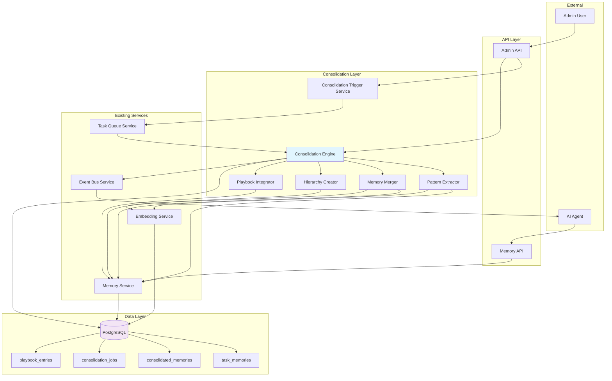

# Agent Memory Consolidation Design

## Overview

This document describes the technical design for the Agent Memory Consolidation System, a background knowledge synthesis service that transforms raw task execution memories into higher-level insights, patterns, and principles. The design extends the existing memory infrastructure (TaskMemory, MemoryService, hybrid search) with new consolidation capabilities while maintaining full traceability to source memories.

## Architecture

### System Context



### Component Diagram

| Component | Layer | Responsibility | Technology |
|-----------|-------|----------------|------------|
| Consolidation Trigger Service | Processing | Monitors conditions and triggers consolidation jobs | Python + APScheduler |
| Consolidation Engine | Processing | Orchestrates consolidation workflow phases | Python |
| Pattern Extractor | Processing | Extracts patterns from groups of similar memories | Python + LLM |
| Memory Merger | Processing | Merges highly similar memories | Python + pgvector |
| Hierarchy Creator | Processing | Creates multi-level memory hierarchy | Python + LLM |
| Playbook Integrator | Processing | Auto-generates/updates playbook entries | Python |
| Consolidation API | API | Admin endpoints for manual control | FastAPI |
| Agent Tools | API | Tools for querying consolidated knowledge | OpenHands SDK |

## Data Model

### Database Schema

#### Consolidated Memory Table

```sql
-- Enable UUID extension if not already enabled
CREATE EXTENSION IF NOT EXISTS "uuid-ossp";

-- Consolidated memories table
CREATE TABLE consolidated_memories (
    id UUID PRIMARY KEY DEFAULT uuid_generate_v4(),
    project_id UUID NOT NULL,

    -- Content
    content TEXT NOT NULL,
    memory_type VARCHAR(50) NOT NULL,  -- Uses existing MemoryType enum
    abstraction_level INTEGER NOT NULL,  -- 1=merged, 2=pattern, 3=principle

    -- Context
    pattern_type VARCHAR(50),  -- success, failure, decision, workflow, gotcha
    confidence_score FLOAT CHECK (confidence_score >= 0.0 AND confidence_score <= 1.0),
    source_memory_ids UUID[] NOT NULL,  -- Source TaskMemory IDs

    -- Embedding for semantic search (3072 dimensions for text-embedding-3-large)
    embedding vector(3072),

    -- Full-text search vector
    content_tsv tsvector GENERATED ALWAYS AS (
        to_tsvector('english', coalesce(content, ''))
    ) STORED,

    -- Metadata
    tags TEXT[],
    consolidation_method VARCHAR(100),  -- llm, heuristic, hybrid
    created_at TIMESTAMP WITH TIME ZONE NOT NULL DEFAULT NOW(),
    updated_at TIMESTAMP WITH TIME ZONE NOT NULL DEFAULT NOW(),
    consolidated_at TIMESTAMP WITH TIME ZONE NOT NULL DEFAULT NOW(),

    -- Statistics
    source_count INTEGER NOT NULL,  -- Number of source memories
    reuse_count INTEGER DEFAULT 0,

    -- Foreign key to projects (assuming projects table exists)
    FOREIGN KEY (project_id) REFERENCES projects(id) ON DELETE CASCADE,

    -- Constraints
    CONSTRAINT consolidated_memories_abstraction_check CHECK (
        abstraction_level IN (1, 2, 3)
    ),
    CONSTRAINT consolidated_memories_type_check CHECK (
        memory_type IN ('error_fix', 'discovery', 'decision', 'learning', 'warning', 'codebase_knowledge')
    ),
    CONSTRAINT consolidated_memories_pattern_check CHECK (
        pattern_type IN ('success', 'failure', 'decision', 'workflow', 'gotcha') OR pattern_type IS NULL
    )
);

-- Indexes for performance
CREATE INDEX idx_cm_project ON consolidated_memories(project_id);
CREATE INDEX idx_cm_abstraction ON consolidated_memories(abstraction_level);
CREATE INDEX idx_cm_type ON consolidated_memories(memory_type);
CREATE INDEX idx_cm_pattern ON consolidated_memories(pattern_type);
CREATE INDEX idx_cm_created ON consolidated_memories(consolidated_at DESC);
CREATE INDEX idx_cm_tags ON consolidated_memories USING GIN(tags);

-- pgvector index for semantic similarity search (HNSW for high-dim vectors)
CREATE INDEX idx_cm_embedding ON consolidated_memories
USING hnsw (embedding vector_cosine_ops)
WHERE embedding IS NOT NULL;

-- Full-text search index
CREATE INDEX idx_cm_content_tsv ON consolidated_memories USING GIN(content_tsv);

-- Index for source memory lookups
CREATE INDEX idx_cm_source_ids ON consolidated_memories USING GIN(source_memory_ids);
```

#### Consolidation Jobs Table

```sql
-- Consolidation job tracking table
CREATE TABLE consolidation_jobs (
    id UUID PRIMARY KEY DEFAULT uuid_generate_v4(),
    project_id UUID NOT NULL,

    -- Job info
    status VARCHAR(50) NOT NULL,  -- pending, running, completed, failed, cancelled
    trigger_type VARCHAR(50) NOT NULL,  -- scheduled, manual, threshold

    -- Scope
    scope JSONB DEFAULT '{}',  -- {date_range, memory_types, unconsolidated_only}

    -- Results
    phases_completed TEXT[],
    metrics JSONB DEFAULT '{}',  -- {memories_processed, patterns_extracted, memories_merged}

    -- Timing
    started_at TIMESTAMP WITH TIME ZONE,
    completed_at TIMESTAMP WITH TIME ZONE,
    duration_seconds INTEGER,

    -- Error handling
    error_message TEXT,
    retry_count INTEGER DEFAULT 0,
    max_retries INTEGER DEFAULT 3,

    -- Metadata
    created_at TIMESTAMP WITH TIME ZONE NOT NULL DEFAULT NOW(),
    triggered_by VARCHAR(255),  -- user_id or 'system'

    FOREIGN KEY (project_id) REFERENCES projects(id) ON DELETE CASCADE,

    CONSTRAINT consolidation_jobs_status_check CHECK (
        status IN ('pending', 'running', 'completed', 'failed', 'cancelled')
    ),
    CONSTRAINT consolidation_jobs_trigger_check CHECK (
        trigger_type IN ('scheduled', 'manual', 'threshold')
    )
);

-- Indexes for job queries
CREATE INDEX idx_cj_project_status ON consolidation_jobs(project_id, status);
CREATE INDEX idx_cj_created ON consolidation_jobs(created_at DESC);
CREATE INDEX idx_cj_trigger_type ON consolidation_jobs(trigger_type);
```

#### Task Memory Enhancements

```sql
-- Add consolidation fields to existing task_memories table
ALTER TABLE task_memories
ADD COLUMN consolidated_into_id UUID REFERENCES consolidated_memories(id) ON DELETE SET NULL;

ALTER TABLE task_memories
ADD COLUMN is_consolidated BOOLEAN DEFAULT FALSE;

-- Index for consolidated memory lookups
CREATE INDEX idx_tm_consolidated ON task_memories(is_consolidated)
WHERE is_consolidated = TRUE;

CREATE INDEX idx_tm_consolidated_into ON task_memories(consolidated_into_id)
WHERE consolidated_into_id IS NOT NULL;
```

### Pydantic Models

```python
from __future__ import annotations
from datetime import datetime
from typing import Any, Dict, List, Optional
from pydantic import BaseModel, Field
from enum import Enum


class AbstractionLevel(str, Enum):
    """Consolidation abstraction levels."""
    MERGED = "1"      # Merged raw memories
    PATTERN = "2"     # Extracted pattern
    PRINCIPLE = "3"   # Abstract principle


class PatternType(str, Enum):
    """Types of patterns that can be extracted."""
    SUCCESS = "success"
    FAILURE = "failure"
    DECISION = "decision"
    WORKFLOW = "workflow"
    GOTCHA = "gotcha"


class ConsolidationMethod(str, Enum):
    """Methods used for consolidation."""
    LLM = "llm"
    HEURISTIC = "heuristic"
    HYBRID = "hybrid"


class JobStatus(str, Enum):
    """Consolidation job status."""
    PENDING = "pending"
    RUNNING = "running"
    COMPLETED = "completed"
    FAILED = "failed"
    CANCELLED = "cancelled"


class TriggerType(str, Enum):
    """Consolidation trigger types."""
    SCHEDULED = "scheduled"
    MANUAL = "manual"
    THRESHOLD = "threshold"


# Request/Response Models

class ConsolidatedMemoryBase(BaseModel):
    """Base consolidated memory model."""
    content: str = Field(..., min_length=10)
    memory_type: str  # From MemoryType enum
    abstraction_level: AbstractionLevel
    pattern_type: Optional[PatternType] = None
    confidence_score: Optional[float] = Field(None, ge=0.0, le=1.0)
    tags: List[str] = Field(default_factory=list)
    consolidation_method: Optional[ConsolidationMethod] = None


class ConsolidatedMemoryCreate(ConsolidatedMemoryBase):
    """Model for creating a consolidated memory."""
    project_id: str
    source_memory_ids: List[str] = Field(..., min_items=1)
    source_count: int = Field(..., ge=1)


class ConsolidatedMemory(ConsolidatedMemoryBase):
    """Full consolidated memory model."""
    id: str
    project_id: str
    source_memory_ids: List[str]
    source_count: int
    reuse_count: int = 0
    created_at: datetime
    updated_at: datetime
    consolidated_at: datetime
    has_embedding: bool = False


class ConsolidationJobCreate(BaseModel):
    """Model for creating a consolidation job."""
    project_id: str
    trigger_type: TriggerType
    scope: Optional[Dict[str, Any]] = None


class ConsolidationJob(ConsolidationJobCreate):
    """Consolidation job model."""
    id: str
    status: JobStatus
    phases_completed: List[str] = []
    metrics: Dict[str, Any] = {}
    started_at: Optional[datetime] = None
    completed_at: Optional[datetime] = None
    duration_seconds: Optional[int] = None
    error_message: Optional[str] = None
    retry_count: int = 0
    created_at: datetime
    triggered_by: Optional[str] = None


class SearchConsolidatedMemoriesRequest(BaseModel):
    """Request for searching consolidated memories."""
    project_id: str
    query: str = Field(..., min_length=3)
    abstraction_levels: Optional[List[AbstractionLevel]] = None
    memory_types: Optional[List[str]] = None
    pattern_types: Optional[List[PatternType]] = None
    limit: int = Field(default=10, ge=1, le=100)
    include_sources: bool = False


class ConsolidatedMemorySearchResult(BaseModel):
    """Consolidated memory search result."""
    id: str
    content: str
    memory_type: str
    abstraction_level: AbstractionLevel
    pattern_type: Optional[PatternType]
    confidence_score: Optional[float]
    relevance_score: float
    source_memory_count: int
    tags: List[str]
    created_at: datetime
    source_memories: Optional[List[Dict[str, Any]]] = None


class ConsolidationMetrics(BaseModel):
    """Consolidation metrics for a project."""
    project_id: str
    total_memories: int
    consolidated_count: int
    raw_count: int
    reduction_percentage: float
    last_run_time: Optional[datetime]
    next_run_time: Optional[datetime]
    memory_type_distribution: Dict[str, int]
    abstraction_distribution: Dict[AbstractionLevel, int]
```

## API Specification

### Endpoints

| Method | Path | Description | Auth |
|--------|------|-------------|------|
| POST | /api/v1/admin/consolidate-memories | Trigger consolidation job | Admin |
| GET | /api/v1/admin/consolidation-status/{job_id} | Get job status | Admin |
| GET | /api/v1/admin/consolidation-metrics/{project_id} | Get metrics | Admin |
| POST | /api/v1/consolidated-memories/search | Search consolidated memories | Required |
| GET | /api/v1/consolidated-memories/{id} | Get consolidated memory | Required |
| POST | /api/v1/consolidated-context | Get context for task | Required |
| GET | /api/v1/consolidated-memories/{id}/lineage | Trace memory lineage | Required |

### Request/Response Examples

#### POST /api/v1/admin/consolidate-memories

**Request:**
```json
{
  "project_id": "proj-123",
  "trigger_type": "manual",
  "scope": {
    "unconsolidated_only": true,
    "memory_types": ["error_fix", "discovery"]
  }
}
```

**Response (202):**
```json
{
  "job_id": "job-abc123",
  "status": "pending",
  "message": "Consolidation job queued",
  "estimated_duration_seconds": 300
}
```

**Error Response (400):**
```json
{
  "error": "invalid_scope",
  "message": "Invalid scope: memory_type 'invalid_type' not recognized"
}
```

---

#### POST /api/v1/consolidated-memories/search

**Request:**
```json
{
  "project_id": "proj-123",
  "query": "best practices for authentication middleware",
  "abstraction_levels": ["2", "3"],
  "limit": 10,
  "include_sources": true
}
```

**Response (200):**
```json
{
  "results": [
    {
      "id": "cm-abc123",
      "content": "Always validate JWT tokens in middleware before route handlers. Use a consistent middleware stack across all authenticated endpoints.",
      "memory_type": "codebase_knowledge",
      "abstraction_level": "3",
      "pattern_type": "success",
      "confidence_score": 0.92,
      "relevance_score": 0.88,
      "source_memory_count": 5,
      "tags": ["jwt", "auth", "middleware", "best_practice"],
      "created_at": "2025-01-08T10:30:00Z",
      "source_memories": [
        {"id": "tm-001", "summary": "Fixed JWT middleware bug", "similarity": 0.96},
        {"id": "tm-002", "summary": "Implemented JWT auth", "similarity": 0.94}
      ]
    }
  ],
  "total_found": 1,
  "search_time_ms": 45
}
```

---

#### POST /api/v1/consolidated-context

**Request:**
```json
{
  "project_id": "proj-123",
  "task_description": "Implement OAuth2 authentication for external API integrations"
}
```

**Response (200):**
```json
{
  "consolidated_memories": [
    {
      "id": "cm-abc123",
      "content": "Use middleware for authentication",
      "abstraction_level": "3",
      "relevance_score": 0.85
    }
  ],
  "playbook_entries": [
    {
      "id": "pb-456",
      "content": "Configure OAuth2 scopes per endpoint",
      "category": "authentication"
    }
  ],
  "recommendations": [
    "Query abstraction_level=3 for principles before starting",
    "Review playbook entries in 'authentication' category"
  ],
  "abstraction_distribution": {
    "1": 2,
    "2": 5,
    "3": 3
  }
}
```

## Implementation Details

### Consolidation Engine

**File Location**: `backend/omoi_os/services/consolidation_engine.py`

```python
from typing import List, Dict, Any, Optional
from dataclasses import dataclass
import logging

from sqlalchemy.orm import Session

from omoi_os.services.consolidation.pattern_extractor import PatternExtractor
from omoi_os.services.consolidation.memory_merger import MemoryMerger
from omoi_os.services.consolidation.hierarchy_creator import HierarchyCreator
from omoi_os.services.consolidation.playbook_integrator import PlaybookIntegrator
from omoi_os.services.embedding import EmbeddingService
from omoi_os.models.consolidation_job import ConsolidationJob


@dataclass
class ConsolidationResult:
    """Result of a consolidation job."""
    job_id: str
    status: str
    phases_completed: List[str]
    metrics: Dict[str, Any]
    duration_seconds: int
    error_message: Optional[str] = None


class ConsolidationEngine:
    """
    Orchestrates the multi-phase consolidation workflow.

    Phases:
    1. Pattern Extraction: Extract patterns from groups of similar memories
    2. Memory Merging: Merge highly similar memories
    3. Hierarchy Creation: Create multi-level memory structures
    4. Playbook Integration: Auto-generate/update playbook entries
    """

    def __init__(
        self,
        db_session: Session,
        embedding_service: EmbeddingService,
        project_id: str,
        scope: Optional[Dict[str, Any]] = None,
    ):
        self.db = db_session
        self.embedding_service = embedding_service
        self.project_id = project_id
        self.scope = scope or {}

        # Initialize phase services
        self.pattern_extractor = PatternExtractor(db_session, embedding_service)
        self.memory_merger = MemoryMerger(db_session, embedding_service)
        self.hierarchy_creator = HierarchyCreator(db_session, embedding_service)
        self.playbook_integrator = PlaybookIntegrator(db_session)

        self.logger = logging.getLogger(__name__)

    async def execute(self, job_id: str) -> ConsolidationResult:
        """
        Execute the full consolidation workflow.

        Args:
            job_id: The consolidation job ID for tracking

        Returns:
            ConsolidationResult with metrics and status
        """
        import time
        from omoi_os.models.consolidation_job import JobStatus

        start_time = time.time()
        phases_completed = []
        metrics = {}
        error_message = None

        try:
            # Phase 1: Pattern Extraction
            self.logger.info(f"Starting pattern extraction for job {job_id}")
            pattern_results = await self.pattern_extractor.extract(
                project_id=self.project_id,
                scope=self.scope
            )
            phases_completed.append("pattern_extraction")
            metrics["patterns_extracted"] = len(pattern_results.patterns)
            self.logger.info(f"Extracted {len(pattern_results.patterns)} patterns")

            # Phase 2: Memory Merging
            self.logger.info(f"Starting memory merging for job {job_id}")
            merge_results = await self.memory_merger.merge(
                project_id=self.project_id,
                scope=self.scope
            )
            phases_completed.append("memory_merging")
            metrics["memories_merged"] = len(merge_results.merged_memories)
            self.logger.info(f"Merged {len(merge_results.merged_memories)} memory groups")

            # Phase 3: Hierarchy Creation
            self.logger.info(f"Starting hierarchy creation for job {job_id}")
            hierarchy_results = await self.hierarchy_creator.create_hierarchy(
                patterns=pattern_results.patterns,
                merged_memories=merge_results.merged_memories
            )
            phases_completed.append("hierarchy_creation")
            metrics["principles_created"] = len(hierarchy_results.principles)
            self.logger.info(f"Created {len(hierarchy_results.principles)} principles")

            # Phase 4: Playbook Integration
            self.logger.info(f"Starting playbook integration for job {job_id}")
            playbook_results = await self.playbook_integrator.integrate(
                patterns=pattern_results.patterns,
                principles=hierarchy_results.principles,
                project_id=self.project_id
            )
            phases_completed.append("playbook_integration")
            metrics["playbook_entries_created"] = len(playbook_results.created_entries)
            metrics["playbook_entries_updated"] = len(playbook_results.updated_entries)
            self.logger.info(f"Created {len(playbook_results.created_entries)} playbook entries")

            duration = int(time.time() - start_time)
            metrics["memories_processed"] = (
                pattern_results.memories_processed +
                merge_results.memories_processed
            )

            return ConsolidationResult(
                job_id=job_id,
                status=JobStatus.COMPLETED,
                phases_completed=phases_completed,
                metrics=metrics,
                duration_seconds=duration
            )

        except Exception as e:
            self.logger.error(f"Consolidation job {job_id} failed: {e}")
            duration = int(time.time() - start_time)

            return ConsolidationResult(
                job_id=job_id,
                status=JobStatus.FAILED,
                phases_completed=phases_completed,
                metrics=metrics,
                duration_seconds=duration,
                error_message=str(e)
            )
```

### Pattern Extractor

**File Location**: `backend/omoi_os/services/consolidation/pattern_extractor.py`

```python
from typing import List, Dict, Any, Optional
from dataclasses import dataclass
import numpy as np
from sqlalchemy.orm import Session

from omoi_os.services.embedding import EmbeddingService
from omoi_os.services.llm_service import get_llm_service
from omoi_os.models.task_memory import TaskMemory
from omoi_os.models.consolidated_memory import ConsolidatedMemory, MemoryType


@dataclass
class PatternExtractionResult:
    """Result of pattern extraction."""
    patterns: List[ConsolidatedMemory]
    memories_processed: int


class PatternExtractor:
    """
    Extracts patterns from groups of similar memories.

    Process:
    1. Fetch unconsolidated memories for project
    2. Group memories by semantic similarity (threshold: 0.85)
    3. For each group, use LLM to extract pattern
    4. Validate pattern (confidence > 0.7)
    5. Store as ConsolidatedMemory with abstraction_level=2
    """

    SIMILARITY_THRESHOLD = 0.85
    MIN_GROUP_SIZE = 3
    CONFIDENCE_THRESHOLD = 0.7

    def __init__(self, db: Session, embedding_service: EmbeddingService):
        self.db = db
        self.embedding_service = embedding_service
        self.llm_service = get_llm_service()

    async def extract(
        self,
        project_id: str,
        scope: Optional[Dict[str, Any]] = None
    ) -> PatternExtractionResult:
        """
        Extract patterns from similar memories.

        Args:
            project_id: Project to process
            scope: Optional scope filters

        Returns:
            PatternExtractionResult with extracted patterns
        """
        # Fetch unconsolidated memories
        memories = self._fetch_memories(project_id, scope)
        patterns = []

        # Group by memory type for better pattern extraction
        by_type = self._group_by_type(memories)

        for memory_type, type_memories in by_type.items():
            # Group similar memories within type
            groups = self._group_similar_memories(type_memories)

            for group in groups:
                if len(group) < self.MIN_GROUP_SIZE:
                    continue

                # Extract pattern from group
                pattern = await self._extract_pattern_from_group(group, memory_type)
                if pattern and pattern.confidence_score >= self.CONFIDENCE_THRESHOLD:
                    patterns.append(pattern)

        return PatternExtractionResult(
            patterns=patterns,
            memories_processed=len(memories)
        )

    def _fetch_memories(
        self,
        project_id: str,
        scope: Optional[Dict[str, Any]]
    ) -> List[TaskMemory]:
        """Fetch memories based on scope."""
        query = self.db.query(TaskMemory).filter(
            TaskMemory.project_id == project_id,
            TaskMemory.is_consolidated == False
        )

        # Apply scope filters
        if scope and scope.get("memory_types"):
            query = query.filter(TaskMemory.memory_type.in_(scope["memory_types"]))

        return query.all()

    def _group_by_type(self, memories: List[TaskMemory]) -> Dict[str, List[TaskMemory]]:
        """Group memories by type."""
        groups = {}
        for memory in memories:
            groups.setdefault(memory.memory_type, []).append(memory)
        return groups

    def _group_similar_memories(
        self,
        memories: List[TaskMemory]
    ) -> List[List[TaskMemory]]:
        """
        Group memories by semantic similarity.

        Uses hierarchical clustering with similarity threshold.
        """
        if not memories:
            return []

        # Extract embeddings
        embeddings = []
        valid_memories = []
        for m in memories:
            if m.context_embedding:
                embeddings.append(np.array(m.context_embedding))
                valid_memories.append(m)

        if not embeddings:
            return []

        # Simple clustering: group by cosine similarity
        groups = []
        used = set()

        for i, memory in enumerate(valid_memories):
            if i in used:
                continue

            group = [memory]
            used.add(i)

            # Find similar memories
            for j, other_memory in enumerate(valid_memories[i+1:], i+1):
                if j in used:
                    continue

                similarity = self.embedding_service.cosine_similarity(
                    embeddings[i],
                    embeddings[j]
                )

                if similarity >= self.SIMILARITY_THRESHOLD:
                    group.append(other_memory)
                    used.add(j)

            if len(group) >= self.MIN_GROUP_SIZE:
                groups.append(group)

        return groups

    async def _extract_pattern_from_group(
        self,
        group: List[TaskMemory],
        memory_type: str
    ) -> Optional[ConsolidatedMemory]:
        """
        Use LLM to extract pattern from memory group.

        Returns ConsolidatedMemory with abstraction_level=2 (pattern).
        """
        # Prepare context for LLM
        summaries = [m.execution_summary for m in group]
        context = "\n\n".join([f"- {s}" for s in summaries])

        prompt = f"""
        Analyze these task execution summaries and extract a recurring pattern:

        {context}

        Extract a pattern that:
        1. Captures the common approach or lesson
        2. Is generalizable to similar situations
        3. Provides actionable guidance

        Classify the pattern type as: success, failure, decision, workflow, or gotcha.
        Provide a confidence score (0-1) for how well this pattern represents the summaries.
        """

        try:
            from omoi_os.schemas.consolidation import PatternExtractionOutput

            result = await self.llm_service.structured_output(
                prompt=prompt,
                output_type=PatternExtractionOutput,
                system_prompt="You are a pattern extraction expert for AI agent task execution."
            )

            # Generate embedding for pattern
            embedding = self.embedding_service.generate_embedding(result.pattern)

            # Create consolidated memory
            consolidated = ConsolidatedMemory(
                project_id=group[0].project_id,
                content=result.pattern,
                memory_type=memory_type,
                abstraction_level=2,  # Pattern level
                pattern_type=result.pattern_type,
                confidence_score=result.confidence,
                source_memory_ids=[m.id for m in group],
                source_count=len(group),
                embedding=embedding,
                consolidation_method="llm"
            )

            self.db.add(consolidated)
            self.db.flush()

            # Mark source memories as consolidated
            for memory in group:
                memory.is_consolidated = True
                memory.consolidated_into_id = consolidated.id

            return consolidated

        except Exception as e:
            logging.getLogger(__name__).warning(f"Pattern extraction failed: {e}")
            return None
```

### Memory Merger

**File Location**: `backend/omoi_os/services/consolidation/memory_merger.py`

```python
from typing import List, Dict, Any, Optional
from dataclasses import dataclass
import numpy as np
from sqlalchemy.orm import Session

from omoi_os.services.embedding import EmbeddingService
from omoi_os.models.task_memory import TaskMemory
from omoi_os.models.consolidated_memory import ConsolidatedMemory


@dataclass
class MergeResult:
    """Result of memory merging."""
    merged_memories: List[ConsolidatedMemory]
    memories_processed: int


class MemoryMerger:
    """
    Merges highly similar memories to reduce redundancy.

    Process:
    1. Find memory pairs with similarity > 0.95
    2. Merge into consolidated memory (abstraction_level=1)
    3. Preserve unique information from all sources
    4. Mark source memories as consolidated
    """

    SIMILARITY_THRESHOLD = 0.95

    def __init__(self, db: Session, embedding_service: EmbeddingService):
        self.db = db
        self.embedding_service = embedding_service

    async def merge(
        self,
        project_id: str,
        scope: Optional[Dict[str, Any]] = None
    ) -> MergeResult:
        """
        Merge highly similar memories.

        Returns:
            MergeResult with merged memories
        """
        # Fetch unconsolidated memories with embeddings
        memories = self._fetch_memories(project_id, scope)
        merged = []

        # Find and merge similar pairs
        processed = set()

        for i, memory1 in enumerate(memories):
            if memory1.id in processed:
                continue

            similar = self._find_similar(memory1, memories[i+1:], processed)

            if similar:
                # Merge the group
                consolidated = self._merge_group([memory1] + similar)
                if consolidated:
                    merged.append(consolidated)
                    processed.update(m.id for m in [memory1] + similar)

        return MergeResult(
            merged_memories=merged,
            memories_processed=len(memories)
        )

    def _fetch_memories(
        self,
        project_id: str,
        scope: Optional[Dict[str, Any]]
    ) -> List[TaskMemory]:
        """Fetch memories with embeddings."""
        query = self.db.query(TaskMemory).filter(
            TaskMemory.project_id == project_id,
            TaskMemory.is_consolidated == False,
            TaskMemory.context_embedding.isnot(None)
        )

        if scope and scope.get("memory_types"):
            query = query.filter(TaskMemory.memory_type.in_(scope["memory_types"]))

        return query.all()

    def _find_similar(
        self,
        memory: TaskMemory,
        candidates: List[TaskMemory],
        processed: set
    ) -> List[TaskMemory]:
        """Find memories similar to the given memory."""
        similar = []

        if not memory.context_embedding:
            return similar

        embedding1 = np.array(memory.context_embedding)

        for candidate in candidates:
            if candidate.id in processed:
                continue

            if not candidate.context_embedding:
                continue

            embedding2 = np.array(candidate.context_embedding)
            similarity = self.embedding_service.cosine_similarity(embedding1, embedding2)

            if similarity >= self.SIMILARITY_THRESHOLD:
                similar.append(candidate)

        return similar

    def _merge_group(self, memories: List[TaskMemory]) -> Optional[ConsolidatedMemory]:
        """Merge a group of similar memories."""
        if not memories:
            return None

        # Merge content (combine unique information)
        summaries = [m.execution_summary for m in memories]
        merged_content = self._merge_content(summaries)

        # Use first memory's type
        memory_type = memories[0].memory_type

        # Average embedding
        embeddings = [np.array(m.context_embedding) for m in memories if m.context_embedding]
        avg_embedding = np.mean(embeddings, axis=0).tolist() if embeddings else None

        # Create consolidated memory
        consolidated = ConsolidatedMemory(
            project_id=memories[0].project_id,
            content=merged_content,
            memory_type=memory_type,
            abstraction_level=1,  # Merged level
            source_memory_ids=[m.id for m in memories],
            source_count=len(memories),
            embedding=avg_embedding,
            consolidation_method="heuristic",
            confidence_score=0.95  # High confidence for near-duplicates
        )

        self.db.add(consolidated)
        self.db.flush()

        # Mark source memories
        for memory in memories:
            memory.is_consolidated = True
            memory.consolidated_into_id = consolidated.id

        return consolidated

    def _merge_content(self, summaries: List[str]) -> str:
        """Merge content from multiple summaries."""
        # Remove duplicates while preserving order
        seen = set()
        unique = []

        for summary in summaries:
            summary_lower = summary.lower()
            if summary_lower not in seen:
                seen.add(summary_lower)
                unique.append(summary)

        if len(unique) == 1:
            return unique[0]

        # Combine unique summaries
        return "\n\n".join(unique)
```

### Consolidation Service

**File Location**: `backend/omoi_os/services/consolidation_service.py`

```python
from typing import List, Optional, Dict, Any
from sqlalchemy.orm import Session

from omoi_os.models.consolidated_memory import ConsolidatedMemory
from omoi_os.models.consolidation_job import ConsolidationJob, JobStatus
from omoi_os.services.embedding import EmbeddingService
from omoi_os.services.consolidation_engine import ConsolidationEngine


class ConsolidationService:
    """
    Service for managing memory consolidation operations.

    Provides:
    - Trigger consolidation jobs
    - Search consolidated memories
    - Trace consolidation lineage
    - Get consolidation metrics
    """

    def __init__(self, db: Session, embedding_service: EmbeddingService):
        self.db = db
        self.embedding_service = embedding_service

    def trigger_consolidation(
        self,
        project_id: str,
        trigger_type: str,
        scope: Optional[Dict[str, Any]] = None,
        triggered_by: Optional[str] = None
    ) -> str:
        """
        Trigger a consolidation job.

        Returns:
            Job ID for tracking
        """
        job = ConsolidationJob(
            project_id=project_id,
            trigger_type=trigger_type,
            scope=scope or {},
            status=JobStatus.PENDING,
            triggered_by=triggered_by or "system"
        )

        self.db.add(job)
        self.db.flush()

        # Queue job in task queue
        from omoi_os.services.task_queue import TaskQueueService

        task_queue = TaskQueueService(self.db)
        task_queue.enqueue(
            task_type="consolidation",
            task_id=str(job.id),
            payload={"job_id": str(job.id)}
        )

        return str(job.id)

    async def execute_consolidation_job(self, job_id: str) -> Dict[str, Any]:
        """
        Execute a consolidation job (called by worker).

        Returns:
            ConsolidationResult as dict
        """
        job = self.db.query(ConsolidationJob).filter_by(id=job_id).first()
        if not job:
            raise ValueError(f"Job {job_id} not found")

        # Update status
        job.status = JobStatus.RUNNING
        job.started_at = datetime.now(timezone.utc)
        self.db.commit()

        # Create engine and execute
        engine = ConsolidationEngine(
            db_session=self.db,
            embedding_service=self.embedding_service,
            project_id=job.project_id,
            scope=job.scope
        )

        result = await engine.execute(job_id)

        # Update job with results
        job.status = result.status
        job.completed_at = datetime.now(timezone.utc)
        job.duration_seconds = result.duration_seconds
        job.phases_completed = result.phases_completed
        job.metrics = result.metrics
        job.error_message = result.error_message

        self.db.commit()

        return result.__dict__

    def search_consolidated(
        self,
        project_id: str,
        query: str,
        abstraction_levels: Optional[List[int]] = None,
        memory_types: Optional[List[str]] = None,
        limit: int = 10
    ) -> List[Dict[str, Any]]:
        """
        Search consolidated memories using hybrid search.

        Returns:
            List of search results with relevance scores
        """
        # Generate query embedding
        query_embedding = self.embedding_service.generate_embedding(query, is_query=True)

        # Build query
        from sqlalchemy import select, text

        stmt = select(ConsolidatedMemory).filter(
            ConsolidatedMemory.project_id == project_id
        )

        if abstraction_levels:
            stmt = stmt.filter(ConsolidatedMemory.abstraction_level.in_(abstraction_levels))

        if memory_types:
            stmt = stmt.filter(ConsolidatedMemory.memory_type.in_(memory_types))

        # Execute with similarity calculation
        # Note: This is simplified; actual implementation would use pgvector properly
        memories = self.db.execute(stmt.limit(limit * 2)).scalars().all()

        # Calculate similarities and sort
        results = []
        for memory in memories:
            if memory.embedding:
                similarity = self.embedding_service.cosine_similarity(
                    query_embedding,
                    memory.embedding
                )
                if similarity > 0.3:  # Minimum threshold
                    results.append({
                        "memory": memory,
                        "relevance_score": similarity
                    })

        results.sort(key=lambda x: x["relevance_score"], reverse=True)

        # Return top results
        return [
            {
                "id": r["memory"].id,
                "content": r["memory"].content,
                "memory_type": r["memory"].memory_type,
                "abstraction_level": r["memory"].abstraction_level,
                "pattern_type": r["memory"].pattern_type,
                "confidence_score": r["memory"].confidence_score,
                "relevance_score": r["relevance_score"],
                "source_count": r["memory"].source_count,
                "tags": r["memory"].tags or [],
                "created_at": r["memory"].created_at.isoformat()
            }
            for r in results[:limit]
        ]

    def get_metrics(self, project_id: str) -> Dict[str, Any]:
        """Get consolidation metrics for a project."""
        from sqlalchemy import func, case

        # Count memories
        total_count = self.db.query(func.count(ConsolidatedMemory.id)).filter(
            ConsolidatedMemory.project_id == project_id
        ).scalar() or 0

        # By abstraction level
        by_level = self.db.query(
            ConsolidatedMemory.abstraction_level,
            func.count(ConsolidatedMemory.id)
        ).filter(
            ConsolidatedMemory.project_id == project_id
        ).group_by(ConsolidatedMemory.abstraction_level).all()

        abstraction_dist = {str(level): count for level, count in by_level}

        # By memory type
        by_type = self.db.query(
            ConsolidatedMemory.memory_type,
            func.count(ConsolidatedMemory.id)
        ).filter(
            ConsolidatedMemory.project_id == project_id
        ).group_by(ConsolidatedMemory.memory_type).all()

        type_dist = {memory_type: count for memory_type, count in by_type}

        # Last job
        last_job = self.db.query(ConsolidationJob).filter(
            ConsolidationJob.project_id == project_id,
            ConsolidationJob.status == JobStatus.COMPLETED
        ).order_by(ConsolidationJob.completed_at.desc()).first()

        return {
            "project_id": project_id,
            "total_consolidated": total_count,
            "abstraction_distribution": abstraction_dist,
            "memory_type_distribution": type_dist,
            "last_run_time": last_job.completed_at.isoformat() if last_job else None
        }
```

## Configuration

| Parameter | Default | Range | Description |
|-----------|---------|-------|-------------|
| `consolidation.schedule` | `0 2 * * *` | cron expression | When to run scheduled consolidation |
| `consolidation.threshold` | `100` | 10-1000 | Memories to trigger consolidation |
| `consolidation.similarity.merge` | `0.95` | 0.90-0.99 | Threshold for merging memories |
| `consolidation.similarity.pattern` | `0.85` | 0.75-0.95 | Threshold for grouping patterns |
| `consolidation.min_group_size` | `3` | 2-10 | Minimum memories for pattern extraction |
| `consolidation.confidence.min` | `0.7` | 0.5-0.9 | Minimum confidence for patterns |
| `consolidation.timeout` | `600` | 60-3600 | Max seconds per consolidation job |

## Testing Strategy

### Unit Tests
- [ ] `test_pattern_extractor_grouping()` - Test memory grouping by similarity
- [ ] `test_memory_merger_threshold()` - Test merge threshold behavior
- [ ] `test_hierarchy_creator_levels()` - Test abstraction level promotion
- [ ] `test_consolidation_service_search()` - Test consolidated memory search

### Integration Tests
- [ ] `test_consolidation_workflow()` - End-to-end consolidation workflow
- [ ] `test_playbook_integration()` - Playbook entry creation/update
- [ ] `test_consolidation_api()` - Admin API endpoints
- [ ] `test_agent_tools()` - Agent tool integration

### Performance Tests
- [ ] `test_consolidation_throughput()` - 1000 memories in <5 min
- [ ] `test_search_latency()` - Consolidated search <100ms P95
- [ ] `test_concurrent_jobs()` - Multiple concurrent consolidations

## Security Considerations

- [ ] Admin endpoints require elevated permissions
- [ ] Consolidation jobs scoped to project_id
- [ ] Audit logging for all consolidation operations
- [ ] Input validation on scope parameters

## Performance Considerations

- [ ] Use read replicas for consolidation queries
- [ ] Batch processing in chunks of 100 memories
- [ ] Schedule consolidation during off-peak hours
- [ ] Cache consolidated memory search results
- [ ] Incremental consolidation (only new memories)

## Open Questions

- [ ] Should raw memories be archived after consolidation?
- [ ] How to handle conflicting patterns from similar memories?
- [ ] Should consolidation be automatic or opt-in per project?
