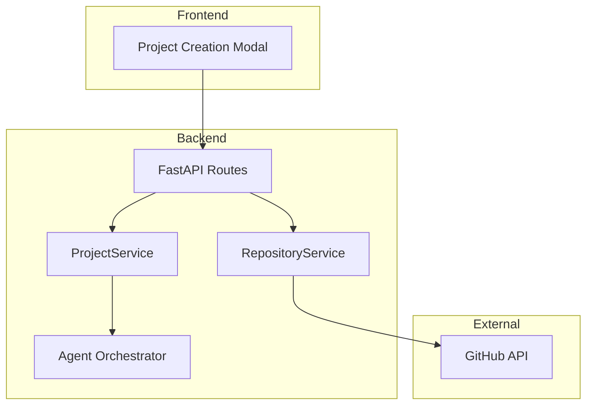

# Create Repository Design

## Overview

This design covers the technical implementation for creating, scaffolding, and deleting GitHub repositories directly from OmoiOS. The feature integrates into the existing project connection flow and leverages both the GitHub API and existing agent scaffolding capabilities.

## Architecture

### System Context



### Component Diagram

| Component | Responsibility | Technology |
|-----------|---------------|------------|
| `RepositoryService` | Create, delete repos via GitHub API | Python + httpx |
| `ProjectService` | Link repos to OmoiOS projects | Existing service |
| `TemplateService` | Apply starter templates to new repos | Python |
| `ProjectCreationModal` | UI for create/connect flow | React + ShadCN |
| `RepoNameInput` | Validate and check availability | React component |

## Data Model

### Database Schema

No new tables required. Extend existing `Project` model:

```sql
-- Add columns to projects table
ALTER TABLE projects ADD COLUMN repo_created_by_omoios BOOLEAN DEFAULT FALSE;
ALTER TABLE projects ADD COLUMN repo_template_used VARCHAR(100) NULL;
ALTER TABLE projects ADD COLUMN github_owner VARCHAR(255) NULL;
ALTER TABLE projects ADD COLUMN github_owner_type VARCHAR(20) NULL; -- 'user' or 'organization'
```

### Pydantic Models

```python
from pydantic import BaseModel, Field
from typing import Optional, Literal
from enum import Enum

class RepoVisibility(str, Enum):
    PUBLIC = "public"
    PRIVATE = "private"

class RepoTemplate(str, Enum):
    EMPTY = "empty"
    NEXTJS = "nextjs"
    FASTAPI = "fastapi"
    REACT_VITE = "react-vite"
    PYTHON_PACKAGE = "python-package"

class GitHubOwner(BaseModel):
    """GitHub account or organization that can own repos."""
    login: str
    id: int
    type: Literal["User", "Organization"]
    avatar_url: Optional[str] = None

class CreateRepositoryRequest(BaseModel):
    """Request to create a new GitHub repository."""
    name: str = Field(..., min_length=1, max_length=100, pattern=r'^[a-zA-Z0-9._-]+$')
    description: Optional[str] = Field(None, max_length=350)
    visibility: RepoVisibility = RepoVisibility.PRIVATE
    owner: str = Field(..., description="GitHub username or org login")
    template: RepoTemplate = RepoTemplate.EMPTY
    auto_scaffold: bool = Field(True, description="Auto-scaffold after creation")
    feature_description: Optional[str] = Field(None, description="What to build (for auto-scaffold)")

class CreateRepositoryResponse(BaseModel):
    """Response after creating a repository."""
    id: int
    name: str
    full_name: str
    html_url: str
    clone_url: str
    default_branch: str
    project_id: str  # OmoiOS project ID

class DeleteRepositoryRequest(BaseModel):
    """Request to delete a repository."""
    owner: str
    repo: str
    confirm_name: str = Field(..., description="Must match repo name for confirmation")

class ListOrganizationsResponse(BaseModel):
    """List of GitHub accounts/orgs user can create repos in."""
    owners: list[GitHubOwner]
```

## API Specification

### Endpoints

| Method | Path | Description | Auth |
|--------|------|-------------|------|
| GET | /api/v1/github/owners | List accounts/orgs user can create repos in | Required |
| POST | /api/v1/github/repos | Create new repository | Required |
| DELETE | /api/v1/github/repos/{owner}/{repo} | Delete repository | Required |
| GET | /api/v1/github/repos/{owner}/{repo}/available | Check if repo name is available | Required |
| GET | /api/v1/templates | List available templates | Required |

### Request/Response Examples

#### GET /api/v1/github/owners

**Response (200):**
```json
{
  "owners": [
    {
      "login": "kivo360",
      "id": 2403240,
      "type": "User",
      "avatar_url": "https://avatars.githubusercontent.com/u/2403240"
    },
    {
      "login": "omoios",
      "id": 123456,
      "type": "Organization",
      "avatar_url": "https://avatars.githubusercontent.com/u/123456"
    }
  ]
}
```

#### POST /api/v1/github/repos

**Request:**
```json
{
  "name": "invoice-api",
  "description": "REST API for invoice management",
  "visibility": "private",
  "owner": "kivo360",
  "template": "fastapi",
  "auto_scaffold": true,
  "feature_description": "Build a REST API for managing invoices with Stripe integration"
}
```

**Response (201):**
```json
{
  "id": 123456789,
  "name": "invoice-api",
  "full_name": "kivo360/invoice-api",
  "html_url": "https://github.com/kivo360/invoice-api",
  "clone_url": "https://github.com/kivo360/invoice-api.git",
  "default_branch": "main",
  "project_id": "proj-abc123"
}
```

**Error Response (400):**
```json
{
  "error": "repository_exists",
  "message": "Repository 'invoice-api' already exists in kivo360's account"
}
```

**Error Response (403):**
```json
{
  "error": "insufficient_permissions",
  "message": "Cannot create repository in organization 'acme'. Missing create_repo permission."
}
```

#### DELETE /api/v1/github/repos/{owner}/{repo}

**Request:**
```json
{
  "confirm_name": "invoice-api"
}
```

**Response (200):**
```json
{
  "message": "Repository 'kivo360/invoice-api' deleted successfully",
  "project_archived": true
}
```

**Error Response (400):**
```json
{
  "error": "confirmation_mismatch",
  "message": "Confirmation name does not match repository name"
}
```

**Error Response (403):**
```json
{
  "error": "missing_scope",
  "message": "GitHub token is missing 'delete_repo' scope. Please re-authorize.",
  "reauth_url": "/auth/github/reauthorize?scope=delete_repo"
}
```

#### GET /api/v1/github/repos/{owner}/{repo}/available

**Response (200) - Available:**
```json
{
  "available": true,
  "name": "invoice-api",
  "owner": "kivo360"
}
```

**Response (200) - Not Available:**
```json
{
  "available": false,
  "name": "invoice-api",
  "owner": "kivo360",
  "suggestion": "invoice-api-2"
}
```

## Implementation Details

### RepositoryService

```python
# omoi_os/services/repository_service.py

import httpx
from typing import Optional
from omoi_os.models.github import CreateRepositoryRequest, GitHubOwner

class RepositoryService:
    """Service for GitHub repository operations."""

    def __init__(self, github_token: str):
        self.github_token = github_token
        self.client = httpx.AsyncClient(
            base_url="https://api.github.com",
            headers={
                "Authorization": f"Bearer {github_token}",
                "Accept": "application/vnd.github+json",
                "X-GitHub-Api-Version": "2022-11-28"
            },
            timeout=30.0
        )

    async def list_owners(self) -> list[GitHubOwner]:
        """List accounts/orgs user can create repos in."""
        # Get authenticated user
        user_resp = await self.client.get("/user")
        user_resp.raise_for_status()
        user = user_resp.json()

        owners = [GitHubOwner(
            login=user["login"],
            id=user["id"],
            type="User",
            avatar_url=user.get("avatar_url")
        )]

        # Get organizations
        orgs_resp = await self.client.get("/user/orgs")
        orgs_resp.raise_for_status()

        for org in orgs_resp.json():
            # Check if user can create repos in this org
            membership_resp = await self.client.get(
                f"/orgs/{org['login']}/memberships/{user['login']}"
            )
            if membership_resp.status_code == 200:
                membership = membership_resp.json()
                # Admin or member with create_repo permission
                if membership.get("role") in ("admin", "member"):
                    owners.append(GitHubOwner(
                        login=org["login"],
                        id=org["id"],
                        type="Organization",
                        avatar_url=org.get("avatar_url")
                    ))

        return owners

    async def check_availability(self, owner: str, name: str) -> tuple[bool, Optional[str]]:
        """Check if repo name is available. Returns (available, suggestion)."""
        resp = await self.client.get(f"/repos/{owner}/{name}")
        if resp.status_code == 404:
            return True, None
        elif resp.status_code == 200:
            # Suggest alternative
            for i in range(2, 10):
                alt_name = f"{name}-{i}"
                alt_resp = await self.client.get(f"/repos/{owner}/{alt_name}")
                if alt_resp.status_code == 404:
                    return False, alt_name
            return False, f"{name}-{uuid.uuid4().hex[:6]}"
        else:
            resp.raise_for_status()

    async def create_repository(
        self,
        request: CreateRepositoryRequest,
        is_org: bool = False
    ) -> dict:
        """Create a new GitHub repository."""
        payload = {
            "name": request.name,
            "description": request.description or "",
            "private": request.visibility == "private",
            "auto_init": True,  # Initialize with README
        }

        if is_org:
            url = f"/orgs/{request.owner}/repos"
        else:
            url = "/user/repos"

        resp = await self.client.post(url, json=payload)
        resp.raise_for_status()
        return resp.json()

    async def delete_repository(self, owner: str, repo: str) -> bool:
        """Delete a GitHub repository."""
        resp = await self.client.delete(f"/repos/{owner}/{repo}")
        if resp.status_code == 204:
            return True
        elif resp.status_code == 403:
            # Check if it's a scope issue
            scopes = resp.headers.get("X-OAuth-Scopes", "")
            if "delete_repo" not in scopes:
                raise PermissionError("Missing delete_repo scope")
            raise PermissionError("Cannot delete repository")
        else:
            resp.raise_for_status()

    async def check_scopes(self) -> list[str]:
        """Check OAuth scopes of current token."""
        resp = await self.client.get("/user")
        scopes = resp.headers.get("X-OAuth-Scopes", "")
        return [s.strip() for s in scopes.split(",") if s.strip()]
```

### TemplateService

```python
# omoi_os/services/template_service.py

from typing import Dict, List
import base64

TEMPLATES: Dict[str, List[dict]] = {
    "empty": [],  # Just README from auto_init

    "nextjs": [
        {"path": "package.json", "content": "..."},
        {"path": "next.config.js", "content": "..."},
        {"path": "tsconfig.json", "content": "..."},
        {"path": "app/page.tsx", "content": "..."},
        {"path": "app/layout.tsx", "content": "..."},
        {"path": ".gitignore", "content": "node_modules/\n.next/\n..."},
    ],

    "fastapi": [
        {"path": "pyproject.toml", "content": "..."},
        {"path": "app/__init__.py", "content": ""},
        {"path": "app/main.py", "content": "from fastapi import FastAPI\n..."},
        {"path": "app/config.py", "content": "..."},
        {"path": ".gitignore", "content": "__pycache__/\n.venv/\n..."},
    ],

    "react-vite": [
        {"path": "package.json", "content": "..."},
        {"path": "vite.config.ts", "content": "..."},
        {"path": "src/main.tsx", "content": "..."},
        {"path": "src/App.tsx", "content": "..."},
        {"path": ".gitignore", "content": "node_modules/\ndist/\n..."},
    ],

    "python-package": [
        {"path": "pyproject.toml", "content": "..."},
        {"path": "src/__init__.py", "content": ""},
        {"path": "tests/__init__.py", "content": ""},
        {"path": ".gitignore", "content": "__pycache__/\ndist/\n..."},
    ],
}

class TemplateService:
    """Service for applying project templates."""

    def __init__(self, repo_service: RepositoryService):
        self.repo_service = repo_service

    async def apply_template(
        self,
        owner: str,
        repo: str,
        template: str
    ) -> int:
        """Apply template files to repository. Returns number of files created."""
        if template == "empty" or template not in TEMPLATES:
            return 0

        files = TEMPLATES[template]
        for file_info in files:
            content_b64 = base64.b64encode(
                file_info["content"].encode()
            ).decode()

            await self.repo_service.client.put(
                f"/repos/{owner}/{repo}/contents/{file_info['path']}",
                json={
                    "message": f"Add {file_info['path']} from {template} template",
                    "content": content_b64,
                }
            )

        return len(files)
```

### Auto-Scaffold Flow

```python
# omoi_os/services/project_service.py (additions)

async def create_project_with_repo(
    self,
    user_id: str,
    request: CreateRepositoryRequest,
) -> Project:
    """Create new project with a new GitHub repository."""

    # 1. Determine if org or personal
    owners = await self.repo_service.list_owners()
    owner_info = next((o for o in owners if o.login == request.owner), None)
    if not owner_info:
        raise ValueError(f"Cannot create repos in {request.owner}")

    is_org = owner_info.type == "Organization"

    # 2. Create the repository
    repo = await self.repo_service.create_repository(request, is_org)

    # 3. Apply template if selected
    if request.template != "empty":
        await self.template_service.apply_template(
            request.owner,
            request.name,
            request.template
        )

    # 4. Create OmoiOS project
    project = Project(
        name=request.name,
        user_id=user_id,
        github_repo_url=repo["html_url"],
        github_repo_id=repo["id"],
        github_owner=request.owner,
        github_owner_type=owner_info.type.lower(),
        repo_created_by_omoios=True,
        repo_template_used=request.template,
    )

    with self.db.get_session() as session:
        session.add(project)
        session.commit()
        session.refresh(project)

    # 5. Trigger auto-scaffold if feature description provided
    if request.auto_scaffold and request.feature_description:
        await self.trigger_scaffolding(
            project_id=str(project.id),
            feature_description=request.feature_description,
        )

    return project
```

## Frontend Components

### ProjectCreationModal

```tsx
// frontend/components/project/ProjectCreationModal.tsx

import { Tabs, TabsContent, TabsList, TabsTrigger } from "@/components/ui/tabs"
import { CreateRepoForm } from "./CreateRepoForm"
import { ConnectRepoForm } from "./ConnectRepoForm"

export function ProjectCreationModal({ onClose, onSuccess }) {
  return (
    <Dialog open onOpenChange={onClose}>
      <DialogContent className="max-w-2xl">
        <DialogHeader>
          <DialogTitle>New Project</DialogTitle>
        </DialogHeader>

        <Tabs defaultValue="create">
          <TabsList className="grid w-full grid-cols-2">
            <TabsTrigger value="create">Create New Repo</TabsTrigger>
            <TabsTrigger value="connect">Connect Existing</TabsTrigger>
          </TabsList>

          <TabsContent value="create">
            <CreateRepoForm onSuccess={onSuccess} />
          </TabsContent>

          <TabsContent value="connect">
            <ConnectRepoForm onSuccess={onSuccess} />
          </TabsContent>
        </Tabs>
      </DialogContent>
    </Dialog>
  )
}
```

### CreateRepoForm

```tsx
// frontend/components/project/CreateRepoForm.tsx

export function CreateRepoForm({ onSuccess }) {
  const [owners, setOwners] = useState<GitHubOwner[]>([])
  const [selectedOwner, setSelectedOwner] = useState<string>("")
  const [repoName, setRepoName] = useState("")
  const [isAvailable, setIsAvailable] = useState<boolean | null>(null)
  const [template, setTemplate] = useState("empty")
  const [visibility, setVisibility] = useState("private")
  const [featureDescription, setFeatureDescription] = useState("")

  // Fetch owners on mount
  useEffect(() => {
    fetchOwners().then(setOwners)
  }, [])

  // Check availability on name change (debounced)
  useEffect(() => {
    if (repoName && selectedOwner) {
      checkAvailability(selectedOwner, repoName).then(setIsAvailable)
    }
  }, [repoName, selectedOwner])

  return (
    <form onSubmit={handleSubmit}>
      {/* Owner Selection */}
      <Select value={selectedOwner} onValueChange={setSelectedOwner}>
        <SelectTrigger>
          <SelectValue placeholder="Select account or organization" />
        </SelectTrigger>
        <SelectContent>
          {owners.map(owner => (
            <SelectItem key={owner.login} value={owner.login}>
              <Avatar src={owner.avatar_url} />
              {owner.login}
              <Badge>{owner.type}</Badge>
            </SelectItem>
          ))}
        </SelectContent>
      </Select>

      {/* Repo Name with availability indicator */}
      <div className="relative">
        <Input
          value={repoName}
          onChange={e => setRepoName(e.target.value)}
          placeholder="repository-name"
        />
        {isAvailable === true && <CheckIcon className="text-green-500" />}
        {isAvailable === false && <XIcon className="text-red-500" />}
      </div>

      {/* Template Selection */}
      <RadioGroup value={template} onValueChange={setTemplate}>
        <RadioGroupItem value="empty">Empty (README only)</RadioGroupItem>
        <RadioGroupItem value="nextjs">Next.js App Router</RadioGroupItem>
        <RadioGroupItem value="fastapi">FastAPI + PostgreSQL</RadioGroupItem>
        <RadioGroupItem value="react-vite">React + Vite</RadioGroupItem>
        <RadioGroupItem value="python-package">Python Package</RadioGroupItem>
      </RadioGroup>

      {/* Visibility */}
      <RadioGroup value={visibility} onValueChange={setVisibility}>
        <RadioGroupItem value="private">Private</RadioGroupItem>
        <RadioGroupItem value="public">Public</RadioGroupItem>
      </RadioGroup>

      {/* Feature Description for auto-scaffold */}
      <Textarea
        value={featureDescription}
        onChange={e => setFeatureDescription(e.target.value)}
        placeholder="Describe what you want to build... (optional)"
        rows={4}
      />

      <Button type="submit" disabled={!isAvailable || !selectedOwner}>
        Create Repository & Start Building
      </Button>
    </form>
  )
}
```

## Testing Strategy

### Unit Tests
- [ ] `RepositoryService.list_owners` - Returns user + orgs with permissions
- [ ] `RepositoryService.check_availability` - Returns correct availability and suggestions
- [ ] `RepositoryService.create_repository` - Creates repo with correct params
- [ ] `RepositoryService.delete_repository` - Handles success and permission errors
- [ ] `TemplateService.apply_template` - Applies correct files for each template
- [ ] Repo name validation - Rejects invalid names

### Integration Tests
- [ ] Full create flow - Create repo, apply template, create project
- [ ] Delete flow - Delete repo, archive project
- [ ] Permission errors - Correct error messages for insufficient permissions

### E2E Tests
- [ ] User creates repo in personal account
- [ ] User creates repo in organization
- [ ] User selects template and sees files created
- [ ] User provides feature description and scaffolding starts
- [ ] User deletes repo with confirmation

## Security Considerations

- [ ] Validate OAuth scopes before operations
- [ ] Never log or expose GitHub tokens
- [ ] Require confirmation for destructive actions (delete)
- [ ] Rate limit repo creation to prevent abuse
- [ ] Validate repo name on backend (don't trust frontend validation)

## Performance Considerations

- [ ] Cache org list for 5 minutes (orgs don't change often)
- [ ] Debounce availability checks (300ms)
- [ ] Apply template files in parallel (not sequentially)
- [ ] Use background task for scaffolding after creation

## Open Questions

- [x] Should templates be hardcoded or configurable? **Hardcoded for MVP, configurable later**
- [x] Retry logic for GitHub API failures? **Yes, 3 retries with exponential backoff**
