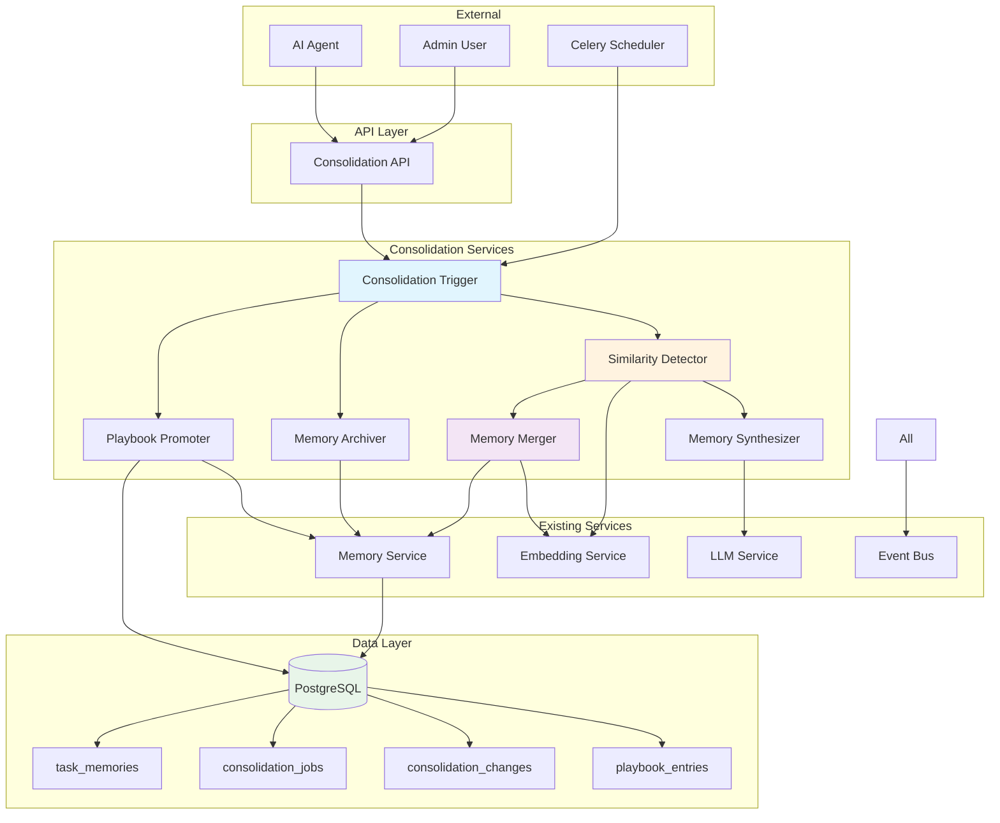

# Memory Consolidation Design

## Overview

This design document specifies the architecture, components, data models, APIs, and implementation details for the Memory Consolidation System. The system extends the existing Agent Memory System with intelligent memory management capabilities including merging, summarization, archiving, and playbook promotion.

## Architecture

### System Context



### Component Diagram

| Component | Responsibility | Technology |
|-----------|---------------|------------|
| Consolidation API | HTTP endpoints for triggering and querying consolidation | FastAPI |
| Consolidation Trigger | Orchestrates consolidation workflow, manages job lifecycle | Python 3.11+ |
| Similarity Detector | Clusters similar memories using embedding similarity | pgvector |
| Memory Merger | Merges similar memories into consolidated entries | SQLAlchemy |
| Memory Synthesizer | Creates summary memories from clusters | PydanticAI |
| Memory Archiver | Archives stale/unused memories | SQLAlchemy |
| Playbook Promoter | Promotes high-value memories to playbook | SQLAlchemy |
| Scheduled Job Runner | Executes periodic consolidation via Celery | Celery |

## Data Model

### Database Schema Extensions

#### consolidation_jobs Table

```sql
CREATE TABLE consolidation_jobs (
    id UUID PRIMARY KEY DEFAULT uuid_generate_v4(),
    project_id UUID NOT NULL REFERENCES projects(id) ON DELETE CASCADE,

    -- Job status
    status VARCHAR(20) NOT NULL,  -- pending, running, completed, failed
    trigger_type VARCHAR(20) NOT NULL,  -- scheduled, manual, threshold

    -- Configuration options
    options JSONB DEFAULT '{}',
    /*
    {
        "merge": true,
        "summarize": true,
        "archive": true,
        "promote": true,
        "similarity_threshold": 0.90,
        "min_cluster_size": 2,
        "archive_stale_days": 90,
        "archive_min_reuse": 3
    }
    */

    -- Results counters
    memories_merged INTEGER DEFAULT 0,
    memories_archived INTEGER DEFAULT 0,
    memories_promoted INTEGER DEFAULT 0,
    summaries_created INTEGER DEFAULT 0,

    -- Execution metadata
    started_at TIMESTAMP WITH TIME ZONE,
    completed_at TIMESTAMP WITH TIME ZONE,
    error_message TEXT,
    triggered_by VARCHAR(255),  -- user_id or 'system'

    created_at TIMESTAMP WITH TIME ZONE DEFAULT CURRENT_TIMESTAMP,

    CONSTRAINT consolidation_jobs_status_check
        CHECK (status IN ('pending', 'running', 'completed', 'failed')),
    CONSTRAINT consolidation_jobs_trigger_check
        CHECK (trigger_type IN ('scheduled', 'manual', 'threshold'))
);

CREATE INDEX idx_consolidation_jobs_project ON consolidation_jobs(project_id, created_at DESC);
CREATE INDEX idx_consolidation_jobs_status ON consolidation_jobs(status) WHERE status IN ('pending', 'running');
CREATE INDEX idx_consolidation_jobs_triggered_by ON consolidation_jobs(triggered_by);
```

#### consolidation_changes Table

```sql
CREATE TABLE consolidation_changes (
    id UUID PRIMARY KEY DEFAULT uuid_generate_v4(),
    consolidation_job_id UUID NOT NULL REFERENCES consolidation_jobs(id) ON DELETE CASCADE,

    -- Change details
    operation VARCHAR(20) NOT NULL,  -- merge, archive, promote, summarize, rollback
    memory_id UUID NOT NULL REFERENCES task_memories(id) ON DELETE CASCADE,

    -- State tracking
    previous_state JSONB,
    new_state JSONB,

    -- Context
    reason TEXT,
    confidence FLOAT,

    -- Metadata
    changed_at TIMESTAMP WITH TIME ZONE DEFAULT CURRENT_TIMESTAMP,
    changed_by VARCHAR(255),  -- user_id or 'system'

    CONSTRAINT consolidation_changes_operation_check
        CHECK (operation IN ('merge', 'archive', 'promote', 'summarize', 'rollback'))
);

CREATE INDEX idx_consolidation_changes_job ON consolidation_changes(consolidation_job_id);
CREATE INDEX idx_consolidation_changes_memory ON consolidation_changes(memory_id);
CREATE INDEX idx_consolidation_changes_operation ON consolidation_changes(operation);
CREATE INDEX idx_consolidation_changes_changed_at ON consolidation_changes(changed_at DESC);
```

#### task_memories Table Extensions

```sql
-- Add consolidation-related columns
ALTER TABLE task_memories
ADD COLUMN IF NOT EXISTS consolidated_from UUID[],
ADD COLUMN IF NOT EXISTS consolidated_at TIMESTAMP WITH TIME ZONE,
ADD COLUMN IF NOT EXISTS synthesized_from UUID[],
ADD COLUMN IF NOT EXISTS synthesized_at TIMESTAMP WITH TIME ZONE,
ADD COLUMN IF NOT EXISTS synthesis_confidence FLOAT,
ADD COLUMN IF NOT EXISTS is_archived BOOLEAN DEFAULT FALSE,
ADD COLUMN IF NOT EXISTS archived_at TIMESTAMP WITH TIME ZONE,
ADD COLUMN IF NOT EXISTS archive_reason VARCHAR(50);

-- Create indexes for consolidation queries
CREATE INDEX idx_task_memories_consolidated
ON task_memories(consolidated_at DESC)
WHERE consolidated_at IS NOT NULL;

CREATE INDEX idx_task_memories_synthesized
ON task_memories(synthesized_at DESC)
WHERE synthesized_at IS NOT NULL;

CREATE INDEX idx_task_memories_archived
ON task_memories(is_archived, archived_at DESC)
WHERE is_archived = TRUE;

-- Add memory_type enum values
ALTER TABLE task_memories
ADD CONSTRAINT task_memories_consolidated_type_check
CHECK (
    memory_type IN (
        'error_fix', 'discovery', 'decision', 'learning',
        'warning', 'codebase_knowledge',
        'consolidated', 'synthesis'
    )
);
```

### Pydantic Models

```python
from __future__ import annotations
from datetime import datetime
from typing import Any, Dict, List, Optional
from pydantic import BaseModel, Field
from uuid import UUID


class ConsolidationOptions(BaseModel):
    """Options for consolidation operations."""

    merge: bool = True
    summarize: bool = True
    archive: bool = True
    promote: bool = True

    similarity_threshold: float = Field(default=0.90, ge=0.0, le=1.0)
    min_cluster_size: int = Field(default=2, ge=2)
    archive_stale_days: int = Field(default=90, ge=1)
    archive_min_reuse: int = Field(default=3, ge=0)
    promote_confidence_threshold: float = Field(default=0.85, ge=0.0, le=1.0)


class TriggerConsolidationRequest(BaseModel):
    """Request to trigger consolidation."""

    project_id: UUID
    options: Optional[ConsolidationOptions] = None


class TriggerConsolidationResponse(BaseModel):
    """Response when consolidation is triggered."""

    job_id: UUID
    status: str
    estimated_completion: Optional[datetime] = None


class ConsolidationStatusResponse(BaseModel):
    """Response for consolidation status query."""

    job_id: UUID
    project_id: UUID
    status: str
    progress: Optional[float] = None  # 0.0 to 1.0
    started_at: Optional[datetime] = None
    completed_at: Optional[datetime] = None

    # Results
    memories_merged: int = 0
    memories_archived: int = 0
    memories_promoted: int = 0
    summaries_created: int = 0

    # Links
    consolidation_changes: List[UUID] = []
    error_message: Optional[str] = None


class MemoryCluster(BaseModel):
    """A cluster of similar memories."""

    memory_ids: List[UUID]
    cluster_id: str  # Hash of sorted IDs for identification
    similarity_score: float  # Average pairwise similarity
    representative_id: UUID  # Most central memory


class ConsolidationResult(BaseModel):
    """Result of a consolidation operation."""

    job_id: UUID
    operation: str  # merge, summarize, archive, promote

    # Output
    created_memory_ids: List[UUID] = []
    modified_memory_ids: List[UUID] = []
    archived_memory_ids: List[UUID] = []

    # Metrics
    input_count: int
    output_count: int
    reduction_ratio: float

    # Links
    consolidation_change_ids: List[UUID]


class RollbackRequest(BaseModel):
    """Request to rollback a consolidation."""

    consolidation_id: UUID
    reason: Optional[str] = None


class RollbackResponse(BaseModel):
    """Response for rollback operation."""

    success: bool
    rollback_id: UUID
    memories_restored: int
    memories_deleted: int
    warnings: List[str] = []
```

## API Specification

### Endpoints

| Method | Path | Description | Auth |
|--------|------|-------------|------|
| POST | /api/v1/consolidation/trigger | Trigger consolidation | Admin |
| GET | /api/v1/consolidation/status/{job_id} | Get job status | Admin |
| GET | /api/v1/consolidation/history/{project_id} | Get consolidation history | Admin |
| POST | /api/v1/consolidation/rollback | Rollback consolidation | Admin |
| POST | /api/v1/consolidation/configure/{project_id} | Configure consolidation | Admin |

### POST /api/v1/consolidation/trigger

**Request:**
```json
{
  "project_id": "uuid",
  "options": {
    "merge": true,
    "summarize": true,
    "archive": true,
    "promote": true,
    "similarity_threshold": 0.90,
    "min_cluster_size": 2
  }
}
```

**Response (202 Accepted):**
```json
{
  "job_id": "uuid",
  "status": "pending",
  "estimated_completion": "2025-01-08T15:30:00Z"
}
```

**Error Response (400):**
```json
{
  "error": "validation_error",
  "message": "Project has consolidation disabled"
}
```

### GET /api/v1/consolidation/status/{job_id}

**Response (200 OK):**
```json
{
  "job_id": "uuid",
  "project_id": "uuid",
  "status": "completed",
  "progress": 1.0,
  "started_at": "2025-01-08T15:00:00Z",
  "completed_at": "2025-01-08T15:00:25Z",
  "memories_merged": 45,
  "memories_archived": 12,
  "memories_promoted": 8,
  "summaries_created": 3,
  "consolidation_changes": ["uuid1", "uuid2", ...]
}
```

### POST /api/v1/consolidation/rollback

**Request:**
```json
{
  "consolidation_id": "uuid",
  "reason": "Incorrect merge"
}
```

**Response (200 OK):**
```json
{
  "success": true,
  "rollback_id": "uuid",
  "memories_restored": 45,
  "memories_deleted": 3,
  "warnings": []
}
```

**Error Response (409 Conflict):**
```json
{
  "error": "conflict",
  "message": "Cannot rollback: conflicting changes exist after consolidation"
}
```

## Implementation Details

### Consolidation Service Architecture

```python
# omoi_os/services/consolidation.py

from typing import List, Optional
from sqlalchemy.orm import Session
from dataclasses import dataclass

from omoi_os.services.memory import MemoryService
from omoi_os.services.embedding import EmbeddingService
from omoi_os.services.llm_service import LLMService
from omoi_os.models.task_memory import TaskMemory
from omoi_os.models.consolidation_job import ConsolidationJob


@dataclass
class ConsolidationResult:
    """Result of consolidation operation."""
    created_memory_ids: List[str]
    modified_memory_ids: List[str]
    archived_memory_ids: List[str]
    change_ids: List[str]


class ConsolidationService:
    """
    Service for memory consolidation operations.

    Features:
    - Detect similar memory clusters using embedding similarity
    - Merge similar memories into consolidated entries
    - Create summary memories from clusters
    - Archive stale/unused memories
    - Promote high-value memories to playbook
    - Track all operations in audit log
    """

    def __init__(
        self,
        memory_service: MemoryService,
        embedding_service: EmbeddingService,
        llm_service: LLMService,
    ):
        self.memory_service = memory_service
        self.embedding_service = embedding_service
        self.llm_service = llm_service

    async def execute_consolidation(
        self,
        session: Session,
        project_id: str,
        options: ConsolidationOptions,
        trigger_type: str,
        triggered_by: str,
    ) -> ConsolidationResult:
        """
        Execute full consolidation workflow.

        Steps:
        1. Create consolidation job record
        2. Detect similar memory clusters
        3. Merge clusters if enabled
        4. Create summaries if enabled
        5. Archive stale memories if enabled
        6. Promote high-value memories if enabled
        7. Record all changes
        8. Update job status

        Returns:
            ConsolidationResult with all affected memory IDs
        """
        # Implementation details below...
        pass

    async def detect_similar_clusters(
        self,
        session: Session,
        project_id: str,
        threshold: float,
    ) -> List[MemoryCluster]:
        """
        Detect clusters of similar memories using embedding similarity.

        Algorithm:
        1. Get all active memories for project with embeddings
        2. Compute pairwise cosine similarity matrix
        3. Apply threshold to find similar pairs
        4. Use connected components to form clusters
        5. Filter clusters by min_size

        Returns:
            List of MemoryCluster objects
        """
        # Get candidate memories
        memories = session.execute(
            select(TaskMemory)
            .where(TaskMemory.project_id == project_id)
            .where(TaskMemory.is_duplicate == False)
            .where(TaskMemory.is_archived == False)
            .where(TaskMemory.context_embedding.isnot(None))
        ).scalars().all()

        # Compute similarity clusters
        clusters = await self._compute_clusters(memories, threshold)

        # Filter by min size
        return [c for c in clusters if len(c.memory_ids) >= options.min_cluster_size]

    async def merge_cluster(
        self,
        session: Session,
        cluster: MemoryCluster,
        project_id: str,
    ) -> str:
        """
        Merge a cluster of similar memories into single consolidated memory.

        Strategy:
        1. Select representative memory (highest reused_count)
        2. Combine content from all memories
        3. Merge tags, file links
        4. Generate new embedding
        5. Mark sources as duplicate
        6. Create consolidated memory

        Returns:
            ID of new consolidated memory
        """
        # Get source memories
        source_memories = [
            session.get(TaskMemory, mid) for mid in cluster.memory_ids
        ]

        # Select representative (most reused)
        representative = max(source_memories, key=lambda m: m.reused_count)

        # Build consolidated content
        consolidated_content = self._build_merged_content(source_memories)

        # Combine metadata
        all_tags = set()
        all_files = set()
        for mem in source_memories:
            all_tags.update(mem.tags or [])
            # Extract file links from memory_files table

        # Generate embedding
        embedding = self.embedding_service.generate_embedding(
            consolidated_content
        )

        # Create consolidated memory
        consolidated = TaskMemory(
            task_id=representative.task_id,  # Keep link to one task
            execution_summary=consolidated_content,
            memory_type="consolidated",
            context_embedding=embedding,
            goal=self._merge_field(source_memories, "goal"),
            result=self._merge_field(source_memories, "result"),
            feedback=self._merge_field(source_memories, "feedback"),
            tags=list(all_tags),
            consolidated_from=[str(m.id) for m in source_memories],
            consolidated_at=utc_now(),
            success=any(m.success for m in source_memories),
        )

        session.add(consolidated)
        session.flush()

        # Mark sources as duplicate
        for mem in source_memories:
            mem.is_duplicate = True
            mem.duplicate_of = str(consolidated.id)

        return str(consolidated.id)

    async def create_summary(
        self,
        session: Session,
        cluster: MemoryCluster,
    ) -> str:
        """
        Create a summary memory that synthesizes insights from cluster.

        Uses LLM to extract:
        - Common patterns across memories
        - Best practices identified
        - Architectural insights
        - Gotchas or warnings

        Returns:
            ID of new summary memory
        """
        # Get source memories
        source_memories = [
            session.get(TaskMemory, mid) for mid in cluster.memory_ids
        ]

        # Build synthesis prompt
        from omoi_os.services.template_service import get_template_service

        template_service = get_template_service()
        prompt = template_service.render(
            "prompts/memory_synthesis.md.j2",
            memories=[
                {
                    "summary": m.execution_summary,
                    "type": m.memory_type,
                    "goal": m.goal,
                }
                for m in source_memories
            ],
        )

        # Generate summary using LLM
        from omoi_os.services.llm_service import get_llm_service
        from omoi_os.schemas.memory_analysis import MemorySynthesis

        llm = get_llm_service()
        synthesis = await llm.structured_output(
            prompt,
            output_type=MemorySynthesis,
        )

        # Validate quality
        if synthesis.confidence < 0.80:
            # Flag for review
            pass

        # Create summary memory
        embedding = self.embedding_service.generate_embedding(
            synthesis.summary
        )

        summary = TaskMemory(
            task_id=source_memories[0].task_id,
            execution_summary=synthesis.summary,
            memory_type="synthesis",
            context_embedding=embedding,
            goal=synthesis.patterns,
            result=synthesis.best_practices,
            feedback=synthesis.gotchas,
            tags=["synthesis", "consolidated"],
            synthesized_from=[str(m.id) for m in source_memories],
            synthesized_at=utc_now(),
            synthesis_confidence=synthesis.confidence,
            success=True,
        )

        session.add(summary)
        session.flush()

        return str(summary.id)

    async def archive_stale_memories(
        self,
        session: Session,
        project_id: str,
        stale_days: int,
        min_reuse: int,
    ) -> List[str]:
        """
        Archive memories that are stale and rarely used.

        Criteria:
        - Not reused in stale_days
        - Total reuse_count < min_reuse
        - Not already archived or duplicate

        Returns:
            List of archived memory IDs
        """
        cutoff_date = utc_now() - timedelta(days=stale_days)

        stale_memories = session.execute(
            select(TaskMemory)
            .where(TaskMemory.project_id == project_id)
            .where(TaskMemory.is_duplicate == False)
            .where(TaskMemory.is_archived == False)
            .where(TaskMemory.reused_count < min_reuse)
            .where(TaskMemory.learned_at < cutoff_date)
        ).scalars().all()

        archived_ids = []
        for mem in stale_memories:
            mem.is_archived = True
            mem.archived_at = utc_now()
            mem.archive_reason = "staleness"
            archived_ids.append(str(mem.id))

        return archived_ids

    async def promote_to_playbook(
        self,
        session: Session,
        memory_id: str,
        confidence: float,
    ) -> Optional[str]:
        """
        Promote a consolidated or summary memory to playbook entry.

        Criteria:
        - Memory type is 'consolidated' or 'synthesis'
        - Confidence > threshold (default 0.85)
        - Not already in playbook

        Returns:
            Playbook entry ID if promoted, None otherwise
        """
        memory = session.get(TaskMemory, memory_id)
        if not memory:
            return None

        # Check eligibility
        if memory.memory_type not in ("consolidated", "synthesis"):
            return None

        if confidence < 0.85:
            return None

        # Check for duplicates
        existing = await self._check_playbook_duplicate(
            session, memory.execution_summary, memory.project_id
        )
        if existing:
            return None

        # Create playbook entry
        from omoi_os.models.playbook_entry import PlaybookEntry

        entry = PlaybookEntry(
            project_id=memory.project_id,
            content=memory.execution_summary,
            category=self._infer_category(memory),
            tags=memory.tags or [],
            priority=self._calculate_priority(memory),
            supporting_memory_ids=[memory.id],
            embedding=memory.context_embedding,
            created_by="consolidation_system",
        )

        session.add(entry)
        session.flush()

        return str(entry.id)
```

### Scheduled Job Implementation

```python
# omoi_os/tasks/consolidation_tasks.py

from celery import shared_task
from sqlalchemy.orm import Session

from omoi_os.db.session import get_session
from omoi_os.services.consolidation import ConsolidationService
from omoi_os.models.consolidation_job import ConsolidationJob


@shared_task(name="consolidation.run_scheduled")
def run_scheduled_consolidation():
    """
    Run consolidation for all projects exceeding threshold.

    Scheduled to run daily via Celery beat.
    """
    with get_session() as session:
        # Get projects exceeding threshold
        projects = session.execute(
            select(Project)
            .outerjoin(TaskMemory)
            .group_by(Project.id)
            .having(func.count(TaskMemory.id) > Project.consolidation_threshold)
        ).scalars().all()

        for project in projects:
            # Trigger consolidation for each project
            run_project_consolidation.delay(str(project.id))


@shared_task(name="consolidation.run_project")
def run_project_consolidation(project_id: str):
    """
    Run consolidation for a specific project.
    """
    from omoi_os.services.consolidation import get_consolidation_service

    with get_session() as session:
        service = get_consolidation_service()

        # Get project config
        project = session.get(Project, project_id)
        options = ConsolidationOptions(**project.consolidation_config)

        # Execute consolidation
        result = service.execute_consolidation(
            session=session,
            project_id=project_id,
            options=options,
            trigger_type="scheduled",
            triggered_by="system",
        )

        return {
            "project_id": project_id,
            "merged": len(result.created_memory_ids),
            "archived": len(result.archived_memory_ids),
        }
```

## Integration Points

| System | Integration Type | Purpose |
|--------|-----------------|---------|
| MemoryService | Service Call | Access to memory CRUD operations |
| EmbeddingService | Service Call | Generate embeddings for consolidated memories |
| LLMService | Service Call | Generate summary memories using structured output |
| EventBus | Event Bus | Publish consolidation events for monitoring |
| Celery | Task Queue | Run scheduled consolidation jobs |

## Configuration

| Parameter | Default | Range | Description |
|-----------|---------|-------|-------------|
| similarity_threshold | 0.90 | 0.80-0.95 | Minimum similarity for clustering |
| min_cluster_size | 2 | 2-5 | Minimum memories to form cluster |
| archive_stale_days | 90 | 30-365 | Days before considering memory stale |
| archive_min_reuse | 3 | 0-10 | Minimum reuse to avoid archival |
| promote_confidence_threshold | 0.85 | 0.70-0.95 | Minimum confidence for playbook promotion |
| consolidation_enabled | true | - | Whether consolidation runs for project |
| consolidation_threshold | 1000 | 500-10000 | Memory count to trigger auto-consolidation |

## Testing Strategy

### Unit Tests
- SimilarityDetector._compute_clusters() - Test clustering algorithm
- MemoryMerger.merge_cluster() - Test merge logic with various inputs
- MemorySynthesizer - Test LLM prompt and response parsing
- MemoryArchiver - Test archival criteria logic

### Integration Tests
- Full consolidation workflow end-to-end
- Rollback operation with conflicting changes
- Concurrent consolidation with memory creation
- Search performance before/after consolidation

### E2E Tests
- Manual trigger via API → verify job completes → check results
- Scheduled job → verify runs on schedule → check multiple projects
- Rollback → verify state restoration → verify audit log

## Security Considerations

- All consolidation endpoints require admin authentication
- Consolidation can be disabled per project
- Audit trail tracks all changes with actor (user_id or system)
- Rollback limited to 7 days to prevent long-term inconsistencies

## Performance Considerations

- Clustering uses O(n²) similarity comparisons - consider sampling for large projects
- Embedding generation batched for efficiency
- Archival uses bulk UPDATE operations
- Consolidation job progress tracked for long-running operations

## Open Questions

- [ ] Should clustering use hierarchical DBSCAN for better results?
- [ ] How to handle file links when source files are deleted?
- [ ] Should summaries be generated only for clusters >3 members?
- [ ] Optimal default values for configuration parameters?
