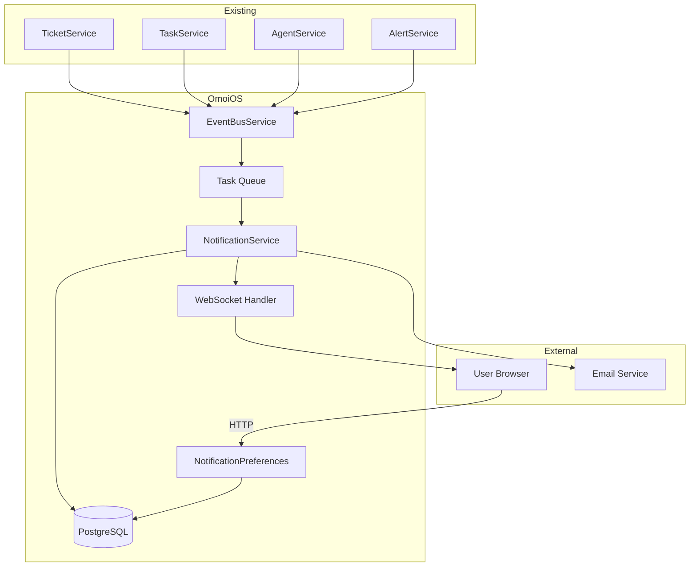

# Notification System Design

## Overview

The notification system provides real-time and persistent notifications for OmoiOS users. It integrates with existing infrastructure (WebSocket, EventBus, Auth) and consists of a NotificationService for creation/delivery, NotificationPreferences for user control, and API endpoints for client interaction.

## Architecture

### System Context



### Component Diagram

| Component | Responsibility | Technology |
|-----------|---------------|------------|
| NotificationService | Create, deliver, aggregate notifications | Python/FastAPI |
| NotificationPreferences | Manage user notification preferences | Python/FastAPI |
| WebSocketNotificationHandler | Broadcast notifications via WebSocket | Existing WebSocket |
| NotificationRepository | Database operations | SQLAlchemy |
| EmailNotificationService | Send email notifications | SMTP/API |
| NotificationCleanupJob | Delete old notifications | Python/cron |

## Data Model

### Database Schema

```sql
-- Notifications table
CREATE TABLE notifications (
    id UUID PRIMARY KEY DEFAULT gen_random_uuid(),
    user_id UUID NOT NULL REFERENCES users(id) ON DELETE CASCADE,
    type VARCHAR(50) NOT NULL,  -- ticket_assigned, task_completed, etc.
    title VARCHAR(255) NOT NULL,
    message TEXT NOT NULL,
    data JSONB DEFAULT '{}',  -- {ticket_id, task_id, project_id, etc.}
    status VARCHAR(20) NOT NULL DEFAULT 'unread',  -- unread, read
    read_at TIMESTAMP WITH TIME ZONE,
    delivered_via_ws BOOLEAN DEFAULT FALSE,
    delivered_via_email BOOLEAN DEFAULT FALSE,
    aggregation_id UUID,  -- Links aggregated notifications
    created_at TIMESTAMP WITH TIME ZONE DEFAULT NOW(),
    deleted_at TIMESTAMP WITH TIME ZONE
);

CREATE INDEX idx_notifications_user_id ON notifications(user_id);
CREATE INDEX idx_notifications_user_status ON notifications(user_id, status, created_at DESC);
CREATE INDEX idx_notifications_type ON notifications(type);
CREATE INDEX idx_notifications_created_at ON notifications(created_at DESC);
CREATE INDEX idx_notifications_aggregation ON notifications(aggregation_id) WHERE aggregation_id IS NOT NULL;

-- Notification preferences table
CREATE TABLE notification_preferences (
    id UUID PRIMARY KEY DEFAULT gen_random_uuid(),
    user_id UUID NOT NULL REFERENCES users(id) ON DELETE CASCADE,
    organization_id UUID REFERENCES organizations(id) ON DELETE CASCADE,
    preferences JSONB NOT NULL DEFAULT '{}',  -- {in_app: {...}, email: {...}}
    created_at TIMESTAMP WITH TIME ZONE DEFAULT NOW(),
    updated_at TIMESTAMP WITH TIME ZONE DEFAULT NOW(),
    UNIQUE(user_id)
);

CREATE INDEX idx_notification_prefs_user ON notification_preferences(user_id);
CREATE INDEX idx_notification_prefs_org ON notification_preferences(organization_id) WHERE organization_id IS NOT NULL;

-- Organization default preferences
CREATE TABLE organization_notification_preferences (
    id UUID PRIMARY KEY DEFAULT gen_random_uuid(),
    organization_id UUID NOT NULL REFERENCES organizations(id) ON DELETE CASCADE,
    preferences JSONB NOT NULL DEFAULT '{}',
    created_at TIMESTAMP WITH TIME ZONE DEFAULT NOW(),
    updated_at TIMESTAMP WITH TIME ZONE DEFAULT NOW(),
    UNIQUE(organization_id)
);

CREATE INDEX idx_org_notif_prefs_org ON organization_notification_preferences(organization_id);
```

### Pydantic Models

```python
from pydantic import BaseModel, Field
from datetime import datetime
from uuid import UUID
from typing import Optional, Dict, Any
from enum import Enum

class NotificationType(str, Enum):
    TICKET_ASSIGNED = "ticket_assigned"
    TICKET_UPDATED = "ticket_updated"
    TASK_COMPLETED = "task_completed"
    TASK_FAILED = "task_failed"
    APPROVAL_REQUESTED = "approval_requested"
    AGENT_STATUS_CHANGED = "agent_status_changed"
    SYSTEM_ALERT = "system_alert"
    MENTION = "mention"

class NotificationStatus(str, Enum):
    UNREAD = "unread"
    READ = "read"

class NotificationChannel(str, Enum):
    IN_APP = "in_app"
    EMAIL = "email"

class NotificationBase(BaseModel):
    type: NotificationType
    title: str
    message: str
    data: Dict[str, Any] = Field(default_factory=dict)

class NotificationCreate(NotificationBase):
    user_id: UUID

class NotificationResponse(NotificationBase):
    id: UUID
    user_id: UUID
    status: NotificationStatus
    read_at: Optional[datetime] = None
    created_at: datetime

    class Config:
        from_attributes = True

class NotificationPreferences(BaseModel):
    in_app: Dict[NotificationType, bool] = Field(
        default_factory=lambda: {t: True for t in NotificationType}
    )
    email: Dict[NotificationType, bool] = Field(
        default_factory=lambda: {t: False for t in NotificationType}
    )

class NotificationPreferencesUpdate(BaseModel):
    in_app: Optional[Dict[NotificationType, bool]] = None
    email: Optional[Dict[NotificationType, bool]] = None
```

## API Specification

### Endpoints

| Method | Path | Description | Auth |
|--------|------|-------------|------|
| GET | /api/v1/notifications | List user notifications | Required |
| PATCH | /api/v1/notifications/{id}/read | Mark as read | Required |
| POST | /api/v1/notifications/read-all | Mark all as read | Required |
| DELETE | /api/v1/notifications/{id} | Delete notification | Required |
| GET | /api/v1/notifications/preferences | Get preferences | Required |
| PUT | /api/v1/notifications/preferences | Update preferences | Required |
| GET | /api/v1/notifications/unread-count | Get unread count | Required |

### Request/Response Examples

#### GET /api/v1/notifications

**Query Parameters:**
- `status`: all|read|unread (default: all)
- `type`: filter by notification type (optional)
- `limit`: 1-100 (default: 50)
- `offset`: pagination offset (default: 0)

**Response (200):**
```json
{
  "notifications": [
    {
      "id": "550e8400-e29b-41d4-a716-446655440000",
      "user_id": "550e8400-e29b-41d4-a716-446655440001",
      "type": "ticket_assigned",
      "title": "Ticket assigned to you",
      "message": "John Doe assigned 'Fix authentication bug' to you",
      "data": {
        "ticket_id": "550e8400-e29b-41d4-a716-446655440002",
        "project_id": "550e8400-e29b-41d4-a716-446655440003",
        "assigner_name": "John Doe"
      },
      "status": "unread",
      "read_at": null,
      "created_at": "2026-01-08T10:30:00Z"
    }
  ],
  "total": 42,
  "unread_count": 5
}
```

#### PATCH /api/v1/notifications/{id}/read

**Response (200):**
```json
{
  "id": "550e8400-e29b-41d4-a716-446655440000",
  "status": "read",
  "read_at": "2026-01-08T10:35:00Z"
}
```

#### PUT /api/v1/notifications/preferences

**Request:**
```json
{
  "in_app": {
    "ticket_assigned": true,
    "task_completed": true,
    "system_alert": false
  },
  "email": {
    "ticket_assigned": false,
    "approval_requested": true
  }
}
```

**Response (200):**
```json
{
  "user_id": "550e8400-e29b-41d4-a716-446655440001",
  "preferences": {
    "in_app": {
      "ticket_assigned": true,
      "task_completed": true,
      "system_alert": false
    },
    "email": {
      "ticket_assigned": false,
      "approval_requested": true
    }
  },
  "updated_at": "2026-01-08T10:40:00Z"
}
```

## Implementation Details

### NotificationService

```python
class NotificationService:
    """Core service for notification creation and delivery."""

    def __init__(
        self,
        db: DatabaseService,
        event_bus: EventBusService,
        ws_manager: WebSocketManager,
        email_service: Optional[EmailNotificationService] = None,
    ):
        self.db = db
        self.event_bus = event_bus
        self.ws_manager = ws_manager
        self.email_service = email_service
        self.aggregator = NotificationAggregator()

    async def create_notification(
        self,
        user_id: UUID,
        type: NotificationType,
        title: str,
        message: str,
        data: Dict[str, Any],
    ) -> Notification:
        """Create and deliver a notification."""
        # 1. Check user preferences
        prefs = await self._get_preferences(user_id)
        if not self._should_notify(prefs, type):
            return None

        # 2. Check rate limits
        if await self._is_rate_limited(user_id):
            # Create but don't deliver
            return await self._create_silent(user_id, type, title, message, data)

        # 3. Check aggregation
        aggregated = await self.aggregator.maybe_aggregate(
            user_id, type, title, message, data
        )
        if aggregated:
            return aggregated

        # 4. Create notification
        notification = await self._create_in_db(user_id, type, title, message, data)

        # 5. Deliver in-app
        if prefs.in_app.get(type, True):
            await self._deliver_websocket(notification)

        # 6. Deliver email
        if self.email_service and prefs.email.get(type, False):
            await self._deliver_email(notification)

        return notification

    async def _deliver_websocket(self, notification: Notification):
        """Send notification via WebSocket."""
        message = {
            "type": "notification_new",
            "payload": notification.model_dump(),
        }
        await self.ws_manager.broadcast_to_user(
            str(notification.user_id),
            message
        )
        await self._mark_ws_delivered(notification.id)

    async def _deliver_email(self, notification: Notification):
        """Send notification via email."""
        # Background task to avoid blocking
        await self.email_service.send_notification_email(notification)
```

### NotificationAggregator

```python
class NotificationAggregator:
    """Aggregates similar notifications within a time window."""

    AGGREGATION_WINDOW = timedelta(minutes=5)

    async def maybe_aggregate(
        self,
        user_id: UUID,
        type: NotificationType,
        title: str,
        message: str,
        data: Dict[str, Any],
    ) -> Optional[Notification]:
        """Check if we should aggregate with existing notifications."""
        # Only aggregate certain types
        if type not in self.AGGREGATABLE_TYPES:
            return None

        # Find recent similar notifications
        cutoff = utc_now() - self.AGGREGATION_WINDOW
        recent = await self._find_recent_notifications(user_id, type, cutoff)

        if not recent:
            return None

        # Group by aggregation key
        groups = self._group_by_key(recent, data)
        for key, group in groups.items():
            if len(group) >= 2:  # Only aggregate if 2+ similar
                return await self._create_aggregated(group, data)

        return None
```

### WebSocket Integration

The system integrates with the existing WebSocket handler at `/api/v1/ws/events`:

```python
# In existing WebSocketProvider, add handling for notification_new
ws.onmessage = (event) => {
  const data = JSON.parse(event.data)
  if (data.type === 'notification_new') {
    // Show toast notification
    toast.show(data.payload.title)
    // Invalidate queries
    queryClient.invalidateQueries({ queryKey: ['notifications'] })
  }
  if (data.type === 'notification_read') {
    queryClient.invalidateQueries({ queryKey: ['notifications'] })
  }
}
```

## Integration Points

| System | Integration Type | Purpose |
|--------|-----------------|---------|
| EventBusService | Subscribe | Listen for notification-triggering events |
| WebSocket (/api/v1/ws/events) | Broadcast | Real-time delivery to connected clients |
| AuthService | Dependency | User authentication for API endpoints |
| User/Organization Models | Foreign Keys | User preferences and organization defaults |
| AlertService | Optional | System alert notifications |

## Configuration

| Parameter | Default | Range | Description |
|-----------|---------|-------|-------------|
| aggregation_window_seconds | 300 | 60-3600 | Time window for notification aggregation |
| rate_limit_per_hour | 10 | 1-100 | Max notifications per user per hour |
| max_notifications_per_user | 1000 | 100-10000 | Max notifications before cleanup |
| websocket_delivery_timeout | 5 | 1-30 | Seconds to wait for WebSocket delivery |
| email_retry_attempts | 3 | 1-5 | Email delivery retry attempts |

## Testing Strategy

### Unit Tests
- [ ] NotificationService - Create, deliver, aggregate
- [ ] NotificationAggregator - Grouping logic, time windows
- [ ] NotificationPreferences - Validation, defaults
- [ ] Rate limiting - Counter, window tracking

### Integration Tests
- [ ] End-to-end notification creation and delivery
- [ ] WebSocket delivery with real connections
- [ ] Email delivery with mock email service
- [ ] Preference overrides

### E2E Tests
- [ ] User receives ticket assignment notification
- [ ] User marks notification as read
- [ ] User updates notification preferences
- [ ] Aggregated notifications appear correctly

## Security Considerations

- [ ] All endpoints require valid JWT authentication
- [ ] Users can only access their own notifications
- [ ] Notification data is sanitized before storage
- [ ] Email unsubscribe links include verification tokens
- [ ] Rate limiting prevents notification spam
- [ ] Admin endpoints for debugging require admin role

## Performance Considerations

- [ ] Notification creation uses database connection pooling
- [ ] WebSocket delivery is async and non-blocking
- [ ] Aggregation uses indexed queries on (user_id, type, created_at)
- [ ] Email delivery in background task queue
- [ ] Pagination prevents large result sets
- [ ] Cleanup job runs during low-traffic hours

## Open Questions

- [ ] Which email service to use? (SendGrid, AWS SES, Supabase?)
- [ ] Should we track delivery receipts for debugging?
- [ ] Should aggregated notifications be expandable in UI?
