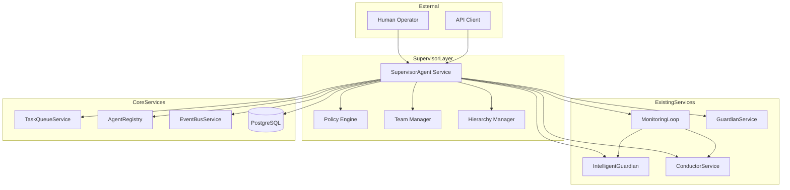
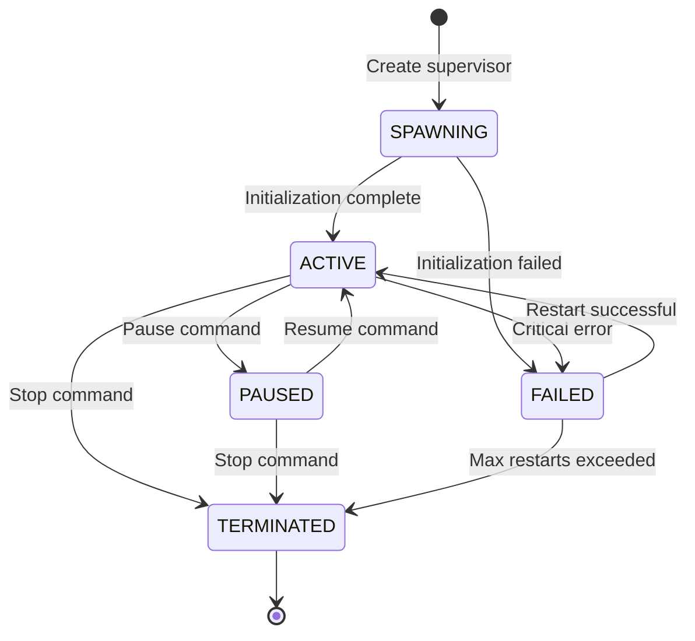

# Supervisor Agent Design

## Overview

The Supervisor Agent is a higher-level orchestration service that provides unified oversight, coordination, and policy enforcement for the multi-agent monitoring system. This design details the architecture, data models, API specifications, and implementation details for the Supervisor Agent.

## Architecture

### System Context



### Component Diagram

| Component | Responsibility | Technology |
|-----------|---------------|------------|
| SupervisorAgent | Main orchestration service, coordinates all supervisor operations | Python 3.12+, FastAPI |
| PolicyEngine | Evaluates policies, manages adaptive learning | Python, Pydantic models |
| TeamManager | Manages agent team assignments and coordination | Python, SQLAlchemy ORM |
| HierarchyManager | Manages supervisor hierarchies and escalation | Python, tree data structure |
| AlertAggregator | Aggregates and correlates alerts from services | Python, async processing |
| InterventionOrchestrator | Executes interventions across services | Python, transaction wrapper |
| SupervisorHealth | Monitors supervisor health and heartbeats | Python, background tasks |

## Data Model

### Database Schema

```sql
-- Supervisors table
CREATE TABLE supervisors (
    id UUID PRIMARY KEY DEFAULT gen_random_uuid(),
    name VARCHAR(255) NOT NULL,
    description TEXT,
    status VARCHAR(50) NOT NULL DEFAULT 'SPAWNING',  -- SPAWNING, ACTIVE, PAUSED, FAILED, TERMINATED
    config JSONB NOT NULL DEFAULT '{}',
    parent_id UUID REFERENCES supervisors(id),
    hierarchy_level INTEGER NOT NULL DEFAULT 0,
    policy_version UUID,
    created_at TIMESTAMP WITH TIME ZONE DEFAULT NOW(),
    updated_at TIMESTAMP WITH TIME ZONE DEFAULT NOW(),
    last_heartbeat TIMESTAMP WITH TIME ZONE,
    health_metrics JSONB DEFAULT '{}',
    UNIQUE(name, parent_id)
);

CREATE INDEX idx_supervisors_parent ON supervisors(parent_id);
CREATE INDEX idx_supervisors_status ON supervisors(status);
CREATE INDEX idx_supervisors_hierarchy ON supervisors(hierarchy_level);

-- Supervisor teams
CREATE TABLE supervisor_teams (
    id UUID PRIMARY KEY DEFAULT gen_random_uuid(),
    supervisor_id UUID NOT NULL REFERENCES supervisors(id) ON DELETE CASCADE,
    name VARCHAR(255) NOT NULL,
    description TEXT,
    objective TEXT,
    config JSONB NOT NULL DEFAULT '{}',
    created_at TIMESTAMP WITH TIME ZONE DEFAULT NOW(),
    updated_at TIMESTAMP WITH TIME ZONE DEFAULT NOW(),
    UNIQUE(supervisor_id, name)
);

CREATE INDEX idx_teams_supervisor ON supervisor_teams(supervisor_id);

-- Team members (agents)
CREATE TABLE supervisor_team_members (
    id UUID PRIMARY KEY DEFAULT gen_random_uuid(),
    team_id UUID NOT NULL REFERENCES supervisor_teams(id) ON DELETE CASCADE,
    agent_id UUID NOT NULL,
    role VARCHAR(100) DEFAULT 'MEMBER',  -- LEAD, MEMBER, TRAINEE
    joined_at TIMESTAMP WITH TIME ZONE DEFAULT NOW(),
    left_at TIMESTAMP WITH TIME ZONE,
    metadata JSONB DEFAULT '{}',
    UNIQUE(team_id, agent_id),
    UNIQUE(agent_id) WHERE left_at IS NULL
);

CREATE INDEX idx_team_members_team ON supervisor_team_members(team_id);
CREATE INDEX idx_team_members_agent ON supervisor_team_members(agent_id);
CREATE INDEX idx_team_members_active ON supervisor_team_members(team_id) WHERE left_at IS NULL;

-- Policies
CREATE TABLE supervisor_policies (
    id UUID PRIMARY KEY DEFAULT gen_random_uuid(),
    name VARCHAR(255) NOT NULL,
    version INTEGER NOT NULL DEFAULT 1,
    description TEXT,
    policy_type VARCHAR(50) NOT NULL,  -- INTERVENTION, COORDINATION, ESCALATION, LEARNING
    definition JSONB NOT NULL,  -- Policy definition in YAML/JSON format
    variables JSONB DEFAULT '{}',  -- Learned variables for adaptive policies
    effectiveness_score FLOAT DEFAULT 0.5,
    total_evaluations INTEGER DEFAULT 0,
    successful_evaluations INTEGER DEFAULT 0,
    created_by VARCHAR(255),
    created_at TIMESTAMP WITH TIME ZONE DEFAULT NOW(),
    updated_at TIMESTAMP WITH TIME ZONE DEFAULT NOW(),
    is_active BOOLEAN DEFAULT TRUE,
    UNIQUE(name, version)
);

CREATE INDEX idx_policies_type ON supervisor_policies(policy_type);
CREATE INDEX idx_policies_active ON supervisor_policies(is_active) WHERE is_active = TRUE;

-- Supervisor-policy assignments
CREATE TABLE supervisor_policy_assignments (
    id UUID PRIMARY KEY DEFAULT gen_random_uuid(),
    supervisor_id UUID NOT NULL REFERENCES supervisors(id) ON DELETE CASCADE,
    policy_id UUID NOT NULL REFERENCES supervisor_policies(id),
    priority INTEGER NOT NULL DEFAULT 0,
    enabled_at TIMESTAMP WITH TIME ZONE DEFAULT NOW(),
    disabled_at TIMESTAMP WITH TIME ZONE,
    UNIQUE(supervisor_id, policy_id)
);

CREATE INDEX idx_policy_assignments_supervisor ON supervisor_policy_assignments(supervisor_id);
CREATE INDEX idx_policy_assignments_policy ON supervisor_policy_assignments(policy_id);

-- Policy evaluations (audit log)
CREATE TABLE supervisor_policy_evaluations (
    id UUID PRIMARY KEY DEFAULT gen_random_uuid(),
    supervisor_id UUID NOT NULL REFERENCES supervisors(id),
    policy_id UUID REFERENCES supervisor_policies(id),
    trigger_event JSONB NOT NULL,
    context JSONB NOT NULL DEFAULT '{}',
    decision BOOLEAN NOT NULL,  -- TRUE = policy matched
    action_taken JSONB,
    evaluation_duration_ms INTEGER,
    created_at TIMESTAMP WITH TIME ZONE DEFAULT NOW()
);

CREATE INDEX idx_evaluations_supervisor ON supervisor_policy_evaluations(supervisor_id);
CREATE INDEX idx_evaluations_policy ON supervisor_policy_evaluations(policy_id);
CREATE INDEX idx_evaluations_created ON supervisor_policy_evaluations(created_at);

-- Interventions
CREATE TABLE supervisor_interventions (
    id UUID PRIMARY KEY DEFAULT gen_random_uuid(),
    supervisor_id UUID NOT NULL REFERENCES supervisors(id),
    intervention_type VARCHAR(100) NOT NULL,  -- AGENT_RESTART, TASK_REASSIGN, TEAM_QUARANTINE, etc.
    target_type VARCHAR(50) NOT NULL,  -- AGENT, TEAM, POLICY
    target_id UUID NOT NULL,
    reason TEXT NOT NULL,
    action_details JSONB NOT NULL,
    status VARCHAR(50) NOT NULL DEFAULT 'PENDING',  -- PENDING, APPROVED, REJECTED, EXECUTING, COMPLETED, FAILED
    approval_required BOOLEAN DEFAULT FALSE,
    approved_by VARCHAR(255),
    approved_at TIMESTAMP WITH TIME ZONE,
    executed_at TIMESTAMP WITH TIME ZONE,
    completed_at TIMESTAMP WITH TIME ZONE,
    error_message TEXT,
    outcome JSONB,
    created_at TIMESTAMP WITH TIME ZONE DEFAULT NOW()
);

CREATE INDEX idx_interventions_supervisor ON supervisor_interventions(supervisor_id);
CREATE INDEX idx_interventions_status ON supervisor_interventions(status);
CREATE INDEX idx_interventions_type ON supervisor_interventions(intervention_type);

-- Alert aggregations
CREATE TABLE supervisor_alert_groups (
    id UUID PRIMARY KEY DEFAULT gen_random_uuid(),
    supervisor_id UUID NOT NULL REFERENCES supervisors(id),
    group_key VARCHAR(255) NOT NULL,  -- Correlation key (e.g., "agent_123_anomaly")
    severity VARCHAR(20) NOT NULL,  -- INFO, WARNING, ERROR, CRITICAL
    alert_count INTEGER NOT NULL DEFAULT 1,
    alert_ids JSONB NOT NULL DEFAULT '[]',  -- Array of alert IDs
    affected_agents JSONB NOT NULL DEFAULT '[]',  -- Array of agent IDs
    correlation_summary TEXT,
    first_alert_at TIMESTAMP WITH TIME ZONE DEFAULT NOW(),
    last_alert_at TIMESTAMP WITH TIME ZONE DEFAULT NOW(),
    resolved_at TIMESTAMP WITH TIME ZONE,
    created_at TIMESTAMP WITH TIME ZONE DEFAULT NOW(),
    updated_at TIMESTAMP WITH TIME ZONE DEFAULT NOW()
);

CREATE INDEX idx_alert_groups_supervisor ON supervisor_alert_groups(supervisor_id);
CREATE INDEX idx_alert_groups_severity ON supervisor_alert_groups(severity);
CREATE INDEX idx_alert_groups_resolved ON supervisor_alert_groups(resolved_at) WHERE resolved_at IS NULL;
```

### Pydantic Models

```python
from pydantic import BaseModel, Field, field_validator
from typing import Optional, Dict, List, Any, Literal
from datetime import datetime
from uuid import UUID
from enum import Enum


class SupervisorStatus(str, Enum):
    """Supervisor lifecycle status."""
    SPAWNING = "SPAWNING"
    ACTIVE = "ACTIVE"
    PAUSED = "PAUSED"
    FAILED = "FAILED"
    TERMINATED = "TERMINATED"


class TeamMemberRole(str, Enum):
    """Role of agent within a team."""
    LEAD = "LEAD"
    MEMBER = "MEMBER"
    TRAINEE = "TRAINEE"


class InterventionStatus(str, Enum):
    """Status of an intervention."""
    PENDING = "PENDING"
    APPROVED = "APPROVED"
    REJECTED = "REJECTED"
    EXECUTING = "EXECUTING"
    COMPLETED = "COMPLETED"
    FAILED = "FAILED"


class PolicyType(str, Enum):
    """Type of policy."""
    INTERVENTION = "INTERVENTION"
    COORDINATION = "COORDINATION"
    ESCALATION = "ESCALATION"
    LEARNING = "LEARNING"


# Supervisor models
class SupervisorCreate(BaseModel):
    """Request to create a supervisor."""
    name: str = Field(..., min_length=1, max_length=255)
    description: Optional[str] = None
    config: Dict[str, Any] = Field(default_factory=dict)
    parent_id: Optional[UUID] = None


class SupervisorResponse(BaseModel):
    """Supervisor response."""
    id: UUID
    name: str
    description: Optional[str]
    status: SupervisorStatus
    config: Dict[str, Any]
    parent_id: Optional[UUID]
    hierarchy_level: int
    policy_version: Optional[UUID]
    created_at: datetime
    updated_at: datetime
    last_heartbeat: Optional[datetime]
    health_metrics: Dict[str, Any]


# Team models
class TeamCreate(BaseModel):
    """Request to create a team."""
    supervisor_id: UUID
    name: str = Field(..., min_length=1, max_length=255)
    description: Optional[str] = None
    objective: Optional[str] = None
    config: Dict[str, Any] = Field(default_factory=dict)
    agent_ids: List[UUID] = Field(default_factory=list)


class TeamResponse(BaseModel):
    """Team response."""
    id: UUID
    supervisor_id: UUID
    name: str
    description: Optional[str]
    objective: Optional[str]
    config: Dict[str, Any]
    member_count: int
    created_at: datetime
    updated_at: datetime


# Policy models
class PolicyCreate(BaseModel):
    """Request to create a policy."""
    name: str = Field(..., min_length=1, max_length=255)
    description: Optional[str] = None
    policy_type: PolicyType
    definition: Dict[str, Any]
    variables: Dict[str, Any] = Field(default_factory=dict)
    created_by: str

    @field_validator('definition')
    def validate_definition(cls, v):
        """Validate policy definition structure."""
        required_keys = {'condition', 'actions'}
        if not all(k in v for k in required_keys):
            raise ValueError(f"Policy definition must contain: {required_keys}")
        return v


class PolicyResponse(BaseModel):
    """Policy response."""
    id: UUID
    name: str
    version: int
    description: Optional[str]
    policy_type: PolicyType
    definition: Dict[str, Any]
    variables: Dict[str, Any]
    effectiveness_score: float
    total_evaluations: int
    successful_evaluations: int
    created_by: str
    created_at: datetime
    updated_at: datetime
    is_active: bool


# Intervention models
class InterventionCreate(BaseModel):
    """Request to create an intervention."""
    supervisor_id: UUID
    intervention_type: str
    target_type: Literal["AGENT", "TEAM", "POLICY"]
    target_id: UUID
    reason: str
    action_details: Dict[str, Any]
    approval_required: bool = False


class InterventionResponse(BaseModel):
    """Intervention response."""
    id: UUID
    supervisor_id: UUID
    intervention_type: str
    target_type: str
    target_id: UUID
    reason: str
    action_details: Dict[str, Any]
    status: InterventionStatus
    approval_required: bool
    approved_by: Optional[str]
    approved_at: Optional[datetime]
    executed_at: Optional[datetime]
    completed_at: Optional[datetime]
    error_message: Optional[str]
    outcome: Optional[Dict[str, Any]]
    created_at: datetime


# Alert aggregation models
class AlertGroupResponse(BaseModel):
    """Alert group response."""
    id: UUID
    supervisor_id: UUID
    group_key: str
    severity: str
    alert_count: int
    alert_ids: List[str]
    affected_agents: List[str]
    correlation_summary: Optional[str]
    first_alert_at: datetime
    last_alert_at: datetime
    resolved_at: Optional[datetime]
```

## API Specification

### Endpoints

| Method | Path | Description | Auth |
|--------|------|-------------|------|
| POST | /api/v1/supervisors | Create supervisor | Required |
| GET | /api/v1/supervisors | List supervisors | Required |
| GET | /api/v1/supervisors/{id} | Get supervisor | Required |
| PUT | /api/v1/supervisors/{id} | Update supervisor | Required |
| DELETE | /api/v1/supervisors/{id} | Delete supervisor | Required |
| POST | /api/v1/supervisors/{id}/pause | Pause supervisor | Required |
| POST | /api/v1/supervisors/{id}/resume | Resume supervisor | Required |
| GET | /api/v1/supervisors/{id}/health | Get supervisor health | Required |
| GET | /api/v1/supervisors/{id}/teams | List teams | Required |
| POST | /api/v1/supervisors/{id}/teams | Create team | Required |
| GET | /api/v1/supervisors/{id}/hierarchy | Get hierarchy | Required |
| POST | /api/v1/policies | Create policy | Admin |
| GET | /api/v1/policies | List policies | Required |
| GET | /api/v1/policies/{id} | Get policy | Required |
| POST | /api/v1/policies/{id}/simulate | Simulate policy | Required |
| POST | /api/v1/supervisors/{id}/policies | Assign policy | Admin |
| GET | /api/v1/supervisors/{id}/interventions | List interventions | Required |
| POST | /api/v1/interventions | Create intervention | Required |
| PUT | /api/v1/interventions/{id}/approve | Approve intervention | Admin |
| GET | /api/v1/supervisors/{id}/alerts | List alert groups | Required |

### Request/Response Examples

#### POST /api/v1/supervisors

**Request:**
```json
{
  "name": "backend-team-supervisor",
  "description": "Supervisor for backend implementation agents",
  "config": {
    "heartbeat_interval": 30,
    "policy_evaluation_interval": 10,
    "alert_correlation_window": 300,
    "max_hierarchy_depth": 5
  }
}
```

**Response (201):**
```json
{
  "id": "550e8400-e29b-41d4-a716-446655440000",
  "name": "backend-team-supervisor",
  "description": "Supervisor for backend implementation agents",
  "status": "SPAWNING",
  "config": {
    "heartbeat_interval": 30,
    "policy_evaluation_interval": 10
  },
  "parent_id": null,
  "hierarchy_level": 0,
  "policy_version": null,
  "created_at": "2025-01-08T10:00:00Z",
  "updated_at": "2025-01-08T10:00:00Z",
  "last_heartbeat": null,
  "health_metrics": {}
}
```

**Error Response (400):**
```json
{
  "error": "validation_error",
  "message": "Supervisor name must be unique within hierarchy level",
  "details": {
    "field": "name",
    "constraint": "unique_name_per_parent"
  }
}
```

#### POST /api/v1/policies

**Request:**
```json
{
  "name": "agent-anomaly-quarantine",
  "description": "Quarantine agents with consecutive anomalous readings",
  "policy_type": "INTERVENTION",
  "definition": {
    "condition": {
      "type": "composite",
      "operator": "AND",
      "conditions": [
        {
          "type": "field_comparison",
          "field": "agent.anomaly_score",
          "operator": ">=",
          "value": 0.8
        },
        {
          "type": "field_comparison",
          "field": "agent.consecutive_anomalous_readings",
          "operator": ">=",
          "value": 3
        }
      ]
    },
    "actions": [
      {
        "type": "quarantine_agent",
        "target": "${agent.id}",
        "reason": "Consecutive anomalous readings detected",
        "approval_required": false
      }
    ]
  },
  "created_by": "admin@omoios.dev"
}
```

**Response (201):**
```json
{
  "id": "660e8400-e29b-41d4-a716-446655440001",
  "name": "agent-anomaly-quarantine",
  "version": 1,
  "description": "Quarantine agents with consecutive anomalous readings",
  "policy_type": "INTERVENTION",
  "definition": {
    "condition": { "...": "..." },
    "actions": [ { "...": "..." } ]
  },
  "variables": {},
  "effectiveness_score": 0.5,
  "total_evaluations": 0,
  "successful_evaluations": 0,
  "created_by": "admin@omoios.dev",
  "created_at": "2025-01-08T10:00:00Z",
  "updated_at": "2025-01-08T10:00:00Z",
  "is_active": true
}
```

#### POST /api/v1/interventions

**Request:**
```json
{
  "supervisor_id": "550e8400-e29b-41d4-a716-446655440000",
  "intervention_type": "TEAM_RESTART",
  "target_type": "TEAM",
  "target_id": "770e8400-e29b-41d4-a716-446655440002",
  "reason": "Team performance degraded due to memory leak pattern",
  "action_details": {
    "restart_mode": "staggered",
    "stagger_seconds": 30,
    "rollback_plan": "Restore agents from previous checkpoint"
  },
  "approval_required": true
}
```

**Response (201):**
```json
{
  "id": "880e8400-e29b-41d4-a716-446655440003",
  "supervisor_id": "550e8400-e29b-41d4-a716-446655440000",
  "intervention_type": "TEAM_RESTART",
  "target_type": "TEAM",
  "target_id": "770e8400-e29b-41d4-a716-446655440002",
  "reason": "Team performance degraded due to memory leak pattern",
  "action_details": {
    "restart_mode": "staggered",
    "stagger_seconds": 30
  },
  "status": "PENDING",
  "approval_required": true,
  "approved_by": null,
  "approved_at": null,
  "executed_at": null,
  "completed_at": null,
  "error_message": null,
  "outcome": null,
  "created_at": "2025-01-08T10:05:00Z"
}
```

## Implementation Details

### Supervisor Agent Core Service

```python
from omoi_os.services.database import DatabaseService
from omoi_os.services.event_bus import EventBusService
from omoi_os.services.monitoring_loop import MonitoringLoop
from omoi_os.services.intelligent_guardian import IntelligentGuardian
from omoi_os.services.conductor import ConductorService
from omoi_os.services.guardian import GuardianService


class SupervisorAgent:
    """Main supervisor orchestration service.

    Coordinates monitoring services, evaluates policies, and executes interventions.
    """

    def __init__(
        self,
        supervisor_id: UUID,
        db: DatabaseService,
        event_bus: EventBusService,
        monitoring_loop: MonitoringLoop,
        guardian_service: GuardianService,
    ):
        """Initialize supervisor agent.

        Args:
            supervisor_id: UUID of this supervisor
            db: Database service
            event_bus: Event bus for publishing events
            monitoring_loop: Monitoring loop for coordinated analysis
            guardian_service: Guardian service for interventions
        """
        self.supervisor_id = supervisor_id
        self.db = db
        self.event_bus = event_bus
        self.monitoring_loop = monitoring_loop
        self.guardian_service = guardian_service

        # Initialize components
        self.policy_engine = PolicyEngine(db, supervisor_id)
        self.team_manager = TeamManager(db, supervisor_id)
        self.hierarchy_manager = HierarchyManager(db, supervisor_id)
        self.alert_aggregator = AlertAggregator(db, supervisor_id)
        self.intervention_orchestrator = InterventionOrchestrator(
            db, event_bus, guardian_service
        )

        # State
        self.running = False
        self.status = SupervisorStatus.SPAWNING

    async def start(self) -> None:
        """Start supervisor operation."""
        logger.info(f"Starting supervisor {self.supervisor_id}")
        self.running = True
        self.status = SupervisorStatus.ACTIVE

        # Start background tasks
        await self._start_policy_evaluation_loop()
        await self._start_alert_aggregation_loop()
        await self._start_heartbeat_loop()

        # Publish startup event
        self._publish_event("supervisor.started", {})

    async def stop(self) -> None:
        """Stop supervisor operation."""
        logger.info(f"Stopping supervisor {self.supervisor_id}")
        self.running = False
        self.status = SupervisorStatus.TERMINATED

        # Publish shutdown event
        self._publish_event("supervisor.stopped", {})

    async def evaluate_policies(self, trigger_event: Dict[str, Any]) -> List[InterventionResponse]:
        """Evaluate policies against trigger event.

        Args:
            trigger_event: Event that triggered policy evaluation

        Returns:
            List of interventions triggered by policies
        """
        # Get active policies for this supervisor
        policies = await self.policy_engine.get_active_policies()

        triggered_interventions = []
        for policy in policies:
            # Evaluate policy condition
            decision = await self.policy_engine.evaluate(policy, trigger_event)

            # Record evaluation
            await self.policy_engine.record_evaluation(
                policy.id, trigger_event, decision
            )

            if decision.matched:
                # Execute policy actions
                for action in decision.actions:
                    intervention = await self.intervention_orchestrator.execute(
                        self.supervisor_id, action, trigger_event
                    )
                    triggered_interventions.append(intervention)

                    # Learn from intervention outcome if adaptive
                    if policy.policy_type == PolicyType.LEARNING:
                        await self.policy_engine.update_from_outcome(
                            policy.id, intervention
                        )

        return triggered_interventions

    async def get_team_status(self) -> Dict[str, Any]:
        """Get status of all teams managed by this supervisor."""
        teams = await self.team_manager.get_teams()
        team_statuses = []

        for team in teams:
            members = await self.team_manager.get_team_members(team.id)
            team_statuses.append({
                "team_id": str(team.id),
                "team_name": team.name,
                "member_count": len(members),
                "objective": team.objective,
                "active_members": sum(1 for m in members if m.left_at is None),
            })

        return {
            "supervisor_id": str(self.supervisor_id),
            "teams": team_statuses,
            "total_teams": len(teams),
            "total_members": sum(t["active_members"] for t in team_statuses),
        }

    async def escalate_to_parent(self, issue: Dict[str, Any]) -> bool:
        """Escalate issue to parent supervisor.

        Args:
            issue: Details of issue to escalate

        Returns:
            True if escalation successful
        """
        parent_id = await self.hierarchy_manager.get_parent_id()
        if not parent_id:
            logger.warning(f"Supervisor {self.supervisor_id} has no parent to escalate to")
            return False

        # Publish escalation event (parent will handle)
        self._publish_event(
            "supervisor.escalation",
            {
                "child_supervisor_id": str(self.supervisor_id),
                "parent_supervisor_id": str(parent_id),
                "issue": issue,
            }
        )

        return True

    async def _start_policy_evaluation_loop(self) -> None:
        """Start background policy evaluation loop."""
        # Implementation depends on config policy_evaluation_interval
        pass

    async def _start_alert_aggregation_loop(self) -> None:
        """Start background alert aggregation loop."""
        pass

    async def _start_heartbeat_loop(self) -> None:
        """Start heartbeat loop."""
        pass

    def _publish_event(self, event_type: str, payload: Dict[str, Any]) -> None:
        """Publish supervisor event."""
        event = SystemEvent(
            event_type=f"supervisor.{event_type}",
            entity_type="supervisor",
            entity_id=str(self.supervisor_id),
            payload=payload,
        )
        self.event_bus.publish(event)
```

### Policy Engine

```python
class PolicyEngine:
    """Evaluates policies and manages adaptive learning."""

    def __init__(self, db: DatabaseService, supervisor_id: UUID):
        self.db = db
        self.supervisor_id = supervisor_id

    async def get_active_policies(self) -> List[Policy]:
        """Get all active policies for this supervisor."""
        with self.db.get_session() as session:
            policies = (
                session.query(Policy)
                .join(SupervisorPolicyAssignment)
                .filter(
                    SupervisorPolicyAssignment.supervisor_id == self.supervisor_id,
                    SupervisorPolicyAssignment.disabled_at.is_(None),
                    Policy.is_active == True,
                )
                .order_by(SupervisorPolicyAssignment.priority.desc())
                .all()
            )
            return [p for p in policies]

    async def evaluate(
        self, policy: Policy, trigger_event: Dict[str, Any]
    ) -> PolicyDecision:
        """Evaluate policy against trigger event.

        Args:
            policy: Policy to evaluate
            trigger_event: Event data

        Returns:
            Policy decision with matched status and actions
        """
        start_time = time.time()

        # Evaluate condition
        matched = await self._evaluate_condition(
            policy.definition["condition"], trigger_event
        )

        duration_ms = int((time.time() - start_time) * 1000)

        decision = PolicyDecision(
            policy_id=policy.id,
            matched=matched,
            actions=policy.definition["actions"] if matched else [],
            context=trigger_event,
            evaluation_duration_ms=duration_ms,
        )

        # Record evaluation
        await self.record_evaluation(
            policy.id, trigger_event, decision
        )

        return decision

    async def _evaluate_condition(
        self, condition: Dict[str, Any], context: Dict[str, Any]
    ) -> bool:
        """Evaluate a policy condition.

        Supports:
        - field_comparison: Compare a field to a value
        - composite: AND/OR/NOT logic
        """
        condition_type = condition["type"]

        if condition_type == "field_comparison":
            field = condition["field"]
            operator = condition["operator"]
            value = condition["value"]

            # Extract field value from context (supports dot notation)
            field_value = self._get_nested_value(context, field)

            # Compare
            return self._compare(field_value, operator, value)

        elif condition_type == "composite":
            operator = condition["operator"]  # AND, OR, NOT
            conditions = condition["conditions"]

            if operator == "AND":
                return all(
                    await self._evaluate_condition(c, context) for c in conditions
                )
            elif operator == "OR":
                return any(
                    await self._evaluate_condition(c, context) for c in conditions
                )
            elif operator == "NOT":
                return not await self._evaluate_condition(conditions[0], context)

        return False

    def _get_nested_value(self, data: Dict[str, Any], path: str) -> Any:
        """Get nested value from dict using dot notation."""
        keys = path.split(".")
        value = data
        for key in keys:
            if isinstance(value, dict):
                value = value.get(key)
            else:
                return None
        return value

    def _compare(self, value: Any, operator: str, target: Any) -> bool:
        """Compare value to target using operator."""
        if operator == "==":
            return value == target
        elif operator == "!=":
            return value != target
        elif operator == ">":
            return value > target
        elif operator == ">=":
            return value >= target
        elif operator == "<":
            return value < target
        elif operator == "<=":
            return value <= target
        elif operator == "in":
            return value in target
        elif operator == "not_in":
            return value not in target
        return False

    async def record_evaluation(
        self, policy_id: UUID, trigger_event: Dict[str, Any], decision: PolicyDecision
    ) -> None:
        """Record policy evaluation to database."""
        with self.db.get_session() as session:
            evaluation = SupervisorPolicyEvaluation(
                supervisor_id=self.supervisor_id,
                policy_id=policy_id,
                trigger_event=trigger_event,
                context=decision.context,
                decision=decision.matched,
                action_details=decision.actions if decision.matched else None,
                evaluation_duration_ms=decision.evaluation_duration_ms,
            )
            session.add(evaluation)
            session.commit()

    async def update_from_outcome(
        self, policy_id: UUID, intervention: InterventionResponse
    ) -> None:
        """Update policy effectiveness based on intervention outcome.

        Implements adaptive learning by adjusting policy variables.
        """
        # Determine if intervention was successful
        success = intervention.status == InterventionStatus.COMPLETED

        # Update policy effectiveness score
        with self.db.get_session() as session:
            policy = session.get(Policy, policy_id)
            if not policy:
                return

            # Update effectiveness using exponential moving average
            alpha = 0.1  # Learning rate
            new_score = alpha * success + (1 - alpha) * policy.effectiveness_score
            policy.effectiveness_score = new_score
            policy.total_evaluations += 1
            if success:
                policy.successful_evaluations += 1

            # Adjust policy variables if adaptive
            if policy.policy_type == PolicyType.LEARNING and success:
                policy.variables = self._adjust_variables(
                    policy.variables, intervention.outcome
                )

            session.commit()
```

### State Machine



## Integration Points

| System | Integration Type | Purpose |
|--------|-----------------|---------|
| MonitoringLoop | Service orchestration | Trigger coordinated analysis cycles |
| IntelligentGuardian | Individual agent analysis | Get trajectory analysis for policy evaluation |
| ConductorService | System-wide analysis | Get coherence analysis for team coordination |
| GuardianService | Intervention execution | Execute emergency interventions via GuardianService |
| TaskQueueService | Task management | Reassign tasks between agents |
| AgentRegistry | Agent lifecycle | Restart, quarantine, or terminate agents |
| EventBusService | Event streaming | Publish supervisor events and subscribe to alerts |

## Configuration

| Parameter | Default | Range | Description |
|-----------|---------|-------|-------------|
| heartbeat_interval_seconds | 30 | 10-300 | Frequency of supervisor heartbeats |
| policy_evaluation_interval_seconds | 10 | 1-60 | Frequency of policy evaluation cycles |
| alert_correlation_window_seconds | 300 | 60-3600 | Time window for alert correlation |
| max_hierarchy_depth | 5 | 1-10 | Maximum allowed supervisor hierarchy depth |
| intervention_timeout_seconds | 300 | 60-3600 | Timeout for intervention execution |
| policy_learning_rate | 0.1 | 0.01-0.5 | Rate of adaptive policy learning |
| max_concurrent_interventions | 10 | 1-100 | Maximum concurrent interventions per supervisor |

## Testing Strategy

### Unit Tests
- [ ] PolicyEngine - Evaluate various policy conditions
- [ ] TeamManager - Team CRUD and member management
- [ ] HierarchyManager - Hierarchy validation and traversal
- [ ] AlertAggregator - Alert correlation logic

### Integration Tests
- [ ] Supervisor integration with MonitoringLoop
- [ ] Supervisor integration with GuardianService
- [ ] Policy-driven intervention execution
- [ ] Alert aggregation from multiple services

### E2E Tests
- [ ] Supervisor lifecycle (create → start → stop → delete)
- [ ] Team coordination workflow
- [ ] Policy-based intervention flow
- [ ] Hierarchical supervision escalation

## Security Considerations

- [ ] Policy authorization - Only admins can modify policies
- [ ] Intervention safety - Destructive actions require approval
- [ ] Audit logging - All policy changes and interventions logged
- [ ] Rate limiting - Prevent policy evaluation DoS

## Performance Considerations

- [ ] Async policy evaluation - Don't block on LLM calls
- [ ] Policy caching - Cache frequently evaluated policies
- [ ] Batch processing - Batch multiple interventions
- [ ] Database optimization - Indexes for common queries
