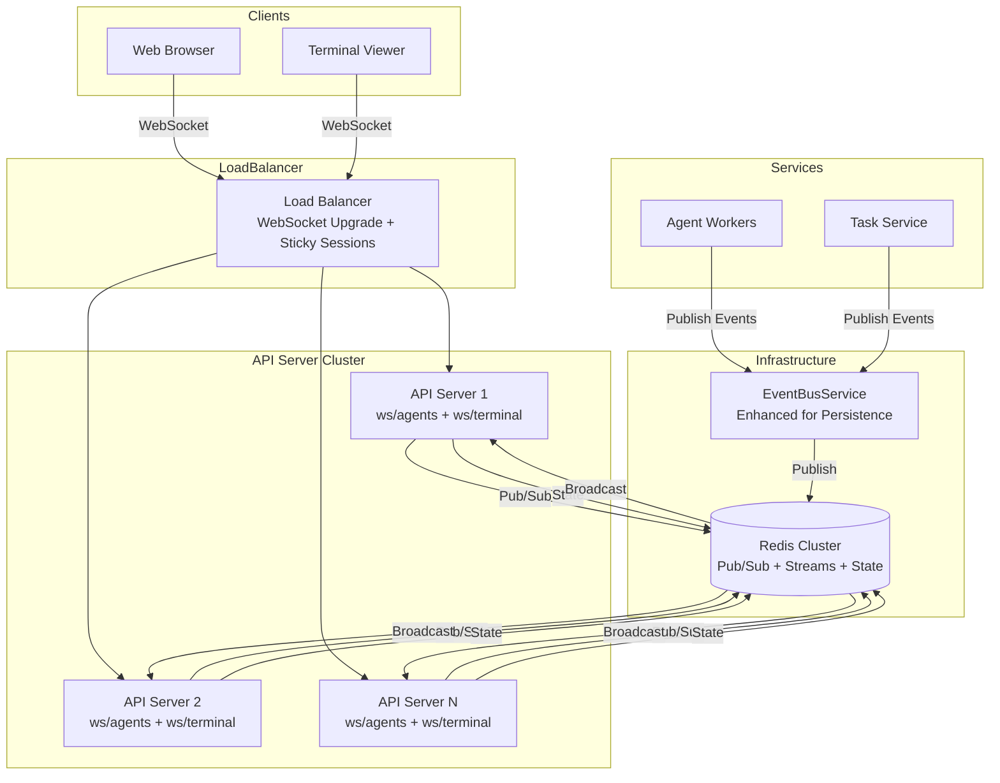
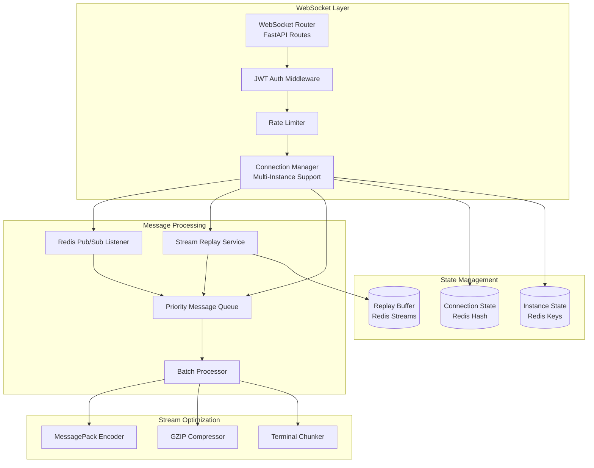

# WebSocket Infrastructure Design

## Overview

This document describes the technical design for a scalable WebSocket infrastructure that enables real-time streaming of AI agent status updates, task progress, and terminal output. The design builds upon the existing EventBusService and `/ws/events` endpoint, adding horizontal scaling, message persistence, and optimized streaming capabilities.

## Architecture

### System Context



### Component Architecture



## Data Model

### Connection State (Redis)

```python
# Redis Key Pattern: ws:connections:{connection_id}
# Type: Hash
# TTL: 24 hours (auto-cleanup)

{
    "connection_id": "uuid",           # Unique connection identifier
    "user_id": "uuid",                  # Authenticated user ID
    "instance_id": "api-server-1",      # Server instance handling connection
    "connected_at": "2026-01-08T12:00:00Z",
    "last_heartbeat": "2026-01-08T12:30:00Z",
    "filters": {                        # Subscription filters
        "agent_ids": ["uuid1", "uuid2"],
        "project_ids": ["uuid3"],
        "event_types": ["STATUS_CHANGED", "COMPLETED"]
    },
    "last_sequence_id": 12345,          # Last delivered sequence
    "encoding": "json",                 # json | messagepack
    "compression": true,                # gzip enabled
    "is_draining": false                # Shutdown in progress
}

# Index: ws:connections:user:{user_id} -> Set of connection_ids
```

### Replay Buffer (Redis Streams)

```python
# Redis Key Pattern: ws:replay:agent_status:{user_id}
# Type: Stream
# Max Length: 1000 messages (~5 minutes at 3 msg/s)

# Stream Entry Format:
{
    "sequence_id": 12345,               # Auto-generated by Redis
    "event_type": "AGENT_STATUS_CHANGED",
    "timestamp": "2026-01-08T12:00:00Z",
    "payload": {
        "agent_id": "uuid",
        "old_status": "working",
        "new_status": "completed",
        "task_id": "uuid",
        "progress": 100
    }
}

# Consumer Groups for replay:
# ws:replay:agent_status:{user_id} > cg:{connection_id}
```

### Instance State (Redis)

```python
# Redis Key Pattern: ws:instances:{instance_id}
# Type: Hash
# TTL: 60 seconds (heartbeat refresh)

{
    "instance_id": "api-server-1",
    "hostname": "api-server-1.internal",
    "port": 8001,
    "started_at": "2026-01-08T10:00:00Z",
    "last_heartbeat": "2026-01-08T12:30:00Z",
    "connection_count": 1250,           # Active connections
    "status": "active"                  # active | draining | shutdown
}
```

### Pydantic Models

```python
from pydantic import BaseModel, Field
from typing import Optional, List, Dict, Any, Literal
from datetime import datetime
from uuid import UUID
from enum import Enum

class AgentStatus(str, Enum):
    IDLE = "idle"
    WORKING = "working"
    STUCK = "stuck"
    FAILED = "failed"
    COMPLETED = "completed"
    CANCELLED = "cancelled"

class MessageType(str, Enum):
    # Server -> Client
    AGENT_STATUS_CHANGED = "AGENT_STATUS_CHANGED"
    PROGRESS_UPDATE = "PROGRESS_UPDATE"
    TERMINAL_OUTPUT = "TERMINAL_OUTPUT"
    PING = "PING"
    REPLAY_START = "REPLAY_START"
    REPLAY_END = "REPLAY_END"
    ERROR = "ERROR"
    # Client -> Server
    SUBSCRIBE = "SUBSCRIBE"
    UNSUBSCRIBE = "UNSUBSCRIBE"
    PONG = "PONG"
    PAUSE_STREAM = "PAUSE_STREAM"
    RESUME_STREAM = "RESUME_STREAM"

class EncodingType(str, Enum):
    JSON = "json"
    MESSAGEPACK = "messagepack"

class WebSocketMessage(BaseModel):
    """Base WebSocket message."""
    type: MessageType
    timestamp: datetime = Field(default_factory=datetime.utcnow)
    sequence_id: Optional[int] = None

class AgentStatusEvent(WebSocketMessage):
    """Agent status change event."""
    type: Literal[MessageType.AGENT_STATUS_CHANGED] = MessageType.AGENT_STATUS_CHANGED
    payload: dict = Field(..., description={
        "agent_id": str,
        "old_status": AgentStatus,
        "new_status": AgentStatus,
        "task_id": Optional[str],
        "progress": Optional[int],  # 0-100
        "message": Optional[str]
    })

class ProgressUpdateEvent(WebSocketMessage):
    """Task progress update event."""
    type: Literal[MessageType.PROGRESS_UPDATE] = MessageType.PROGRESS_UPDATE
    payload: dict = Field(..., description={
        "task_id": str,
        "agent_id": str,
        "current_step": int,
        "total_steps": int,
        "progress_percent": float,
        "message": str,
        "estimated_seconds_remaining": Optional[float]
    })

class TerminalOutputEvent(WebSocketMessage):
    """Terminal output streaming event."""
    type: Literal[MessageType.TERMINAL_OUTPUT] = MessageType.TERMINAL_OUTPUT
    payload: dict = Field(..., description={
        "task_id": str,
        "data": bytes,  # Raw terminal data (ANSI codes preserved)
        "stream": Literal["stdout", "stderr"],
        "is_complete": bool
    })

class SubscriptionFilters(BaseModel):
    """Subscription filter criteria."""
    agent_ids: Optional[List[str]] = None
    project_ids: Optional[List[str]] = None
    event_types: Optional[List[str]] = None

class SubscribeMessage(WebSocketMessage):
    """Client subscription request."""
    type: Literal[MessageType.SUBSCRIBE] = MessageType.SUBSCRIBE
    payload: SubscriptionFilters

class ConnectionInfo(BaseModel):
    """Connection information stored in Redis."""
    connection_id: UUID
    user_id: UUID
    instance_id: str
    connected_at: datetime
    last_heartbeat: datetime
    filters: SubscriptionFilters
    last_sequence_id: int = 0
    encoding: EncodingType = EncodingType.JSON
    compression: bool = False
    is_draining: bool = False
```

## API Specification

### WebSocket Endpoints

#### `/ws/agents` - Agent Events Stream

**Description**: Real-time stream of agent status changes and progress updates.

**Query Parameters**:
- `token` (required): JWT access token
- `agent_ids` (optional): Comma-separated list of agent IDs to filter
- `project_ids` (optional): Comma-separated list of project IDs to filter
- `event_types` (optional): Comma-separated event types (STATUS_CHANGED, PROGRESS_UPDATE)
- `encoding` (optional): Message encoding (json | messagepack), default: json
- `compression` (optional): Enable gzip compression (true | false), default: false

**Connection Flow**:
```
Client                  Server
  |                       |
  |--WebSocket Upgrade--->|
  |--(Auth Query Param)-->|
  |                       |-- Validate JWT -->|
  |                       |-- Create Connection State -->|
  |                       |-- Subscribe to Redis Pub/Sub -->|
  |<-- Connection Accepted--|
  |<-- REPLAY_START (seq 0)|
  |<-- [Missed Messages]---|
  |<-- REPLAY_END (seq N)--|
  |                       |
  |<-- AGENT_STATUS_CHANGED (seq N+1)
  |<-- PROGRESS_UPDATE (seq N+2)
  |                       |
  |--PING (every 30s)----->|
  |<--PONG-----------------|
  |                       |
  |--SUBSCRIBE (filter)-->|
  |                       |-- Update Filters -->|
  |<-- FILTERS_UPDATED-----|
  |                       |
  |--Close---------------->|
  |                       |-- Cleanup State -->|
```

**Message Format (JSON)**:
```json
{
  "type": "AGENT_STATUS_CHANGED",
  "sequence_id": 12345,
  "timestamp": "2026-01-08T12:00:00Z",
  "payload": {
    "agent_id": "uuid",
    "old_status": "working",
    "new_status": "completed",
    "task_id": "uuid",
    "progress": 100
  }
}
```

**Message Format (MessagePack)**:
```
<binary MessagePack encoded>
Format: map{
  "type": "AGENT_STATUS_CHANGED",
  "sequence_id": 12345,
  "timestamp": 1704700800,
  "payload": map{
    "agent_id": b"uuid",
    "old_status": "working",
    "new_status": "completed",
    "task_id": b"uuid",
    "progress": 100
  }
}
```

---

#### `/ws/terminal/{task_id}` - Terminal Output Stream

**Description**: Dedicated endpoint for streaming task stdout/stderr output.

**Path Parameters**:
- `task_id` (required): UUID of the task to stream

**Query Parameters**:
- `token` (required): JWT access token with task read permission
- `encoding` (optional): Message encoding (json | messagepack), default: json
- `chunk_size` (optional): Max chunk size in bytes, default: 4096, max: 16384

**Connection Flow**:
```
Client                  Server
  |                       |
  |--WebSocket Upgrade--->|
  |--(Auth + Task Check)->|
  |                       |-- Validate Task Access -->|
  |                       |-- Connect to Task Stream -->|
  |<-- Connection Accepted--|
  |                       |
  |<-- TERMINAL_OUTPUT (chunk 1)
  |<-- TERMINAL_OUTPUT (chunk 2)
  |<-- TERMINAL_OUTPUT (chunk 3)
  |                       |
  |--PAUSE_STREAM-------->|
  |                       |-- Stop Sending -->|
  |                       |
  |--RESUME_STREAM------->|
  |                       |-- Resume Sending -->|
  |<-- TERMINAL_OUTPUT (chunk 4)
  |                       |
  |<-- TERMINAL_OUTPUT (complete=true)
  |<-- Connection Closed---|
```

**Message Format**:
```json
{
  "type": "TERMINAL_OUTPUT",
  "sequence_id": 100,
  "timestamp": "2026-01-08T12:00:00Z",
  "payload": {
    "task_id": "uuid",
    "data": "SGVsbG8gV29ybGQh",  // Base64 encoded binary data
    "stream": "stdout",
    "is_complete": false
  }
}
```

---

### Internal Service API

#### `POST /api/v1/internal/ws/publish` - Publish Agent Event

**Description**: Internal endpoint for agent workers to publish events.

**Headers**:
- `X-Internal-Service-Key`: Service authentication key
- `X-Service-Name`: Service identifier

**Request Body**:
```json
{
  "event_type": "AGENT_STATUS_CHANGED",
  "agent_id": "uuid",
  "user_id": "uuid",
  "project_id": "uuid",
  "payload": {
    "old_status": "working",
    "new_status": "completed",
    "task_id": "uuid",
    "progress": 100,
    "message": "Task completed successfully"
  }
}
```

**Response**:
- `202`: Event queued for delivery
- `400`: Invalid request
- `401`: Authentication failed
- `403`: Invalid service key

---

## Implementation Details

### Connection Manager Enhancement

```python
# omoi_os/api/websocket/connection_manager.py

import asyncio
import json
from typing import Dict, Set, Optional, Any
from datetime import datetime, timedelta
import redis.asyncio as redis
from fastapi import WebSocket, WebSocketDisconnect
from pydantic import ValidationError

from omoi_os.services.event_bus import EventBusService, SystemEvent
from omoi_os.api.websocket.models import (
    ConnectionInfo,
    SubscriptionFilters,
    WebSocketMessage,
    MessageType,
)
from omoi_os.logging import get_logger

logger = get_logger(__name__)

class ScalableConnectionManager:
    """
    Manages WebSocket connections across multiple API server instances
    using Redis-backed state and Pub/Sub.
    """

    def __init__(
        self,
        redis_client: redis.Redis,
        event_bus: EventBusService,
        instance_id: str,
    ):
        self.redis = redis_client
        self.event_bus = event_bus
        self.instance_id = instance_id

        # Local connection tracking (for this instance only)
        self.local_connections: Dict[str, WebSocket] = {}
        self.connection_tasks: Dict[str, asyncio.Task] = {}

        # Configuration
        self.heartbeat_interval = 30  # seconds
        self.heartbeat_timeout = 10   # seconds
        self.replay_window_minutes = 5
        self.max_replay_messages = 1000

        # Background tasks
        self.heartbeat_task: Optional[asyncio.Task] = None
        self.redis_listener_task: Optional[asyncio.Task] = None
        self.stale_cleanup_task: Optional[asyncio.Task] = None

    async def start(self):
        """Start background tasks."""
        self.heartbeat_task = asyncio.create_task(self._heartbeat_loop())
        self.redis_listener_task = asyncio.create_task(self._redis_listener())
        self.stale_cleanup_task = asyncio.create_task(self._stale_connection_cleanup())
        logger.info(f"ConnectionManager started for instance {self.instance_id}")

    async def stop(self):
        """Stop background tasks and close connections."""
        # Cancel background tasks
        for task in [self.heartbeat_task, self.redis_listener_task, self.stale_cleanup_task]:
            if task and not task.done():
                task.cancel()
                try:
                    await task
                except asyncio.CancelledError:
                    pass

        # Close all connections
        for connection_id, websocket in list(self.local_connections.items()):
            try:
                await websocket.close(code=1001, reason="Server shutting down")
            except Exception:
                pass

        await self._cleanup_instance_state()
        logger.info(f"ConnectionManager stopped for instance {self.instance_id}")

    async def connect(
        self,
        websocket: WebSocket,
        user_id: str,
        filters: SubscriptionFilters,
        encoding: str = "json",
        compression: bool = False,
    ) -> str:
        """
        Accept and register a WebSocket connection.

        Returns:
            connection_id: Unique connection identifier
        """
        await websocket.accept()

        # Generate unique connection ID
        import uuid
        connection_id = str(uuid.uuid4())

        # Create connection info
        connection_info = ConnectionInfo(
            connection_id=connection_id,
            user_id=user_id,
            instance_id=self.instance_id,
            connected_at=datetime.utcnow(),
            last_heartbeat=datetime.utcnow(),
            filters=filters,
            encoding=encoding,
            compression=compression,
        )

        # Store in Redis (cross-instance visibility)
        await self._store_connection_state(connection_info)

        # Track locally
        self.local_connections[connection_id] = websocket

        # Start per-connection message handler
        self.connection_tasks[connection_id] = asyncio.create_task(
            self._connection_handler(connection_id, websocket, connection_info)
        )

        logger.info(
            f"Connection {connection_id} established for user {user_id} "
            f"with filters {filters.model_dump()}"
        )

        return connection_id

    async def disconnect(self, connection_id: str):
        """Remove a WebSocket connection."""
        # Remove from local tracking
        self.local_connections.pop(connection_id, None)

        # Cancel handler task
        task = self.connection_tasks.pop(connection_id, None)
        if task and not task.done():
            task.cancel()

        # Remove from Redis
        await self._remove_connection_state(connection_id)

        logger.info(f"Connection {connection_id} disconnected")

    async def publish_event(self, event: SystemEvent, user_id: str):
        """
        Publish an event to specific user's connections.

        Args:
            event: System event to publish
            user_id: Target user ID
        """
        # Publish to Redis Pub/Sub (cross-instance delivery)
        channel = f"ws:user:{user_id}"
        message = event.model_dump_json()
        await self.redis.publish(channel, message)

    async def _connection_handler(
        self,
        connection_id: str,
        websocket: WebSocket,
        connection_info: ConnectionInfo,
    ):
        """
        Handle messages from a specific WebSocket connection.
        """
        try:
            # Send replay (missed messages)
            await self._send_replay(websocket, connection_info)

            # Main message loop
            while True:
                try:
                    # Receive message from client
                    data = await asyncio.wait_for(
                        websocket.receive_text(),
                        timeout=self.heartbeat_interval + self.heartbeat_timeout
                    )

                    # Parse and handle message
                    message = json.loads(data)
                    await self._handle_client_message(
                        connection_id, message, connection_info
                    )

                except asyncio.TimeoutError:
                    # No message received, check heartbeat
                    await self._check_heartbeat(connection_id, websocket)

        except WebSocketDisconnect:
            logger.info(f"Connection {connection_id} disconnected by client")
        except Exception as e:
            logger.error(
                f"Error in connection handler for {connection_id}",
                error=str(e),
                exc_info=True
            )
        finally:
            await self.disconnect(connection_id)

    async def _send_replay(
        self,
        websocket: WebSocket,
        connection_info: ConnectionInfo,
    ):
        """
        Send missed messages from Redis Stream.
        """
        replay_key = f"ws:replay:agent_status:{connection_info.user_id}"
        last_sequence = connection_info.last_sequence_id

        await websocket.send_json({
            "type": "REPLAY_START",
            "sequence_id": last_sequence,
        })

        # Read from stream since last sequence
        messages = await self.redis.xread(
            {replay_key: last_sequence},
            count=self.max_replay_messages,
        )

        for stream, entries in messages:
            for message_id, data in entries:
                await websocket.send_json({
                    "type": data["event_type"],
                    "sequence_id": int(message_id.split(b"-")[1]),
                    "timestamp": data["timestamp"],
                    "payload": json.loads(data["payload"]),
                })

        await websocket.send_json({
            "type": "REPLAY_END",
        })

    async def _handle_client_message(
        self,
        connection_id: str,
        message: dict,
        connection_info: ConnectionInfo,
    ):
        """Handle incoming message from client."""
        message_type = message.get("type")

        if message_type == "PONG":
            # Update heartbeat
            connection_info.last_heartbeat = datetime.utcnow()
            await self._update_connection_heartbeat(connection_id)

        elif message_type == "SUBSCRIBE":
            # Update filters
            try:
                new_filters = SubscriptionFilters(**message.get("payload", {}))
                connection_info.filters = new_filters
                await self._update_connection_filters(connection_id, new_filters)

                # Send confirmation
                websocket = self.local_connections.get(connection_id)
                if websocket:
                    await websocket.send_json({
                        "type": "FILTERS_UPDATED",
                        "payload": new_filters.model_dump(),
                    })
            except ValidationError as e:
                logger.warning(f"Invalid subscription filters: {e}")

    async def _redis_listener(self):
        """
        Listen to Redis Pub/Sub for user-specific messages.
        """
        pubsub = self.redis.pubsub()

        # Subscribe to pattern for all users
        await pubsub.psubscribe("ws:user:*")

        try:
            async for message in pubsub.listen():
                if message["type"] == "pmessage":
                    # Parse channel (ws:user:{user_id})
                    channel = message["channel"]
                    user_id = channel.split(":")[-1]

                    # Find connections for this user on this instance
                    connection_ids = await self._get_user_connections(user_id)

                    # Deliver to local connections
                    event_data = json.loads(message["data"])
                    for connection_id in connection_ids:
                        websocket = self.local_connections.get(connection_id)
                        if websocket:
                            await self._deliver_to_connection(websocket, event_data)

        except asyncio.CancelledError:
            pass
        finally:
            await pubsub.close()

    async def _deliver_to_connection(
        self,
        websocket: WebSocket,
        event_data: dict,
    ):
        """Deliver event to specific connection."""
        try:
            # Apply encoding (JSON or MessagePack)
            # Apply compression if enabled
            # Check backpressure
            await websocket.send_json(event_data)
        except Exception as e:
            logger.error(f"Failed to deliver event: {e}")

    async def _heartbeat_loop(self):
        """Send periodic heartbeats to all connections."""
        while True:
            try:
                await asyncio.sleep(self.heartbeat_interval)

                ping_message = {
                    "type": "PING",
                    "timestamp": datetime.utcnow().isoformat(),
                }

                # Send to all local connections
                for connection_id, websocket in list(self.local_connections.items()):
                    try:
                        await websocket.send_json(ping_message)
                    except Exception:
                        # Connection likely dead
                        await self.disconnect(connection_id)

                # Update instance heartbeat in Redis
                await self._update_instance_heartbeat()

            except asyncio.CancelledError:
                break
            except Exception as e:
                logger.error(f"Error in heartbeat loop: {e}")

    async def _stale_connection_cleanup(self):
        """Clean up stale connections."""
        while True:
            try:
                await asyncio.sleep(60)  # Run every minute

                # Find connections with old heartbeats
                timeout = datetime.utcnow() - timedelta(
                    seconds=(self.heartbeat_interval + self.heartbeat_timeout) * 3
                )

                # Scan Redis for stale connections
                pattern = "ws:connections:*"
                async for key in self.redis.scan_iter(match=pattern):
                    connection_id = key.split(":")[-1]
                    last_heartbeat_str = await self.redis.hget(key, "last_heartbeat")

                    if last_heartbeat_str:
                        last_heartbeat = datetime.fromisoformat(last_heartbeat_str)
                        if last_heartbeat < timeout:
                            # Check if connection belongs to this instance
                            instance_id = await self.redis.hget(key, "instance_id")
                            if instance_id == self.instance_id:
                                logger.warning(f"Cleaning up stale connection {connection_id}")
                                await self.disconnect(connection_id)

            except asyncio.CancelledError:
                break
            except Exception as e:
                logger.error(f"Error in stale connection cleanup: {e}")

    async def _store_connection_state(self, connection_info: ConnectionInfo):
        """Store connection state in Redis."""
        key = f"ws:connections:{connection_info.connection_id}"
        data = connection_info.model_dump_json()
        await self.redis.hset(key, mapping=json.loads(data))
        await self.redis.expire(key, 86400)  # 24 hours

        # Add to user index
        user_index_key = f"ws:connections:user:{connection_info.user_id}"
        await self.redis.sadd(user_index_key, connection_info.connection_id)
        await self.redis.expire(user_index_key, 86400)

    async def _remove_connection_state(self, connection_id: str):
        """Remove connection state from Redis."""
        key = f"ws:connections:{connection_id}"
        user_id = await self.redis.hget(key, "user_id")

        await self.redis.delete(key)

        if user_id:
            user_index_key = f"ws:connections:user:{user_id}"
            await self.redis.srem(user_index_key, connection_id)

    async def _get_user_connections(self, user_id: str) -> list[str]:
        """Get all connection IDs for a user on this instance."""
        pattern = "ws:connections:*"
        user_connections = []

        async for key in self.redis.scan_iter(match=pattern):
            connection_user_id = await self.redis.hget(key, "user_id")
            connection_instance_id = await self.redis.hget(key, "instance_id")

            if connection_user_id == user_id and connection_instance_id == self.instance_id:
                connection_id = key.split(":")[-1]
                user_connections.append(connection_id)

        return user_connections

    async def _update_connection_heartbeat(self, connection_id: str):
        """Update last heartbeat timestamp for connection."""
        key = f"ws:connections:{connection_id}"
        await self.redis.hset(
            key,
            "last_heartbeat",
            datetime.utcnow().isoformat()
        )

    async def _update_connection_filters(
        self,
        connection_id: str,
        filters: SubscriptionFilters,
    ):
        """Update subscription filters for connection."""
        key = f"ws:connections:{connection_id}"
        await self.redis.hset(
            key,
            "filters",
            filters.model_dump_json()
        )

    async def _update_instance_heartbeat(self):
        """Update instance heartbeat in Redis."""
        key = f"ws:instances:{self.instance_id}"
        await self.redis.hset(
            key,
            "last_heartbeat",
            datetime.utcnow().isoformat()
        )
        await self.redis.hset(
            key,
            "connection_count",
            len(self.local_connections)
        )
        await self.redis.expire(key, 60)

    async def _cleanup_instance_state(self):
        """Remove instance state from Redis."""
        key = f"ws:instances:{self.instance_id}"
        await self.redis.delete(key)

    async def _check_heartbeat(self, connection_id: str, websocket: WebSocket):
        """Check if connection is still alive."""
        key = f"ws:connections:{connection_id}"
        last_heartbeat_str = await self.redis.hget(key, "last_heartbeat")

        if last_heartbeat_str:
            last_heartbeat = datetime.fromisoformat(last_heartbeat_str)
            timeout = timedelta(seconds=self.heartbeat_timeout)

            if datetime.utcnow() - last_heartbeat > timeout:
                logger.warning(f"Connection {connection_id} heartbeat timeout")
                await websocket.close(code=1000, reason="Heartbeat timeout")
```

### Terminal Streaming Handler

```python
# omoi_os/api/websocket/terminal_stream.py

import asyncio
import base64
from typing import Optional
from fastapi import WebSocket, WebSocketDisconnect, Query
from pydantic import BaseModel

from omoi_os.logging import get_logger

logger = get_logger(__name__)

class TerminalStreamParams(BaseModel):
    """Terminal stream connection parameters."""
    chunk_size: int = Query(default=4096, ge=1024, le=16384)
    encoding: str = Query(default="json", regex="^(json|messagepack)$")

class TerminalStreamer:
    """
    Handles terminal output streaming for task execution.
    """

    def __init__(self, redis_client):
        self.redis = redis_client
        self.active_streams: dict[str, WebSocket] = {}

    async def connect_terminal(
        self,
        websocket: WebSocket,
        task_id: str,
        user_id: str,
        chunk_size: int = 4096,
    ):
        """
        Establish terminal stream for a task.

        Args:
            websocket: WebSocket connection
            task_id: Task to stream
            user_id: Authenticated user
            chunk_size: Max bytes per chunk
        """
        await websocket.accept()

        # Verify user has access to task
        if not await self._verify_task_access(task_id, user_id):
            await websocket.close(code=1003, reason="Access denied")
            return

        # Register stream
        self.active_streams[task_id] = websocket

        try:
            # Subscribe to task output channel
            channel = f"terminal:output:{task_id}"
            pubsub = self.redis.pubsub()
            await pubsub.subscribe(channel)

            # Send ready message
            await websocket.send_json({
                "type": "STREAM_READY",
                "task_id": task_id,
                "timestamp": datetime.utcnow().isoformat(),
            })

            # Stream output
            buffer = bytearray()
            async for message in pubsub.listen():
                if message["type"] == "message":
                    data = message["data"]

                    # Accumulate buffer
                    buffer.extend(data)

                    # Send chunks
                    while len(buffer) >= chunk_size:
                        chunk = bytes(buffer[:chunk_size])
                        buffer = buffer[chunk_size:]

                        await self._send_chunk(websocket, task_id, chunk)

            # Send remaining buffer
            if buffer:
                await self._send_chunk(websocket, task_id, bytes(buffer))

            # Send completion
            await websocket.send_json({
                "type": "TERMINAL_OUTPUT",
                "payload": {
                    "task_id": task_id,
                    "data": "",
                    "stream": "stdout",
                    "is_complete": True,
                }
            })

        except WebSocketDisconnect:
            logger.info(f"Terminal stream disconnected for task {task_id}")
        except Exception as e:
            logger.error(f"Error in terminal stream: {e}")
        finally:
            await pubsub.close()
            self.active_streams.pop(task_id, None)

    async def _send_chunk(self, websocket: WebSocket, task_id: str, data: bytes):
        """Send a chunk of terminal data."""
        # Encode as base64 to avoid JSON escaping issues
        encoded_data = base64.b64encode(data).decode("ascii")

        await websocket.send_json({
            "type": "TERMINAL_OUTPUT",
            "sequence_id": self._next_sequence(),
            "timestamp": datetime.utcnow().isoformat(),
            "payload": {
                "task_id": task_id,
                "data": encoded_data,
                "stream": "stdout",
                "is_complete": False,
            }
        })

    async def _verify_task_access(self, task_id: str, user_id: str) -> bool:
        """Verify user has access to task."""
        # TODO: Implement permission check via database
        return True

    def _next_sequence(self) -> int:
        """Generate next sequence number."""
        if not hasattr(self, "_sequence"):
            self._sequence = 0
        self._sequence += 1
        return self._sequence
```

## Integration Points

| System | Integration Type | Purpose |
|--------|-----------------|---------|
| EventBusService | Enhancement | Add message persistence to existing pub/sub |
| Redis Pub/Sub | Pub/Sub | Cross-instance message delivery |
| Redis Streams | Persistence | Message replay buffer |
| FastAPI Routes | WebSocket | `/ws/agents` and `/ws/terminal` endpoints |
| Load Balancer | Sticky Sessions | Route client to same instance (optional, state is in Redis) |
| Agent Workers | HTTP API | Publish events via `/api/v1/internal/ws/publish` |

## Configuration

| Parameter | Default | Range | Description |
|-----------|---------|-------|-------------|
| `WS_HEARTBEAT_INTERVAL` | 30 | 10-60 | Seconds between ping messages |
| `WS_HEARTBEAT_TIMEOUT` | 10 | 5-30 | Seconds to wait for pong |
| `WS_REPLAY_WINDOW_MINUTES` | 5 | 1-60 | Message replay window |
| `WS_MAX_REPLAY_MESSAGES` | 1000 | 100-10000 | Max messages in replay buffer |
| `WS_RATE_LIMIT_PER_CONNECTION` | 100 | 10-1000 | Messages per second per connection |
| `WS_RATE_LIMIT_GLOBAL` | 10000 | 1000-100000 | Global messages per second |
| `WS_MAX_CHUNK_SIZE` | 4096 | 1024-16384 | Terminal chunk size in bytes |
| `WS_SEND_BUFFER_SIZE` | 100 | 10-1000 | Max messages in send buffer |
| `WS_MAX_CONNECTIONS_PER_INSTANCE` | 10000 | 1000-50000 | Max concurrent connections |

## Testing Strategy

### Unit Tests
- [ ] ConnectionManager - connection lifecycle, state management
- [ ] Message replay - sequence handling, buffer limits
- [ ] Subscription filters - matching logic
- [ ] Rate limiting - token bucket, priority queue
- [ ] Heartbeat - timeout detection, cleanup

### Integration Tests
- [ ] Redis Pub/Sub message delivery
- [ ] Cross-instance connection state sync
- [ ] Redis Streams read/write
- [ ] WebSocket authentication flow
- [ ] Terminal stream buffering

### E2E Tests
- [ ] Multi-instance deployment with load balancer
- [ ] Graceful shutdown with connection drain
- [ ] Client reconnection with replay
- [ ] High-volume streaming (10K+ messages/sec)
- [ ] Backpressure handling

### Load Tests
- [ ] 10,000 concurrent connections
- [ ] 10,000 messages/second throughput
- [ ] Memory usage under load
- [ ] Reconnection storm handling

## Security Considerations

- **JWT Validation**: All connections must present valid JWT token
- **User Isolation**: Users only receive events for their accessible resources
- **Rate Limiting**: Per-IP and per-user connection rate limits
- **Input Validation**: Filter parameters, message size limits
- **Audit Logging**: Connection events logged with user, IP, timestamp
- **TLS Required**: Production requires WSS (WebSocket Secure)

## Performance Considerations

- **Connection Pooling**: Reuse Redis connections across connections
- **Message Batching**: Batch high-frequency updates (progress) within 100ms window
- **Binary Encoding**: Use MessagePack for high-volume streams to reduce payload size
- **Compression**: Enable gzip for messages > 1KB
- **Backpressure**: Monitor send buffer depth and drop low-priority messages when needed
- **Lazy Deserialization**: Only parse message payloads after filter matching

## Open Questions

- [ ] Should we implement client-side message deduplication using sequence IDs?
- [ ] What is the optimal replay window for production (5 min default)?
- [ ] Should terminal output be persisted or purely ephemeral?
- [ ] Do we need WebSocket subprotocol versioning for future compatibility?
- [ ] Should we implement message prioritization at the Redis Pub/Sub level?
