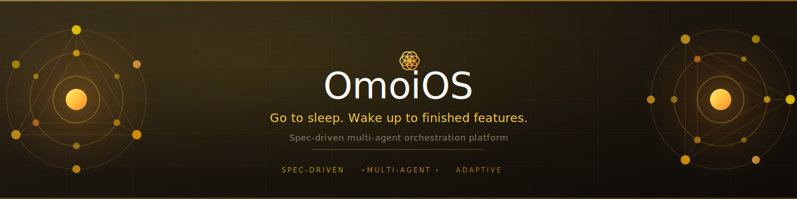

<p align="center">
  
</p>

<p align="center">
  <a href="https://github.com/kivo360/OmoiOS/actions/workflows/ci.yml"></a>
  <a href="https://codecov.io/gh/kivo360/OmoiOS"></a>
  <a href="LICENSE"></a>
  
  
  
  
</p>

<p align="center">
  <b>Stop babysitting AI agents. Run structured swarms instead.</b>
</p>

---

## The Problem

AI coding agents are powerful individually, but using them at scale is a mess. You paste a prompt, wait, review, paste another prompt, fix what broke, repeat. There's no dependency awareness, no parallel execution, no structured handoff between tasks. Agents don't know what other agents are doing. When something fails, you're the orchestrator.

**OmoiOS fixes this.** It reads your existing codebase, generates specs from what's actually there, builds a task DAG with real dependencies, and runs agent swarms across isolated sandboxes until the work is done. A supervisor agent handles merges and keeps everything on track.

```
You describe what you want
    → OmoiOS explores your codebase
    → Generates specs (requirements, design, tasks)
    → Builds a dependency DAG
    → Spawns agents in isolated sandboxes
    → Agents execute in parallel, discover new work as they go
    → Supervisor agent merges code and steers stuck agents
    → PRs land on your repo
```

This isn't prompt chaining. It's a **structured runtime for agent swarms** — with dependency graphs, sandboxed execution, active supervision, and code that actually merges.

## What Makes This Different

### Specs from your actual code
OmoiOS doesn't generate generic plans. It reads your repo — file structure, patterns, dependencies — and generates specs grounded in what exists. The `SpecStateMachine` runs phases (Explore → Requirements → Design → Tasks) where each phase builds on real codebase context.

### DAG-based execution, not a task queue
Tasks form a dependency graph (`DependencyGraphService`). Nothing executes until its dependencies are met. Critical path analysis determines what runs in parallel. This is how you get 5 agents working simultaneously without stepping on each other.

### Every agent gets a sandbox
Each agent runs in an isolated Daytona container with its own Git branch, filesystem, and resources. No shared state. No interference. When agents finish, `ConvergenceMergeService` merges their branches in optimal order, using Claude to resolve conflicts.

### Active supervision, not fire-and-forget
`IntelligentGuardian` analyzes every agent's trajectory every 60 seconds — scoring alignment, detecting drift, and injecting steering interventions mid-task. `ConductorService` monitors system-wide coherence, detects duplicate work, and coordinates across agents. Agents don't just run. They're watched.

### Agents discover work as they go
During execution, agents find bugs, missing requirements, optimization opportunities. `DiscoveryService` spawns new tasks in the appropriate phase automatically. The DAG grows and adapts — workflows build themselves based on what agents actually encounter.

### You approve at gates, not every step
Phase transitions have quality gates. You review at strategic points (phase completions, PRs). Everything between gates runs autonomously. You set direction — the swarm handles execution.

## Architecture

```
┌─────────────────────────────────────────────────────────────────┐
│                        Frontend (Next.js 15)                     │
│  Dashboard · Kanban Board · Agent Monitor · Spec Workspace       │
│  65 pages · ShadCN UI · React Flow · xterm.js · WebSocket        │
└──────────────────────────┬──────────────────────────────────────┘
                           │ REST + WebSocket
┌──────────────────────────▼──────────────────────────────────────┐
│                     Backend (FastAPI)                             │
│                                                                  │
│  ┌─────────────┐  ┌──────────────┐  ┌────────────────────────┐  │
│  │   35 Route   │  │  103 Service │  │   59 SQLAlchemy        │  │
│  │   Modules    │  │   Modules    │  │   Models               │  │
│  └─────────────┘  └──────────────┘  └────────────────────────┘  │
│                                                                  │
│  ┌──────────────────────────────────────────────────────────┐   │
│  │              Core Orchestration Services                   │   │
│  │                                                           │   │
│  │  SpecStateMachine    →  Phase-based workflow engine        │   │
│  │  OrchestratorWorker  →  Task execution + sandbox spawn    │   │
│  │  TaskQueueService    →  Priority assignment + deps        │   │
│  │  DiscoveryService    →  Adaptive workflow branching        │   │
│  │  IntelligentGuardian →  LLM-powered trajectory analysis   │   │
│  │  AgentHealthService  →  Heartbeat monitoring (30s/90s)    │   │
│  │  EventBusService     →  Redis pub/sub for real-time       │   │
│  │  Conductor           →  System coherence scoring          │   │
│  └──────────────────────────────────────────────────────────┘   │
│                                                                  │
└──────┬───────────────┬───────────────┬──────────────────────────┘
       │               │               │
  ┌────▼────┐   ┌──────▼──────┐  ┌─────▼─────┐
  │ Postgres │   │    Redis    │  │  Daytona  │
  │ 16 +     │   │  7 (cache,  │  │ (isolated │
  │ pgvector │   │  queue,     │  │  sandbox  │
  │          │   │  pub/sub)   │  │  exec)    │
  └──────────┘   └─────────────┘  └───────────┘
```

### How a Feature Gets Built

```
1. You submit a feature request
   └→ API creates a Spec record

2. SpecStateMachine runs phases automatically:
   EXPLORE → REQUIREMENTS → DESIGN → TASKS → SYNC
   └→ Each phase produces versioned artifacts

3. TaskQueueService assigns work to agents
   └→ Priority-based, respects dependencies

4. OrchestratorWorker spawns isolated sandboxes
   └→ Each agent gets its own Daytona workspace + Git branch

5. Agents execute, discover, and adapt
   └→ Guardian monitors every 60s
   └→ Discovery creates new tasks when agents find issues
   └→ EventBus publishes progress via WebSocket

6. Phase gates validate quality
   └→ Human approval at strategic points

7. Code lands as PRs
   └→ Full traceability from spec to commit
```

## Quick Start

### Docker (Recommended)

```bash
git clone https://github.com/kivo360/OmoiOS.git
cd OmoiOS

# Start all services
docker-compose up

# Services available at:
# - Frontend:  http://localhost:3000
# - API:       http://localhost:18000
# - API Docs:  http://localhost:18000/docs
# - Postgres:  localhost:15432
# - Redis:     localhost:16379
```

### Manual Setup

**Prerequisites:** Python 3.12+, Node.js 22+, [uv](https://docs.astral.sh/uv/), [pnpm](https://pnpm.io/), PostgreSQL 16, Redis 7

**Backend:**
```bash
cd backend

# Install all workspace dependencies
uv sync

# Run database migrations
uv run alembic upgrade head

# Start API server
uv run uvicorn omoi_os.api.main:app --host 0.0.0.0 --port 18000 --reload
```

**Frontend:**
```bash
cd frontend

pnpm install
pnpm dev
# → http://localhost:3000
```

### Using the Justfile

If you have [just](https://github.com/casey/just) installed:

```bash
just --list          # Show all available commands
just watch           # Backend with hot-reload
just frontend-dev    # Frontend dev server
just dev-all         # Everything at once
just test            # Run affected tests (smart, fast)
just test-all        # Full test suite
just check           # All quality checks
```

## Tech Stack

| Layer | Technology | Purpose |
|-------|-----------|---------|
| **Frontend** | Next.js 15 (App Router) | 65-page dashboard with SSR |
| **UI** | ShadCN UI + Tailwind | Component library (Radix primitives) |
| **State** | Zustand + React Query | Client + server state management |
| **Visualization** | React Flow v12 | Dependency graphs + workflow DAGs |
| **Terminal** | xterm.js | Live agent workspace terminal |
| **Backend** | FastAPI 0.104+ | Async Python API framework |
| **Database** | PostgreSQL 16 + pgvector | Relational + vector search |
| **Cache / Queue** | Redis 7 + Taskiq | Caching, pub/sub, background jobs |
| **ORM** | SQLAlchemy 2.0+ | Async database access |
| **LLM** | Claude (Agent SDK) | AI agent backbone |
| **Sandbox** | Daytona | Isolated workspace execution |
| **Auth** | JWT + API Keys | Authentication + authorization |
| **Observability** | Sentry + OpenTelemetry + Logfire | Monitoring + tracing |

## Project Structure

```
OmoiOS/
├── backend/                  # Python FastAPI backend
│   ├── omoi_os/
│   │   ├── api/routes/       # 35 route modules (~23k lines)
│   │   ├── models/           # 59 SQLAlchemy models
│   │   ├── services/         # 103 service modules
│   │   └── workers/          # Orchestrator + task workers
│   ├── migrations/versions/  # 71 Alembic migrations
│   ├── config/               # YAML configs per environment
│   └── tests/                # 234+ pytest tests
│
├── frontend/                 # Next.js 15 frontend
│   ├── app/                  # 65 App Router pages
│   ├── components/           # 100+ React components
│   ├── hooks/                # Custom hooks (WebSocket, API)
│   └── lib/                  # API client, utilities
│
├── subsystems/
│   └── sandbox-runtime/      # Lightweight spec execution runtime
│
├── docs/                     # 30,000+ lines of documentation
├── containers/               # Docker configurations
├── scripts/                  # Development + deployment scripts
├── docker-compose.yml        # Full stack orchestration
├── Justfile                  # Task runner commands
├── ARCHITECTURE.md           # System architecture deep-dive
├── CONTRIBUTING.md           # Contribution guide
├── SECURITY.md               # Security policy
└── CHANGELOG.md              # Version history
```

## Development

### Running Tests

```bash
cd backend

# Fast: only tests affected by your changes (testmon)
just test

# Full suite
uv run pytest

# With coverage
uv run pytest --cov=omoi_os

# Single test
uv run pytest tests/path/test_file.py::TestClass::test_method -v
```

### Code Quality

```bash
cd backend

# Lint
ruff check .

# Format
black .

# Both at once
just check
```

### Database Migrations

```bash
cd backend

uv run alembic upgrade head              # Apply migrations
uv run alembic revision -m "description" # Create new migration
uv run alembic downgrade -1              # Rollback one step
```

## Port Configuration

All ports are offset by +10,000 to avoid conflicts with local services:

| Service | Port | Standard |
|---------|------|----------|
| PostgreSQL | 15432 | 5432 |
| Redis | 16379 | 6379 |
| Backend API | 18000 | 8000 |
| Frontend | 3000 | 3000 |

## Documentation

| Document | Description |
|----------|-------------|
| **[ARCHITECTURE.md](./ARCHITECTURE.md)** | Complete system architecture (start here) |
| [Product Vision](docs/product_vision.md) | Full product vision + target audience |
| [App Overview](docs/app_overview.md) | Core features + user flows |
| [Page Architecture](docs/page_architecture.md) | All 65 frontend pages detailed |
| [Design System](docs/design_system.md) | Complete design system |
| [Frontend Architecture](docs/design/frontend/frontend_architecture_shadcn_nextjs.md) | Frontend patterns + components |
| [Monitoring Architecture](docs/requirements/monitoring/monitoring_architecture.md) | Guardian + Conductor system |
| [Backend Guide](backend/CLAUDE.md) | Backend development reference |

## Contributing

We welcome contributions. See [CONTRIBUTING.md](CONTRIBUTING.md) for setup instructions, coding standards, and PR process.

**Quick version:**
1. Fork the repo
2. Create a feature branch (`git checkout -b feature/amazing-feature`)
3. Make your changes
4. Run `just check` to verify quality
5. Submit a PR

## Security

Found a vulnerability? Please report it responsibly. See [SECURITY.md](SECURITY.md) for our security policy and reporting process.

## License

OmoiOS is licensed under the [Apache License 2.0](LICENSE).

---

<p align="center">
  <b>Go to sleep. Wake up to finished features.</b>
</p>
