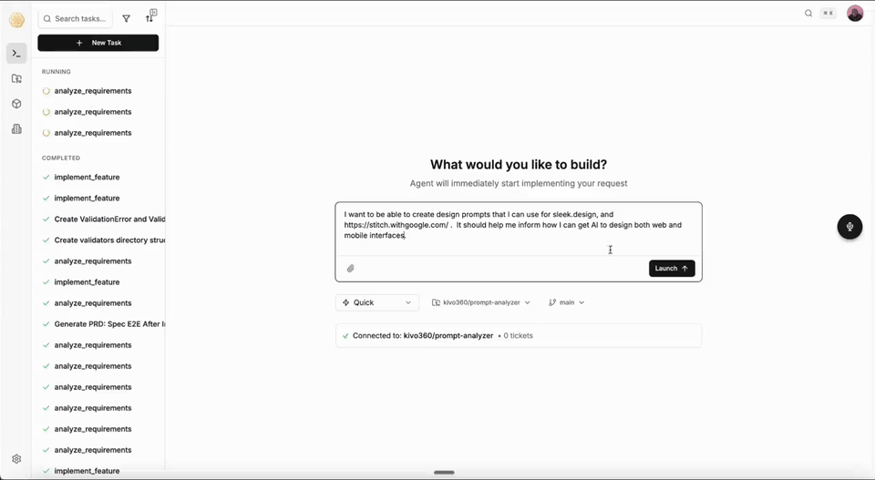

<p align="center">
  
</p>

<p align="center">
  <a href="https://github.com/kivo360/OmoiOS/stargazers"></a>
  <a href="https://github.com/kivo360/OmoiOS/actions/workflows/ci.yml"></a>
  <a href="LICENSE"></a>
  
  
  
  
</p>

<p align="center">
  <b>Open-source orchestration runtime that turns specs into PRs using parallel agent swarms in isolated sandboxes.</b>
</p>

<p align="center">
  If you find OmoiOS useful, consider giving it a <a href="https://github.com/kivo360/OmoiOS">star</a> — it helps others discover the project.
</p>

<p align="center">
  
</p>

---

## The Problem

AI coding agents are powerful individually, but using them at scale is a mess. You paste a prompt, wait, review, paste another prompt, fix what broke, repeat. There's no dependency awareness, no parallel execution, no structured handoff between tasks. Agents don't know what other agents are doing. When something fails, you're the orchestrator.

**OmoiOS fixes this.** It reads your existing codebase, generates specs from what's actually there, builds a task DAG with real dependencies, and runs agent swarms across isolated sandboxes until the work is done. A supervisor agent handles merges and keeps everything on track.

```
You describe what you want
    → OmoiOS explores your codebase
    → Generates specs (requirements, design, tasks)
    → Builds a dependency DAG
    → Spawns agents in isolated sandboxes
    → Agents execute in parallel, discover new work as they go
    → Supervisor agent merges code and steers stuck agents
    → PRs land on your repo
```

This isn't prompt chaining. It's a **structured runtime for agent swarms** — with dependency graphs, sandboxed execution, active supervision, and code that actually merges.

## What Makes This Different

### Specs from your actual code
OmoiOS doesn't generate generic plans. It reads your repo — file structure, patterns, dependencies — and generates specs grounded in what exists. The `SpecStateMachine` runs phases (Explore → Requirements → Design → Tasks) where each phase builds on real codebase context.

### DAG-based execution, not a task queue
Tasks form a dependency graph (`DependencyGraphService`). Nothing executes until its dependencies are met. Critical path analysis determines what runs in parallel. This is how you get 5 agents working simultaneously without stepping on each other.

### Every agent gets a sandbox
Each agent runs in an isolated Daytona container with its own Git branch, filesystem, and resources. No shared state. No interference. When agents finish, `ConvergenceMergeService` merges their branches in optimal order, using Claude to resolve conflicts.

### Active supervision, not fire-and-forget
`IntelligentGuardian` analyzes every agent's trajectory every 60 seconds — scoring alignment, detecting drift, and injecting steering interventions mid-task. `ConductorService` monitors system-wide coherence, detects duplicate work, and coordinates across agents. Agents don't just run. They're watched.

### Agents discover work as they go
During execution, agents find bugs, missing requirements, optimization opportunities. `DiscoveryService` spawns new tasks in the appropriate phase automatically. The DAG grows and adapts — workflows build themselves based on what agents actually encounter.

### You approve at gates, not every step
Phase transitions have quality gates. You review at strategic points (phase completions, PRs). Everything between gates runs autonomously. You set direction — the swarm handles execution.

## Code Assistant

<p align="center">
  
</p>

Beyond orchestrating agent swarms, OmoiOS includes a built-in code assistant that understands your entire codebase. Ask it anything — it explores your repo's structure, reads the actual code, and gives grounded answers. When it's time to build, it spawns isolated sandboxes and writes code for you.

## Architecture

```
                    +---------------------------+
                    |    Frontend (Next.js 15)   |
                    |  Dashboard, Kanban Board,  |
                    |  Agent Monitor, Spec       |
                    |  Workspace, React Flow     |
                    +-------------+-------------+
                                  |
                          REST + WebSocket
                                  |
                    +-------------v-------------+
                    |    Backend (FastAPI)       |
                    |                           |
                    |  40+ Route Modules         |
                    |  100+ Service Modules      |
                    |  75+ SQLAlchemy Models      |
                    |                           |
                    |  --- Core Services ---     |
                    |  SpecStateMachine          |
                    |  OrchestratorWorker        |
                    |  TaskQueueService          |
                    |  IntelligentGuardian       |
                    |  ConductorService          |
                    |  DiscoveryService          |
                    |  EventBusService           |
                    |  MemoryService             |
                    |  BillingService            |
                    +---+-----------+--------+--+
                        |           |        |
                +-------v--+  +----v-----+  +--v--------+
                | Postgres  |  |  Redis   |  |  Daytona  |
                | 16 +      |  |  cache,  |  |  isolated |
                | pgvector  |  |  queue,  |  |  sandbox  |
                |           |  |  pubsub  |  |  exec     |
                +-----------+  +----------+  +-----------+
```

### How a Feature Gets Built

```
1. You submit a feature request
   └→ API creates a Spec record

2. SpecStateMachine runs phases automatically:
   EXPLORE → REQUIREMENTS → DESIGN → TASKS → SYNC
   └→ Each phase produces versioned artifacts

3. TaskQueueService assigns work to agents
   └→ Priority-based, respects dependencies

4. OrchestratorWorker spawns isolated sandboxes
   └→ Each agent gets its own Daytona workspace + Git branch

5. Agents execute, discover, and adapt
   └→ Guardian monitors every 60s
   └→ Discovery creates new tasks when agents find issues
   └→ EventBus publishes progress via WebSocket

6. Phase gates validate quality
   └→ Human approval at strategic points

7. Code lands as PRs
   └→ Full traceability from spec to commit
```

## Quick Start

### Prerequisites

You need **Docker**, **Python 3.12+**, **Node.js 22+**, **uv**, **pnpm**, and **just**. Pick your platform below.

<details open>
<summary><b>macOS</b></summary>

```bash
# Docker Desktop
brew install --cask docker

# Python + Node.js
brew install python@3.12 node

# uv (Python package manager)
curl -LsSf https://astral.sh/uv/install.sh | sh

# pnpm (Node.js package manager)
corepack enable && corepack prepare pnpm@latest --activate

# just (command runner)
brew install just
```

</details>

<details>
<summary><b>Ubuntu / Debian</b></summary>

```bash
# Docker Engine
sudo apt-get update
sudo apt-get install -y ca-certificates curl gnupg
sudo install -m 0755 -d /etc/apt/keyrings
curl -fsSL https://download.docker.com/linux/ubuntu/gpg | sudo gpg --dearmor -o /etc/apt/keyrings/docker.gpg
sudo chmod a+r /etc/apt/keyrings/docker.gpg
echo "deb [arch=$(dpkg --print-architecture) signed-by=/etc/apt/keyrings/docker.gpg] https://download.docker.com/linux/ubuntu $(. /etc/os-release && echo "$VERSION_CODENAME") stable" | sudo tee /etc/apt/sources.list.d/docker.list > /dev/null
sudo apt-get update
sudo apt-get install -y docker-ce docker-ce-cli containerd.io docker-compose-plugin

# Add yourself to docker group (log out + in after this)
sudo usermod -aG docker $USER

# Python 3.12+
sudo apt-get install -y python3.12 python3.12-venv python3.12-dev

# Node.js 22+ (via NodeSource)
curl -fsSL https://deb.nodesource.com/setup_22.x | sudo -E bash -
sudo apt-get install -y nodejs

# uv (Python package manager)
curl -LsSf https://astral.sh/uv/install.sh | sh

# pnpm (Node.js package manager)
corepack enable && corepack prepare pnpm@latest --activate

# just (command runner) — pick one:
curl --proto '=https' --tlsv1.2 -sSf https://just.systems/install.sh | bash -s -- --to /usr/local/bin
# or: sudo snap install just --classic
# or: sudo apt install just  (if available on your release)
```

</details>

<details>
<summary><b>Fedora / RHEL / CentOS</b></summary>

```bash
# Docker Engine
sudo dnf -y install dnf-plugins-core
sudo dnf config-manager --add-repo https://download.docker.com/linux/fedora/docker-ce.repo
sudo dnf install -y docker-ce docker-ce-cli containerd.io docker-compose-plugin
sudo systemctl start docker && sudo systemctl enable docker
sudo usermod -aG docker $USER

# Python 3.12+
sudo dnf install -y python3.12 python3.12-devel

# Node.js 22+ (via NodeSource)
curl -fsSL https://rpm.nodesource.com/setup_22.x | sudo bash -
sudo dnf install -y nodejs

# uv (Python package manager)
curl -LsSf https://astral.sh/uv/install.sh | sh

# pnpm (Node.js package manager)
corepack enable && corepack prepare pnpm@latest --activate

# just (command runner) — pick one:
curl --proto '=https' --tlsv1.2 -sSf https://just.systems/install.sh | bash -s -- --to /usr/local/bin
# or: sudo dnf install just
```

</details>

<details>
<summary><b>Arch Linux</b></summary>

```bash
sudo pacman -S docker docker-compose python nodejs pnpm just
sudo systemctl start docker && sudo systemctl enable docker
sudo usermod -aG docker $USER

# uv (Python package manager)
curl -LsSf https://astral.sh/uv/install.sh | sh
```

</details>

<details>
<summary><b>Windows (WSL2 recommended)</b></summary>

```powershell
# Install WSL2 + Ubuntu, then follow the Ubuntu instructions above
wsl --install

# Or native Windows:
winget install Docker.DockerDesktop
winget install Python.Python.3.12
winget install OpenJS.NodeJS
winget install --id Casey.Just --exact

# Then in PowerShell:
irm https://astral.sh/uv/install.ps1 | iex
corepack enable && corepack prepare pnpm@latest --activate
```

</details>

<details>
<summary><b>Other ways to install <code>just</code></b></summary>

`just` is available in most package managers. If your platform wasn't listed above:

| Method | Command |
|--------|---------|
| Installer script | `curl --proto '=https' --tlsv1.2 -sSf https://just.systems/install.sh \| bash -s -- --to /usr/local/bin` |
| Cargo | `cargo install just` |
| Conda | `conda install -c conda-forge just` |
| npm | `npm install -g rust-just` |
| pipx | `pipx install rust-just` |
| Snap | `sudo snap install --edge --classic just` |
| Nix | `nix-env -iA nixpkgs.just` |
| Chocolatey | `choco install just` |
| Scoop | `scoop install just` |
| FreeBSD | `pkg install just` |

Full list: [github.com/casey/just — Packages](https://github.com/casey/just#packages)

</details>

**Verify everything is installed:**

```bash
docker --version    # Docker 24+
python3 --version   # Python 3.12+
node --version      # Node.js 22+
uv --version        # uv 0.4+
pnpm --version      # pnpm 9+
just --version      # just 1.0+
```

### Quickstart (Recommended)

One command sets up everything — env files, database services, dependencies, and migrations:

```bash
git clone https://github.com/kivo360/OmoiOS.git
cd OmoiOS

just quickstart
```

Then start developing:

```bash
just dev-all         # Start API + frontend (http://localhost:3000)
```

> **Note:** Edit `.env.local` to add your API keys (`LLM_API_KEY`, etc.) for full functionality. The app runs without them but with reduced features.

### After Quickstart

Once `just quickstart` completes, configure your environment:

```bash
# Edit .env.local with your API keys
# At minimum, set LLM_API_KEY for AI features to work:
$EDITOR .env.local
```

| Variable | Required | Purpose |
|----------|----------|---------|
| `LLM_API_KEY` | For AI features | Fireworks AI or OpenAI-compatible key |
| `ANTHROPIC_API_KEY` | For agent execution | Claude Agent SDK key |
| `GITHUB_TOKEN` | For Git integration | GitHub personal access token |
| `DAYTONA_API_KEY` | For sandboxes | Daytona isolated workspace key |

> All other features (dashboard, task management, API) work without any keys.

### Running the Stack

```bash
# Start everything — API + frontend in one terminal
just dev-all

# Or start services individually in separate terminals:
just backend-api         # Backend API on http://localhost:18000
just frontend-dev        # Frontend on http://localhost:3000
just watch               # Backend with Docker hot-reload (alternative)
```

| Service | URL |
|---------|-----|
| Frontend | http://localhost:3000 |
| Backend API | http://localhost:18000 |
| API Docs (Swagger) | http://localhost:18000/docs |
| PostgreSQL | localhost:15432 |
| Redis | localhost:16379 |

All backend ports are offset by +10,000 to avoid conflicts with local services.

### Troubleshooting

<details>
<summary><b>Docker permission denied (Linux)</b></summary>

```bash
# Add yourself to the docker group and re-login
sudo usermod -aG docker $USER
newgrp docker
```

</details>

<details>
<summary><b>Port already in use</b></summary>

```bash
just status              # See what's running
just kill-port 18000     # Kill process on a specific port
just stop-all            # Stop all OmoiOS services
```

</details>

<details>
<summary><b>Database connection errors</b></summary>

```bash
just docker-up           # Restart Postgres + Redis
just db-migrate          # Re-run migrations
just bootstrap           # Full environment health check
```

</details>

<details>
<summary><b>Python/Node dependency issues</b></summary>

```bash
# Backend: clean reinstall
cd backend && uv sync --group test

# Frontend: clean reinstall
just frontend-clean-install
```

</details>

<details>
<summary><b>Alternative setup: Docker-only (no local toolchain)</b></summary>

If you don't want to install Python/Node locally, the root `docker-compose.yml` builds everything:

```bash
cp .env.example .env.local
docker compose up        # Builds + runs all services
```

</details>

## Development

### Everyday Commands

```bash
just dev-all             # Start full stack
just test                # Run affected tests only (fast, ~10-30s)
just test-all            # Full test suite
just check               # Lint + format (auto-fix)
just status              # Check what's running
just stop-all            # Stop everything
```

### Testing

```bash
just test                # Smart: only tests affected by your changes (testmon)
just test-all            # Full suite with coverage
just test-unit           # Unit tests only
just test-integration    # Integration tests only
just test-match "keyword"  # Run tests matching a keyword
just test-watch          # Watch mode — re-runs on file changes
```

### Code Quality

```bash
just check               # Auto-fix lint issues + format (ruff)
just lint                # Lint only (no fixes)
just format              # Format only
just frontend-check      # Frontend format + type check
```

Pre-commit hooks enforce Ruff linting and formatting on every commit.

### Database

```bash
just db-migrate                   # Apply all pending migrations
just db-revision "add user table" # Create a new migration
just db-history                   # View migration history
just db-downgrade                 # Rollback one migration
```

## Tech Stack

| Layer | Technology | Purpose |
|-------|-----------|---------|
| **Frontend** | Next.js 15 (App Router) | Full dashboard with SSR |
| **UI** | ShadCN UI + Tailwind | Component library (Radix primitives) |
| **State** | Zustand + React Query | Client + server state management |
| **Visualization** | React Flow v12 | Dependency graphs + workflow DAGs |
| **Terminal** | xterm.js | Live agent workspace terminal |
| **Backend** | FastAPI 0.104+ | Async Python API framework |
| **Database** | PostgreSQL 16 + pgvector | Relational + vector search |
| **Cache / Queue** | Redis 7 + Taskiq | Caching, pub/sub, background jobs |
| **ORM** | SQLAlchemy 2.0+ | Async database access |
| **LLM** | Claude (Agent SDK) | AI agent backbone |
| **Sandbox** | Daytona | Isolated workspace execution |
| **Auth** | JWT + API Keys | Authentication + authorization |
| **Observability** | Sentry + OpenTelemetry + Logfire | Monitoring + tracing |

## Project Structure

```
OmoiOS/
├── backend/                  # Python FastAPI backend
│   ├── omoi_os/
│   │   ├── api/routes/       # 40+ route modules
│   │   ├── models/           # 75+ SQLAlchemy model classes
│   │   ├── services/         # 100+ service modules
│   │   └── workers/          # Orchestrator + task workers
│   ├── migrations/versions/  # 70+ Alembic migrations
│   ├── config/               # YAML configs per environment
│   └── tests/                # 100+ test files (pytest)
│
├── frontend/                 # Next.js 15 frontend
│   ├── app/                  # 60+ App Router pages
│   ├── components/           # 130+ React components
│   ├── hooks/                # Custom hooks (WebSocket, API)
│   └── lib/                  # API client, utilities
│
├── subsystems/
│   └── spec-sandbox/         # Lightweight spec execution runtime
│
├── docs/                     # 30,000+ lines of documentation
├── containers/               # Docker configurations
├── scripts/                  # Development + deployment scripts
├── docker-compose.yml        # Full stack orchestration
├── Justfile                  # Task runner commands
├── ARCHITECTURE.md           # System architecture deep-dive
├── CONTRIBUTING.md           # Contribution guide
├── SECURITY.md               # Security policy
└── CHANGELOG.md              # Version history
```

## Documentation

| Document | Description |
|----------|-------------|
| **[Installation Runbook](docs/installation.md)** | AI-executable setup guide (automated install) |
| **[ARCHITECTURE.md](./ARCHITECTURE.md)** | Complete system architecture (start here) |
| [Product Vision](docs/product_vision.md) | Full product vision + target audience |
| [App Overview](docs/app_overview.md) | Core features + user flows |
| [Page Architecture](docs/page_architecture.md) | All frontend pages detailed |
| [Design System](docs/design_system.md) | Complete design system |
| [Frontend Architecture](docs/design/frontend/frontend_architecture_shadcn_nextjs.md) | Frontend patterns + components |
| [Monitoring Architecture](docs/requirements/monitoring/monitoring_architecture.md) | Guardian + Conductor system |
| [Backend Guide](backend/CLAUDE.md) | Backend development reference |

<details>
<summary>Architecture Deep-Dives</summary>

| Document | Description |
|----------|-------------|
| [Planning System](docs/architecture/01-planning-system.md) | Spec-Sandbox state machine, phase evaluators |
| [Execution System](docs/architecture/02-execution-system.md) | Orchestrator, Daytona sandboxes, agent workers |
| [Discovery System](docs/architecture/03-discovery-system.md) | Adaptive workflow branching |
| [Readjustment System](docs/architecture/04-readjustment-system.md) | Guardian, Conductor, steering interventions |
| [Frontend Architecture](docs/architecture/05-frontend-architecture.md) | Next.js 15 App Router, state management |
| [Real-Time Events](docs/architecture/06-realtime-events.md) | Redis pub/sub, WebSocket forwarding |
| [Auth & Security](docs/architecture/07-auth-and-security.md) | JWT, OAuth, RBAC, API keys |
| [Billing & Subscriptions](docs/architecture/08-billing-and-subscriptions.md) | Stripe, tiers, cost tracking |
| [MCP Integration](docs/architecture/09-mcp-integration.md) | Model Context Protocol, circuit breakers |
| [GitHub Integration](docs/architecture/10-github-integration.md) | Branch management, PR workflows |
| [Database Schema](docs/architecture/11-database-schema.md) | PostgreSQL + pgvector, 75+ model classes |
| [Configuration System](docs/architecture/12-configuration-system.md) | YAML + env, Pydantic validation |
| [API Route Catalog](docs/architecture/13-api-route-catalog.md) | All FastAPI route modules |
| [Integration Gaps](docs/architecture/14-integration-gaps.md) | Known issues, resolved gaps |
| [LLM Service Layer](docs/architecture/15-llm-service.md) | LLM architecture, structured outputs |
| [Service Catalog](docs/architecture/16-service-catalog.md) | All backend services cataloged |

</details>

## Star History

<a href="https://star-history.com/#kivo360/OmoiOS&Date">
 <picture>
   <source media="(prefers-color-scheme: dark)" srcset="https://api.star-history.com/svg?repos=kivo360/OmoiOS&type=Date&theme=dark" />
   <source media="(prefers-color-scheme: light)" srcset="https://api.star-history.com/svg?repos=kivo360/OmoiOS&type=Date" />
   
 </picture>
</a>

## Contributing

We welcome contributions. See [CONTRIBUTING.md](CONTRIBUTING.md) for setup instructions, coding standards, and PR process.

**Quick version:**
1. Fork the repo
2. Create a feature branch (`git checkout -b feature/amazing-feature`)
3. Make your changes
4. Run `just check` to verify quality
5. Submit a PR

## Security

Found a vulnerability? Please report it responsibly. See [SECURITY.md](SECURITY.md) for our security policy and reporting process.

## License

OmoiOS is licensed under the [Apache License 2.0](LICENSE).

---

<p align="center">
  <b>Go to sleep. Wake up to pull requests.</b>
</p>
