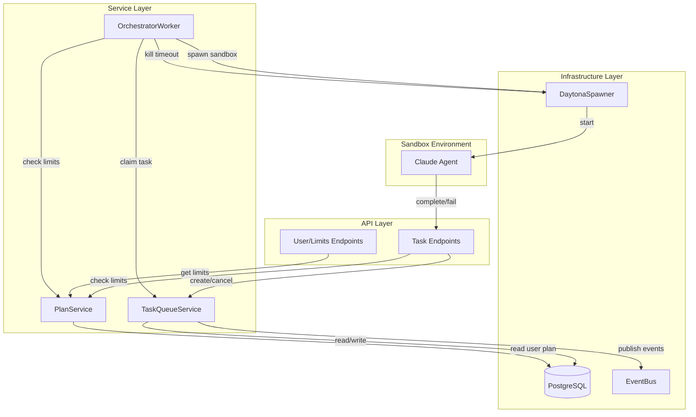
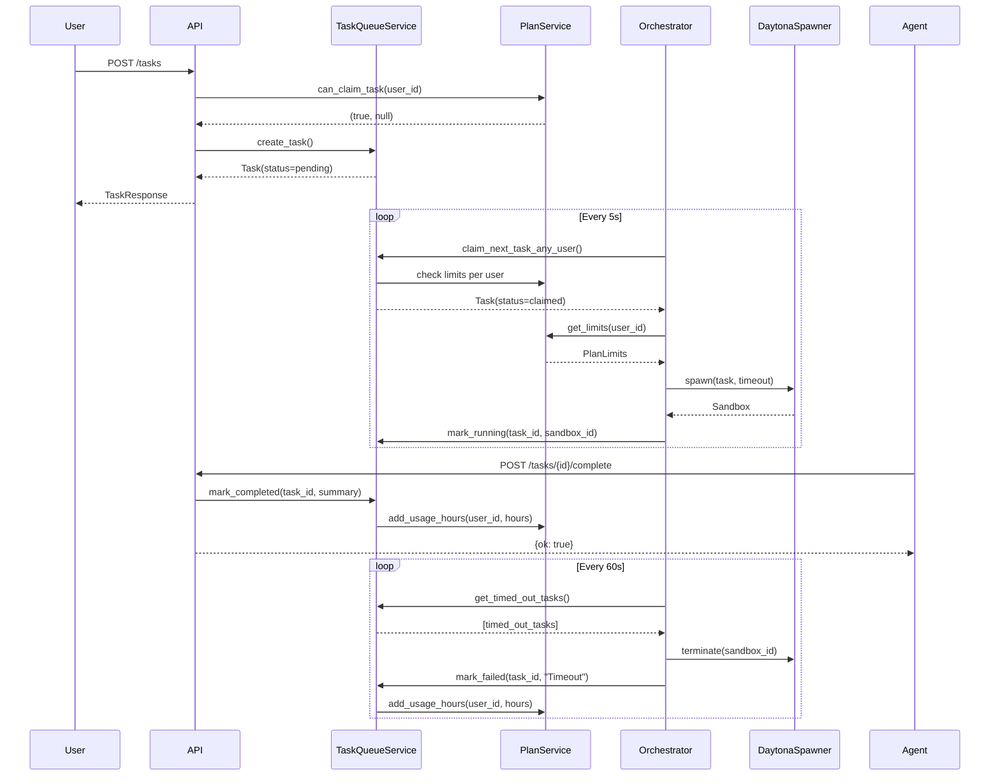

# Task Queue User Limits - Product Design Document

## Document Overview

A task queue extension that enables overnight batch execution with user-based concurrency limits. Users queue tasks before bed, agents execute them in sandboxes respecting plan limits, and results are available in the morning.

- **Purpose & Scope**
  - Add plan-based concurrency limits to existing TaskQueueService
  - Track monthly agent hour usage per user
  - Enable overnight batch processing without supervision
  - Non-goals: Billing integration, Stripe webhooks (post-MVP)

- **Target Audience**
  - Implementation teams extending TaskQueueService
  - DevOps configuring plan limits

- **Related Documents**
  - Requirements: `.omoi_os/requirements/task-queue-user-limits.md`
  - Existing: `omoi_os/services/task_queue.py`

---

## Architecture Overview

### High-Level Architecture



### Component Responsibilities

| Component | Layer | Responsibilities |
|-----------|-------|------------------|
| TaskQueueService | Service | Task CRUD, claim logic, status updates, queue ordering |
| PlanService | Service | Plan limits lookup, usage tracking, eligibility checks |
| OrchestratorWorker | Service | Main loop, timeout detection, sandbox spawning |
| DaytonaSpawner | Infrastructure | Sandbox lifecycle management |
| EventBus | Infrastructure | Real-time event broadcasting |

### System Boundaries

- **Within scope of this design**:
  - User plan limits enforcement
  - Concurrency control per user
  - Monthly usage tracking
  - Timeout management per plan

- **Out of scope (delegated)**:
  - Billing/Stripe integration (future)
  - Plan upgrade UI (frontend)
  - Guardian intervention (separate feature)

---

## Component Details

### PlanService (New)

#### Responsibilities
- Load plan configuration from code
- Get user's current plan limits
- Track and update monthly usage
- Check claim eligibility

#### Key Interfaces
- `get_limits(user_id: str) -> PlanLimits`
- `get_monthly_hours_used(user_id: str) -> float`
- `add_usage_hours(user_id: str, hours: float) -> None`
- `can_claim_task(user_id: str) -> tuple[bool, Optional[str]]`

#### Implementation Notes
```python
# config/plans.py
from dataclasses import dataclass
from typing import Optional

@dataclass
class PlanLimits:
    max_concurrent_agents: int
    max_task_duration_minutes: int
    monthly_agent_hours: Optional[int]  # None = unlimited

PLAN_LIMITS = {
    "free": PlanLimits(
        max_concurrent_agents=1,
        max_task_duration_minutes=30,
        monthly_agent_hours=10,
    ),
    "pro": PlanLimits(
        max_concurrent_agents=3,
        max_task_duration_minutes=120,
        monthly_agent_hours=100,
    ),
    "team": PlanLimits(
        max_concurrent_agents=10,
        max_task_duration_minutes=240,
        monthly_agent_hours=None,
    ),
    "enterprise": PlanLimits(
        max_concurrent_agents=50,
        max_task_duration_minutes=480,
        monthly_agent_hours=None,
    ),
}
```

### TaskQueueService Extensions

#### New Methods
- `get_running_count(user_id: str) -> int`
- `can_claim_task(user_id: str) -> tuple[bool, Optional[str]]`
- `claim_next_task_for_user(user_id: str) -> Optional[Task]`
- `claim_next_task_any_user() -> Optional[Task]`
- `get_pending_count(user_id: str) -> int`
- `get_queue_position(task_id: str) -> Optional[int]`

#### Modified Methods
- `mark_completed()` - Add usage hour tracking
- `mark_failed()` - Add usage hour tracking

### OrchestratorWorker Updates

#### New Behavior
1. Check for timed-out tasks every 60 seconds
2. Use `claim_next_task_any_user()` instead of existing claim logic
3. Pass user's timeout limit to sandbox spawner
4. Kill sandboxes for timed-out tasks

---

## Data Models

### Database Schema

```sql
-- Add plan columns to existing users table
ALTER TABLE users ADD COLUMN plan_tier VARCHAR(20) DEFAULT 'free';
ALTER TABLE users ADD COLUMN max_concurrent_agents INT DEFAULT 1;
ALTER TABLE users ADD COLUMN max_task_duration_minutes INT DEFAULT 30;
ALTER TABLE users ADD COLUMN monthly_agent_hours_limit INT DEFAULT 10;
ALTER TABLE users ADD COLUMN monthly_agent_hours_used DECIMAL(10,2) DEFAULT 0;
ALTER TABLE users ADD COLUMN billing_cycle_reset_at TIMESTAMP;

-- Index for quick plan lookups
CREATE INDEX idx_users_plan ON users(plan_tier);

-- Add user_id to tasks if not present
ALTER TABLE tasks ADD COLUMN IF NOT EXISTS user_id UUID REFERENCES users(id);
ALTER TABLE tasks ADD COLUMN IF NOT EXISTS project_id UUID;
ALTER TABLE tasks ADD COLUMN IF NOT EXISTS result_summary TEXT;
ALTER TABLE tasks ADD COLUMN IF NOT EXISTS files_changed JSONB;

-- Index for user's running task count
CREATE INDEX idx_tasks_user_status ON tasks(user_id, status)
    WHERE status IN ('claimed', 'running');
```

### Pydantic Models

```python
from __future__ import annotations
from datetime import datetime
from enum import Enum
from typing import Any, Dict, List, Optional
from pydantic import BaseModel, Field


class PlanTier(str, Enum):
    FREE = "free"
    PRO = "pro"
    TEAM = "team"
    ENTERPRISE = "enterprise"


class TaskStatus(str, Enum):
    PENDING = "pending"
    CLAIMED = "claimed"
    RUNNING = "running"
    COMPLETED = "completed"
    FAILED = "failed"


class TaskCreate(BaseModel):
    title: str
    description: str
    project_id: str
    priority: int = Field(default=3, ge=1, le=4)


class TaskResponse(BaseModel):
    id: str
    title: str
    status: TaskStatus
    priority: int
    queue_position: Optional[int] = None
    created_at: datetime
    started_at: Optional[datetime] = None
    completed_at: Optional[datetime] = None
    result_summary: Optional[str] = None
    failure_reason: Optional[str] = None


class TaskResult(BaseModel):
    status: str  # "completed" or "failed"
    summary: Optional[str] = None
    files_changed: Optional[List[str]] = None
    error: Optional[str] = None


class QueueStatus(BaseModel):
    running: int
    pending: int
    max_concurrent: int
    can_start_more: bool
    monthly_hours_used: float
    monthly_hours_limit: Optional[int] = None


class UserLimits(BaseModel):
    plan: PlanTier
    max_concurrent_agents: int
    max_task_duration_minutes: int
    monthly_agent_hours_limit: Optional[int] = None
    monthly_agent_hours_used: float
    billing_cycle_resets_at: Optional[datetime] = None
```

---

## API Specifications

### REST Endpoints

| Method | Path | Purpose | Request | Response |
|--------|------|---------|---------|----------|
| POST | `/api/v1/tasks` | Create task | `TaskCreate` | `TaskResponse` |
| GET | `/api/v1/tasks` | List user's tasks | `?status=` | `TaskResponse[]` |
| DELETE | `/api/v1/tasks/{id}` | Cancel task | - | `{cancelled: true}` |
| GET | `/api/v1/tasks/queue-status` | Queue status | - | `QueueStatus` |
| POST | `/api/v1/tasks/{id}/complete` | Report completion | `TaskResult` | `{ok: true}` |
| GET | `/api/v1/users/me/limits` | User limits | - | `UserLimits` |

### Error Handling

| Status Code | Error Code | Description |
|-------------|------------|-------------|
| 400 | `TOO_MANY_PENDING` | User has 50+ pending tasks |
| 400 | `TASK_ALREADY_COMPLETED` | Cannot cancel completed task |
| 403 | `MONTHLY_LIMIT_REACHED` | Monthly hours exhausted |
| 404 | `TASK_NOT_FOUND` | Task doesn't exist or wrong user |

---

## Implementation Details

### Core Algorithm: Claim Next Task Any User

```python
async def claim_next_task_any_user(self) -> Optional[QueuedTask]:
    """
    Claim next available task across all users (for orchestrator).
    Respects per-user limits, prioritizes users with fewer running agents.

    Steps:
    1. Find users with pending tasks who aren't at their limit
    2. Order by running count ascending (fairness)
    3. Try to claim from each eligible user
    """
    # Step 1: Get eligible users
    eligible_users = await self.db.fetch("""
        WITH user_running AS (
            SELECT user_id, COUNT(*) as running_count
            FROM tasks
            WHERE status IN ('claimed', 'running')
            GROUP BY user_id
        ),
        user_pending AS (
            SELECT DISTINCT user_id
            FROM tasks
            WHERE status = 'pending'
        )
        SELECT up.user_id, u.max_concurrent_agents,
               COALESCE(ur.running_count, 0) as running
        FROM user_pending up
        JOIN users u ON up.user_id = u.id
        LEFT JOIN user_running ur ON up.user_id = ur.user_id
        WHERE COALESCE(ur.running_count, 0) < u.max_concurrent_agents
        ORDER BY COALESCE(ur.running_count, 0) ASC
        LIMIT 10
    """)

    # Step 2: Try to claim from each eligible user
    for user in eligible_users:
        # Also check monthly hours
        if not await self._check_monthly_limit(user["user_id"]):
            continue

        task = await self.claim_next_task(user["user_id"])
        if task:
            return task

    return None
```

### Operation Flow: Task Lifecycle



---

## Configuration

| Parameter | Default | Range | Description |
|-----------|---------|-------|-------------|
| `poll_interval` | 5.0 | 1-30 | Orchestrator poll interval (seconds) |
| `timeout_check_interval` | 60.0 | 30-300 | Timeout check interval (seconds) |
| `max_pending_per_user` | 50 | 10-200 | Maximum pending tasks per user |
| `stale_claiming_threshold` | 60 | 30-300 | Seconds before claiming task is stale |

---

## Performance Considerations

### Database Indexing
- `idx_users_plan` - Quick plan tier lookups
- `idx_tasks_user_status` - Fast running count queries (partial index)
- Existing task priority/created_at indexes for queue ordering

### Query Optimization
- Use partial index for running tasks (status IN ('claimed', 'running'))
- Limit eligible users query to 10 at a time
- Use SKIP LOCKED for atomic claiming

### Batch Processing
- Orchestrator processes one task per loop iteration
- Timeout check runs every 60 seconds to batch kill operations

---

## Security Considerations

### Authentication
- All task endpoints require valid JWT or API key
- Sandbox callback uses internal service auth

### Authorization
- Users can only access their own tasks
- Plan tier changes require admin privileges

### Data Protection
- No sensitive data in task descriptions (user responsibility)
- Sandbox outputs may contain code - treat as user data

---

## Related Documents

- **Requirements**: `.omoi_os/requirements/task-queue-user-limits.md`
- **Existing Implementation**: `omoi_os/services/task_queue.py`
- **Daytona Spawner**: `omoi_os/services/daytona_spawner.py`

---

## Quality Checklist

- [x] All requirements addressed
- [x] Architecture diagram included
- [x] API specifications complete
- [x] Database schemas defined
- [x] Integration points documented
- [x] Error handling specified
- [x] Security considerations addressed

---

## Revision History

| Version | Date | Author | Changes |
|---------|------|--------|---------|
| 1.0 | 2024-12-29 | Kevin | Initial design from provided doc |
