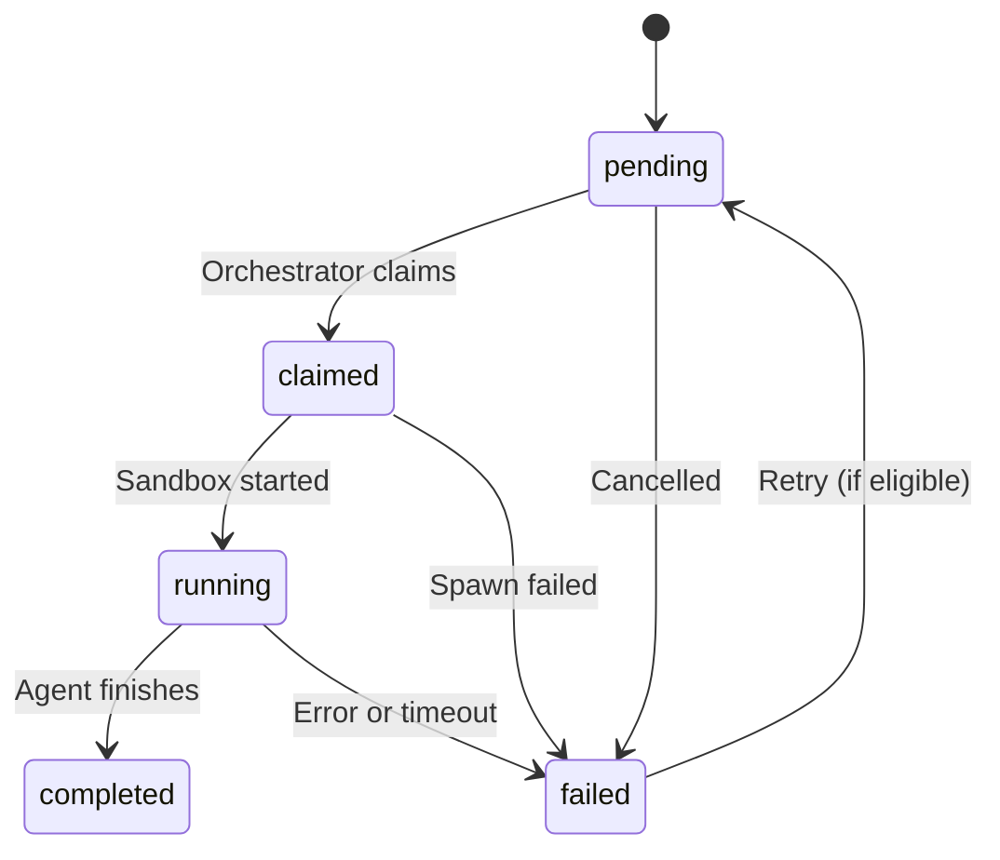

# Task Queue User Limits Requirements

## Document Overview

This document defines requirements for extending the existing task queue system with user-based concurrency limits, plan tiers, and overnight batch execution support. The goal is to enable users to queue multiple tasks before sleeping and wake up to completed results without runaway costs or hung tasks.

**Parent Document**: Existing TaskQueueService implementation

---

## 1. Plan Tier Management

#### REQ-TQU-PLAN-001: Plan Tier Definition
THE SYSTEM SHALL support the following plan tiers with defined limits:

| Plan | Max Concurrent Agents | Max Task Duration | Monthly Agent Hours |
|------|----------------------|-------------------|---------------------|
| Free | 1 | 30 min | 10 hrs |
| Pro | 3 | 2 hrs | 100 hrs |
| Team | 10 | 4 hrs | Unlimited |
| Enterprise | Custom | Custom | Unlimited |

#### REQ-TQU-PLAN-002: Plan Configuration
THE SYSTEM SHALL store plan limits in a configuration module that can be extended without database changes.

#### REQ-TQU-PLAN-003: User Plan Assignment
THE SYSTEM SHALL associate each user with a plan tier, defaulting to 'free' for new users.

---

## 2. Concurrency Control

#### REQ-TQU-CONC-001: Running Task Count
THE SYSTEM SHALL track the number of currently running agents per user by counting tasks in 'claimed' or 'running' status.

#### REQ-TQU-CONC-002: Claim Eligibility Check
WHEN a user attempts to claim a new task, THE SYSTEM SHALL verify:
- Current running count < max_concurrent_agents for user's plan
- Monthly hours used < monthly_agent_hours limit (if applicable)

#### REQ-TQU-CONC-003: Claim Rejection Reason
WHEN a user cannot claim a task due to limits, THE SYSTEM SHALL return a descriptive reason (e.g., "At limit: 3/3 agents running").

#### REQ-TQU-CONC-004: Cross-User Task Claiming
THE SYSTEM SHALL support claiming tasks across all users while respecting per-user limits, prioritizing users with fewer running agents.

---

## 3. Monthly Usage Tracking

#### REQ-TQU-USAGE-001: Hour Accumulation
THE SYSTEM SHALL track monthly agent hours used per user, incrementing on task completion or failure.

#### REQ-TQU-USAGE-002: Usage Calculation
THE SYSTEM SHALL calculate usage as: (completed_at - started_at) in hours, rounded to two decimal places.

#### REQ-TQU-USAGE-003: Billing Cycle Reset
THE SYSTEM SHALL reset monthly_agent_hours_used to 0 at the start of each billing cycle (monthly).

#### REQ-TQU-USAGE-004: Usage Enforcement
WHEN a user's monthly hours reach the limit, THE SYSTEM SHALL prevent new task claims until the billing cycle resets.

---

## 4. Task Duration Limits

#### REQ-TQU-DUR-001: Per-Task Timeout
THE SYSTEM SHALL enforce max_task_duration_minutes from the user's plan as the timeout for each task.

#### REQ-TQU-DUR-002: Timeout Detection
THE SYSTEM SHALL periodically check for tasks exceeding their timeout (every 60 seconds).

#### REQ-TQU-DUR-003: Timeout Handling
WHEN a task exceeds its timeout, THE SYSTEM SHALL:
1. Terminate the associated sandbox
2. Mark the task as failed with reason "Timeout: exceeded {minutes} minutes"
3. Still count the elapsed hours toward monthly usage

---

## 5. Queue Management

#### REQ-TQU-QUEUE-001: Priority-Based Ordering
THE SYSTEM SHALL order pending tasks by priority (1=critical → 4=low) then by created_at ascending.

#### REQ-TQU-QUEUE-002: Queue Position
THE SYSTEM SHALL provide queue position for pending tasks relative to other tasks with same or higher priority.

#### REQ-TQU-QUEUE-003: Maximum Pending Tasks
THE SYSTEM SHALL limit pending tasks per user to 50 to prevent queue abuse.

#### REQ-TQU-QUEUE-004: Task Cancellation
THE SYSTEM SHALL allow users to cancel pending or running tasks, terminating sandboxes for running tasks.

---

## 6. State Machine

#### REQ-TQU-SM-001: States
Tasks SHALL support the following states:



#### REQ-TQU-SM-002: Transitions
Valid transitions:
```
pending → claimed (orchestrator claims)
claimed → running (sandbox spawns, agent starts)
running → completed (agent finishes successfully)
running → failed (error, timeout, or cancellation)
pending → failed (cancelled before claim)
claimed → failed (sandbox spawn failure)
failed → pending (retry if retry_count < max_retries)
```

---

## 7. Data Model Requirements

### 7.1 User Plan Fields
#### REQ-TQU-DM-001
User model SHALL include the following plan-related fields:
- `plan_tier: VARCHAR(20)` (default: 'free')
- `max_concurrent_agents: INT` (default: 1)
- `max_task_duration_minutes: INT` (default: 30)
- `monthly_agent_hours_limit: INT | NULL` (NULL = unlimited)
- `monthly_agent_hours_used: DECIMAL(10,2)` (default: 0)
- `billing_cycle_reset_at: TIMESTAMP`

### 7.2 Task Fields (Existing + New)
#### REQ-TQU-DM-002
Task model already includes required fields. Verify presence of:
- `user_id TEXT FK -> users(id)` (may need to add)
- `project_id TEXT FK -> projects(id)` (may need to add)
- `sandbox_id TEXT` (exists)
- `started_at TIMESTAMP` (exists)
- `completed_at TIMESTAMP` (exists)
- `timeout_seconds INT` (exists)
- `result_summary TEXT` (may need to add)
- `files_changed JSONB` (may need to add)

---

## 8. API Requirements

### 8.1 Endpoints Table

| Endpoint | Method | Purpose | Request Body | Responses |
|----------|--------|---------|--------------|-----------|
| /api/v1/tasks | POST | Create task | `{ title, description, project_id, priority }` | 200: `TaskResponse`; 400: `{ error }` |
| /api/v1/tasks | GET | List user's tasks | `?status=` | 200: `TaskResponse[]` |
| /api/v1/tasks/{id} | DELETE | Cancel task | - | 200: `{ cancelled: true }` |
| /api/v1/tasks/queue-status | GET | Get queue status | - | 200: `QueueStatus` |
| /api/v1/tasks/{id}/complete | POST | Report completion | `{ status, summary, files_changed }` | 200: `{ ok: true }` |
| /api/v1/users/me/limits | GET | Get user limits | - | 200: `UserLimits` |

### 8.2 Response Models
#### REQ-TQU-API-001
```python
class TaskResponse(BaseModel):
    id: str
    title: str
    status: str
    priority: int
    queue_position: Optional[int]
    created_at: datetime
    started_at: Optional[datetime]
    completed_at: Optional[datetime]

class QueueStatus(BaseModel):
    running: int
    pending: int
    max_concurrent: int
    can_start_more: bool
    monthly_hours_used: float
    monthly_hours_limit: Optional[int]

class UserLimits(BaseModel):
    plan: str
    max_concurrent_agents: int
    max_task_duration_minutes: int
    monthly_agent_hours_limit: Optional[int]
    monthly_agent_hours_used: float
    billing_cycle_resets_at: Optional[datetime]
```

---

## 9. SLOs & Performance

#### REQ-TQU-SLO-001
Task claiming should complete within 100ms under normal conditions.

#### REQ-TQU-SLO-002
Timeout detection loop should complete within 5 seconds for up to 1000 running tasks.

#### REQ-TQU-SLO-003
Queue position calculation should complete within 50ms.

---

## 10. Security & Audit

#### REQ-TQU-SEC-001
Only authenticated users MAY create, list, or cancel their own tasks.

#### REQ-TQU-SEC-002
Task completion callback endpoint SHALL validate task ownership or use internal auth.

#### REQ-TQU-SEC-003
Plan tier changes MUST be audited with actor, old_tier, new_tier, and timestamp.

---

## 11. Integration Requirements

#### REQ-TQU-INT-001: Existing TaskQueueService
THE SYSTEM SHALL extend the existing TaskQueueService rather than replacing it.

#### REQ-TQU-INT-002: Daytona Spawner
THE SYSTEM SHALL integrate with DaytonaSpawnerService for sandbox lifecycle management.

#### REQ-TQU-INT-003: Event Bus
THE SYSTEM SHALL publish task events (created, claimed, completed, failed, cancelled) to the existing EventBusService.

---

## Related Documents

- [Task Queue User Limits Design](../designs/task-queue-user-limits.md)
- [Existing TaskQueueService](../../omoi_os/services/task_queue.py)

---

## Revision History

| Version | Date | Author | Changes |
|---------|------|--------|---------|
| 1.0 | 2024-12-29 | Kevin | Initial requirements from design doc |
