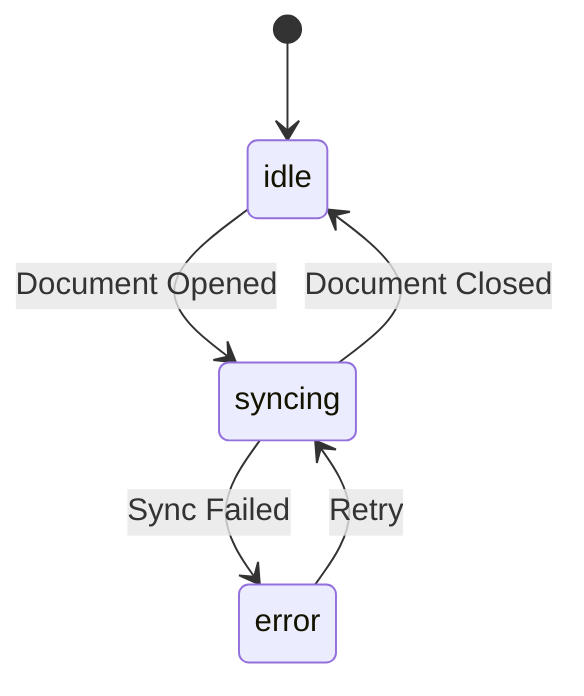

# Spec-Driven Development

Systematic workflow for turning feature ideas into structured specifications, designs, and actionable work items using Claude Agent SDK patterns.

---

## 🚨 MANDATORY: YAML Frontmatter on ALL Files

**EVERY file you create in `.omoi_os/` MUST begin with YAML frontmatter.** This is NON-NEGOTIABLE.

### Why Frontmatter is Required

1. **Programmatic Parsing**: The CLI tools, API sync, and orchestrator all parse frontmatter to understand file structure
2. **Traceability**: Frontmatter enables linking requirements → designs → tickets → tasks
3. **Status Tracking**: Status, priority, and dependencies are tracked via frontmatter fields
4. **API Integration**: When syncing to backend, frontmatter provides the structured data

### Required Frontmatter by File Type

**Requirements** (`.omoi_os/requirements/*.md`):
```yaml
---
id: REQ-{DOMAIN}-001
title: {Feature Name} Requirements
feature: {feature-name}
created: {YYYY-MM-DD}
updated: {YYYY-MM-DD}
status: draft  # draft | review | approved
category: functional  # functional | non-functional | constraint
priority: HIGH  # CRITICAL | HIGH | MEDIUM | LOW
design_ref: designs/{feature-name}.md
condition: "{EARS WHEN clause}"
action: "{EARS SHALL clause}"
---
```

**Designs** (`.omoi_os/designs/*.md`):
```yaml
---
id: DESIGN-{DOMAIN}-001
title: {Feature Name} Design
feature: {feature-name}
created: {YYYY-MM-DD}
updated: {YYYY-MM-DD}
status: draft  # draft | review | approved
requirements:
  - REQ-{DOMAIN}-001
---
```

**Tickets** (`.omoi_os/tickets/TKT-*.md`):
```yaml
---
id: TKT-{NUM}
title: {Ticket Title}
status: backlog  # backlog | analyzing | building | testing | done | blocked
priority: MEDIUM  # CRITICAL | HIGH | MEDIUM | LOW
estimate: M  # S | M | L | XL
created: {YYYY-MM-DD}
updated: {YYYY-MM-DD}
feature: {feature-name}
requirements:
  - REQ-XXX-YYY
design_ref: designs/{feature-name}.md
tasks:
  - TSK-{NUM}
dependencies:
  blocked_by: []
  blocks: []
  related: []
---
```

**Tasks** (`.omoi_os/tasks/TSK-*.md`):
```yaml
---
id: TSK-{NUM}
title: {Task Title}
status: pending  # pending | in_progress | review | done | blocked
parent_ticket: TKT-{NUM}
estimate: M  # S | M | L
created: {YYYY-MM-DD}
assignee: null
dependencies:
  depends_on: []
  blocks: []
---
```

### ❌ Files Without Frontmatter Will Fail

Files missing frontmatter will:
- Not appear in `spec_cli.py show` commands
- Not sync to the API
- Not be tracked in traceability reports
- Not be picked up by the orchestrator

### ✅ Always Start With Frontmatter

When creating ANY file in `.omoi_os/`, your FIRST action should be writing the YAML frontmatter block, THEN the content.

---

## CRITICAL: Research-First, Question-Driven Approach

**BEFORE creating any specs, requirements, or designs:**

### Step 0: Explore Existing Codebase & Documentation

**MANDATORY**: Always explore the existing codebase and documentation FIRST to understand context, patterns, and constraints.

```
1. Search for existing docs:
   - Read docs/ directory for architecture, requirements, and design docs
   - Check .omoi_os/ directory for existing specs, tickets, and tasks
   - Look for CLAUDE.md, README.md, and other project guidance files

2. Explore related code:
   - Use Grep/Glob to find related components, services, and patterns
   - Read existing implementations that the new feature will integrate with
   - Identify coding patterns, naming conventions, and architecture styles

3. Check for prior work:
   - Look for existing tickets, tasks, or specs related to this feature
   - Review git history for context on similar features
   - Find any ADRs (Architecture Decision Records) that apply
```

### Step 1: Ask Discovery Questions (MANDATORY)

**NEVER proceed to design without asking thorough questions first.** Ask 5-15 questions depending on feature complexity:

**Feature Clarity Questions:**
- What specific problem does this solve? What pain point exists today?
- Who are the primary users/actors? Secondary?
- What does success look like? How will we measure it?

**Scope & Boundaries Questions:**
- What is explicitly IN scope? What is explicitly OUT?
- Are there existing features this overlaps with?
- What are the hard constraints (time, budget, technical)?

**Technical Context Questions:**
- What existing systems/services will this integrate with?
- Are there performance requirements (latency, throughput)?
- What data will this feature need? Where does it come from?
- What security/privacy considerations apply?

**Design Direction Questions:**
- Are there multiple valid approaches? Which should we explore?
- What are the trade-offs between approaches?
- Are there existing patterns in the codebase we should follow?
- What could go wrong? What are the risks?

**Example Question Flow:**
```
User: "I want to add user notifications"

Claude: Before designing, I need to understand the feature better. Let me ask some questions:

**Scope:**
1. What types of notifications? (in-app, email, SMS, push?)
2. What events trigger notifications? (task complete, agent stuck, PR ready?)
3. Should users be able to configure notification preferences?

**Technical:**
4. I see we have an EventBusService - should notifications hook into that?
5. Do we need real-time delivery or is near-real-time (polling) acceptable?
6. What's the expected volume of notifications per user per day?

**Constraints:**
7. Are there any third-party services we must/must not use?
8. What's the timeline/priority for this feature?

Let me know your thoughts on these, and I may have follow-up questions.
```

### Step 2: Always Create Tangible Artifacts in `.omoi_os/`

Even when using MCP tools, **ALSO write local files in `.omoi_os/`** for these benefits:
- **Reference**: AI can re-read files if context is lost
- **Debugging**: Humans can inspect what was generated
- **Version Control**: Files can be committed to git
- **Portability**: Works even if MCP tools fail

**Dual-Write Strategy:**
```
1. Call MCP tool to create in backend system
2. ALSO write to .omoi_os/ directory with same content
3. If MCP fails, .omoi_os/ files serve as fallback
```

### Python Scripts for API Reference

Use the utility scripts in `scripts/` to interact with APIs and validate state:

```bash
# Initialize feature directory structure
uv run python .claude/skills/spec-driven-dev/scripts/init_feature.py --feature notifications

# Generate next ticket/task IDs
uv run python .claude/skills/spec-driven-dev/scripts/generate_ids.py

# Validate spec completeness
uv run python .claude/skills/spec-driven-dev/scripts/validate_specs.py --feature notifications

# Call spec workflow APIs (if backend is running)
# These help verify MCP tool operations and debug issues
uv run python scripts/test_spec_workflow.py --list-specs
uv run python scripts/test_spec_workflow.py --get-spec spec-123
```

**When to use scripts:**
- After MCP tool calls, verify the data was created correctly
- When debugging why a spec/ticket isn't showing up
- To list existing specs before creating new ones
- To validate generated specs match requirements

---

## MCP Spec Workflow Tools (USE WHEN AVAILABLE!)

**IMPORTANT**: If you have access to the `mcp__spec_workflow__*` tools, use them instead of writing files to `.omoi_os/`. These tools create specs, requirements, and tickets directly in the OmoiOS backend system.

### Available MCP Tools

Check if these tools are available in your current session:

| Tool | Purpose | Use Instead Of |
|------|---------|----------------|
| `mcp__spec_workflow__create_spec` | Create a new specification | Writing `.omoi_os/requirements/*.md` |
| `mcp__spec_workflow__add_requirement` | Add EARS-style requirement | Manually formatting requirements |
| `mcp__spec_workflow__add_acceptance_criterion` | Add acceptance criteria | Writing criteria in markdown |
| `mcp__spec_workflow__update_design` | Update architecture/design | Writing `.omoi_os/designs/*.md` |
| `mcp__spec_workflow__add_spec_task` | Add task to spec | Writing `.omoi_os/tasks/*.md` |
| `mcp__spec_workflow__create_ticket` | Create workflow ticket | Writing `.omoi_os/tickets/*.md` |
| `mcp__spec_workflow__approve_requirements` | Move to Design phase | Manual status updates |
| `mcp__spec_workflow__approve_design` | Move to Implementation phase | Manual status updates |
| `mcp__spec_workflow__get_spec` | Get spec details | Reading files |
| `mcp__spec_workflow__list_project_specs` | List all specs | Listing directories |
| `mcp__spec_workflow__get_ticket` | Get ticket details | Reading ticket files |

### MCP-Based Workflow (with Dual-Write)

When MCP tools are available, follow this flow. **Always dual-write to `.omoi_os/` as backup!**

```
0. EXPLORE existing docs, code, and prior specs (MANDATORY)
1. ASK discovery questions to understand the feature (5-15 questions)
2. RESEARCH using DeepWiki/Context7 for external libraries/patterns
3. Create Spec:        mcp__spec_workflow__create_spec + write .omoi_os/requirements/{feature}.md
4. Add Requirements:   mcp__spec_workflow__add_requirement (for each) + append to local file
5. Add Criteria:       mcp__spec_workflow__add_acceptance_criterion + append to local file
6. Approve Reqs:       mcp__spec_workflow__approve_requirements
7. Update Design:      mcp__spec_workflow__update_design + write .omoi_os/designs/{feature}.md
8. Approve Design:     mcp__spec_workflow__approve_design
9. Add Tasks:          mcp__spec_workflow__add_spec_task (for each) + write .omoi_os/tasks/TSK-{N}.md
10. Create Ticket:     mcp__spec_workflow__create_ticket + write .omoi_os/tickets/TKT-{N}.md
11. VERIFY:            Run scripts to confirm data was created correctly
```

**Why Dual-Write?**
- If MCP server fails, you have local files as fallback
- AI can re-read .omoi_os/ files if context is lost mid-conversation
- Human reviewers can see exactly what was generated
- Files can be committed to version control for audit trail

### Example MCP Usage

```python
# 1. Create the spec
mcp__spec_workflow__create_spec(
    project_id="proj-123",
    title="Real-Time Collaboration",
    description="Enable multiple users to edit documents simultaneously"
)
# Returns: spec_id

# 2. Add requirements (EARS format: WHEN condition, THE SYSTEM SHALL action)
mcp__spec_workflow__add_requirement(
    spec_id="spec-456",
    title="Live cursor display",
    condition="a user opens a shared document",
    action="display all active collaborators' cursors in real-time"
)

# 3. Add acceptance criteria
mcp__spec_workflow__add_acceptance_criterion(
    spec_id="spec-456",
    requirement_id="req-789",
    text="Cursor positions update within 100ms of remote changes"
)

# 4. Approve requirements to move to Design phase
mcp__spec_workflow__approve_requirements(spec_id="spec-456")

# 5. Update design
mcp__spec_workflow__update_design(
    spec_id="spec-456",
    architecture="## Architecture\n\nWebSocket-based sync using CRDT...",
    data_model="## Data Model\n\n```sql\nCREATE TABLE collaborators...",
    api_spec=[
        {"method": "WS", "endpoint": "/ws/collab/{doc_id}", "description": "Real-time sync"}
    ]
)

# 6. Approve design to move to Implementation
mcp__spec_workflow__approve_design(spec_id="spec-456")

# 7. Add tasks
mcp__spec_workflow__add_spec_task(
    spec_id="spec-456",
    title="Implement CRDT data structures",
    description="Create RGA-based CRDT for text sequences",
    phase="Implementation",
    priority="high"
)

# 8. Create ticket to trigger orchestrator
mcp__spec_workflow__create_ticket(
    title="Implement Real-Time Collaboration",
    description="Full implementation of collaborative editing feature",
    priority="HIGH",
    phase_id="PHASE_IMPLEMENTATION",
    project_id="proj-123"
)
```

---

## Fallback: File-Based Workflow

If MCP tools are NOT available, fall back to writing files in `.omoi_os/` as described below.

## Workflow Overview

```
┌─────────────────┐     ┌──────────────────┐     ┌─────────────────┐
│  1. Understand  │────>│  2. Research     │────>│  3. Generate    │
│  Feature        │     │  (DeepWiki/C7)   │     │  Requirements   │
└─────────────────┘     └──────────────────┘     └─────────────────┘
                                                         │
                                                         ▼
┌─────────────────┐     ┌──────────────────┐     ┌─────────────────┐
│  6. Tasks       │<────│  5. Tickets      │<────│  4. Design Doc  │
│  (Children)     │     │  (Work Items)    │     │  (Technical)    │
└─────────────────┘     └──────────────────┘     └─────────────────┘
```

## Directory Structure

All spec artifacts are stored in `.omoi_os/`:

```
.omoi_os/
├── requirements/           # Requirements documents
│   ├── feature-name.md     # REQ-XXX-YYY format
│   └── ...
├── designs/                # Technical design documents
│   ├── feature-name.md     # Architecture, data models, APIs
│   └── ...
├── tickets/                # Work item tickets
│   ├── TKT-001.md          # Parent work items
│   └── ...
└── tasks/                  # Child tasks
    ├── TSK-001.md          # Individual actionable tasks
    └── ...
```

## Phase 1: Feature Understanding (DEEP EXPLORATION)

### When to Enter This Phase
- User describes a new feature idea
- User wants to plan implementation
- User says "let's build..." or "I want to add..."

### Process (Expanded)

**Step 1a: Explore Existing Context FIRST**

Before asking questions, gather context:
```
# Read project documentation
Read docs/CLAUDE.md, docs/architecture/, docs/requirements/

# Check for existing related specs
ls .omoi_os/requirements/
ls .omoi_os/designs/

# Search codebase for related components
Grep for related service names, models, patterns

# Check for prior discussions/ADRs
ls docs/architecture/decisions/
```

**Step 1b: Ask Thorough Discovery Questions**

Ask 5-15 questions depending on complexity. Categories:

1. **Problem & Value** (2-3 questions)
   - What specific problem does this solve?
   - What's the impact of not having this feature?
   - How will we measure success?

2. **Users & Interactions** (2-3 questions)
   - Who are the users/actors?
   - What are the key user journeys?
   - What are the edge cases?

3. **Technical Context** (3-5 questions)
   - What existing systems will this integrate with?
   - What data does this need? Where does it come from?
   - Are there performance/scale requirements?
   - What security/auth considerations apply?

4. **Constraints & Trade-offs** (2-3 questions)
   - What's explicitly out of scope?
   - Are there time/budget constraints?
   - What are the risks? What could go wrong?

**Step 1c: Confirm Understanding with Summary**

After questions are answered, summarize:
- Feature name (kebab-case identifier)
- One-line description
- Key user stories (3-5)
- Scope boundaries (IN/OUT explicitly listed)
- Technical constraints discovered
- Risks identified

### Example Dialog

```
User: "I want to add real-time collaboration to the editor"

Claude: Let me first explore the codebase to understand context...

[Reads docs/CLAUDE.md, checks for existing specs, searches for editor-related code]

Found: We have EventBusService for real-time events, WebSocket support in the frontend.
No existing collaboration specs found.

Now, before designing, I need to understand the feature better:

**Problem & Value:**
1. What specific problem does this solve? (Multiple people editing same doc causes conflicts?)
2. How critical is real-time? (Sub-second updates vs eventual consistency?)

**Users & Scope:**
3. Who will collaborate? (Internal team only? External guests?)
4. What types of content? (Just text? Code? Rich formatting?)
5. What's explicitly OUT of scope? (Comments? Video chat?)

**Technical:**
6. I see we have EventBusService - should collaboration events flow through there?
7. What's the expected concurrent editor count per document?
8. Do we need conflict resolution or can we use CRDT for auto-merge?

**Constraints:**
9. Any third-party services we must use or avoid?
10. What's the timeline? MVP vs full feature?

[After user answers...]

**Summary:**

**Feature**: real-time-collaboration
**Description**: Enable multiple users to edit documents simultaneously with live cursors and changes

**User Stories**:
1. As a user, I can see other editors' cursors in real-time
2. As a user, I can see changes appear as others type
3. As a user, I can see who is currently viewing the document

**Scope**:
- IN: Live cursors, text sync, presence indicators
- OUT: Voice/video, commenting (separate feature)

**Technical Constraints**:
- Must integrate with existing EventBusService
- Max 10 concurrent editors per document
- Use CRDT for conflict resolution

**Risks Identified**:
- Performance with large documents
- Network latency affecting user experience

Is this correct? Any changes before I proceed to research?
```

## Phase 2: Research

### Using DeepWiki and Context7

Research libraries and patterns before creating specifications:

```python
# For GitHub repositories (architecture, implementation patterns)
mcp__deepwiki-mcp__read_wiki_structure(repoName="owner/repo")
mcp__deepwiki-mcp__ask_question(
    repoName="owner/repo",
    question="How is real-time collaboration implemented?"
)

# For library documentation (API, best practices)
lib_id = mcp__context7-mcp__resolve-library-id(libraryName="yjs")
mcp__context7-mcp__get-library-docs(
    context7CompatibleLibraryID=lib_id,
    topic="collaboration",
    mode="code"  # or "info" for concepts
)
```

### Research Questions by Feature Type

**Data/Storage Features:**
- What data models are needed?
- What are the storage patterns?
- What are the query patterns?

**API Features:**
- What endpoints are needed?
- What authentication/authorization?
- What error handling?

**Real-time Features:**
- What transport (WebSocket, SSE)?
- What sync algorithm (CRDT, OT)?
- What consistency model?

**Agent Features:**
- What tools are needed?
- What hooks/callbacks?
- What permissions model?

## Phase 3: Requirements Document

### Location
`.omoi_os/requirements/{feature-name}.md`

### Template Structure

See [references/requirements_template.md](references/requirements_template.md) for full template.

### Key Patterns

**Requirement IDs:**
```
REQ-{DOMAIN}-{AREA}-{NUM}

Examples:
REQ-COLLAB-SYNC-001    # Collaboration > Sync > Requirement 1
REQ-AUTH-JWT-002       # Auth > JWT > Requirement 2
REQ-AGENT-TOOL-003     # Agent > Tool > Requirement 3
```

**State Machines (Mermaid):**


**Configuration Tables:**
```markdown
| Parameter | Default | Range | Description |
|-----------|---------|-------|-------------|
| sync_interval_ms | 100 | 50-1000 | Sync frequency |
| max_peers | 10 | 1-50 | Maximum collaborators |
```

**Pydantic Models:**
```python
from pydantic import BaseModel, Field

class CollaboratorPresence(BaseModel):
    user_id: str
    cursor_position: int
    last_seen: datetime
    color: str = Field(description="Assigned cursor color")
```

## Phase 4: Design Document

### Location
`.omoi_os/designs/{feature-name}.md`

### Template Structure

See [references/design_template.md](references/design_template.md) for full template.

### Key Sections

1. **Architecture Overview** (Mermaid flowchart)
2. **Component Responsibilities** (table)
3. **Data Models** (SQL + Pydantic)
4. **API Specifications** (endpoints table)
5. **Integration Points** (external systems)
6. **Implementation Details** (algorithms, pseudocode)

### Claude Agent SDK Integration Patterns

When the feature involves agents, include:

**Custom Tools:**
```python
@tool("sync_document", "Sync document changes", {"doc_id": str, "changes": dict})
async def sync_document(args: dict[str, Any]) -> dict[str, Any]:
    # Implementation
    return {"content": [{"type": "text", "text": f"Synced {len(changes)} changes"}]}
```

**Hooks:**
```python
async def validate_changes(input_data, tool_use_id, context):
    """PreToolUse hook to validate changes before applying."""
    changes = input_data["tool_input"].get("changes", {})
    if not validate_change_format(changes):
        return {
            "hookSpecificOutput": {
                "hookEventName": "PreToolUse",
                "permissionDecision": "deny",
                "permissionDecisionReason": "Invalid change format"
            }
        }
    return {}
```

**Agent Options:**
```python
options = ClaudeAgentOptions(
    system_prompt="You are a document collaboration assistant.",
    mcp_servers={"collab": collab_server},
    allowed_tools=["mcp__collab__sync_document", "mcp__collab__get_peers"],
    hooks={
        "PreToolUse": [HookMatcher(matcher="sync_document", hooks=[validate_changes])]
    },
    max_turns=20,
    max_budget_usd=1.0
)
```

## Phase 5: Tickets

### Location
`.omoi_os/tickets/TKT-{NUM}.md`

### Template Structure

See [references/ticket_template.md](references/ticket_template.md) for full template.

### Ticket Generation Rules

1. **One ticket per major component** from design
2. **Clear acceptance criteria** mapped from requirements
3. **Dependencies** explicitly listed
4. **Estimates** in T-shirt sizes (S/M/L/XL)

### Example Ticket

```markdown
# TKT-001: Implement Sync Engine

**Status**: backlog
**Priority**: HIGH
**Estimate**: L
**Requirements**: REQ-COLLAB-SYNC-001, REQ-COLLAB-SYNC-002
**Design Reference**: designs/real-time-collaboration.md#sync-engine

## Description
Implement the core synchronization engine using CRDT for conflict-free merging.

## Acceptance Criteria
- [ ] CRDT data structure implemented
- [ ] Sync protocol handles concurrent edits
- [ ] P95 sync latency < 100ms

## Dependencies
- TKT-002: WebSocket infrastructure (must complete first)

## Tasks
- TSK-001: Implement CRDT data types
- TSK-002: Build sync protocol
- TSK-003: Add unit tests
```

## Phase 6: Tasks

### Location
`.omoi_os/tasks/TSK-{NUM}.md`

### Template Structure

See [references/task_template.md](references/task_template.md) for full template.

### Task Generation Rules

1. **Atomic units of work** (1-4 hours ideal)
2. **Clear deliverable** (file, test, endpoint)
3. **No ambiguity** in implementation approach
4. **Test requirements** included

### Example Task

```markdown
# TSK-001: Implement CRDT Data Types

**Status**: pending
**Parent Ticket**: TKT-001
**Estimate**: M
**Assignee**: (unassigned)

## Objective
Create CRDT data structures for text collaboration.

## Deliverables
- [ ] `src/collab/crdt.py` - CRDT implementation
- [ ] `tests/collab/test_crdt.py` - Unit tests

## Implementation Notes
Use RGA (Replicated Growable Array) for text sequences.
Reference: https://github.com/yjs/yjs

## Acceptance Criteria
- All unit tests pass
- Handles concurrent inserts at same position
- Maintains consistent ordering across replicas
```

## Interactive Workflow

### Starting a New Feature

```
User: "I want to build a notification system"

Claude: [Phase 1 - Understand]
Let me understand the feature...
[Asks clarifying questions]

Claude: [Phase 2 - Research]
Let me research notification patterns...
[Uses DeepWiki/Context7]

Claude: [Phase 3-6 - Generate]
Here's what I'll create:
1. .omoi_os/requirements/notifications.md
2. .omoi_os/designs/notifications.md
3. .omoi_os/tickets/TKT-00X.md (N tickets)
4. .omoi_os/tasks/TSK-00X.md (M tasks)

Shall I proceed?
```

### Updating Existing Specs

When updating:
1. Read existing spec first
2. Identify what changed
3. Update requirements → design → tickets → tasks (cascade)
4. Note revision in document history

## Recovery: When Context is Lost

If you lose context mid-conversation or need to resume work on a spec:

### Re-Orient from Local Files

```
1. Read the spec files to understand where you were:
   - .omoi_os/requirements/{feature}.md - Current requirements
   - .omoi_os/designs/{feature}.md - Current design
   - .omoi_os/tickets/ - Existing tickets
   - .omoi_os/tasks/ - Existing tasks

2. Check MCP for current state:
   mcp__spec_workflow__list_project_specs(project_id="...")
   mcp__spec_workflow__get_spec(spec_id="...")

3. Use scripts to verify state:
   uv run python scripts/test_spec_workflow.py --get-spec spec-123
```

### Resume Checklist

When resuming work on an existing spec:

- [ ] Read .omoi_os/ files to understand current state
- [ ] Query MCP to get live data
- [ ] Identify what phase you're in (Requirements, Design, Implementation)
- [ ] Check for pending questions that were never answered
- [ ] Review any TODOs or blockers noted in files
- [ ] Continue from where you left off

### Example Recovery

```
Claude: I notice we're continuing work on the "notifications" feature. Let me check our progress...

[Reads .omoi_os/requirements/notifications.md]
[Reads .omoi_os/designs/notifications.md]
[Calls mcp__spec_workflow__get_spec]

Status:
- Requirements: 5 defined, approved
- Design: In progress (architecture done, API spec pending)
- Tickets: Not yet created
- Tasks: Not yet created

Next step: Complete the API specification section of the design.

Would you like me to continue from here?
```

---

## Best Practices

### Requirements
- Use normative language (SHALL, MUST, SHOULD, MAY)
- Include measurable criteria (latency < Xms)
- Reference related requirements explicitly

### Designs
- Architecture first, then details
- Include both happy path and error handling
- Provide pseudocode for complex algorithms

### Tickets
- Clear scope boundaries
- Explicit dependencies
- Realistic estimates

### Tasks
- Small enough to complete in one session
- Self-contained with all context needed
- Include test expectations

### Recovery & Reference
- ALWAYS write to .omoi_os/ even when using MCP
- Re-read local files when resuming work
- Use scripts to verify backend state
- Keep local files in sync with MCP state

## Scripts

This skill includes utility scripts in `scripts/`:

- `init_feature.py` - Initialize directory structure for new feature
- `generate_ids.py` - Generate next ticket/task IDs
- `validate_specs.py` - Validate spec documents for completeness
- `spec_cli.py` - **Main CLI** for viewing, validating, and syncing specs
- `api_client.py` - Direct HTTP client for OmoiOS API (bypasses MCP)
- `parse_specs.py` - Parser for .omoi_os/ markdown files
- `models.py` - Data models with cross-ticket dependency logic

---

## Spec CLI (spec_cli.py)

The main CLI tool for working with specs locally and syncing to the API.

### View Local Specs

```bash
# From the scripts directory:
cd .claude/skills/spec-driven-dev/scripts

# Show all specs (requirements, designs, tickets, tasks, traceability)
python spec_cli.py show all

# Show only requirements (EARS format)
python spec_cli.py show requirements

# Show only designs
python spec_cli.py show designs

# Show only tickets
python spec_cli.py show tickets

# Show only tasks (with blocking reasons)
python spec_cli.py show tasks

# Show task dependency graph (within tickets)
python spec_cli.py show graph

# Show cross-ticket dependency graph
python spec_cli.py show ticket-graph

# Show full traceability matrix (Requirements → Designs → Tickets → Tasks)
python spec_cli.py show traceability

# Show only ready tasks (not blocked)
python spec_cli.py show ready

# Validate specs (circular deps, missing refs)
python spec_cli.py validate

# Export to JSON (includes all specs + traceability stats)
python spec_cli.py export json
```

### API Integration

```bash
# List all projects
python spec_cli.py projects --api-url http://0.0.0.0:18000

# Show project with all tickets and tasks
python spec_cli.py project <project-id> --api-url http://0.0.0.0:18000

# Dry-run sync (see what would change)
python spec_cli.py sync diff --api-url http://0.0.0.0:18000 --project-id <id>

# Push local specs to API
python spec_cli.py sync push --api-url http://0.0.0.0:18000 --project-id <id>
```

### Sync Specs to API (Requirements & Designs)

```bash
# Sync local requirements and designs to API specs
# This creates or updates specs with EARS-format requirements

# Dry-run: See what would be synced
python spec_cli.py sync-specs diff --project-id <id> --api-url http://0.0.0.0:18000

# Push: Actually create/update specs
python spec_cli.py sync-specs push --project-id <id> --api-url http://0.0.0.0:18000

# Optional: Specify a custom spec title
python spec_cli.py sync-specs push --project-id <id> --spec-title "My Feature Spec"
```

### View API Traceability

```bash
# View full traceability from API: Specs → Requirements → Tickets → Tasks
python spec_cli.py api-trace <project-id> --api-url http://0.0.0.0:18000
```

### Authentication Options

```bash
# Via API key (recommended)
python spec_cli.py sync push --api-key <key> ...
# Or set OMOIOS_API_KEY environment variable

# Via JWT token
python spec_cli.py sync push --token <jwt> ...
# Or set OMOIOS_TOKEN environment variable

# Via email/password login
python spec_cli.py sync push --email user@example.com --password secret ...
# Or set OMOIOS_EMAIL and OMOIOS_PASSWORD environment variables
```

### Sync Behavior

The sync command uses **create-or-skip** logic:
- **CREATE**: If ticket/task doesn't exist (matched by title)
- **UPDATE**: If exists but description differs
- **SKIP**: If exists with same description

---

## Cross-Ticket Dependencies

Tasks can be blocked by dependencies at two levels:

### 1. Task-Level Dependencies (within a ticket)

```yaml
# In .omoi_os/tasks/TSK-002.md
dependencies:
  depends_on: [TSK-001]  # Must complete TSK-001 first
  blocks: [TSK-003]      # TSK-003 waits for this
```

### 2. Ticket-Level Dependencies (cross-ticket)

```yaml
# In .omoi_os/tickets/TKT-002.md
dependencies:
  blocked_by: [TKT-001]  # ALL tasks in TKT-002 wait for ALL tasks in TKT-001
  blocks: [TKT-003]      # TKT-003 waits for this ticket
  related: []            # Informational only
```

### How Cross-Ticket Blocking Works

When a ticket has `blocked_by: [TKT-001]`:
1. ALL tasks in that ticket are blocked
2. They remain blocked until ALL tasks in TKT-001 have `status: done`
3. The CLI shows: `[BLOCKED: blocked by ticket(s): TKT-001]`

### Viewing Dependency Graphs

```bash
# Task dependencies (within tickets)
python spec_cli.py show graph
# Output:
# └─> TSK-001 (Add models)
#     └─> TSK-002 (Create migration)
#         └─> TSK-003 (Implement service)

# Cross-ticket dependencies
python spec_cli.py show ticket-graph
# Output:
# └─> [○] TKT-001 (Webhook Infrastructure) [6 tasks]
#     └─> [○] TKT-002 (Slack/Discord Integration) [2 tasks]
# Legend: ✓ = all tasks complete, ○ = incomplete
```

---

## Direct API Client (api_client.py)

For programmatic access to the OmoiOS API without MCP:

```python
from api_client import OmoiOSClient

# Initialize client
client = OmoiOSClient(
    base_url="http://0.0.0.0:18000",
    api_key="your-api-key"  # or token="jwt-token"
)

# List projects
projects = await client.list_projects()

# Get project with tickets and tasks
data = await client.get_project_with_tickets(project_id)

# List tickets for a project
tickets = await client.list_tickets(project_id)

# Create a ticket
from models import ParsedTicket
success, msg = await client.create_ticket(parsed_ticket, project_id)

# Create a task
from models import ParsedTask
success, msg = await client.create_task(parsed_task, ticket_api_id)

# Full sync from local specs (tickets/tasks)
from parse_specs import SpecParser
parser = SpecParser()
result = parser.parse_all()
summary = await client.sync(result, project_id)
```

### Spec/Requirement/Design API Operations

```python
# === SPEC OPERATIONS ===

# Create a new spec
success, msg, spec_id = await client.create_spec(
    title="My Feature Spec",
    project_id="project-uuid",
    description="Optional description"
)

# Get spec by ID
spec = await client.get_spec(spec_id)

# List all specs for a project
specs = await client.list_specs(project_id)

# === REQUIREMENT OPERATIONS (EARS Format) ===

# Add a requirement using EARS format
success, msg, req_id = await client.add_requirement(
    spec_id=spec_id,
    title="User authentication",
    condition="a user submits valid credentials",  # WHEN clause
    action="authenticate the user and create a session"  # SHALL clause
)

# Add acceptance criterion to a requirement
success, msg = await client.add_acceptance_criterion(
    spec_id=spec_id,
    requirement_id=req_id,
    text="Session token expires after 24 hours"
)

# === DESIGN OPERATIONS ===

# Update spec's design artifact
success, msg = await client.update_design(
    spec_id=spec_id,
    architecture="## Architecture\n\nJWT-based auth with refresh tokens...",
    data_model="## Data Model\n\n```sql\nCREATE TABLE sessions...",
    api_spec=[
        {"method": "POST", "path": "/api/auth/login", "description": "User login"},
        {"method": "POST", "path": "/api/auth/logout", "description": "User logout"}
    ]
)

# === SYNC LOCAL SPECS TO API ===

# Sync local requirements and designs to API specs
from parse_specs import SpecParser
from models import ParseResult

parser = SpecParser()
result: ParseResult = parser.parse_all()

# Dry-run: See what would change
summary = await client.sync_specs(result, project_id, dry_run=True)

# Actual sync: Create/update specs
summary = await client.sync_specs(result, project_id)

# Diff only (shorthand for dry_run=True)
summary = await client.diff_specs(result, project_id)

# === FULL TRACEABILITY ===

# Get complete traceability from API
# Returns: Specs → Requirements → Tickets → Tasks
trace = await client.get_full_traceability(project_id)
```

---

## Complete Sync Workflow

This section provides step-by-step instructions for syncing local specs to the OmoiOS API.

### Prerequisites

1. **Backend running** at your API URL
2. **Project exists** in the system (get project ID via `spec_cli.py projects`)
3. **Local specs** in `.omoi_os/` with proper YAML frontmatter

### Environment Variables

Set these environment variables to avoid passing flags on every command:

| Variable | Description | Default |
|----------|-------------|---------|
| `OMOIOS_API_URL` | Base URL of the OmoiOS API | `http://localhost:18000` |
| `OMOIOS_API_KEY` | API key for authentication | (none) |
| `OMOIOS_TOKEN` | JWT token for authentication | (none) |

**Example setup:**
```bash
# Set in your shell profile (.bashrc, .zshrc, etc.)
export OMOIOS_API_URL="http://0.0.0.0:18000"
export OMOIOS_API_KEY="your-api-key"

# Or set per-session
OMOIOS_API_URL="http://0.0.0.0:18000" python spec_cli.py projects
```

**Priority order:**
1. Command-line flag (e.g., `--api-url`)
2. Environment variable (e.g., `OMOIOS_API_URL`)
3. Default value (`http://localhost:18000`)

### Step 1: Prepare Local Spec Files

Ensure your files have proper YAML frontmatter:

**Requirements** (`.omoi_os/requirements/{feature}.md`):
```yaml
---
id: REQ-FEATURE-001
title: Feature Name Requirements
feature: feature-name
created: 2025-12-29
updated: 2025-12-29
status: draft
category: functional
priority: HIGH
design_ref: designs/feature-name.md  # Links to design
---
```

**Designs** (`.omoi_os/designs/{feature}.md`):
```yaml
---
id: DESIGN-FEATURE-001
title: Feature Name Design
feature: feature-name
created: 2025-12-29
updated: 2025-12-29
status: draft
requirements:
  - REQ-FEATURE-001  # Links back to requirements
---
```

**Tickets** (`.omoi_os/tickets/TKT-{N}.md`):
```yaml
---
id: TKT-001
title: Implement Feature
status: backlog
priority: HIGH
design_ref: designs/feature-name.md
dependencies:
  blocked_by: []
  blocks: []
---
```

**Tasks** (`.omoi_os/tasks/TSK-{N}.md`):
```yaml
---
id: TSK-001
title: Create data models
status: pending
ticket_id: TKT-001
estimate: M
dependencies:
  depends_on: []
  blocks: [TSK-002]
---
```

### Step 2: Validate Local Specs

```bash
cd .claude/skills/spec-driven-dev/scripts

# Validate for errors (circular deps, missing refs)
python spec_cli.py validate

# Preview what you have locally
python spec_cli.py show all

# Check traceability (Requirements → Designs → Tickets → Tasks)
python spec_cli.py show traceability
```

### Step 3: Find Your Project ID

```bash
# List all projects (uses OMOIOS_API_URL env var or default)
python spec_cli.py projects

# Or specify URL explicitly
python spec_cli.py projects --api-url http://0.0.0.0:18000

# Note the project ID (UUID format)
```

### Step 4: Sync Specs (Requirements & Designs)

```bash
# DRY RUN: See what would be synced (no changes made)
python spec_cli.py sync-specs diff --project-id <project-uuid>

# Output shows:
# - CREATE: New specs that will be created
# - UPDATE: Specs that exist but need updates
# - SKIP: Specs already in sync

# PUSH: Actually sync to API
python spec_cli.py sync-specs push --project-id <project-uuid>

# Optional: Custom spec title
python spec_cli.py sync-specs push \
  --project-id <project-uuid> \
  --spec-title "Webhook Notifications"
```

### Step 5: Sync Tickets & Tasks

```bash
# DRY RUN: Preview ticket/task sync
python spec_cli.py sync diff --project-id <project-uuid>

# PUSH: Actually sync tickets and tasks
python spec_cli.py sync push --project-id <project-uuid>
```

### Step 6: Verify in API

```bash
# View full traceability from API
python spec_cli.py api-trace <project-uuid>

# View project with all tickets/tasks
python spec_cli.py project <project-uuid>
```

### What Gets Synced

| Local File | API Entity | Linking |
|------------|------------|---------|
| `.omoi_os/requirements/*.md` | Spec + Requirements | `design_ref` → Design link |
| `.omoi_os/designs/*.md` | Spec design artifact | `requirements` → Requirement links |
| `.omoi_os/tickets/*.md` | Ticket | `design_ref` → links to spec |
| `.omoi_os/tasks/*.md` | Task | `ticket_id` → parent ticket |

### Traceability Flow

```
Requirements (EARS format)
    ↓ design_ref
Designs (Architecture, API specs)
    ↓ requirements list
Tickets (Work items)
    ↓ ticket_id
Tasks (Atomic units)
```

### Sync Summary Output

After push, you'll see a summary:
```
Summary: 2 created, 1 updated, 3 skipped, 0 failed
```

- **created**: New entities added to API
- **updated**: Existing entities modified
- **skipped**: Already in sync (no changes needed)
- **failed**: Errors (check messages)

### Common Issues

**"Spec not found"**: Run `sync-specs push` before `sync push` (specs must exist first)

**"DetachedInstanceError"**: Backend session issue - restart backend

**"Project not found"**: Verify project ID with `spec_cli.py projects`

**Missing linked_design**: Ensure requirements have `design_ref` in frontmatter

---

## References

- [references/requirements_template.md](references/requirements_template.md) - Full requirements template with YAML frontmatter
- [references/design_template.md](references/design_template.md) - Full design template with YAML frontmatter
- [references/ticket_template.md](references/ticket_template.md) - Ticket template with dependencies
- [references/task_template.md](references/task_template.md) - Task template with dependencies
- [references/claude_sdk_patterns.md](references/claude_sdk_patterns.md) - Claude Agent SDK integration patterns
