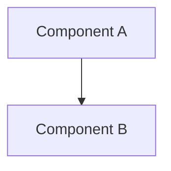

# Spec-Driven Development

Follow this workflow when building features:

## Workflow Phases

### 1. Requirements Phase
Create requirements document in `.omoi_os/requirements/{feature}.md`:

```markdown
# {Feature} Requirements

**Status**: Draft | Review | Approved
**Created**: {YYYY-MM-DD}

## Overview
{2-3 sentence description}

## Requirements

#### REQ-{DOMAIN}-{AREA}-001: {Title}
THE SYSTEM SHALL {normative requirement}.

## Data Model
{Pydantic models with field descriptions}

## API Endpoints
| Method | Path | Purpose | Request | Response |
|--------|------|---------|---------|----------|
```

### 2. Design Phase
Create design document in `.omoi_os/designs/{feature}.md`:

```markdown
# {Feature} Design

**Status**: Draft | Review | Approved
**Requirements**: {link to requirements}

## Architecture



## Component Responsibilities
| Component | Layer | Responsibilities |
|-----------|-------|------------------|

## Implementation Details
{Key algorithms, patterns, integration points}
```

### 3. Tickets Phase
Create tickets in `.omoi_os/tickets/TKT-{NUM}.md`:

```markdown
# TKT-{NUM}: {Title}

**Status**: backlog | building | testing | done
**Priority**: HIGH | MEDIUM | LOW
**Requirements**: REQ-XXX-YYY-001

## Acceptance Criteria
- [ ] {Criterion 1}
- [ ] {Criterion 2}

## Tasks
| Task ID | Description | Status |
|---------|-------------|--------|
| TSK-001 | {Task} | pending |
```

### 4. Tasks Phase
Create tasks in `.omoi_os/tasks/TSK-{NUM}.md`:

```markdown
# TSK-{NUM}: {Title}

**Status**: pending | in_progress | done
**Parent**: TKT-{NUM}

## Objective
{What this task accomplishes}

## Deliverables
- [ ] `{file1.py}` - {purpose}
- [ ] `{file2.py}` - {purpose}

## Acceptance Criteria
- [ ] All tests pass
- [ ] No linting errors
```

## Naming Conventions

- **Requirements**: `REQ-{DOMAIN}-{AREA}-{NUM}` (e.g., `REQ-AUTH-API-001`)
- **Tickets**: `TKT-{NUM}` or `TKT-{PREFIX}-{NUM}` (e.g., `TKT-AUTH-001`)
- **Tasks**: `TSK-{NUM}` (e.g., `TSK-001`)

## Directory Structure

```
.omoi_os/
├── requirements/    # REQ-XXX documents
├── designs/         # Design documents
├── tickets/         # TKT-XXX tickets
└── tasks/           # TSK-XXX tasks
```

## Best Practices

1. **Start with requirements** - Understand WHAT before HOW
2. **Design before code** - Architecture diagrams and data models first
3. **Small tickets** - Each ticket should be completable in 1-2 days
4. **Atomic tasks** - Each task should have one clear deliverable
5. **Traceability** - Always link tasks → tickets → requirements
