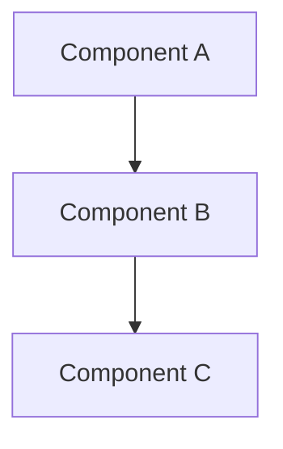

# Documentation Standards & Organization

**Created**: 2025-11-20
**Status**: Standard
**Purpose**: Define documentation structure, naming conventions, and organization rules

---

## 1. Documentation Organization Principles

### Directory Structure

```
docs/
├── README.md                        # Documentation index (auto-generated)
├── STANDARDS.md                     # This file
│
├── requirements/                    # Requirements (what to build)
│   ├── README.md                    # Requirements index
│   ├── auth_system.md               # REQ-AUTH-*
│   ├── multi_agent_orchestration.md # REQ-ORCH-*
│   │
│   ├── workflows/                   # Workflow requirements
│   │   ├── validation_system.md     # REQ-VAL-*
│   │   ├── task_queue_management.md # REQ-TQ-*
│   │   └── ticket_workflow.md       # REQ-TKT-*
│   │
│   ├── monitoring/                  # Monitoring requirements
│   │   ├── monitoring_architecture.md # REQ-MON-*
│   │   └── fault_tolerance.md       # REQ-FT-*
│   │
│   ├── memory/                      # Memory system requirements
│   │   └── memory_system.md         # REQ-MEM-*
│   │
│   ├── agents/                      # Agent requirements
│   │   └── lifecycle_management.md  # REQ-AGENT-*
│   │
│   └── integration/                 # Integration requirements
│       └── mcp_servers.md           # REQ-MCP-*
│
├── design/                          # Design Documents (how to build)
│   ├── README.md                    # Design index
│   ├── ARCHITECTURE.md              # System architecture overview
│   │
│   ├── core/                        # Core system designs
│   │   ├── multi_agent_orchestration.md
│   │   ├── workspace_isolation_system.md
│   │   └── task_queue_management.md
│   │
│   ├── services/                    # Service designs
│   │   ├── memory_system.md
│   │   ├── validation_system.md
│   │   ├── monitoring_architecture.md
│   │   └── auth_system_implementation.md
│   │
│   ├── workflows/                   # Workflow designs
│   │   ├── ticket_workflow.md
│   │   ├── result_submission.md
│   │   └── diagnosis_agent.md
│   │
│   ├── integration/                 # Integration designs
│   │   ├── mcp_server_integration.md
│   │   └── supabase_auth_integration_plan.md
│   │
│   ├── frontend/                    # Frontend designs
│   │   ├── architecture_shadcn_nextjs.md
│   │   ├── components_scaffold.md
│   │   ├── pages_scaffold.md
│   │   ├── react_query_and_websocket.md
│   │   └── zustand_middleware_reference.md
│   │
│   ├── testing/                     # Testing strategies
│   │   ├── test_organization_plan.md
│   │   ├── pytest_testmon_guide.md
│   │   └── testing_standards.md
│   │
│   └── configuration/               # Configuration designs
│       ├── configuration_architecture.md
│       └── config_migration_guide.md
│
├── implementation/                  # Implementation logs and status
│   ├── README.md                    # Implementation index
│   ├── phase1_complete.md           # Phase completion reports
│   ├── phase2_summary.md
│   └── migration_guides/            # Migration guides
│       └── async_sqlalchemy_migration_plan.md
│
├── operations/                      # Operational guides (runbooks)
│   ├── deployment_guide.md
│   ├── monitoring_runbook.md
│   └── incident_response.md
│
├── architecture/                    # Architecture Decision Records (ADRs)
│   ├── README.md                    # ADR index
│   ├── 001_use_postgresql_18.md
│   ├── 002_yaml_configuration.md
│   ├── 003_pytest_testmon.md
│   └── 004_zustand_state_management.md
│
└── archive/                         # Historical/completed docs
    ├── phase_summaries/
    │   ├── PHASE3_COMPLETE.md
    │   ├── PHASE4_PARALLEL_PLAN.md
    │   └── PHASE5_ALL_SQUADS_INTEGRATED.md
    │
    └── chat_logs/                   # Historical chat logs
        └── auth_system.md
```

---

## 2. Naming Conventions

### Document Filename Rules

#### Requirements Documents
```
Format: {feature}_{component}.md
Location: docs/requirements/{category}/

Examples:
✅ docs/requirements/auth_system.md
✅ docs/requirements/workflows/validation_system.md
✅ docs/requirements/monitoring/fault_tolerance.md

❌ docs/requirements/REQ-001-Auth.md (no codes in filename)
❌ docs/requirements/Auth-System-Requirements.md (no title case)
❌ docs/requirements/authsystem.md (use underscores)
```

#### Design Documents
```
Format: {feature}_{component}.md
Location: docs/design/{category}/

Examples:
✅ docs/design/core/multi_agent_orchestration.md
✅ docs/design/services/memory_system.md
✅ docs/design/frontend/components_scaffold.md

❌ docs/design/MultiAgentOrchestration.md (no camel case)
❌ docs/design/memory-system.md (use underscores, not hyphens)
❌ docs/design/MemorySystemDesign.md (no title case)
```

#### Implementation Logs
```
Format: {phase}_{milestone}.md OR {feature}_complete.md
Location: docs/implementation/

Examples:
✅ docs/implementation/phase1_complete.md
✅ docs/implementation/auth_system_deployed.md
✅ docs/implementation/migration_guides/async_sqlalchemy_migration_plan.md

❌ docs/AUTH_SYSTEM_COMPLETE.md (should be in implementation/)
❌ docs/Phase1Done.md (use underscores, lowercase)
```

#### Architecture Decision Records (ADRs)
```
Format: {number}_{decision_title}.md
Location: docs/architecture/

Examples:
✅ docs/architecture/001_use_postgresql_18.md
✅ docs/architecture/002_yaml_configuration.md
✅ docs/architecture/003_pytest_testmon.md

❌ docs/architecture/postgresql.md (no number prefix)
❌ docs/architecture/ADR-001-PostgreSQL.md (no ADR prefix)
```

#### Summary/Status Documents
```
Format: {FEATURE}_{TYPE}.md (UPPERCASE)
Location: docs/ (root only for major summaries)

Examples:
✅ docs/TESTING_AND_CONFIG_IMPROVEMENTS_SUMMARY.md
✅ docs/FRONTEND_UPDATES_SUMMARY.md
✅ docs/CONFIGURATION_ARCHITECTURE.md

Use sparingly - prefer categorized subdirectories
```

### Heading Structure

All documents must follow this hierarchy:

```markdown
# Document Title (H1) - Only ONE per document

## Major Section (H2)

### Subsection (H3)

#### Detail (H4)

**Bold for emphasis**, *italic for terms*
```

**Rules**:
- One H1 per document (the title)
- H2 for major sections
- H3 for subsections
- H4 for details
- Never skip levels (H1 → H3 is wrong)

### Document Metadata

Every document must start with metadata:

```markdown
# Document Title

**Created**: 2025-11-20
**Updated**: 2025-11-21
**Status**: Draft | Review | Active | Archived
**Authors**: @username
**Reviewers**: @username
**Related**: [Link to related docs]
**Purpose**: One-sentence description

---

## Content starts here...
```

---

## 3. Document Types & Templates

### Requirements Document Template

```markdown
# {Feature Name} Requirements

**Created**: YYYY-MM-DD
**Status**: Draft | Review | Approved
**Purpose**: Define requirements for {feature}
**Requirement IDs**: REQ-{PREFIX}-001 through REQ-{PREFIX}-999

---

## Overview

Brief description of the feature and its purpose.

## Functional Requirements

### REQ-{PREFIX}-001: {Requirement Title}
- **Category**: Core | Optional | Enhancement
- **Priority**: Critical | High | Medium | Low
- **Description**: What the system must do
- **Acceptance Criteria**:
  - [ ] Criterion 1
  - [ ] Criterion 2
- **Dependencies**: REQ-{PREFIX}-002
- **Related**: Link to design docs

### REQ-{PREFIX}-002: {Another Requirement}
...

## Non-Functional Requirements

### Performance
- Response time requirements
- Throughput requirements

### Security
- Authentication requirements
- Authorization requirements

### Scalability
- Load requirements
- Growth projections

## Constraints

- Technical constraints
- Business constraints
- Timeline constraints

## Out of Scope

- What this feature explicitly does NOT cover

---

**Total Requirements**: {count}
**Critical**: {count} | **High**: {count} | **Medium**: {count} | **Low**: {count}
```

### Design Document Template

```markdown
# {Feature Name} Design

**Created**: YYYY-MM-DD
**Status**: Draft | Review | Approved | Implemented
**Purpose**: Design for {feature}
**Requirements**: REQ-{PREFIX}-* from [requirements doc]
**Related Design**: [Link to related designs]

---

## Overview

High-level summary of the design approach.

## Architecture

### System Context



### Component Responsibilities

| Component | Responsibility | Technology |
|-----------|---------------|------------|
| Component A | Does X | Python/FastAPI |
| Component B | Does Y | PostgreSQL |

## Detailed Design

### Component A

**Purpose**: What it does
**Inputs**: What it receives
**Outputs**: What it produces
**Dependencies**: What it needs

#### Class Structure

```python
class ComponentA:
    def method_a(self) -> ReturnType:
        """Docstring"""
        pass
```

#### Data Models

```python
class DataModel(BaseModel):
    field: str
```

## API Specifications

### Endpoint: POST /api/v1/resource

**Request**:
```json
{
  "field": "value"
}
```

**Response**:
```json
{
  "id": "uuid",
  "status": "success"
}
```

## Configuration

### YAML Configuration

```yaml
# config/base.yaml
feature:
  setting: value
```

### Environment Variables

```bash
# .env (secrets only)
FEATURE_API_KEY=secret
```

## Database Schema

```sql
CREATE TABLE table_name (
    id UUID PRIMARY KEY,
    ...
);
```

## Testing Strategy

### Unit Tests
- Test component A
- Test component B

### Integration Tests
- Test A + B integration

### E2E Tests
- Complete workflow

## Performance Considerations

- Caching strategy
- Query optimization
- Scaling approach

## Security Considerations

- Authentication
- Authorization
- Data protection

## Migration Path

1. Phase 1: ...
2. Phase 2: ...

## Alternatives Considered

### Alternative 1
- Pros
- Cons
- Why rejected

## References

- [Requirement Doc](link)
- [Related Design](link)
- [External Reference](link)

---

**Implementation Status**: Not Started | In Progress | Complete
**Last Review**: YYYY-MM-DD
```

### Architecture Decision Record (ADR) Template

```markdown
# ADR-{number}: {Decision Title}

**Date**: 2025-11-20
**Status**: Proposed | Accepted | Deprecated | Superseded
**Deciders**: @username1, @username2
**Context**: What prompted this decision

---

## Context and Problem Statement

What is the problem we're trying to solve?

## Decision Drivers

- Driver 1
- Driver 2
- Driver 3

## Considered Options

1. Option A
2. Option B
3. Option C

## Decision Outcome

**Chosen option**: Option B

**Justification**: Why we chose this

### Positive Consequences

- Pro 1
- Pro 2

### Negative Consequences

- Con 1
- Con 2

## Pros and Cons of the Options

### Option A

**Pros**:
- Pro 1
- Pro 2

**Cons**:
- Con 1
- Con 2

### Option B (Chosen)

**Pros**:
- Pro 1
- Pro 2

**Cons**:
- Con 1
- Con 2

### Option C

**Pros**:
- Pro 1

**Cons**:
- Con 1
- Con 2

## Links

- [Requirement](link)
- [Design Doc](link)
- [External Reference](link)

---

**Review Date**: 6 months from decision
```

---

## 4. Documentation Lifecycle

### States

| State | Meaning | Action Required |
|-------|---------|-----------------|
| **Draft** | Work in progress | Review and feedback |
| **Review** | Ready for review | Approve or request changes |
| **Approved** | Finalized | Can implement |
| **Active** | Currently relevant | Keep updated |
| **Implemented** | Code complete | Archive when superseded |
| **Archived** | Historical | Move to archive/ |
| **Deprecated** | No longer valid | Update references |

### Transitions

```
Draft → Review → Approved → Active → Implemented → Archived
                              ↓
                         Deprecated
```

### Document Retirement

When a document becomes obsolete:

1. Update status to **Deprecated** or **Archived**
2. Add deprecation notice at top:
   ```markdown
   > **⚠️ DEPRECATED**: This document is no longer active.
   > **Superseded by**: [New Document](link)
   > **Archived**: 2025-11-20
   ```
3. Move to `docs/archive/{category}/`
4. Update all references

---

## 5. Documentation Rules

### DO ✅

1. **Use snake_case** for all filenames
   - `memory_system.md` ✅
   - `auth_system_implementation.md` ✅

2. **Categorize by purpose**, not by phase
   - `docs/requirements/` (what)
   - `docs/design/` (how)
   - `docs/implementation/` (status)
   - `docs/architecture/` (decisions)

3. **Include metadata** at document start
   - Created date
   - Status
   - Purpose

4. **Link related documents**
   - Requirements ↔ Design
   - Design ↔ Implementation
   - Design ↔ ADRs

5. **Keep docs DRY** (Don't Repeat Yourself)
   - Single source of truth
   - Link instead of duplicate

6. **Use consistent heading hierarchy**
   - One H1 (title)
   - Logical H2/H3/H4 structure

7. **Include code examples**
   - With syntax highlighting
   - With comments
   - Runnable when possible

### DON'T ❌

1. **No Title Case filenames**
   - ❌ `AuthSystemImplementation.md`
   - ✅ `auth_system_implementation.md`

2. **No hyphens in filenames**
   - ❌ `auth-system-implementation.md`
   - ✅ `auth_system_implementation.md`

3. **No version numbers in filenames**
   - ❌ `auth_system_v2.md`
   - ✅ `auth_system.md` (update in place, use git history)

4. **No ALL_CAPS except summaries**
   - ❌ `AUTHENTICATION.md`
   - ✅ `authentication.md`
   - ✅ `AUTH_SYSTEM_SUMMARY.md` (summary exception)

5. **No orphaned docs** in root
   - ❌ `docs/auth_notes.md`
   - ✅ `docs/design/services/auth_system.md`

6. **No duplicate information**
   - Link to canonical source
   - Don't copy-paste between docs

7. **No incomplete documents** left in main dirs
   - Move WIP to `docs/drafts/`
   - Or mark status as Draft

---

## 6. Automatic Organization Tools

### generate_doc_index.py

```python
#!/usr/bin/env python3
"""Generate documentation index (README.md) from directory structure."""

from pathlib import Path
from datetime import datetime

def generate_index(docs_dir: Path = Path("docs")) -> str:
    """Generate markdown index of all documentation."""
    
    lines = [
        "# OmoiOS Documentation Index",
        "",
        f"**Generated**: {datetime.now().strftime('%Y-%m-%d %H:%M')}",
        f"**Auto-generated**: Run `python scripts/generate_doc_index.py` to update",
        "",
        "---",
        "",
    ]
    
    # Requirements
    lines.append("## Requirements")
    lines.append("")
    for file in sorted((docs_dir / "requirements").rglob("*.md")):
        if file.name != "README.md":
            rel_path = file.relative_to(docs_dir)
            title = file.stem.replace("_", " ").title()
            lines.append(f"- [{title}]({rel_path})")
    lines.append("")
    
    # Design
    lines.append("## Design Documents")
    lines.append("")
    for file in sorted((docs_dir / "design").rglob("*.md")):
        if file.name != "README.md":
            rel_path = file.relative_to(docs_dir)
            title = file.stem.replace("_", " ").title()
            lines.append(f"- [{title}]({rel_path})")
    lines.append("")
    
    # Architecture
    if (docs_dir / "architecture").exists():
        lines.append("## Architecture Decision Records")
        lines.append("")
        for file in sorted((docs_dir / "architecture").glob("*.md")):
            if file.name != "README.md":
                rel_path = file.relative_to(docs_dir)
                title = file.stem
                lines.append(f"- [{title}]({rel_path})")
        lines.append("")
    
    return "\n".join(lines)


if __name__ == "__main__":
    index_content = generate_index()
    Path("docs/README.md").write_text(index_content)
    print("✅ Generated docs/README.md")
```

### validate_docs.py

```python
#!/usr/bin/env python3
"""Validate documentation structure and naming conventions."""

import re
from pathlib import Path
from typing import List, Tuple

def validate_filename(file: Path) -> List[str]:
    """Check if filename follows conventions."""
    errors = []
    name = file.stem
    
    # Check for camelCase or TitleCase
    if re.search(r'[A-Z]', name) and not name.isupper():
        errors.append(f"❌ {file}: Use snake_case, not CamelCase or TitleCase")
    
    # Check for hyphens
    if '-' in name and not name.isupper():
        errors.append(f"❌ {file}: Use underscores, not hyphens")
    
    # Check for spaces
    if ' ' in name:
        errors.append(f"❌ {file}: No spaces in filenames")
    
    return errors


def validate_metadata(file: Path) -> List[str]:
    """Check if document has required metadata."""
    errors = []
    content = file.read_text()
    lines = content.split('\n')[:10]  # First 10 lines
    
    required = ['**Created**:', '**Status**:', '**Purpose**:']
    for req in required:
        if not any(req in line for line in lines):
            errors.append(f"⚠️  {file}: Missing metadata '{req}'")
    
    return errors


def validate_heading_hierarchy(file: Path) -> List[str]:
    """Check heading hierarchy."""
    errors = []
    content = file.read_text()
    lines = content.split('\n')
    
    h1_count = sum(1 for line in lines if line.startswith('# ') and not line.startswith('## '))
    
    if h1_count == 0:
        errors.append(f"❌ {file}: No H1 heading")
    elif h1_count > 1:
        errors.append(f"❌ {file}: Multiple H1 headings (should be only one)")
    
    return errors


def main():
    """Run all validations."""
    docs_dir = Path("docs")
    all_errors = []
    
    for md_file in docs_dir.rglob("*.md"):
        if "archive" in md_file.parts:
            continue  # Skip archived docs
        
        errors = []
        errors.extend(validate_filename(md_file))
        errors.extend(validate_metadata(md_file))
        errors.extend(validate_heading_hierarchy(md_file))
        
        all_errors.extend(errors)
    
    if all_errors:
        print("\n".join(all_errors))
        print(f"\n❌ Found {len(all_errors)} issues")
        return 1
    else:
        print("✅ All documentation files valid")
        return 0


if __name__ == "__main__":
    exit(main())
```

---

## 7. Configuration Organization

### config/ Directory Structure

```
config/
├── base.yaml                        # REQUIRED: Base settings
├── local.yaml                       # Local dev overrides
├── staging.yaml                     # Staging overrides
├── production.yaml                  # Production overrides
├── test.yaml                        # Test overrides
│
├── alert_rules/                     # Alert configurations
│   ├── {alert_type}.yaml
│   └── README.md
│
├── watchdog_policies/               # Guardian policies
│   ├── {policy_name}.yaml
│   └── README.md
│
├── phases/                          # Phase definitions
│   ├── phase_gates.yaml
│   ├── phase_transitions.yaml
│   └── README.md
│
├── task_scoring/                    # Scoring algorithms
│   ├── priority_weights.yaml
│   ├── sla_thresholds.yaml
│   └── README.md
│
└── features/                        # Feature flags
    ├── experimental.yaml
    ├── rollout.yaml
    └── README.md
```

### Naming Rules for Configuration

```yaml
# ✅ GOOD: Descriptive, categorized
config/alert_rules/agent_health_alert.yaml
config/watchdog_policies/monitor_failover_policy.yaml
config/phases/phase_gate_requirements.yaml

# ❌ BAD: Generic, flat
config/alert1.yaml
config/policy.yaml
config/config.yaml
```

---

## 8. Quick Reference

### Creating New Docs

```bash
# Requirements doc
touch docs/requirements/workflows/{feature}_requirements.md

# Design doc
touch docs/design/services/{feature}_design.md

# ADR
touch docs/architecture/$(printf "%03d" $(($(ls docs/architecture/*.md 2>/dev/null | wc -l) + 1)))_{decision_title}.md

# Implementation log
touch docs/implementation/{feature}_complete.md
```

### Organizing Existing Docs

```bash
# Move to correct location
mv docs/AUTH_SYSTEM_COMPLETE.md docs/implementation/auth_system_complete.md

# Rename to follow conventions
mv docs/MemorySystem.md docs/design/services/memory_system.md

# Archive old docs
mkdir -p docs/archive/phase5
mv docs/PHASE5_*.md docs/archive/phase5/
```

---

## 9. Maintenance

### Weekly
- Run `validate_docs.py` to check compliance
- Update index with `generate_doc_index.py`
- Review and archive completed docs

### Monthly
- Review document statuses
- Archive implemented features
- Update cross-references
- Clean up drafts

### Per Release
- Archive phase completion docs
- Update architecture docs
- Create release summary

---

This provides a comprehensive, maintainable documentation system with clear rules and automated tooling.

