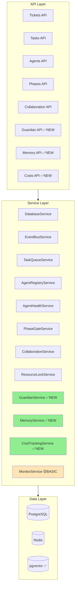
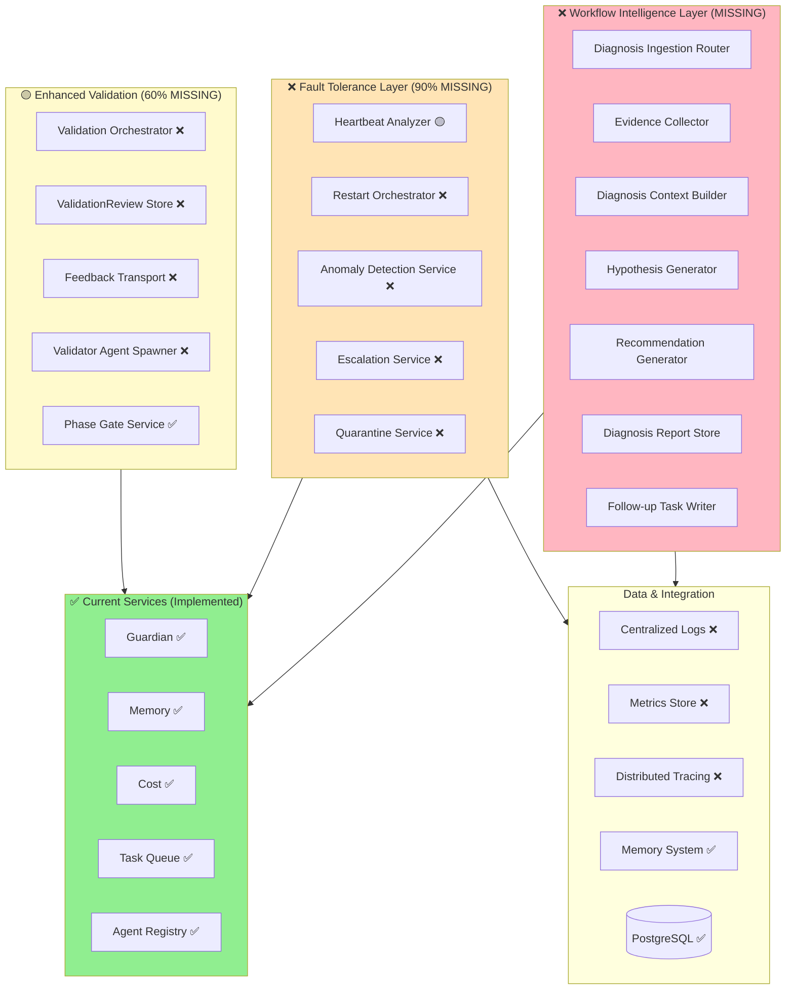

# Architecture Comparison: Current vs. Design Specification

**Created**: 2025-11-20
**Status**: Active
**Purpose**: Visual comparison of the current implemented architecture against the target design to identify gaps and guide future work.
**Related**: docs/design/target_architecture.md, docs/implementation/current_architecture.md, docs/adr/001_adopt_workflow_intelligence_layer.md, docs/monitoring/monitoring_strategy.md, docs/services/guardian_service.md, docs/services/memory_service.md, docs/services/cost_tracking_service.md

---


**Visual guide to understand implementation gaps**

---

## Current Architecture (Phase 3-5 Implemented)



**Legend:**
- ✅ **Green** = Phase 5 newly implemented
- 🟡 **Yellow** = Partially implemented
- No color = Phase 3 foundation

---

## Target Architecture (From Design Docs)



**Legend:**
- ✅ = Implemented
- 🟡 = Partially implemented
- ❌ = Not implemented

---

## Gap Visualization by System

### Guardian + Monitoring Stack

```
Design Specification                Current Implementation
┌─────────────────────┐            ┌─────────────────────┐
│  GUARDIAN LAYER     │            │  GUARDIAN LAYER     │
│  (Authority 4-5)    │            │  (Authority 4-5)    │
├─────────────────────┤            ├─────────────────────┤
│ • Emergency cancel  │ ────✅──→  │ • Emergency cancel  │
│ • Capacity realloc  │ ────✅──→  │ • Capacity realloc  │
│ • Priority override │ ────✅──→  │ • Priority override │
│ • Rollback          │ ────✅──→  │ • Rollback          │
└─────────────────────┘            └─────────────────────┘
         ↓                                  ↓
┌─────────────────────┐            ┌─────────────────────┐
│  DIAGNOSTIC LAYER   │            │  DIAGNOSTIC LAYER   │
│  (Workflow Doctor)  │            │                     │
├─────────────────────┤            ├─────────────────────┤
│ • Stuck detection   │ ────❌──→  │  NOT IMPLEMENTED    │
│ • Evidence collect  │ ────❌──→  │                     │
│ • Hypothesis gen    │ ────❌──→  │                     │
│ • Recovery tasks    │ ────❌──→  │                     │
└─────────────────────┘            └─────────────────────┘
         ↓                                  ↓
┌─────────────────────┐            ┌─────────────────────┐
│  FAULT TOLERANCE    │            │  FAULT TOLERANCE    │
├─────────────────────┤            ├─────────────────────┤
│ • Heartbeat (full)  │ ────🟡──→  │ • Basic heartbeats  │
│ • Auto-restart      │ ────❌──→  │  NOT IMPLEMENTED    │
│ • Anomaly detect    │ ────❌──→  │ • Model exists only │
│ • Escalation        │ ────❌──→  │  NOT IMPLEMENTED    │
│ • Quarantine        │ ────❌──→  │  NOT IMPLEMENTED    │
└─────────────────────┘            └─────────────────────┘
         ↓                                  ↓
┌─────────────────────┐            ┌─────────────────────┐
│  MONITOR LAYER      │            │  MONITOR LAYER      │
│  (Authority 3)      │            │  (Authority 3)      │
├─────────────────────┤            ├─────────────────────┤
│ • Metrics collect   │ ────🟡──→  │ • Task metrics      │
│ • Anomaly scoring   │ ────❌──→  │  NOT IMPLEMENTED    │
│ • Alert rules       │ ────❌──→  │ • Alert model only  │
└─────────────────────┘            └─────────────────────┘
```

---

### Validation + Result Stack

```
Design Specification                Current Implementation
┌─────────────────────┐            ┌─────────────────────┐
│ WORKFLOW RESULT     │            │ WORKFLOW RESULT     │
│ VALIDATION          │            │ VALIDATION          │
├─────────────────────┤            ├─────────────────────┤
│ • Result submission │ ────❌──→  │  NOT IMPLEMENTED    │
│ • Validator spawn   │ ────❌──→  │                     │
│ • Pass/fail decision│ ────❌──→  │                     │
│ • Auto-termination  │ ────❌──→  │                     │
│ • Version tracking  │ ────❌──→  │                     │
└─────────────────────┘            └─────────────────────┘
         ↓                                  ↓
┌─────────────────────┐            ┌─────────────────────┐
│ VALIDATION          │            │ VALIDATION          │
│ ORCHESTRATION       │            │ ORCHESTRATION       │
├─────────────────────┤            ├─────────────────────┤
│ • Review iterations │ ────❌──→  │  NOT IMPLEMENTED    │
│ • Feedback delivery │ ────❌──→  │                     │
│ • Failure threshold │ ────❌──→  │                     │
│ • Diagnosis trigger │ ────❌──→  │                     │
│ • Git commits       │ ────❌──→  │                     │
└─────────────────────┘            └─────────────────────┘
         ↓                                  ↓
┌─────────────────────┐            ┌─────────────────────┐
│ PHASE GATE          │            │ PHASE GATE          │
│ VALIDATION          │            │ VALIDATION          │
├─────────────────────┤            ├─────────────────────┤
│ • Gate requirements │ ────✅──→  │ • Gate requirements │
│ • Artifact collect  │ ────✅──→  │ • Artifact collect  │
│ • Pass/fail         │ ────✅──→  │ • Pass/fail         │
│ • Phase transition  │ ────✅──→  │ • Phase transition  │
└─────────────────────┘            └─────────────────────┘
```

---

## Feature Completeness Matrix

| Feature Category | Subsystem | Design | Current | Gap % |
|------------------|-----------|--------|---------|-------|
| **Emergency Intervention** | Guardian | Full system | ✅ Full | 0% |
| **Pattern Learning** | Memory | Full system | ✅ Full | 0% |
| **Cost Management** | Cost Tracking | Full system | 🔄 95% | 5% |
| **Quality Prediction** | Quality Gates | ML-based | ⏳ Pending | 100% |
| **Workflow Self-Healing** | Diagnostic | Full system | ❌ None | 100% |
| **Result Validation** | Result Submission | Versioned system | ❌ None | 100% |
| **Advanced Validation** | Validation Orchestrator | Iterations + feedback | 🟡 Basic | 70% |
| **Heartbeat Monitoring** | Fault Tolerance | Bidirectional | 🟡 Basic | 70% |
| **Auto-Restart** | Fault Tolerance | Full orchestration | ❌ None | 100% |
| **Anomaly Detection** | Fault Tolerance | ML-based | 🟡 Models | 90% |
| **Escalation** | Fault Tolerance | SEV mapping + notify | ❌ None | 100% |
| **Quarantine** | Fault Tolerance | Forensics + isolation | ❌ None | 100% |

**Overall Completion:** 
- **Phase 3-5 Features:** 95% ✅
- **Diagnostic + Fault Tolerance:** 10% ❌
- **Total Design Spec:** 30% 🟡

---

## What Makes the Design "Advanced"?

The design documents describe a **Level 4 autonomous system**:

**Level 1** — Basic orchestration (task queue, assignment)  
**Level 2** — Collaborative agents (messaging, locking) ← **WE ARE HERE**  
**Level 3** — Self-monitoring (health, metrics, alerts)  
**Level 4** — Self-healing (diagnostics, auto-recovery) ← **DESIGN SPEC**  
**Level 5** — Self-improving (ML-based optimization)

We've built a **solid Level 2-3 system**. The design docs describe Level 4.

---

## Why the Gap Exists

1. **Phase Scope Creep:** Original Phase 5 was Guardian + Memory + Cost + Quality
2. **Design Docs Written After:** The comprehensive design docs reference systems not in original roadmap
3. **Incremental Development:** We're building foundation first (correct approach!)
4. **Massive Scope:** Full design is 150-200 hours of work

---

## Recommended Path Forward

### Option A: Stay the Course (Recommended)

✅ **Finish Phase 5 as planned:**
- Complete Cost Squad
- Complete Quality Squad
- Merge all Phase 5 features
- Celebrate 🎉

📋 **Plan Phase 6:**
- Focus on Diagnostic Agent System
- Add WorkflowResult tracking
- Build on Phase 5 foundation

🚀 **Plan Phase 7:**
- Full Fault Tolerance
- Production hardening
- Advanced ML features

**Timeline:** Phase 5 (1 week) → Phase 6 (1 month) → Phase 7 (2-3 months)

---

### Option B: Pivot to Diagnostic Now (High Risk)

⚠️ **Warning:** Would require:
- Abandoning Quality Squad temporarily
- 2-3 weeks additional work
- Risk of incomplete features
- Coordination challenges with parallel contexts

**Not recommended** — Too much scope change mid-phase.

---

## Conclusion

**How far off are we?**
- **From Phase 5 goals:** 75% complete (waiting on other contexts)
- **From full design spec:** 25-30% complete

**Are we missing anything CRITICAL?**
- **For Phase 5:** No — we're on track!
- **For production system:** Yes — Diagnostic Agent is critical for autonomy

**What to do?**
1. ✅ Complete Phase 5 (Guardian ✅, Memory ✅, Cost, Quality)
2. 📋 Document Phase 6 scope (Diagnostic + Workflow Intelligence)
3. 🚀 Build incrementally toward the full vision

**Bottom line:** We have an **excellent foundation**. The design docs represent the **north star**, not the immediate goal. Keep building incrementally!

