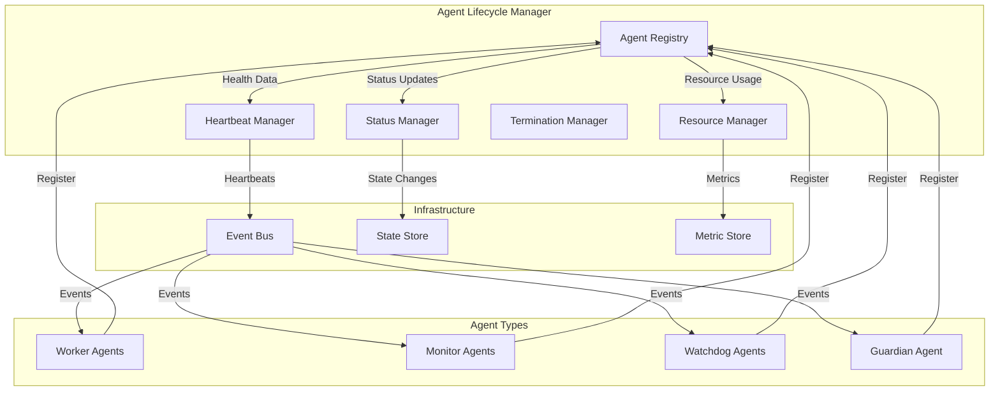
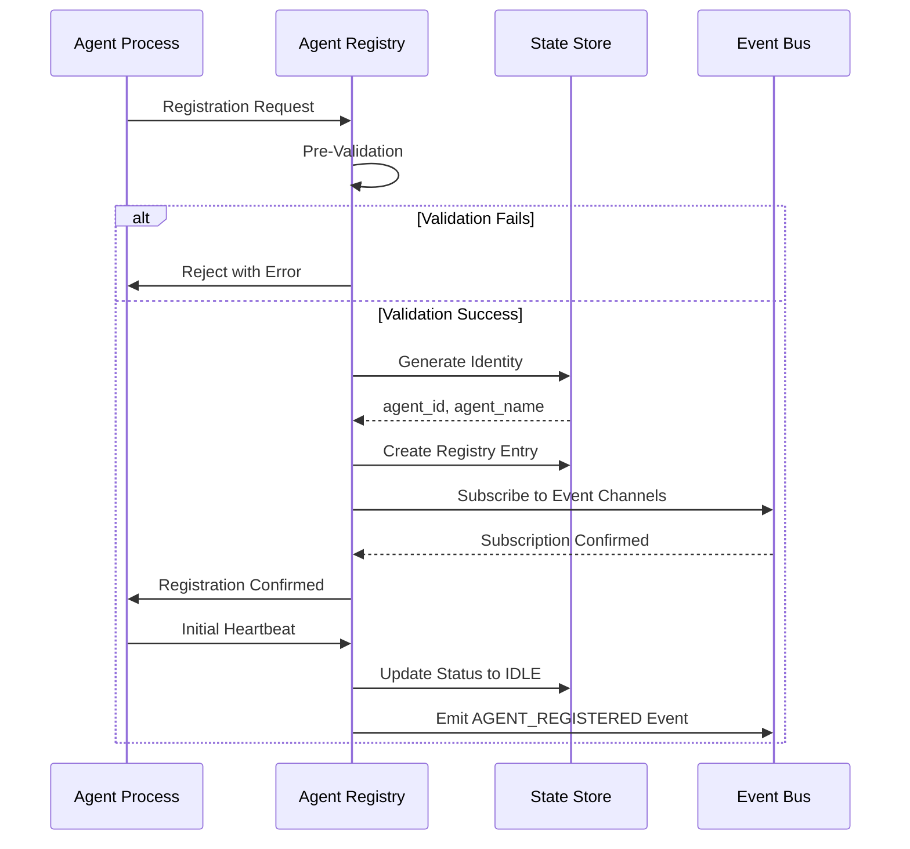

# Agent Lifecycle Management Design Document

**Created**: 2025-11-20
**Status**: Draft
**Related**: ../requirements/agents/lifecycle_management.md, ./multi_agent_orchestration.md, ./task_queue_management.md, ./monitoring_architecture.md, ./fault_tolerance.md

---


## Document Overview

This design document specifies the architecture, components, protocols, and implementation patterns for managing the complete lifecycle of agents within the multi-agent orchestration system. It covers agent registration, heartbeat protocols, status transitions, resource allocation, termination procedures, and resurrection mechanisms.

**Purpose**: Provide a comprehensive design for agent lifecycle management that ensures reliable agent registration, monitoring, health checking, graceful termination, and recovery.

**Target Audience**: AI spec agents (Kiro, Cursor, Cline), implementation teams, system architects, DevOps engineers

**Related Documents**:
- [Requirements Document](../requirements/agents/lifecycle_management.md) - Source of truth for all requirements
- [Multi-Agent Orchestration Design](./multi_agent_orchestration.md) - Agent layer patterns and architecture
- [Task Queue Management Design](./task_queue_management.md) - Task assignment and agent interaction
- [Monitoring Architecture Design](./monitoring_architecture.md) - Health monitoring and anomaly detection
- [Fault Tolerance Design](./fault_tolerance.md) - Failure detection and recovery procedures

---

## Architecture Overview

### High-Level Architecture

The Agent Lifecycle Management system consists of several key components that work together to manage agent registration, health monitoring, status transitions, and lifecycle events.



### Component Responsibilities

| Component | Primary Responsibility | Key Functions |
|-----------|----------------------|---------------|
| Agent Registry | Agent registration and identity management | Pre-validation, identity assignment, capability tracking |
| Heartbeat Manager | Bidirectional heartbeat protocol | Heartbeat processing, missed heartbeat detection, acknowledgment |
| Status Manager | Agent status state machine | Status transitions, validation, event emission |
| Resource Manager | Resource allocation and monitoring | Budget enforcement, usage tracking, quota management |
| Termination Manager | Graceful shutdown and cleanup | Pre-termination actions, state preservation, resource release |
| Resurrection Manager | Agent recovery and state reconstruction | State restoration, task continuity, identity preservation |

### System Boundaries

- **Input Boundaries**: Agent spawn requests, heartbeat messages, status change requests, termination signals
- **Output Boundaries**: Registration confirmations, status change events, resource warnings, termination notifications
- **Integration Points**: Event Bus (publish/subscribe), State Store (persistence), Metric Store (monitoring), Task Queue (assignment coordination)

---

## Component Details

### Agent Registry

The Agent Registry is responsible for the complete registration protocol, including pre-validation, identity assignment, capability tracking, and event bus subscription.

#### Registration Protocol Flow



#### Pre-Registration Validation

Before an agent is registered, the system performs several validation checks:

1. **Binary Integrity Verification**: Validate agent binary checksum against expected hash
2. **Version Compatibility Check**: Ensure agent version is compatible with orchestrator version
3. **Configuration Schema Validation**: Verify agent configuration matches required schema
4. **Resource Availability Check**: Confirm sufficient resources available for agent requirements

```python
class AgentRegistry:
    """Manages agent registration and lifecycle tracking."""
    
    async def register_agent(
        self,
        agent_type: AgentType,
        capabilities: Dict[str, Any],
        resource_requirements: ResourceRequirements,
        config: Dict[str, Any]
    ) -> AgentRegistration:
        """Execute complete registration protocol."""
        
        # Step 1: Pre-Registration Validation
        validation_result = await self._pre_validate(
            agent_type=agent_type,
            capabilities=capabilities,
            resource_requirements=resource_requirements,
            config=config
        )
        
        if not validation_result.success:
            raise RegistrationRejectedError(
                reason=validation_result.reason,
                details=validation_result.details
            )
        
        # Step 2: Identity Assignment
        agent_id = await self._generate_agent_id()
        agent_name = await self._generate_agent_name(agent_type)
        crypto_identity = await self._generate_crypto_identity(agent_id)
        
        # Step 3: Registry Entry Creation
        registry_entry = await self._create_registry_entry(
            agent_id=agent_id,
            agent_name=agent_name,
            agent_type=agent_type,
            capabilities=capabilities,
            resource_allocation=await self._allocate_resources(resource_requirements),
            crypto_identity=crypto_identity,
            config=config
        )
        
        # Step 4: Event Bus Subscription
        await self._subscribe_to_event_bus(
            agent_id=agent_id,
            agent_type=agent_type,
            phase_id=capabilities.get('phase_id')
        )
        
        # Step 5: Initial Status
        await self._transition_status(agent_id, StatusEnum.INITIALIZING, StatusEnum.IDLE)
        
        return AgentRegistration(
            agent_id=agent_id,
            agent_name=agent_name,
            registry_entry=registry_entry,
            crypto_identity=crypto_identity
        )
```

#### Identity Assignment

Each agent receives:
- **agent_id**: UUID v4 for unique identification
- **agent_name**: Human-readable name following pattern `{type}-{phase}-{sequence}`
- **crypto_identity**: Cryptographic key pair for secure communication

```python
async def _generate_agent_name(self, agent_type: AgentType) -> str:
    """Generate human-readable agent name."""
    if agent_type == AgentType.WORKER:
        phase = self.capabilities.get('phase_id', 'general')
        sequence = await self._get_next_sequence_number(agent_type, phase)
        return f"worker-{phase.lower()}-{sequence:03d}"
    elif agent_type == AgentType.MONITOR:
        sequence = await self._get_next_sequence_number(agent_type)
        return f"monitor-{sequence:03d}"
    elif agent_type == AgentType.WATCHDOG:
        sequence = await self._get_next_sequence_number(agent_type)
        return f"watchdog-{sequence:03d}"
    elif agent_type == AgentType.GUARDIAN:
        return "guardian-primary"  # Singleton pattern
```

#### Registry Entry Structure

```python
@dataclass
class AgentRegistryEntry:
    agent_id: str  # UUID v4
    agent_name: str
    agent_type: AgentType
    phase_id: Optional[str]  # For worker agents
    status: StatusEnum
    capabilities: Dict[str, Any]
    resource_allocation: ResourceAllocation
    heartbeat_timestamp: Optional[datetime]
    anomaly_score: float = 0.0
    restart_count: int = 0
    created_at: datetime
    registered_by: str
    metadata: Dict[str, Any]
```

---

## Agent Types and Classifications

### Worker Agents

Worker agents execute domain-specific tasks within the workflow pipeline. Each worker agent has a single phase specialization.

#### Phase Specializations

| Phase ID | Description | Capabilities |
|----------|-------------|--------------|
| PHASE_REQUIREMENTS | Requirements analysis and decomposition | Requirement analysis, decomposition, clarification |
| PHASE_IMPLEMENTATION | Code generation and modification | Code generation, refactoring, bug fixing |
| PHASE_VALIDATION | Output verification and acceptance testing | Code review, acceptance testing, security scanning |
| PHASE_ANALYSIS | Investigation and root cause analysis | Log analysis, metric analysis, hypothesis generation |
| PHASE_TESTING | Comprehensive test execution | Unit testing, integration testing, E2E testing |

#### Capability Declaration

Worker agents must declare their capabilities during registration:

```python
{
    "supported_languages": ["python", "typescript", "javascript"],
    "framework_expertise": ["fastapi", "react", "next.js"],
    "tool_proficiencies": [
        "context7:search",
        "github:read_file",
        "github:write_file"
    ],
    "domain_knowledge": ["web_development", "api_design"],
    "max_concurrent_tasks": 3
}
```

#### Resource Budgets

Worker agents have configurable resource budgets:

| Resource | Minimum | Maximum | Default | Enforcement |
|----------|---------|---------|---------|-------------|
| CPU | 250m | 2000m | 500m | Container limits |
| Memory | 256Mi | 4Gi | 512Mi | Container limits |
| Network | Rate-limited | - | 10MB/s | Rate limiter |
| Disk I/O | Quota-limited | - | 100MB | Quota manager |
| Token Budget | - | Configurable | 100k | Task-level limit |

```python
@dataclass
class ResourceBudget:
    cpu_min_millicores: int = 250
    cpu_max_millicores: int = 2000
    memory_min_mb: int = 256
    memory_max_mb: int = 4096
    network_rate_limit_mbps: float = 10.0
    disk_quota_mb: int = 100
    token_budget_per_task: int = 100000
```

### Monitor Agents

Monitor agents provide continuous health surveillance for assigned worker agents.

#### Monitor-to-Worker Ratio

The system maintains a configurable ratio of monitors to workers (default: 1:10). This ratio is enforced automatically:

```python
class MonitorAssignmentManager:
    """Manages monitor-to-worker assignment ratios."""
    
    async def ensure_proper_ratio(self) -> None:
        """Ensure monitor-to-worker ratio is maintained."""
        worker_count = await self._count_active_workers()
        monitor_count = await self._count_active_monitors()
        target_ratio = config.MONITOR_TO_WORKER_RATIO
        
        required_monitors = math.ceil(worker_count / target_ratio)
        
        if monitor_count < required_monitors:
            await self._spawn_additional_monitors(
                count=required_monitors - monitor_count
            )
        elif monitor_count > required_monitors:
            await self._rebalance_monitor_assignments()
    
    async def assign_workers_to_monitor(
        self,
        monitor_id: str
    ) -> List[str]:
        """Assign workers to monitor (max 15 per monitor)."""
        unassigned_workers = await self._get_unassigned_workers()
        current_assignments = await self._get_monitor_assignments(monitor_id)
        
        max_per_monitor = config.MAX_WORKERS_PER_MONITOR  # 15
        
        remaining_capacity = max_per_monitor - len(current_assignments)
        new_assignments = unassigned_workers[:remaining_capacity]
        
        await self._assign_workers(monitor_id, new_assignments)
        return new_assignments
```

#### Monitor Specialization

Monitors can be specialized per agent type with custom thresholds:

```python
@dataclass
class MonitorConfiguration:
    agent_type: AgentType
    anomaly_threshold: float  # Custom per type
    health_metrics: List[str]  # Type-specific metrics
    restart_strategy: RestartStrategy  # Type-specific strategy
    escalation_policy: EscalationPolicy  # Type-specific policy
```

### Watchdog Agents

Watchdog agents provide meta-level monitoring of the monitoring infrastructure itself.

#### Independence Requirements

Watchdogs must operate independently from monitors:

- **Separate Infrastructure**: Different nodes/containers (Kubernetes anti-affinity)
- **Independent Network Paths**: Different routes to event bus
- **Isolated Resource Pools**: Separate CPU/memory allocation
- **Minimal Shared Dependencies**: Only share event bus and state store

#### Watchdog Heartbeat Protocol

Watchdogs use a faster heartbeat mechanism than workers:

| Metric | Worker Agent | Watchdog Agent |
|--------|--------------|----------------|
| Heartbeat Frequency | 30s (IDLE), 15s (RUNNING) | 5s |
| TTL Threshold | 30s (IDLE), 15s (RUNNING) | 15s |
| Detection Time | 30-45s | 20s |
| Escalation Time | 60s | 5s |

```python
class WatchdogAgent:
    """Meta-monitor for monitor agents."""
    
    async def monitor_monitor_agents(self) -> None:
        """Monitor monitor agents with fast heartbeat."""
        while True:
            monitor_agents = await self._get_all_monitor_agents()
            
            for monitor_id in monitor_agents:
                health = await self._check_monitor_health(monitor_id)
                
                if health.is_unresponsive:
                    # Fast detection (20s threshold)
                    await self._escalate_to_guardian(monitor_id)
                
                # Cross-validate with peer watchdogs
                peer_consensus = await self._check_peer_consensus(monitor_id)
                if not peer_consensus:
                    continue  # Prevent false positives
            
            await asyncio.sleep(5)  # Check every 5 seconds
```

### Guardian Agents

Guardian agents provide system-wide oversight and intervention capabilities.

#### Singleton Pattern

Only one active guardian exists per cluster:

```python
class GuardianAgent:
    """Singleton guardian with leader election."""
    
    def __init__(self):
        self.leader_election = LeaderElection(
            namespace="guardian",
            lease_duration=10,  # seconds
            renew_interval=3  # seconds
        )
        self.is_primary = False
        self.standby_state = None
    
    async def start(self) -> None:
        """Start guardian with leader election."""
        while True:
            if await self.leader_election.acquire_leadership():
                if not self.is_primary:
                    await self._assume_leadership()
                self.is_primary = True
                await self._perform_guardian_duties()
            else:
                if self.is_primary:
                    await self._relinquish_leadership()
                self.is_primary = False
                await self._sync_standby_state()
            
            await asyncio.sleep(1)
    
    async def _assume_leadership(self) -> None:
        """Assume guardian leadership role."""
        # Load state from standby
        if self.standby_state:
            await self._restore_state(self.standby_state)
        
        # Emit leadership change event
        await self.event_bus.publish(Event(
            type=EventType.GUARDIAN_LEADERSHIP_CHANGED,
            data={"guardian_id": self.agent_id, "action": "assumed"}
        ))
```

#### Override Authority

Guardians have override authority for critical operations:

```python
class GuardianOverrideController:
    """Controls guardian override operations."""
    
    async def force_terminate_agent(
        self,
        agent_id: str,
        reason: str,
        justification: str
    ) -> None:
        """Force terminate any agent."""
        # Rate limiting
        if await self._check_rate_limit():
            raise OverrideRateLimitExceededError()
        
        # Log override action
        await self._log_override_action(
            action="force_terminate",
            target_agent_id=agent_id,
            reason=reason,
            justification=justification
        )
        
        # Execute termination
        await self.termination_manager.force_terminate(agent_id)
        
        # Human notification if required
        if self._requires_human_notification("force_terminate"):
            await self._notify_humans(agent_id, reason)
```

---

## Heartbeat Protocol

### Bidirectional Heartbeat Protocol

The system maintains a bidirectional heartbeat protocol to ensure continuous communication between agents and the lifecycle manager. Heartbeats are adaptive based on agent status and load conditions.

#### Heartbeat Message Structure

```python
@dataclass
class HeartbeatMessage:
    agent_id: str  # UUID
    timestamp: datetime  # ISO8601
    sequence_number: int  # Monotonically increasing
    status: StatusEnum  # Current agent status
    current_task_id: Optional[str]  # UUID or null
    health_metrics: HealthMetrics
    checksum: str  # SHA256 of payload

@dataclass
class HealthMetrics:
    cpu_usage_percent: float
    memory_usage_mb: int
    active_connections: int
    pending_operations: int
    last_error_timestamp: Optional[datetime]
    custom_metrics: Dict[str, Any]
```

#### Heartbeat Frequency Rules

The heartbeat frequency adapts based on agent status and system load:

| Agent Status | Default Frequency | Adaptive Frequency | Priority |
|--------------|-------------------|-------------------|----------|
| IDLE | 30 seconds | 30 seconds | Low |
| RUNNING | 15 seconds | 10 seconds (high load) | High |
| DEGRADED | 10 seconds | 10 seconds | Critical |
| Task Completion | Immediate | Immediate | Critical |

#### Missed Heartbeat Escalation Ladder

| Missed Heartbeats | Action | Duration | Escalation Level |
|-------------------|--------|----------|------------------|
| 1 | Log warning, increase monitoring frequency | ~30s | Warning |
| 2 consecutive | Mark as DEGRADED, alert monitor | ~60s | Alert |
| 3 consecutive | Mark as UNRESPONSIVE, initiate restart | ~90s | Critical |

---

## Status State Machine

### Agent Status State Machine

The system enforces a strict state machine for agent status transitions to ensure predictable lifecycle management.

#### State Definitions

| Status | Description | Transitions Allowed | Timeout | Actions |
|--------|-------------|-------------------|---------|---------|
| SPAWNING | Agent process started but not registered | IDLE, FAILED, TERMINATED | 60s | Auto-terminate if timeout |
| IDLE | Registered and awaiting task | RUNNING, DEGRADED, QUARANTINED, TERMINATED | None | Accept tasks |
| RUNNING | Actively executing a task | IDLE, FAILED, DEGRADED, QUARANTINED | None | Enhanced monitoring |
| DEGRADED | Operational but with issues | IDLE, FAILED, QUARANTINED, TERMINATED | None | No new assignments |
| FAILED | Unrecoverable error occurred | QUARANTINED, TERMINATED | None | Restart protocol |
| QUARANTINED | Isolated due to anomaly | IDLE, TERMINATED | Manual | No execution allowed |
| TERMINATED | Clean shutdown completed | None | Final | Resources released |

#### Transition Validation Rules

```python
VALID_TRANSITIONS = {
    "SPAWNING": ["IDLE", "FAILED", "TERMINATED"],
    "IDLE": ["RUNNING", "DEGRADED", "QUARANTINED", "TERMINATED"],
    "RUNNING": ["IDLE", "FAILED", "DEGRADED", "QUARANTINED"],
    "DEGRADED": ["IDLE", "FAILED", "QUARANTINED", "TERMINATED"],
    "FAILED": ["QUARANTINED", "TERMINATED"],
    "QUARANTINED": ["IDLE", "TERMINATED"],
    "TERMINATED": []  # Final state
}
```

---

## Termination and Cleanup

### Graceful Termination Protocol

When an agent completes its lifecycle or is terminated, the system executes a comprehensive cleanup protocol in multiple phases.

#### Phase 1: Pre-Termination Actions (5 second window)
1. Stop accepting new task assignments
2. Complete or checkpoint current task
3. Flush pending metrics to storage
4. Send final heartbeat with termination notice
5. Unsubscribe from event bus channels

#### Phase 2: State Preservation (10 second window)
1. Persist final agent state to archive
2. Export agent logs to long-term storage
3. Save any cached state or learned patterns
4. Record resource usage summary

#### Phase 3: Resource Release (5 second window)
1. Release CPU and memory allocations
2. Close network connections
3. Clean up temporary files
4. Remove from service discovery
5. Release any held locks

#### Phase 4: Registry Cleanup (immediate)
1. Mark registry entry as TERMINATED
2. Move to archived agents table
3. Update monitoring dashboards
4. Release agent name for reuse (after 24-hour cooldown)
5. Emit AGENT_TERMINATED event

---

## Resurrection Protocol

### Agent Resurrection and Recovery

When an agent needs to be restarted with preserved state, the system executes a resurrection protocol that reconstructs the agent's configuration and state.

#### State Reconstruction
1. Load archived agent configuration
2. Restore capability declarations
3. Reapply resource allocations
4. Reconstruct learned baselines
5. Resume from last checkpoint (if available)

#### Task Continuity
- IF agent was executing a task:
  - Retrieve task checkpoint (if checkpointing enabled)
  - Resume from checkpoint OR restart task from beginning
  - Notify task orchestrator of resurrection
  - Update task metadata with resurrection event

#### Identity Preservation
- New agent receives NEW agent_id (for audit trail clarity)
- Metadata includes "resurrected_from": original_agent_id
- Statistics reset but historical data linked
- Anomaly baseline inherited with decay factor
- Maximum resurrection limit: 10 per original agent

---

## Data Models

### Database Schema

```sql
-- Agent Registry Table
CREATE TABLE agents (
    id UUID PRIMARY KEY,
    agent_name VARCHAR(255) NOT NULL UNIQUE,
    agent_type VARCHAR(50) NOT NULL,
    phase_id VARCHAR(50),  -- For worker agents
    status VARCHAR(50) NOT NULL,
    capabilities JSONB NOT NULL,
    resource_allocation JSONB NOT NULL,
    heartbeat_timestamp TIMESTAMP WITH TIME ZONE,
    sequence_number BIGINT DEFAULT 0,
    anomaly_score FLOAT DEFAULT 0.0,
    restart_count INTEGER DEFAULT 0,
    created_at TIMESTAMP WITH TIME ZONE DEFAULT NOW(),
    updated_at TIMESTAMP WITH TIME ZONE DEFAULT NOW(),
    registered_by VARCHAR(255),
    metadata JSONB,
    resurrected_from UUID REFERENCES agents(id),
    CONSTRAINT valid_status CHECK (status IN (
        'SPAWNING', 'IDLE', 'RUNNING', 'DEGRADED', 
        'FAILED', 'QUARANTINED', 'TERMINATED'
    ))
);

-- Archived Agents Table
CREATE TABLE archived_agents (
    id UUID PRIMARY KEY,
    original_agent_id UUID NOT NULL,
    agent_name VARCHAR(255) NOT NULL,
    agent_type VARCHAR(50) NOT NULL,
    final_status VARCHAR(50) NOT NULL,
    termination_reason TEXT,
    lifetime_statistics JSONB,
    final_state JSONB,
    terminated_at TIMESTAMP WITH TIME ZONE DEFAULT NOW(),
    terminated_by VARCHAR(255),
    metadata JSONB
);

-- Agent Status Transitions Audit Log
CREATE TABLE agent_status_transitions (
    id UUID PRIMARY KEY DEFAULT gen_random_uuid(),
    agent_id UUID NOT NULL REFERENCES agents(id),
    previous_status VARCHAR(50) NOT NULL,
    new_status VARCHAR(50) NOT NULL,
    reason TEXT,
    task_id UUID,
    triggered_by VARCHAR(255),
    timestamp TIMESTAMP WITH TIME ZONE DEFAULT NOW(),
    metadata JSONB
);

-- Agent Heartbeat Metrics
CREATE TABLE agent_heartbeat_metrics (
    id UUID PRIMARY KEY DEFAULT gen_random_uuid(),
    agent_id UUID NOT NULL REFERENCES agents(id),
    timestamp TIMESTAMP WITH TIME ZONE DEFAULT NOW(),
    sequence_number BIGINT NOT NULL,
    cpu_usage_percent FLOAT,
    memory_usage_mb INTEGER,
    active_connections INTEGER,
    pending_operations INTEGER,
    latency_ms FLOAT,
    health_metrics JSONB
);

-- Indexes for performance
CREATE INDEX idx_agents_status ON agents(status);
CREATE INDEX idx_agents_type ON agents(agent_type);
CREATE INDEX idx_agents_heartbeat ON agents(heartbeat_timestamp);
CREATE INDEX idx_heartbeat_metrics_agent_time ON agent_heartbeat_metrics(agent_id, timestamp DESC);
CREATE INDEX idx_status_transitions_agent ON agent_status_transitions(agent_id, timestamp DESC);
```

---

## API Specifications

### Agent Registration API

| Method | Path | Purpose | Request | Response |
|--------|------|---------|---------|----------|
| POST | `/api/v1/agents/register` | Register new agent | RegistrationRequest | AgentRegistration |
| GET | `/api/v1/agents/{agent_id}` | Get agent details | - | AgentRegistryEntry |
| PUT | `/api/v1/agents/{agent_id}/status` | Update agent status | StatusUpdateRequest | StatusUpdateResponse |

### Heartbeat API

| Method | Path | Purpose | Request | Response |
|--------|------|---------|---------|----------|
| POST | `/api/v1/agents/{agent_id}/heartbeat` | Send heartbeat | HeartbeatMessage | HeartbeatAcknowledgment |

### Termination API

| Method | Path | Purpose | Request | Response |
|--------|------|---------|---------|----------|
| POST | `/api/v1/agents/{agent_id}/terminate` | Initiate graceful termination | TerminationRequest | TerminationResponse |
| POST | `/api/v1/agents/{agent_id}/force-terminate` | Force terminate agent | ForceTerminationRequest | TerminationResponse |

---

## Integration Points

### Event Bus Integration

The Agent Lifecycle Management system publishes and subscribes to various events:

| Event Type | Publisher | Subscribers | Payload |
|------------|-----------|-------------|---------|
| AGENT_REGISTERED | Agent Registry | Task Queue, Monitoring | agent_id, agent_type, capabilities |
| AGENT_STATUS_CHANGED | Status Manager | All Systems | agent_id, previous_status, new_status, reason |
| AGENT_HEARTBEAT | Heartbeat Manager | Monitoring | agent_id, health_metrics |
| AGENT_TERMINATED | Termination Manager | Task Queue, Monitoring | agent_id, termination_reason |
| AGENT_RESURRECTED | Resurrection Manager | Task Queue, Monitoring | original_agent_id, new_agent_id |
| HEARTBEAT_MISSED | Heartbeat Manager | Monitoring, Guardian | agent_id, missed_count |

---

## Implementation Details

### Configuration Parameters

| Parameter | Default | Range | Description |
|-----------|---------|-------|-------------|
| TTL_THRESHOLD | 30s | 10-120s | Heartbeat timeout for IDLE agents |
| RUNNING_TTL_THRESHOLD | 15s | 5-60s | Heartbeat timeout for RUNNING agents |
| REGISTRATION_TIMEOUT | 60s | 30-180s | Max time for agent registration |
| GRACEFUL_TERMINATION_TIMEOUT | 20s | 10-60s | Time allowed for graceful shutdown |
| MONITOR_TO_WORKER_RATIO | 10 | 5-20 | Workers per monitor agent |
| MAX_WORKERS_PER_MONITOR | 15 | 10-25 | Hard limit on monitor assignments |
| HEARTBEAT_MISS_THRESHOLD | 3 | 1-5 | Missed heartbeats before UNRESPONSIVE |
| AGENT_NAME_REUSE_COOLDOWN | 24h | 1-168h | Time before agent name can be reused |
| MAX_RESURRECTIONS | 10 | 1-50 | Max times an agent lineage can resurrect |

---

## Related Documents

- [Requirements Document](../requirements/agents/lifecycle_management.md) - Source of truth for all requirements
- [Multi-Agent Orchestration Design](./multi_agent_orchestration.md) - Agent layer patterns and architecture
- [Task Queue Management Design](./task_queue_management.md) - Task assignment and agent interaction
- [Monitoring Architecture Design](./monitoring_architecture.md) - Health monitoring and anomaly detection
- [Fault Tolerance Design](./fault_tolerance.md) - Failure detection and recovery procedures
- [Workspace Isolation System Design](./workspace_isolation_system.md) - Workspace management for agents

---

## Document Revision History

| Version | Date | Author | Changes |
|---------|------|--------|---------|
| 1.0 | 2025-11-16 | AI Spec Agent | Initial design document from requirements |

