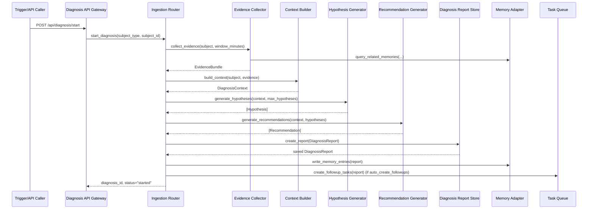

# Diagnosis Agent - Product Design Document

## Document Overview

The Diagnosis Agent is a **read-only** analysis agent that investigates failing tasks, anomalies, blocked tickets, or repeated validation failures. It gathers evidence, constructs a structured diagnosis dossier, generates ranked hypotheses, proposes remediation recommendations, and (optionally) creates follow-up tasks. All mutations to code or system state occur via standard task orchestration, not directly by the Diagnosis Agent.

- **Purpose & Scope**
  - Reduce mean time to diagnose (MTTD) for task failures, anomalies, blocked tickets, and repeated validation failures.
  - Provide auditable, structured diagnosis artifacts (DiagnosisReports) aligned with requirements.
  - Integrate with monitoring, validation, fault tolerance, task queue, and Memory System.
  - Operate in a read-mostly, least-privilege mode; no direct code/state mutation.

- **Target Audience**
  - AI spec agents, implementation teams, system architects.
  - Owners of Monitoring, Validation System, Fault Tolerance, Task Queue, and Memory System.

- **Related Documents**
  - Requirements:
    - `docs/requirements/workflows/diagnosis_agent.md`
    - `docs/requirements/workflows/task_queue_management.md`
    - `docs/requirements/workflows/validation_system.md`
    - `docs/requirements/monitoring/fault_tolerance.md`
    - `docs/requirements/multi_agent_orchestration.md`
  - Design:
    - `docs/design/multi_agent_orchestration.md`
    - `docs/design/monitoring_architecture.md` (once available)
    - `docs/design/fault_tolerance.md` (once available)
    - `docs/design/task_queue_management.md` (once available)
    - `docs/design/validation_system.md` (once available)
    - `docs/design/memory_system.md` (once available)

---

## Architecture Overview

### High-Level Architecture

```mermaid
flowchart TD
    subgraph Triggers
        TF[Task Failure]
        TB[Ticket Blocked]
        TM[Monitoring Alert\n(Anomaly/Quarantine)]
        TV[Validation Repeated Failures]
        TR[Manual Request API]
    end

    subgraph DiagnosisAgentService
        DIR[Diagnosis Ingestion Router]
        DEC[Evidence Collector]
        DCB[Diagnosis Context Builder]
        HGE[Hypothesis Generator & Evaluator]
        RGE[Recommendation Generator]
        DRP[Diagnosis Report Store]
        DFW[Follow-up Task Writer]
        DMI[Memory Integration Adapter]
    end

    subgraph External Systems
        TQS[Task Queue / Ticket Store]
        LOG[Logs Store]
        MET[Metrics Store]
        TRC[Traces Store]
        VAL[Validation System]
        MON[Monitoring/Fault Tolerance]
        MEM[Memory System]
    end

    Triggers --> DIR
    DIR --> DEC
    DEC --> DCB
    DCB --> HGE
    HGE --> RGE
    RGE --> DRP
    DRP --> DMI
    RGE --> DFW

    DEC --> LOG
    DEC --> MET
    DEC --> TRC
    DEC --> VAL
    DEC --> MON
    DFW --> TQS
    DMI <--> MEM
```

### Component Responsibilities

| Component                       | Layer           | Responsibility                                                                                   |
|---------------------------------|-----------------|--------------------------------------------------------------------------------------------------|
| Diagnosis API Gateway           | Interface       | Exposes `/api/diagnosis/start`, `/report`, `/resolve`; authn/z; request validation.             |
| Diagnosis Ingestion Router      | Service         | Maps triggers/requests to internal diagnosis jobs; enforces read-only operation.                |
| Evidence Collector              | Service         | Pulls logs, metrics, traces, validation feedback, existing Memory entries within time window.   |
| Diagnosis Context Builder       | Service         | Normalizes evidence into symptoms, environment snapshots, and a structured dossier.             |
| Hypothesis Generator/Evaluator  | Service/Agent   | Generates and ranks hypotheses from dossier using LLM/heuristics and `max_hypotheses` config.   |
| Recommendation Generator        | Service/Agent   | Produces remediation recommendations with priority and effort estimates; flags follow-ups.       |
| Diagnosis Report Store          | Persistence     | Persists `DiagnosisReport` entities; supports query by `diagnosis_id`, subject, status.         |
| Follow-up Task Writer           | Integration     | Creates follow-up tasks in Task Queue if `auto_create_followups` is enabled.                    |
| Memory Integration Adapter      | Integration     | Writes DiagnosisReport summaries to Memory and queries Memory for prior related incidents.       |
| Event Publisher                 | Infra           | Emits WebSocket/events: `diagnosis_started`, `diagnosis_report_ready`, `diagnosis_resolved`.    |

### System Boundaries

- **Inside Diagnosis Agent System**
  - All read-only analysis logic (ingestion, evidence collection, hypothesis and recommendation generation).
  - DiagnosisReport persistence and querying.
  - Memory read/write adapters specific to diagnosis artifacts.
  - Follow-up task creation *requests*.

- **Outside Diagnosis Agent System**
  - Underlying storage for logs, metrics, traces.
  - Task queue and ticketing system.
  - Validation System definition and operation.
  - Monitoring/Fault Tolerance anomaly detection.
  - Memory System core implementation.

Diagnosis Agent **never performs direct writes** to code repositories, configuration stores, or operational state stores. All changes are routed via normal task workflows.

---

## Component Details

### Diagnosis API Gateway

- **Responsibilities**
  - HTTP/REST endpoint handling for:
    - `POST /api/diagnosis/start`
    - `GET /api/diagnosis/report`
    - `POST /api/diagnosis/resolve`
  - Input validation and subject existence checks (via Task/Ticket store or orchestrator APIs).
  - Authentication and authorization, with audit logging for all actions.
- **Key Methods**
  - `start_diagnosis(subject_type, subject_id) -> diagnosis_id`
  - `get_report(diagnosis_id) -> DiagnosisReport`
  - `resolve_diagnosis(diagnosis_id, root_cause, resolution_notes) -> DiagnosisReport`

### Diagnosis Ingestion Router

- **Responsibilities**
  - Normalize incoming triggers into Diagnosis jobs.
  - Enforce **read-only** access pattern by only calling evidence collection and report store interfaces.
  - Route system-level triggers:
    - Task failure, blocked ticket, anomaly/quarantine, repeated validation failure, manual start.
- **Interfaces**
  - `start_from_trigger(trigger_type, trigger_payload) -> diagnosis_id`
  - `start_from_api(subject_type, subject_id) -> diagnosis_id`
  - Uses Evidence Collector and Context Builder to spawn asynchronous diagnosis workflow.

### Evidence Collector

- **Responsibilities**
  - For a given subject (`task` or `ticket`):
    - Fetch recent logs, metrics, and traces within `evidence_window_minutes`.
    - Fetch validation feedback (if any) for that subject.
    - Fetch anomaly/quarantine context from Monitoring/Fault Tolerance.
    - Fetch prior related incidents from Memory System (REQ-DIAG-MEM-002).
- **Interfaces**
  - `collect_evidence(subject_type, subject_id, window_minutes) -> EvidenceBundle`
- **Sources**
  - Logs: centralized log store (e.g., ELK/Cloud logs).
  - Metrics: Metric store / Prometheus.
  - Traces: Distributed tracing backend.
  - Validation: Validation System API.
  - Monitoring: Fault Tolerance / Monitoring API.
  - Memory: Memory System search endpoint (e.g., by component, error signature).

### Diagnosis Context Builder

- **Responsibilities**
  - Transform raw EvidenceBundle into:
    - `symptoms`: salient observed issues (e.g., errors, timeouts, blocked states).
    - `environment_snapshot`: relevant config, deployment info, resource usage, versions.
    - `structured_evidence`: keyed dictionary grouping evidence by source.
  - Provides clean, compact input for the Hypothesis Generator.
- **Interfaces**
  - `build_context(subject, evidence_bundle) -> DiagnosisContext`
- **Outputs**
  - `DiagnosisContext` containing:
    - `symptoms: List[str]`
    - `environment_snapshot: Dict[str, Any]`
    - `evidence: Dict[str, Any]` (normalized form suitable for LLM/context.)

### Hypothesis Generator & Evaluator

- **Responsibilities**
  - Generate candidate `Hypothesis` objects from DiagnosisContext.
  - Rank hypotheses with `likelihood` scores in [0.0, 1.0].
  - Cap the number of hypotheses at `max_hypotheses`.
- **Interfaces**
  - `generate_hypotheses(context: DiagnosisContext, max_hypotheses: int) -> List[Hypothesis]`
- **Implementation Notes**
  - Uses LLM and/or rule-based heuristics.
  - Incorporates Memory-based evidence (prior incidents, similar root causes).
  - Attaches `supporting_evidence` and `counterpoints` text references.

### Recommendation Generator

- **Responsibilities**
  - For the ranked hypotheses, propose `Recommendation` entries:
    - `description`, `priority`, `estimated_effort`, `creates_followup_task`.
  - Each recommendation is actionable and routed via Task Queue when follow-up tasks are desired.
- **Interfaces**
  - `generate_recommendations(context, hypotheses) -> List[Recommendation]`
- **Implementation Notes**
  - Mapping from hypothesis types to actions and severities.
  - Align `priority` with system-wide severity taxonomy (CRITICAL/HIGH/MEDIUM/LOW).
  - Map `estimated_effort` to S/M/L.

### Diagnosis Report Store

- **Responsibilities**
  - Persist and query `DiagnosisReport` entities.
  - Manage statuses (`open` | `resolved`) and timestamps.
- **Interfaces**
  - `create_report(report: DiagnosisReport) -> DiagnosisReport`
  - `get_report(diagnosis_id: str) -> DiagnosisReport`
  - `update_report_resolution(diagnosis_id, root_cause, resolution_notes) -> DiagnosisReport`
- **Notes**
  - Serves as the canonical source for the `/report` API and Memory summarization.

### Follow-up Task Writer

- **Responsibilities**
  - When `auto_create_followups = true`, convert selected `Recommendation` entries with `creates_followup_task=True` into tasks.
- **Interfaces**
  - `create_followup_tasks(report: DiagnosisReport) -> List[TaskRef]`
- **Behavior**
  - Tasks target either:
    - Phase = `IMPLEMENTATION` (to fix issues).
    - Phase = `ANALYSIS` (for deeper investigation).
  - Each task references the originating `DiagnosisReport.id`.

### Memory Integration Adapter

- **Responsibilities**
  - REQ-DIAG-MEM-001: Summarize DiagnosisReports into Memory entries.
  - REQ-DIAG-MEM-002: Query Memory for related incidents.
- **Interfaces**
  - `write_memory_entries(report: DiagnosisReport) -> None`
  - `query_related_memories(subject, signals) -> MemoryEvidence`
- **Notes**
  - Tags memory entries with:
    - `task_id` or `ticket_id`.
    - Key files/modules implicated.
    - Root cause and significant recommendations.
    - Type tags: `error_fix`, `decision`, `learning`, `warning`.

---

## Data Models

### Database Schemas (Relational)

```sql
-- Diagnosis reports
CREATE TABLE diagnosis_reports (
    id UUID PRIMARY KEY,
    subject_type VARCHAR(16) NOT NULL CHECK (subject_type IN ('task', 'ticket')),
    subject_id UUID NOT NULL,
    status VARCHAR(16) NOT NULL CHECK (status IN ('open', 'resolved')),
    symptoms TEXT[] NOT NULL DEFAULT ARRAY[]::TEXT[],
    evidence JSONB NOT NULL DEFAULT '{}'::JSONB,
    environment_snapshot JSONB NOT NULL DEFAULT '{}'::JSONB,
    root_cause TEXT,
    created_at TIMESTAMPTZ NOT NULL DEFAULT NOW(),
    resolved_at TIMESTAMPTZ,
    resolution_notes TEXT,
    -- Foreign key to tickets/tasks is logical; enforced in orchestrator or via FK if schemas aligned
    metadata JSONB NOT NULL DEFAULT '{}'::JSONB
);

-- Hypotheses per report
CREATE TABLE diagnosis_hypotheses (
    id UUID PRIMARY KEY,
    diagnosis_id UUID NOT NULL REFERENCES diagnosis_reports(id) ON DELETE CASCADE,
    position INTEGER NOT NULL, -- order in hypotheses list (0-based or 1-based)
    statement TEXT NOT NULL,
    likelihood NUMERIC(3,2) NOT NULL CHECK (likelihood >= 0.0 AND likelihood <= 1.0),
    supporting_evidence TEXT[] NOT NULL DEFAULT ARRAY[]::TEXT[],
    counterpoints TEXT[] NOT NULL DEFAULT ARRAY[]::TEXT[],
    created_at TIMESTAMPTZ NOT NULL DEFAULT NOW()
);

CREATE INDEX idx_diagnosis_hypotheses_diagnosis_id
    ON diagnosis_hypotheses(diagnosis_id);

-- Recommendations per report
CREATE TABLE diagnosis_recommendations (
    id UUID PRIMARY KEY,
    diagnosis_id UUID NOT NULL REFERENCES diagnosis_reports(id) ON DELETE CASCADE,
    description TEXT NOT NULL,
    priority VARCHAR(16) NOT NULL CHECK (priority IN ('CRITICAL', 'HIGH', 'MEDIUM', 'LOW')),
    estimated_effort VARCHAR(4) NOT NULL CHECK (estimated_effort IN ('S', 'M', 'L')),
    creates_followup_task BOOLEAN NOT NULL DEFAULT FALSE,
    followup_task_id UUID, -- optional reference to task once created
    created_at TIMESTAMPTZ NOT NULL DEFAULT NOW()
);

CREATE INDEX idx_diagnosis_recommendations_diagnosis_id
    ON diagnosis_recommendations(diagnosis_id);
```

### Pydantic Models

Use the reference models from the requirements and extend minimally for the service.

```python
from __future__ import annotations
from datetime import datetime
from typing import List, Dict, Any, Optional
from pydantic import BaseModel, Field


class Hypothesis(BaseModel):
    statement: str
    likelihood: float  # 0.0 - 1.0
    supporting_evidence: List[str] = Field(default_factory=list)
    counterpoints: List[str] = Field(default_factory=list)


class Recommendation(BaseModel):
    description: str
    priority: str  # CRITICAL|HIGH|MEDIUM|LOW
    estimated_effort: str  # "S", "M", "L"
    creates_followup_task: bool = False
    followup_task_id: Optional[str] = None


class DiagnosisReport(BaseModel):
    id: str
    subject_type: str  # "task" | "ticket"
    subject_id: str
    status: str  # "open" | "resolved"
    symptoms: List[str] = Field(default_factory=list)
    evidence: Dict[str, Any] = Field(default_factory=dict)
    environment_snapshot: Dict[str, Any] = Field(default_factory=dict)
    hypotheses: List[Hypothesis] = Field(default_factory=list)
    root_cause: Optional[str] = None
    recommendations: List[Recommendation] = Field(default_factory=list)
    created_at: datetime
    resolved_at: Optional[datetime] = None
    resolution_notes: Optional[str] = None
```

---

## API Specifications

### REST Endpoints (Normative)

The Diagnosis Agent exposes the following endpoints (matching requirements):

| Endpoint               | Method | Purpose          | Request Body (min)                                                       | Success (200)                                        | Failures                         |
|------------------------|--------|------------------|--------------------------------------------------------------------------|------------------------------------------------------|----------------------------------|
| `/api/diagnosis/start` | POST   | Start diagnosis  | `{ "subject_type": "task\|ticket", "subject_id": "..." }`                | `{ "diagnosis_id": "...", "status": "started" }`     | 404 `{ "error": "...", "message": "..." }` |
| `/api/diagnosis/report`| GET    | Get report       | `?diagnosis_id=...`                                                      | `DiagnosisReport` JSON                               | 404                              |
| `/api/diagnosis/resolve` | POST | Mark resolved    | `{ "diagnosis_id": "...", "root_cause": "...", "resolution_notes":"..." }` | `{ "diagnosis_id":"...", "status":"resolved" }`      | 404 `{ "error": "...", "message": "..." }` |

- **Error Schema**
  - Consistently use: `{ "error": "stable_code", "message": "..." }`.
  - `stable_code` examples: `diagnosis_not_found`, `subject_not_found`, `diagnosis_disabled`.

### Request/Response Models (Sketch)

```python
class StartDiagnosisRequest(BaseModel):
    subject_type: str  # "task" | "ticket"
    subject_id: str


class StartDiagnosisResponse(BaseModel):
    diagnosis_id: str
    status: str  # "started"


class ResolveDiagnosisRequest(BaseModel):
    diagnosis_id: str
    root_cause: str
    resolution_notes: str


class ResolveDiagnosisResponse(BaseModel):
    diagnosis_id: str
    status: str  # "resolved"
```

### Authentication and Authorization

- All endpoints require authentication.
- Authorization rules:
  - Only authorized operators or orchestration components may start diagnoses automatically.
  - Access to reports may be restricted by project/tenant or ticket ownership.
- All actions are **fully audited**:
  - User/agent identity, timestamp, subject, and actions (start, view, resolve).

---

## Integration Points

### Triggers & Upstream Systems

- **Task Failures**
  - Orchestrator or Task Queue posts to `/api/diagnosis/start` when a task transitions to non-transient failure states.
- **Ticket Blocked Status**
  - Ticket Workflow detects blocked tickets and triggers diagnosis for affected tickets.
- **Monitoring Alerts / Quarantine**
  - Fault Tolerance / Monitoring emits anomaly/quarantine events that call `/start` with an associated subject (task or ticket) or indirect mapping.
- **Validation Repeated Failures**
  - Validation System triggers diagnosis when repeated validation failures occur for the same subject.
- **Manual Requests**
  - Users (or tools) invoke `/api/diagnosis/start` manually.

### Memory System Integration (REQ-DIAG-MEM-001/002)

- **Write (REQ-DIAG-MEM-001)**
  - Upon report completion:
    - Summarize diagnosis into Memory entries of types:
      - `error_fix`, `decision`, `learning`, `warning`.
    - Link entries to:
      - `subject_id` (task/ticket),
      - key file paths/modules,
      - `root_cause` and key `recommendations`.
- **Read (REQ-DIAG-MEM-002)**
  - During evidence collection:
    - Query Memory for:
      - prior failures involving same component,
      - similar error signatures,
      - historical remediations and outcomes.
    - Use results to:
      - shape `symptoms`,
      - inform `supporting_evidence`,
      - bias hypothesis likelihood.

### Validation System Integration

- Diagnosis treats validation outcomes as evidence:
  - Ingests historical validation feedback and failure patterns.
  - Validation System triggers diagnoses on repeated failures, but Diagnosis Agent does not modify validation rules or code.
- Recommendations may include:
  - `Add validation for X`, `Tighten check Y`, etc., via follow-up tasks.

### Fault Tolerance & Monitoring Integration

- Anomaly/quarantine events are triggers for diagnoses.
- Diagnosis consumes:
  - Anomaly scores, heartbeat failure context, resource utilization anomalies.
- Recommendations may include:
  - Changes to restart thresholds, resource allocations, or escalation rules (applied via follow-up tasks).

### Task Queue / Ticketing Integration

- Follow-up Task Writer:
  - Creates tasks referring back to `DiagnosisReport.id`.
  - Ensures P95 follow-up task creation latency < 500ms post-report emission.
- Tickets:
  - Diagnosis associated with blocked tickets; recommendations may guide unblocking strategies.

### WebSocket/Event Contracts

As required:

| Event                    | When Emitted                                       | Payload (min)                                           |
|--------------------------|----------------------------------------------------|---------------------------------------------------------|
| `diagnosis_started`      | Immediately after diagnosis job accepted           | `{ "diagnosis_id","subject_type","subject_id" }`        |
| `diagnosis_report_ready` | When report is built and stored                   | `{ "diagnosis_id","subject_id" }`                       |
| `diagnosis_resolved`     | When `resolve` endpoint successfully completes     | `{ "diagnosis_id","root_cause" }`                       |

---

## Implementation Details

### Operation Flow



### Read-Only Enforcement

- Diagnosis Agent obtains credentials with **read-only** roles for:
  - Logs, metrics, traces, and code repositories.
  - Validation and Monitoring APIs.
- Follow-up task creation:
  - Only via Task Queue APIs, not via direct DB writes.
- No direct use of tool capabilities that modify code (e.g., `github:write_file`) within the Diagnosis Agent.

### Configuration Parameters (Normative)

From requirements:

| Parameter                | Default | Range   | Description                                  |
|--------------------------|---------|---------|----------------------------------------------|
| `diagnosis_enabled`      | true    | bool    | Master switch to enable/disable diagnoses.   |
| `max_hypotheses`         | 5       | 1–10    | Maximum number of hypotheses returned.       |
| `include_environment`    | true    | bool    | Capture environment snapshot in reports.     |
| `auto_create_followups`  | false   | bool    | Auto-create tasks from recommendations.      |
| `evidence_window_minutes`| 60      | 5–720   | Evidence time window for logs/metrics/etc.   |

These parameters are exposed via a central config (e.g., Pydantic settings) and must be adjustable per environment.

### Performance & SLOs

- REQ-DIAG-SLO-001:
  - P95 diagnosis report ready < 60s for standard contexts:
    - Parallel evidence collection across sources.
    - Bound data volumes via `evidence_window_minutes`.
    - Limit `max_hypotheses` to reduce LLM cost/latency.
  - P95 follow-up task creation < 500ms:
    - Task creation call executed immediately after report persistence.
    - Avoid synchronous Memory writes blocking task creation.

### Security & Audit

- REQ-DIAG-SEC-001:
  - Read-only access to all operational data.
  - Full audit log entries for:
    - `diagnosis_started` (source trigger, subject).
    - `diagnosis_report_ready` (duration, evidence sources).
    - `diagnosis_resolved` (root cause, notes).
    - Follow-up task creation (task IDs, linkage to report).
- Audit Log fields:
  - Actor (user or system component), subject type/id, diagnosis_id, action type, timestamp, metadata.

### Example Pseudocode (Service Skeleton)

```python
async def start_diagnosis(req: StartDiagnosisRequest) -> StartDiagnosisResponse:
    if not config.diagnosis_enabled:
        raise HTTPException(status_code=503, detail={"error": "diagnosis_disabled", "message": "Diagnosis is disabled"})
    subject = await resolve_subject(req.subject_type, req.subject_id)  # 404 if not found

    diagnosis_id = str(uuid.uuid4())
    asyncio.create_task(run_diagnosis_job(diagnosis_id, subject))  # async, to hit P95 latency goals

    await event_bus.publish("diagnosis_started", {
        "diagnosis_id": diagnosis_id,
        "subject_type": req.subject_type,
        "subject_id": req.subject_id,
    })
    return StartDiagnosisResponse(diagnosis_id=diagnosis_id, status="started")


async def run_diagnosis_job(diagnosis_id: str, subject: SubjectRef) -> None:
    evidence = await evidence_collector.collect(subject, config.evidence_window_minutes)
    context = context_builder.build(subject, evidence)
    hypotheses = hypothesis_generator.generate(context, config.max_hypotheses)
    recommendations = recommendation_generator.generate(context, hypotheses)

    report = DiagnosisReport(
        id=diagnosis_id,
        subject_type=subject.type,
        subject_id=subject.id,
        status="open",
        symptoms=context.symptoms,
        evidence=context.evidence,
        environment_snapshot=context.environment_snapshot if config.include_environment else {},
        hypotheses=hypotheses,
        recommendations=recommendations,
        created_at=datetime.utcnow(),
    )
    await report_store.save(report)
    await memory_adapter.write_from_report(report)

    if config.auto_create_followups:
        await followup_task_writer.create_tasks(report)

    await event_bus.publish("diagnosis_report_ready", {
        "diagnosis_id": diagnosis_id,
        "subject_id": subject.id,
    })
```

---

## Related Documents

- **Requirements**
  - `docs/requirements/workflows/diagnosis_agent.md`
  - `docs/requirements/workflows/validation_system.md`
  - `docs/requirements/workflows/task_queue_management.md`
  - `docs/requirements/monitoring/fault_tolerance.md`
  - `docs/requirements/multi_agent_orchestration.md`

- **Design (Cross-References)**
  - `docs/design/multi_agent_orchestration.md`
  - `docs/design/monitoring_architecture.md`
  - `docs/design/fault_tolerance.md`
  - `docs/design/task_queue_management.md`
  - `docs/design/validation_system.md`
  - `docs/design/memory_system.md`

---

## Quality Checklist

- [x] All requirements from `diagnosis_agent.md` addressed (triggers, read-only constraints, operation flow, data model, APIs, WebSocket events, SLOs, security, memory integration).
- [x] Architecture diagram included (Mermaid).
- [x] API specifications match normative requirements.
- [x] Database schemas cover DiagnosisReport, Hypothesis, Recommendation.
- [x] Integration points documented with Validation, Monitoring/Fault Tolerance, Task Queue, and Memory System.
- [x] Configuration parameters documented and aligned with requirements.
- [x] Pseudocode examples provided where appropriate.
- [x] Cross-references to related design docs included.
- [x] Formatting consistent with `multi_agent_orchestration.md` style.


