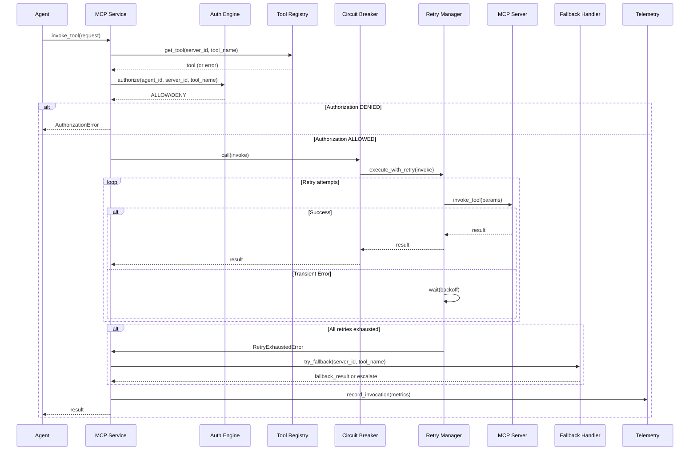

# MCP Server Integration Design Document

**Created**: 2025-11-20
**Status**: Draft
**Purpose**: Describes the architecture and component design for integrating external tools via MCP servers into the multi-agent orchestration system.
**Related**: ../requirements/integration/mcp_servers.md, ./multi_agent_orchestration.md, ./agent_lifecycle_management.md

---


## Document Overview

This design document specifies the architecture, components, and implementation details for integrating external tools via MCP (Model Context Protocol) servers within the multi-agent orchestration system. The integration provides secure, reliable, and observable access to external capabilities through a standardized protocol.

**Target Audience**: AI spec agents (Kiro, Cursor, Cline), implementation teams, system architects

**Related Documents**:
- [Requirements Document](../requirements/integration/mcp_servers.md) - Source of truth for all requirements
- [Multi-Agent Orchestration Design](./multi_agent_orchestration.md) - Infrastructure layer patterns
- [Agent Lifecycle Management Design](./agent_lifecycle_management.md) - Agent registration and capabilities

---

## Architecture Overview

### High-Level Architecture

```
┌─────────────────────────────────────────────────────────────────────┐
│                    ORCHESTRATOR LAYER                              │
│  ┌──────────────────────────────────────────────────────────────┐  │
│  │              MCP Integration Service                          │  │
│  │  ┌──────────────┐  ┌──────────────┐  ┌──────────────┐     │  │
│  │  │   Tool       │  │ Authorization│  │   Retry &     │     │  │
│  │  │  Registry    │  │   Engine     │  │   Circuit    │     │  │
│  │  │              │  │              │  │   Breaker     │     │  │
│  │  └──────────────┘  └──────────────┘  └──────────────┘     │  │
│  └──────────────────────────────────────────────────────────────┘  │
└─────────────────────────────────────────────────────────────────────┘
                              │
                              ▼
┌─────────────────────────────────────────────────────────────────────┐
│                    MCP SERVER LAYER                                 │
│  ┌──────────────┐  ┌──────────────┐  ┌──────────────┐            │
│  │   MCP        │  │   MCP        │  │   MCP         │            │
│  │  Server 1    │  │  Server 2    │  │  Server N     │            │
│  │ (Context7)  │  │  (Supabase)  │  │  (Custom)     │            │
│  └──────────────┘  └──────────────┘  └──────────────┘            │
└─────────────────────────────────────────────────────────────────────┘
                              │
                              ▼
┌─────────────────────────────────────────────────────────────────────┐
│                    EXTERNAL SERVICES                                 │
│  ┌──────────────┐  ┌──────────────┐  ┌──────────────┐            │
│  │   External   │  │   External   │  │   External    │            │
│  │   Service 1 │  │  Service 2   │  │  Service N    │            │
│  └──────────────┘  └──────────────┘  └──────────────┘            │
└─────────────────────────────────────────────────────────────────────┘
```

### Component Responsibilities

| Component | Primary Responsibility |
|-----------|----------------------|
| MCP Integration Service | Central service managing all MCP interactions |
| Tool Registry | Discovery, registration, and schema validation of MCP tools |
| Authorization Engine | Per-agent, per-tool authorization with policy enforcement |
| Retry Manager | Exponential backoff retry logic with jitter |
| Circuit Breaker | Failure protection per server+tool combination |
| Fallback Handler | Alternate server/tool routing on failure |
| Telemetry Collector | Metrics, logging, and audit trail generation |

---

## Component Details

### Tool Registry

The Tool Registry is responsible for discovering, registering, and validating MCP server tools.

#### Architecture Pattern: Service Registry

```python
from typing import Dict, List, Optional
from pydantic import BaseModel, Field, ValidationError
import jsonschema

class MCPToolRegistry:
    """Central registry for all MCP server tools with schema validation."""

    def __init__(self):
        self.tools: Dict[str, MCPTool] = {}  # key: "server_id:tool_name"
        self.servers: Dict[str, MCPServerMeta] = {}
        self.version_matrix: Dict[str, Dict[str, List[str]]] = {}  # server_id -> tool_name -> versions

    async def register_server(
        self,
        server_id: str,
        metadata: MCPServerMeta,
        tools: List[Dict[str, Any]]
    ) -> RegistrationResult:
        """
        Register MCP server and validate all tools.
        
        REQ-MCP-REG-001: Server Discovery
        REQ-MCP-REG-002: Schema Validation
        REQ-MCP-REG-003: Version Compatibility
        """
        # Store server metadata
        self.servers[server_id] = metadata
        
        # Validate and register each tool
        registered_tools = []
        rejected_tools = []
        
        for tool_data in tools:
            try:
                # Validate JSON schema
                if not self._validate_tool_schema(tool_data):
                    rejected_tools.append({
                        "tool_name": tool_data.get("name", "unknown"),
                        "reason": "Invalid JSON schema",
                        "errors": self._get_schema_errors(tool_data)
                    })
                    continue
                
                # Check version compatibility
                tool_name = tool_data["name"]
                tool_version = tool_data.get("version")
                
                if not self._check_version_compatibility(server_id, tool_name, tool_version):
                    rejected_tools.append({
                        "tool_name": tool_name,
                        "reason": "Version incompatibility",
                        "version": tool_version
                    })
                    # Disable but don't reject
                    tool_data["enabled"] = False
                
                # Create tool object
                tool = MCPTool(
                    server_id=server_id,
                    tool_name=tool_name,
                    schema=tool_data["schema"],
                    version=tool_version,
                    enabled=tool_data.get("enabled", True)
                )
                
                tool_key = f"{server_id}:{tool_name}"
                self.tools[tool_key] = tool
                registered_tools.append(tool)
                
            except Exception as e:
                rejected_tools.append({
                    "tool_name": tool_data.get("name", "unknown"),
                    "reason": str(e)
                })
        
        return RegistrationResult(
            server_id=server_id,
            registered_count=len(registered_tools),
            rejected_count=len(rejected_tools),
            registered_tools=registered_tools,
            rejected_tools=rejected_tools
        )

    def _validate_tool_schema(self, tool_data: Dict[str, Any]) -> bool:
        """Validate tool JSON schema structure."""
        required_fields = ["name", "schema"]
        if not all(field in tool_data for field in required_fields):
            return False
        
        # Validate JSON Schema format
        try:
            jsonschema.Draft7Validator.check_schema(tool_data["schema"])
        except jsonschema.SchemaError:
            return False
        
        return True

    def _check_version_compatibility(
        self,
        server_id: str,
        tool_name: str,
        tool_version: Optional[str]
    ) -> bool:
        """Check if tool version is compatible with orchestrator."""
        if tool_version is None:
            return True  # No version specified, assume compatible
        
        # Check against compatibility matrix
        if server_id in self.version_matrix:
            if tool_name in self.version_matrix[server_id]:
                compatible_versions = self.version_matrix[server_id][tool_name]
                return tool_version in compatible_versions
        
        # Default: allow if no matrix defined
        return True

    def list_tools(
        self,
        server_id: Optional[str] = None,
        enabled_only: bool = True
    ) -> List[MCPTool]:
        """List registered tools, optionally filtered by server."""
        tools = list(self.tools.values())
        
        if server_id:
            tools = [t for t in tools if t.server_id == server_id]
        
        if enabled_only:
            tools = [t for t in tools if t.enabled]
        
        return tools

    def get_tool(self, server_id: str, tool_name: str) -> Optional[MCPTool]:
        """Get specific tool by server and name."""
        tool_key = f"{server_id}:{tool_name}"
        return self.tools.get(tool_key)
```

### Authorization Engine

The Authorization Engine enforces per-agent, per-tool authorization policies with least-privilege principles.

#### Architecture Pattern: Policy-Based Access Control

```python
from enum import Enum
from datetime import datetime, timedelta
from typing import Set
import secrets

class PolicyDecision(str, Enum):
    ALLOW = "ALLOW"
    DENY = "DENY"

class AuthorizationEngine:
    """
    Enforces agent-scoped permissions for tool invocations.
    
    REQ-MCP-AUTH-001: Agent-Scoped Permissions
    REQ-MCP-AUTH-002: Capability Binding
    REQ-MCP-AUTH-003: Least Privilege
    """

    def __init__(self):
        self.policies: Dict[str, Set[str]] = {}  # agent_id -> set of allowed tool keys
        self.tokens: Dict[str, TokenInfo] = {}  # token_id -> TokenInfo
        self.decision_cache: Dict[str, PolicyDecision] = {}  # cache key -> decision
        self.cache_ttl = timedelta(minutes=5)

    def authorize(
        self,
        agent_id: str,
        server_id: str,
        tool_name: str,
        require_token: bool = False
    ) -> AuthorizationResult:
        """
        Authorize tool invocation for agent.
        
        Default-deny: Only explicit grants allow access.
        """
        tool_key = f"{server_id}:{tool_name}"
        cache_key = f"{agent_id}:{tool_key}"
        
        # Check cache first
        if cache_key in self.decision_cache:
            cached_decision = self.decision_cache[cache_key]
            return AuthorizationResult(
                decision=cached_decision,
                cached=True,
                reason="Cached decision"
            )
        
        # Default deny
        decision = PolicyDecision.DENY
        reason = "No explicit grant found"
        
        # Check agent capabilities (bound during registration)
        agent_capabilities = self._get_agent_capabilities(agent_id)
        if tool_key in agent_capabilities:
            # Check if token required for high-risk tools
            if require_token:
                token_valid = self._validate_token(agent_id, tool_key)
                if not token_valid:
                    decision = PolicyDecision.DENY
                    reason = "Token validation failed"
                else:
                    decision = PolicyDecision.ALLOW
                    reason = "Authorized with valid token"
            else:
                decision = PolicyDecision.ALLOW
                reason = "Authorized via capability binding"
        
        # Cache decision
        self.decision_cache[cache_key] = decision
        
        return AuthorizationResult(
            decision=decision,
            cached=False,
            reason=reason,
            token_required=require_token
        )

    def grant_permission(
        self,
        agent_id: str,
        server_id: str,
        tool_name: str,
        actions: List[str],
        token_ttl: timedelta = timedelta(minutes=15)
    ) -> PolicyGrant:
        """
        Grant tool permission to agent with optional time-bounded token.
        
        REQ-MCP-AUTH-003: Least Privilege - time-bounded tokens for high-risk tools
        """
        tool_key = f"{server_id}:{tool_name}"
        
        # Initialize agent policy if needed
        if agent_id not in self.policies:
            self.policies[agent_id] = set()
        
        # Add tool to allowed set
        self.policies[agent_id].add(tool_key)
        
        # Generate token if required (for high-risk tools)
        token_id = None
        if self._is_high_risk_tool(server_id, tool_name):
            token_id = self._generate_token(agent_id, tool_key, token_ttl)
        
        grant = PolicyGrant(
            agent_id=agent_id,
            tool_name=tool_name,
            actions=actions,
            token_ttl=token_ttl,
            token_id=token_id
        )
        
        # Invalidate cache
        self._invalidate_cache(agent_id, tool_key)
        
        return grant

    def _generate_token(
        self,
        agent_id: str,
        tool_key: str,
        ttl: timedelta
    ) -> str:
        """Generate time-bounded authorization token."""
        token_id = secrets.token_urlsafe(32)
        expires_at = datetime.now() + ttl
        
        self.tokens[token_id] = TokenInfo(
            agent_id=agent_id,
            tool_key=tool_key,
            expires_at=expires_at,
            created_at=datetime.now()
        )
        
        return token_id

    def _validate_token(self, agent_id: str, tool_key: str) -> bool:
        """Validate token for agent and tool."""
        # Find token for this agent+tool combination
        for token_id, token_info in self.tokens.items():
            if (token_info.agent_id == agent_id and
                token_info.tool_key == tool_key and
                token_info.expires_at > datetime.now()):
                return True
        
        return False

    def _get_agent_capabilities(self, agent_id: str) -> Set[str]:
        """Get tools bound to agent during registration."""
        return self.policies.get(agent_id, set())

    def _is_high_risk_tool(self, server_id: str, tool_name: str) -> bool:
        """Determine if tool requires token-based authorization."""
        # High-risk patterns: write, delete, modify operations
        high_risk_patterns = ["write", "delete", "modify", "update", "create"]
        return any(pattern in tool_name.lower() for pattern in high_risk_patterns)

    def _invalidate_cache(self, agent_id: str, tool_key: str) -> None:
        """Invalidate cached authorization decisions."""
        cache_key = f"{agent_id}:{tool_key}"
        self.decision_cache.pop(cache_key, None)
```

### Retry Manager

The Retry Manager implements exponential backoff with jitter for transient failures.

#### Retry Algorithm

```python
import asyncio
import random
from typing import Callable, Any, Optional
from datetime import datetime

class RetryManager:
    """
    Manages retry logic with exponential backoff and jitter.
    
    REQ-MCP-CALL-002: Retry with Backoff
    REQ-MCP-CALL-003: Idempotency
    """

    def __init__(
        self,
        max_attempts: int = 3,
        base_delay_ms: int = 500,
        factor: float = 2.0,
        max_delay_ms: int = 30000,
        jitter: bool = True
    ):
        self.max_attempts = max_attempts
        self.base_delay_ms = base_delay_ms
        self.factor = factor
        self.max_delay_ms = max_delay_ms
        self.jitter = jitter
        self.idempotency_keys: Dict[str, Any] = {}  # key -> cached result

    async def execute_with_retry(
        self,
        func: Callable,
        *args,
        idempotency_key: Optional[str] = None,
        **kwargs
    ) -> Any:
        """
        Execute function with retry logic.
        
        Formula: delay = min(base * (factor ^ attempt) + jitter, max_delay)
        """
        # Check idempotency cache
        if idempotency_key and idempotency_key in self.idempotency_keys:
            return self.idempotency_keys[idempotency_key]
        
        last_exception = None
        attempt = 0
        
        while attempt < self.max_attempts:
            try:
                result = await func(*args, **kwargs)
                
                # Cache result for idempotency
                if idempotency_key:
                    self.idempotency_keys[idempotency_key] = result
                
                return result
                
            except TransientError as e:
                last_exception = e
                attempt += 1
                
                if attempt < self.max_attempts:
                    delay_ms = self._calculate_backoff(attempt)
                    await asyncio.sleep(delay_ms / 1000.0)
                else:
                    break
                    
            except PermanentError as e:
                # Don't retry permanent errors
                raise
        
        # All retries exhausted
        raise RetryExhaustedError(
            f"Failed after {self.max_attempts} attempts",
            last_exception=last_exception
        )

    def _calculate_backoff(self, attempt: int) -> float:
        """Calculate exponential backoff delay with jitter."""
        # Exponential: base * (factor ^ attempt)
        delay = self.base_delay_ms * (self.factor ** attempt)
        
        # Cap at max delay
        delay = min(delay, self.max_delay_ms)
        
        # Add jitter (±20%)
        if self.jitter:
            jitter_amount = delay * 0.2
            delay = delay + random.uniform(-jitter_amount, jitter_amount)
        
        return max(0, delay)

    def clear_idempotency_cache(self, older_than: timedelta = timedelta(hours=1)) -> None:
        """Clear expired idempotency cache entries."""
        cutoff = datetime.now() - older_than
        # Implementation would track creation time per key
        pass
```

### Circuit Breaker

The Circuit Breaker protects the system from cascading failures by opening circuits after repeated failures.

#### Circuit Breaker States

```python
from enum import Enum
from datetime import datetime, timedelta
from typing import Optional

class CircuitState(str, Enum):
    CLOSED = "CLOSED"  # Normal operation
    OPEN = "OPEN"  # Failing, reject requests
    HALF_OPEN = "HALF_OPEN"  # Testing if recovered

class CircuitBreaker:
    """
    Circuit breaker per server+tool combination.
    
    REQ-MCP-CALL-005: Circuit Breaker
    """

    def __init__(
        self,
        failure_threshold: int = 5,
        cooldown_seconds: int = 60,
        half_open_max_requests: int = 3
    ):
        self.failure_threshold = failure_threshold
        self.cooldown_seconds = cooldown_seconds
        self.half_open_max_requests = half_open_max_requests
        
        self.state = CircuitState.CLOSED
        self.failure_count = 0
        self.success_count = 0
        self.last_failure_time: Optional[datetime] = None
        self.opened_at: Optional[datetime] = None
        self.half_open_requests = 0

    async def call(
        self,
        func: Callable,
        *args,
        **kwargs
    ) -> Any:
        """Execute function with circuit breaker protection."""
        # Check if circuit should transition
        self._check_state_transition()
        
        # Reject if open
        if self.state == CircuitState.OPEN:
            raise CircuitOpenError(
                f"Circuit is OPEN for {self.cooldown_seconds}s",
                opened_at=self.opened_at
            )
        
        # Execute function
        try:
            result = await func(*args, **kwargs)
            self._on_success()
            return result
            
        except Exception as e:
            self._on_failure()
            raise

    def _check_state_transition(self) -> None:
        """Check if circuit should transition states."""
        if self.state == CircuitState.OPEN:
            # Check if cooldown period has passed
            if self.opened_at:
                elapsed = (datetime.now() - self.opened_at).total_seconds()
                if elapsed >= self.cooldown_seconds:
                    self.state = CircuitState.HALF_OPEN
                    self.half_open_requests = 0
                    self.success_count = 0

    def _on_success(self) -> None:
        """Handle successful call."""
        if self.state == CircuitState.HALF_OPEN:
            self.success_count += 1
            self.half_open_requests += 1
            
            # If enough successes, close circuit
            if self.success_count >= self.half_open_max_requests:
                self.state = CircuitState.CLOSED
                self.failure_count = 0
                self.success_count = 0
                self.half_open_requests = 0
        else:
            # Reset failure count on success
            self.failure_count = 0

    def _on_failure(self) -> None:
        """Handle failed call."""
        self.failure_count += 1
        self.last_failure_time = datetime.now()
        
        if self.state == CircuitState.HALF_OPEN:
            # Any failure in half-open immediately opens circuit
            self.state = CircuitState.OPEN
            self.opened_at = datetime.now()
            self.half_open_requests = 0
        elif self.failure_count >= self.failure_threshold:
            # Open circuit after threshold failures
            self.state = CircuitState.OPEN
            self.opened_at = datetime.now()

    def get_metrics(self) -> CircuitBreakerMetrics:
        """Get current circuit breaker metrics."""
        return CircuitBreakerMetrics(
            state=self.state,
            failure_count=self.failure_count,
            last_failure_time=self.last_failure_time,
            opened_at=self.opened_at
        )
```

### MCP Integration Service

The MCP Integration Service orchestrates all components to provide a unified interface for tool invocations.

#### Tool Invocation Flow



#### Implementation

```python
class MCPIntegrationService:
    """
    Central service for MCP tool invocations.
    
    REQ-MCP-CALL-001: Structured Request
    REQ-MCP-CALL-004: Fallbacks
    """

    def __init__(
        self,
        tool_registry: MCPToolRegistry,
        auth_engine: AuthorizationEngine,
        retry_manager: RetryManager,
        circuit_breakers: Dict[str, CircuitBreaker],
        fallback_handler: FallbackHandler,
        telemetry: TelemetryCollector
    ):
        self.tool_registry = tool_registry
        self.auth_engine = auth_engine
        self.retry_manager = retry_manager
        self.circuit_breakers = circuit_breakers
        self.fallback_handler = fallback_handler
        self.telemetry = telemetry

    async def invoke_tool(
        self,
        request: MCPInvocationRequest
    ) -> MCPInvocationResult:
        """
        Invoke MCP tool with full orchestration.
        
        Flow:
        1. Validate request structure
        2. Get tool from registry
        3. Authorize agent
        4. Execute with circuit breaker + retry
        5. Handle fallbacks if needed
        6. Record telemetry
        """
        start_time = datetime.now()
        correlation_id = request.correlation_id
        
        try:
            # 1. Get tool
            tool = self.tool_registry.get_tool(
                request.server_id,
                request.tool_name
            )
            if not tool:
                raise ToolNotFoundError(
                    f"Tool not found: {request.server_id}:{request.tool_name}"
                )
            
            if not tool.enabled:
                raise ToolDisabledError(
                    f"Tool disabled: {request.server_id}:{request.tool_name}"
                )
            
            # 2. Authorize
            auth_result = self.auth_engine.authorize(
                agent_id=request.agent_id,
                server_id=request.server_id,
                tool_name=request.tool_name,
                require_token=self._requires_token(tool)
            )
            
            if auth_result.decision != PolicyDecision.ALLOW:
                raise AuthorizationError(
                    f"Authorization denied: {auth_result.reason}",
                    agent_id=request.agent_id,
                    tool_name=request.tool_name
                )
            
            # 3. Get circuit breaker
            circuit_key = f"{request.server_id}:{request.tool_name}"
            circuit_breaker = self.circuit_breakers.get(
                circuit_key,
                CircuitBreaker()  # Default breaker
            )
            
            # 4. Execute with circuit breaker + retry
            attempts = 0
            last_error = None
            
            async def invoke():
                nonlocal attempts, last_error
                attempts += 1
                return await circuit_breaker.call(
                    self._call_mcp_server,
                    request.server_id,
                    request.tool_name,
                    request.params
                )
            
            try:
                result = await self.retry_manager.execute_with_retry(
                    invoke,
                    idempotency_key=request.idempotency_key
                )
                
                latency_ms = (datetime.now() - start_time).total_seconds() * 1000
                
                return MCPInvocationResult(
                    correlation_id=correlation_id,
                    success=True,
                    result=result,
                    attempts=attempts,
                    latency_ms=latency_ms,
                    completed_at=datetime.now()
                )
                
            except (RetryExhaustedError, CircuitOpenError) as e:
                last_error = e
                
                # 5. Try fallback
                fallback_result = await self.fallback_handler.try_fallback(
                    request.server_id,
                    request.tool_name,
                    request.params
                )
                
                if fallback_result:
                    latency_ms = (datetime.now() - start_time).total_seconds() * 1000
                    return MCPInvocationResult(
                        correlation_id=correlation_id,
                        success=True,
                        result=fallback_result,
                        attempts=attempts,
                        latency_ms=latency_ms,
                        completed_at=datetime.now()
                    )
                else:
                    # Escalate
                    raise ToolInvocationError(
                        f"Tool invocation failed after retries and fallback",
                        original_error=last_error
                    )
        
        except Exception as e:
            latency_ms = (datetime.now() - start_time).total_seconds() * 1000
            
            # 6. Record telemetry
            await self.telemetry.record_invocation(
                correlation_id=correlation_id,
                agent_id=request.agent_id,
                server_id=request.server_id,
                tool_name=request.tool_name,
                success=False,
                error=str(e),
                attempts=attempts,
                latency_ms=latency_ms
            )
            
            return MCPInvocationResult(
                correlation_id=correlation_id,
                success=False,
                error=str(e),
                attempts=attempts,
                latency_ms=latency_ms,
                completed_at=datetime.now()
            )

    async def _call_mcp_server(
        self,
        server_id: str,
        tool_name: str,
        params: Dict[str, Any]
    ) -> Any:
        """Direct call to MCP server (wrapped by circuit breaker)."""
        # Implementation would use MCP client library
        # This is a placeholder for the actual MCP protocol call
        pass

    def _requires_token(self, tool: MCPTool) -> bool:
        """Check if tool requires token-based authorization."""
        return self.auth_engine._is_high_risk_tool(
            tool.server_id,
            tool.tool_name
        )
```

### Fallback Handler

The Fallback Handler attempts alternate servers or tools when primary invocations fail.

```python
class FallbackHandler:
    """
    Handles fallback to alternate servers/tools on failure.
    
    REQ-MCP-CALL-004: Fallbacks
    """

    def __init__(self, tool_registry: MCPToolRegistry):
        self.tool_registry = tool_registry
        self.fallback_config: Dict[str, List[str]] = {}  # tool_key -> [fallback_keys]

    async def try_fallback(
        self,
        server_id: str,
        tool_name: str,
        params: Dict[str, Any]
    ) -> Optional[Any]:
        """Try fallback servers/tools in order."""
        tool_key = f"{server_id}:{tool_name}"
        fallback_keys = self.fallback_config.get(tool_key, [])
        
        for fallback_key in fallback_keys:
            fallback_server_id, fallback_tool_name = fallback_key.split(":", 1)
            
            try:
                # Attempt fallback invocation
                result = await self._invoke_fallback(
                    fallback_server_id,
                    fallback_tool_name,
                    params
                )
                return result
            except Exception as e:
                # Continue to next fallback
                continue
        
        return None

    async def _invoke_fallback(
        self,
        server_id: str,
        tool_name: str,
        params: Dict[str, Any]
    ) -> Any:
        """Invoke fallback tool."""
        # Similar to main invocation but without retry/circuit breaker
        pass
```

---

## Data Models

### Database Schema

```sql
-- MCP Server Registry
CREATE TABLE mcp_servers (
    server_id VARCHAR(255) PRIMARY KEY,
    version VARCHAR(50) NOT NULL,
    capabilities JSONB DEFAULT '[]'::jsonb,
    connected_at TIMESTAMP WITH TIME ZONE DEFAULT NOW(),
    last_heartbeat TIMESTAMP WITH TIME ZONE,
    status VARCHAR(20) DEFAULT 'active',
    metadata JSONB
);

-- MCP Tools
CREATE TABLE mcp_tools (
    id UUID PRIMARY KEY DEFAULT gen_random_uuid(),
    server_id VARCHAR(255) NOT NULL REFERENCES mcp_servers(server_id),
    tool_name VARCHAR(255) NOT NULL,
    schema JSONB NOT NULL,
    version VARCHAR(50),
    enabled BOOLEAN DEFAULT TRUE,
    registered_at TIMESTAMP WITH TIME ZONE DEFAULT NOW(),
    UNIQUE(server_id, tool_name)
);

-- Authorization Policies
CREATE TABLE mcp_policies (
    id UUID PRIMARY KEY DEFAULT gen_random_uuid(),
    agent_id VARCHAR(255) NOT NULL,
    server_id VARCHAR(255) NOT NULL,
    tool_name VARCHAR(255) NOT NULL,
    actions JSONB DEFAULT '[]'::jsonb,
    granted_at TIMESTAMP WITH TIME ZONE DEFAULT NOW(),
    granted_by VARCHAR(255),
    expires_at TIMESTAMP WITH TIME ZONE,
    UNIQUE(agent_id, server_id, tool_name)
);

-- Authorization Tokens
CREATE TABLE mcp_tokens (
    token_id VARCHAR(255) PRIMARY KEY,
    agent_id VARCHAR(255) NOT NULL,
    server_id VARCHAR(255) NOT NULL,
    tool_name VARCHAR(255) NOT NULL,
    created_at TIMESTAMP WITH TIME ZONE DEFAULT NOW(),
    expires_at TIMESTAMP WITH TIME ZONE NOT NULL,
    used_at TIMESTAMP WITH TIME ZONE,
    revoked BOOLEAN DEFAULT FALSE
);

-- Circuit Breaker State
CREATE TABLE circuit_breakers (
    circuit_key VARCHAR(255) PRIMARY KEY,  -- "server_id:tool_name"
    state VARCHAR(20) NOT NULL,  -- CLOSED, OPEN, HALF_OPEN
    failure_count INTEGER DEFAULT 0,
    last_failure_time TIMESTAMP WITH TIME ZONE,
    opened_at TIMESTAMP WITH TIME ZONE,
    success_count INTEGER DEFAULT 0,
    updated_at TIMESTAMP WITH TIME ZONE DEFAULT NOW()
);

-- Invocation Audit Log
CREATE TABLE mcp_invocations (
    id UUID PRIMARY KEY DEFAULT gen_random_uuid(),
    correlation_id VARCHAR(255) NOT NULL,
    agent_id VARCHAR(255) NOT NULL,
    server_id VARCHAR(255) NOT NULL,
    tool_name VARCHAR(255) NOT NULL,
    params_hash VARCHAR(64),  -- SHA256 hash of params (redacted)
    success BOOLEAN NOT NULL,
    result_summary TEXT,  -- Redacted result
    error_message TEXT,
    attempts INTEGER DEFAULT 1,
    latency_ms FLOAT,
    policy_decision VARCHAR(10),  -- ALLOW/DENY
    cached_decision BOOLEAN DEFAULT FALSE,
    invoked_at TIMESTAMP WITH TIME ZONE DEFAULT NOW()
);

-- Indexes
CREATE INDEX idx_mcp_tools_server ON mcp_tools(server_id);
CREATE INDEX idx_mcp_tools_enabled ON mcp_tools(enabled) WHERE enabled = TRUE;
CREATE INDEX idx_mcp_policies_agent ON mcp_policies(agent_id);
CREATE INDEX idx_mcp_tokens_agent ON mcp_tokens(agent_id);
CREATE INDEX idx_mcp_tokens_expires ON mcp_tokens(expires_at) WHERE revoked = FALSE;
CREATE INDEX idx_mcp_invocations_agent ON mcp_invocations(agent_id);
CREATE INDEX idx_mcp_invocations_tool ON mcp_invocations(server_id, tool_name);
CREATE INDEX idx_mcp_invocations_correlation ON mcp_invocations(correlation_id);
CREATE INDEX idx_mcp_invocations_time ON mcp_invocations(invoked_at);
```

### Pydantic Models

```python
from __future__ import annotations
from datetime import datetime, timedelta
from enum import Enum
from typing import Any, Dict, List, Optional
from pydantic import BaseModel, Field

class PolicyDecision(str, Enum):
    ALLOW = "ALLOW"
    DENY = "DENY"

class MCPServerMeta(BaseModel):
    server_id: str
    version: str
    capabilities: List[str] = Field(default_factory=list)
    connected_at: datetime
    last_heartbeat: Optional[datetime] = None
    status: str = "active"
    metadata: Dict[str, Any] = Field(default_factory=dict)

class MCPTool(BaseModel):
    server_id: str
    tool_name: str
    schema: Dict[str, Any]  # JSON Schema
    version: Optional[str] = None
    enabled: bool = True

class PolicyGrant(BaseModel):
    agent_id: str
    tool_name: str
    actions: List[str] = Field(default_factory=list)
    token_ttl: timedelta = Field(default=timedelta(minutes=15))
    token_id: Optional[str] = None

class MCPInvocationRequest(BaseModel):
    correlation_id: str
    agent_id: str
    server_id: str
    tool_name: str
    params: Dict[str, Any] = Field(default_factory=dict)
    idempotency_key: Optional[str] = None
    ticket_id: Optional[str] = None
    task_id: Optional[str] = None
    requested_at: datetime = Field(default_factory=datetime.now)

class MCPInvocationResult(BaseModel):
    correlation_id: str
    success: bool
    result: Any | None = None
    error: Optional[str] = None
    attempts: int = 1
    latency_ms: float = 0.0
    completed_at: datetime

class AuthorizationResult(BaseModel):
    decision: PolicyDecision
    cached: bool = False
    reason: str
    token_required: bool = False

class RegistrationResult(BaseModel):
    server_id: str
    registered_count: int
    rejected_count: int
    registered_tools: List[MCPTool]
    rejected_tools: List[Dict[str, Any]]

class CircuitBreakerMetrics(BaseModel):
    state: str
    failure_count: int
    last_failure_time: Optional[datetime]
    opened_at: Optional[datetime]
```

---

## API Specifications

### REST API Endpoints

| Method | Path | Purpose | Request | Response |
|--------|------|---------|---------|----------|
| POST | `/api/v1/mcp/register` | Register MCP server and tools | `RegisterServerRequest` | `RegistrationResult` |
| GET | `/api/v1/mcp/tools` | List registered tools | Query: `server_id?`, `enabled_only?` | `List[MCPTool]` |
| GET | `/api/v1/mcp/tools/{server_id}/{tool_name}` | Get specific tool | - | `MCPTool` |
| POST | `/api/v1/mcp/invoke` | Invoke MCP tool | `MCPInvocationRequest` | `MCPInvocationResult` |
| POST | `/api/v1/mcp/policies/grant` | Grant tool permission | `PolicyGrant` | `PolicyGrant` |
| GET | `/api/v1/mcp/policies/{agent_id}` | List agent permissions | - | `List[PolicyGrant]` |
| GET | `/api/v1/mcp/circuit-breakers` | Get circuit breaker states | Query: `server_id?`, `tool_name?` | `List[CircuitBreakerMetrics]` |
| GET | `/api/v1/mcp/metrics` | Get invocation metrics | Query: `server_id?`, `tool_name?`, `time_range?` | `MetricsResponse` |

### Request/Response Models

#### Register Server Request

```json
{
  "server_id": "context7",
  "version": "1.0.0",
  "capabilities": ["search", "documentation"],
  "tools": [
    {
      "name": "search",
      "schema": {
        "type": "object",
        "properties": {
          "query": {"type": "string"},
          "limit": {"type": "integer", "default": 10}
        },
        "required": ["query"]
      },
      "version": "1.0.0"
    }
  ]
}
```

#### Invoke Tool Request

```json
{
  "correlation_id": "req-12345",
  "agent_id": "agent-001",
  "server_id": "context7",
  "tool_name": "search",
  "params": {
    "query": "Python async patterns",
    "limit": 5
  },
  "idempotency_key": "idemp-67890",
  "ticket_id": "ticket-abc",
  "task_id": "task-xyz"
}
```

#### Invoke Tool Response

```json
{
  "correlation_id": "req-12345",
  "success": true,
  "result": {
    "results": [
      {"title": "AsyncIO Guide", "url": "https://..."}
    ]
  },
  "attempts": 1,
  "latency_ms": 245.5,
  "completed_at": "2025-01-16T10:30:00Z"
}
```

### Error Handling

| Status Code | Error Type | Description |
|-------------|------------|-------------|
| 400 | `BadRequestError` | Invalid request parameters |
| 401 | `AuthorizationError` | Authorization denied |
| 404 | `ToolNotFoundError` | Tool not found in registry |
| 409 | `ToolDisabledError` | Tool exists but is disabled |
| 429 | `RateLimitError` | Too many requests |
| 500 | `ToolInvocationError` | Tool invocation failed |
| 503 | `CircuitOpenError` | Circuit breaker is open |
| 504 | `TimeoutError` | Request timeout |

---

## Integration Points

### Agent Lifecycle Integration

The MCP Integration Service integrates with the Agent Lifecycle Management system to bind tool capabilities during agent registration.

```python
# During agent registration
async def register_agent_with_capabilities(
    agent_id: str,
    agent_type: str,
    declared_tools: List[str]
) -> None:
    """
    Bind agent capabilities to MCP tools during registration.
    
    REQ-MCP-AUTH-002: Capability Binding
    """
    auth_engine = AuthorizationEngine.get_instance()
    
    for tool_key in declared_tools:
        server_id, tool_name = tool_key.split(":", 1)
        
        # Grant permission
        grant = auth_engine.grant_permission(
            agent_id=agent_id,
            server_id=server_id,
            tool_name=tool_name,
            actions=["invoke"]
        )
        
        # Log capability binding
        logger.info(
            f"Bound tool {tool_key} to agent {agent_id}",
            extra={"agent_id": agent_id, "tool_key": tool_key}
        )
```

### Event Bus Integration

The MCP Integration Service publishes events to the Event Bus for system-wide visibility.

```python
class MCPEventPublisher:
    """Publishes MCP-related events to event bus."""

    def __init__(self, event_bus: EventBus):
        self.event_bus = event_bus

    def publish_tool_registered(self, server_id: str, tool: MCPTool) -> None:
        """Publish tool registration event."""
        self.event_bus.publish(Event(
            type=EventType.MCP_TOOL_REGISTERED,
            data={
                "server_id": server_id,
                "tool_name": tool.tool_name,
                "version": tool.version
            }
        ))

    def publish_invocation_completed(
        self,
        result: MCPInvocationResult
    ) -> None:
        """Publish invocation completion event."""
        self.event_bus.publish(Event(
            type=EventType.MCP_INVOCATION_COMPLETED,
            data={
                "correlation_id": result.correlation_id,
                "success": result.success,
                "latency_ms": result.latency_ms,
                "attempts": result.attempts
            }
        ))

    def publish_circuit_opened(
        self,
        server_id: str,
        tool_name: str
    ) -> None:
        """Publish circuit breaker opened event."""
        self.event_bus.publish(Event(
            type=EventType.MCP_CIRCUIT_OPENED,
            data={
                "server_id": server_id,
                "tool_name": tool_name
            }
        ))
```

### State Store Integration

Circuit breaker state and authorization policies are persisted in the State Store for recovery and consistency.

```python
class PersistentCircuitBreaker(CircuitBreaker):
    """Circuit breaker with state persistence."""

    def __init__(self, state_store: StateStore, circuit_key: str, **kwargs):
        super().__init__(**kwargs)
        self.state_store = state_store
        self.circuit_key = circuit_key
        self._load_state()

    def _load_state(self) -> None:
        """Load circuit breaker state from store."""
        state = self.state_store.get_circuit_breaker_state(self.circuit_key)
        if state:
            self.state = CircuitState(state["state"])
            self.failure_count = state["failure_count"]
            self.opened_at = state.get("opened_at")

    def _on_failure(self) -> None:
        """Persist state on failure."""
        super()._on_failure()
        self._save_state()

    def _on_success(self) -> None:
        """Persist state on success."""
        super()._on_success()
        self._save_state()

    def _save_state(self) -> None:
        """Save circuit breaker state to store."""
        self.state_store.save_circuit_breaker_state(
            self.circuit_key,
            {
                "state": self.state.value,
                "failure_count": self.failure_count,
                "opened_at": self.opened_at.isoformat() if self.opened_at else None
            }
        )
```

---

## Implementation Details

### Telemetry Collector

The Telemetry Collector implements metrics collection and audit logging per REQ-MCP-OBS-001 and REQ-MCP-OBS-002.

```python
from prometheus_client import Counter, Histogram, Gauge
import hashlib
import json

class TelemetryCollector:
    """
    Collects metrics and audit logs for MCP invocations.
    
    REQ-MCP-OBS-001: Metrics
    REQ-MCP-OBS-002: Audit Trail
    """

    def __init__(self, state_store: StateStore):
        self.state_store = state_store
        
        # Prometheus metrics
        self.invocation_counter = Counter(
            'mcp_invocations_total',
            'Total MCP tool invocations',
            ['server_id', 'tool_name', 'agent_id', 'status']
        )
        
        self.invocation_latency = Histogram(
            'mcp_invocation_latency_ms',
            'MCP invocation latency in milliseconds',
            ['server_id', 'tool_name'],
            buckets=[10, 50, 100, 250, 500, 1000, 2500, 5000]
        )
        
        self.retry_counter = Counter(
            'mcp_retries_total',
            'Total retry attempts',
            ['server_id', 'tool_name']
        )
        
        self.circuit_state_gauge = Gauge(
            'mcp_circuit_state',
            'Circuit breaker state (0=CLOSED, 1=OPEN, 2=HALF_OPEN)',
            ['circuit_key']
        )
        
        self.error_rate = Counter(
            'mcp_errors_total',
            'Total MCP invocation errors',
            ['server_id', 'tool_name', 'error_type']
        )

    async def record_invocation(
        self,
        correlation_id: str,
        agent_id: str,
        server_id: str,
        tool_name: str,
        success: bool,
        error: Optional[str] = None,
        attempts: int = 1,
        latency_ms: float = 0.0,
        params: Optional[Dict[str, Any]] = None,
        result: Optional[Any] = None,
        policy_decision: Optional[str] = None,
        cached_decision: bool = False
    ) -> None:
        """Record invocation metrics and audit log."""
        status = "success" if success else "error"
        
        # Update Prometheus metrics
        self.invocation_counter.labels(
            server_id=server_id,
            tool_name=tool_name,
            agent_id=agent_id,
            status=status
        ).inc()
        
        if latency_ms > 0:
            self.invocation_latency.labels(
                server_id=server_id,
                tool_name=tool_name
            ).observe(latency_ms)
        
        if attempts > 1:
            self.retry_counter.labels(
                server_id=server_id,
                tool_name=tool_name
            ).inc(attempts - 1)
        
        if not success and error:
            error_type = self._classify_error(error)
            self.error_rate.labels(
                server_id=server_id,
                tool_name=tool_name,
                error_type=error_type
            ).inc()
        
        # Calculate params hash (for audit, redacted)
        params_hash = None
        if params:
            # Redact sensitive fields
            redacted_params = self._redact_params(params)
            params_hash = hashlib.sha256(
                json.dumps(redacted_params, sort_keys=True).encode()
            ).hexdigest()
        
        # Redact result for audit
        result_summary = None
        if result:
            result_summary = self._summarize_result(result)
        
        # Write to audit log
        await self.state_store.create_mcp_invocation_audit(
            correlation_id=correlation_id,
            agent_id=agent_id,
            server_id=server_id,
            tool_name=tool_name,
            params_hash=params_hash,
            success=success,
            result_summary=result_summary,
            error_message=error,
            attempts=attempts,
            latency_ms=latency_ms,
            policy_decision=policy_decision,
            cached_decision=cached_decision
        )

    def _redact_params(self, params: Dict[str, Any]) -> Dict[str, Any]:
        """Redact sensitive parameters for audit."""
        sensitive_keys = ["password", "token", "secret", "key", "credential"]
        redacted = params.copy()
        
        for key in redacted:
            if any(sensitive in key.lower() for sensitive in sensitive_keys):
                redacted[key] = "[REDACTED]"
        
        return redacted

    def _summarize_result(self, result: Any) -> str:
        """Create summary of result for audit (redacted)."""
        if isinstance(result, dict):
            # Limit size and redact sensitive fields
            summary = json.dumps(result, default=str)[:500]
            return summary
        return str(result)[:500]

    def _classify_error(self, error: str) -> str:
        """Classify error type for metrics."""
        error_lower = error.lower()
        if "timeout" in error_lower:
            return "timeout"
        elif "authorization" in error_lower or "permission" in error_lower:
            return "authorization"
        elif "circuit" in error_lower:
            return "circuit_breaker"
        elif "not found" in error_lower:
            return "not_found"
        else:
            return "other"

    def update_circuit_metrics(
        self,
        circuit_key: str,
        state: CircuitState
    ) -> None:
        """Update circuit breaker metrics."""
        state_value = {
            CircuitState.CLOSED: 0,
            CircuitState.OPEN: 1,
            CircuitState.HALF_OPEN: 2
        }.get(state, 0)
        
        self.circuit_state_gauge.labels(circuit_key=circuit_key).set(state_value)
```

### Configuration Parameters

All configuration parameters from REQ-MCP-CONFIG are documented below.

| Parameter | Default | Description | Environment Variable |
|-----------|---------|-------------|---------------------|
| `RETRY_MAX_ATTEMPTS` | 3 | Maximum retry attempts for transient errors | `MCP_RETRY_MAX_ATTEMPTS` |
| `RETRY_BASE_MS` | 500 | Initial backoff delay in milliseconds | `MCP_RETRY_BASE_MS` |
| `RETRY_FACTOR` | 2.0 | Exponential backoff factor | `MCP_RETRY_FACTOR` |
| `RETRY_MAX_DELAY_MS` | 30000 | Maximum backoff delay in milliseconds | `MCP_RETRY_MAX_DELAY_MS` |
| `CIRCUIT_FAILURE_THRESHOLD` | 5 | Errors before opening circuit | `MCP_CIRCUIT_FAILURE_THRESHOLD` |
| `CIRCUIT_COOLDOWN` | 60 | Cooldown period in seconds before half-open | `MCP_CIRCUIT_COOLDOWN` |
| `CIRCUIT_HALF_OPEN_MAX_REQUESTS` | 3 | Max requests in half-open state | `MCP_CIRCUIT_HALF_OPEN_MAX` |
| `TOKEN_TTL` | 15 | Authorization token lifetime in minutes | `MCP_TOKEN_TTL_MINUTES` |
| `AUTH_CACHE_TTL` | 5 | Authorization decision cache TTL in minutes | `MCP_AUTH_CACHE_TTL` |
| `INVOCATION_TIMEOUT_MS` | 30000 | Request timeout in milliseconds | `MCP_INVOCATION_TIMEOUT_MS` |
| `AUDIT_LOG_RETENTION_DAYS` | 90 | Audit log retention period in days | `MCP_AUDIT_RETENTION_DAYS` |

#### Configuration Implementation

```python
from pydantic_settings import BaseSettings

class MCPConfig(BaseSettings):
    """MCP Integration Service configuration."""

    # Retry configuration
    retry_max_attempts: int = 3
    retry_base_ms: int = 500
    retry_factor: float = 2.0
    retry_max_delay_ms: int = 30000

    # Circuit breaker configuration
    circuit_failure_threshold: int = 5
    circuit_cooldown: int = 60
    circuit_half_open_max_requests: int = 3

    # Authorization configuration
    token_ttl_minutes: int = 15
    auth_cache_ttl_minutes: int = 5

    # Timeout configuration
    invocation_timeout_ms: int = 30000

    # Audit configuration
    audit_log_retention_days: int = 90

    class Config:
        env_prefix = "MCP_"
        env_file = ".env"
```

### Performance Considerations

1. **Authorization Decision Caching**: Cache decisions for 5 minutes to reduce policy lookup overhead.
2. **Circuit Breaker State Persistence**: Persist state to database for recovery across restarts.
3. **Idempotency Key Caching**: Cache results for idempotent requests to avoid duplicate work.
4. **Batch Metrics Export**: Batch Prometheus metric updates to reduce write overhead.
5. **Connection Pooling**: Reuse MCP server connections to reduce connection establishment latency.

### Error Handling Strategies

1. **Transient vs Permanent Errors**: Classify errors to determine retry eligibility.
2. **Error Classification**: Categorize errors (timeout, authorization, circuit breaker, etc.) for metrics.
3. **Graceful Degradation**: Fallback to alternate servers/tools when primary fails.
4. **Escalation**: Escalate to human operators when all retries and fallbacks exhaust.

---

## Related Documents

- [Requirements Document](../requirements/integration/mcp_servers.md) - Source of truth for all MCP integration requirements
- [Multi-Agent Orchestration Design](./multi_agent_orchestration.md) - Infrastructure layer patterns and event bus integration
- [Agent Lifecycle Management Design](./agent_lifecycle_management.md) - Agent registration and capability binding
- [Monitoring Architecture Design](./monitoring_architecture.md) - System-wide monitoring and observability

---

## Document Revision History

| Version | Date | Author | Changes |
|---------|------|--------|---------|
| 1.0 | 2025-01-16 | AI Spec Agent | Initial design document for Job 11: MCP Server Integration |

---

**Status**: Complete  
**Job ID**: `design-mcp-integration`  
**Source**: `docs/requirements/integration/mcp_servers.md`  
**Target**: `docs/design/mcp_server_integration.md`

