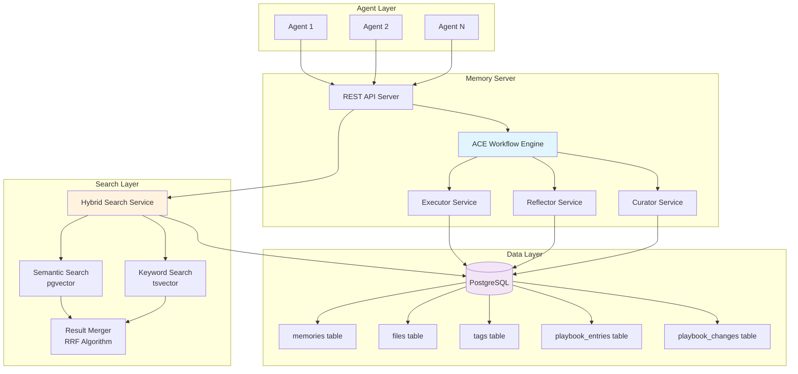
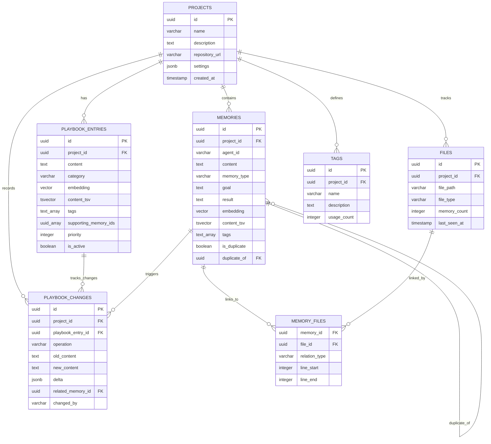
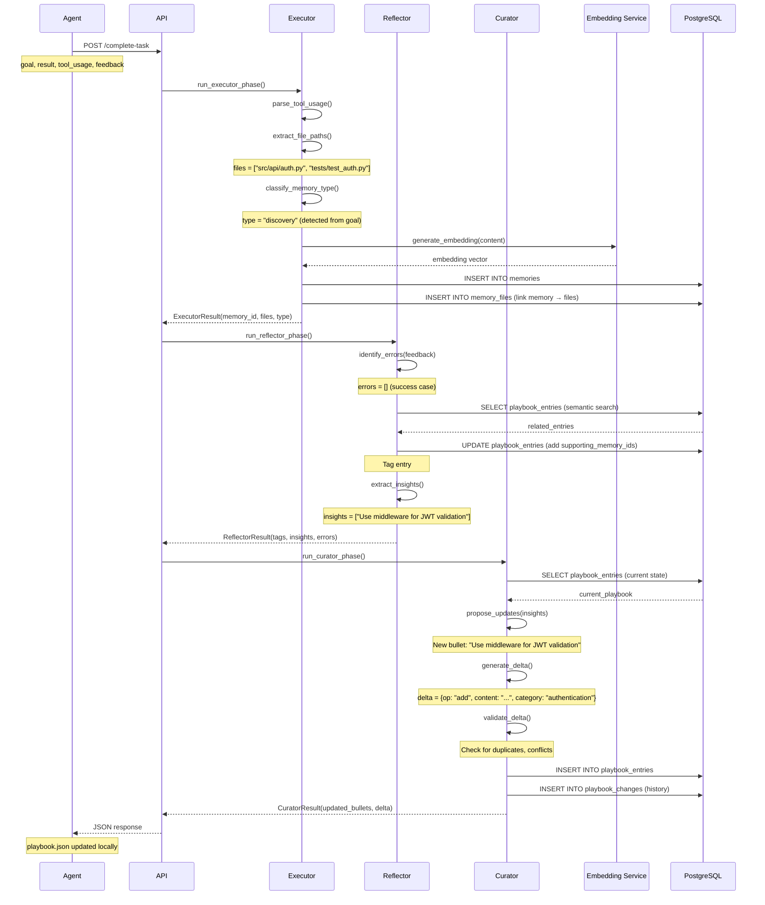

# Agent Memory System - Product Design Document

## Document Overview

This product design document specifies the architecture, components, data flows, and implementation patterns for the server-based Agent Memory System. The system enables AI agents to build, maintain, and share a comprehensive project-wide knowledge base through automatic capture of task outcomes and structured playbook evolution.

**Target Audience**: AI spec agents (Kiro, Cursor, Cline), implementation teams, system architects

**Related Document**: [Memory System Requirements](../requirements/memory/memory_system.md)

---

## 1. System Architecture

### 1.1 High-Level Architecture



### 1.2 Component Responsibilities

| Component | Layer | Primary Responsibility |
|-----------|-------|----------------------|
| REST API Server | API | HTTP endpoint exposure, authentication, request routing |
| ACE Workflow Engine | Processing | Orchestrates Executor → Reflector → Curator phases |
| Executor Service | Processing | Captures task execution, creates memory records |
| Reflector Service | Processing | Analyzes outcomes, finds related knowledge, extracts insights |
| Curator Service | Processing | Proposes and applies playbook updates |
| Hybrid Search Service | Search | Combines semantic and keyword search results |
| Embedding Service | Search | Generates vector embeddings for semantic search |
| PostgreSQL | Data | Persistent storage with pgvector and tsvector support |

---

## 2. Core Components

### 2.1 REST API Server

**Location**: `src/api/memory_api.py`

**Responsibilities**:
- Expose memory operations via HTTP REST endpoints
- Handle authentication and authorization
- Orchestrate ACE workflow
- Manage rate limiting
- Provide health checks

**Key Endpoints**:

```python
class MemoryAPI:
    """REST API server for Agent Memory System."""
    
    # Memory CRUD
    async def create_memory(request: CreateMemoryRequest) -> Memory
    async def search_memories(request: SearchRequest) -> SearchResults
    async def get_memory(memory_id: str) -> Memory
    
    # ACE Workflow
    async def complete_task(request: CompleteTaskRequest) -> ACEResult
    
    # Playbook
    async def get_playbook(project_id: str, filters: Optional[PlaybookFilters]) -> Playbook
    async def get_playbook_history(project_id: str, filters: Optional[HistoryFilters]) -> List[PlaybookChange]
    
    # Files
    async def get_file_memories(file_path: str, project_id: str) -> List[Memory]
    async def get_file_graph(file_path: str, project_id: str) -> FileGraph
    
    # Context
    async def get_context_for_task(request: GetContextRequest) -> TaskContext
```

**Authentication**:
- All endpoints require JWT token authentication
- Authorization checks verify `project_id` access
- Sensitive operations (playbook changes, deduplication) require elevated permissions

### 2.2 ACE Workflow Engine

**Location**: `src/services/ace_engine.py`

**Responsibilities**:
- Orchestrate three-phase workflow (Executor → Reflector → Curator)
- Coordinate service calls and handle failures
- Track workflow metrics
- Return structured ACEResult

**Key Methods**:

```python
class ACEEngine:
    """Orchestrates ACE workflow phases."""
    
    async def execute_workflow(
        goal: str,
        result: str,
        tool_usage: List[ToolUsage],
        feedback: str,
        agent_id: str,
        project_id: str
    ) -> ACEResult:
        """
        Execute complete ACE workflow.
        
        Returns:
            ACEResult with memory_id, tags, insights, playbook_delta
        """
        # Phase 1: Executor
        executor_result = await self.run_executor_phase(
            goal, result, tool_usage, agent_id, project_id
        )
        
        # Phase 2: Reflector
        reflector_result = await self.run_reflector_phase(
            executor_result, feedback, project_id
        )
        
        # Phase 3: Curator
        curator_result = await self.run_curator_phase(
            executor_result, reflector_result, project_id
        )
        
        return ACEResult(
            memory_id=executor_result.memory_id,
            memory_type=executor_result.memory_type,
            files_linked=executor_result.files,
            tags_added=reflector_result.tags,
            insights_found=reflector_result.insights,
            errors_identified=reflector_result.errors,
            related_playbook_entries=reflector_result.related_entries,
            playbook_delta=curator_result.delta,
            updated_bullets=curator_result.updated_bullets,
            change_id=curator_result.change_id
        )
    
    async def run_executor_phase(...) -> ExecutorResult:
        """Phase 1: Capture task execution."""
        pass
    
    async def run_reflector_phase(...) -> ReflectorResult:
        """Phase 2: Analyze and reflect."""
        pass
    
    async def run_curator_phase(...) -> CuratorResult:
        """Phase 3: Curate playbook."""
        pass
```

### 2.3 Executor Service

**Location**: `src/services/executor.py`

**Responsibilities**:
- Parse tool usage to extract file paths and relations
- Classify memory type based on goal and result
- Generate embeddings for content
- Create memory record in database
- Link memory to relevant files

**Key Methods**:

```python
class Executor:
    """Captures task execution details."""
    
    async def execute(
        goal: str,
        result: str,
        tool_usage: List[ToolUsage],
        agent_id: str,
        project_id: str
    ) -> ExecutorResult:
        """
        Execute phase: create memory from task completion.
        
        Steps:
        1. Parse tool_usage to extract file paths
        2. Classify memory_type
        3. Generate embedding
        4. Create memory record
        5. Link to files
        """
        # Parse tool usage
        parsed = self.parse_tool_usage(tool_usage)
        files = self.extract_file_paths(parsed)
        
        # Classify memory type
        memory_type = self.classify_memory_type(goal, result)
        
        # Generate content and embedding
        content = f"{goal}\n\nResult: {result}"
        embedding = await self.embedding_service.generate_embedding(content)
        
        # Check for duplicates
        duplicate_of = await self.check_for_duplicate(
            embedding, project_id, threshold=0.95
        )
        
        # Create memory record
        memory_id = await self.db.insert_memory(
            project_id=project_id,
            agent_id=agent_id,
            content=content,
            memory_type=memory_type,
            goal=goal,
            result=result,
            embedding=embedding,
            tags=self.extract_tags(goal, result),
            is_duplicate=(duplicate_of is not None),
            duplicate_of=duplicate_of
        )
        
        # Link files
        for file_path in files:
            file_id = await self.get_or_create_file(project_id, file_path)
            relation_type = self.infer_relation(file_path, parsed)
            await self.db.link_memory_to_file(
                memory_id=memory_id,
                file_id=file_id,
                relation_type=relation_type
            )
        
        return ExecutorResult(
            memory_id=memory_id,
            memory_type=memory_type,
            files=files,
            tags=self.extract_tags(goal, result)
        )
    
    def parse_tool_usage(self, tool_usage: List[ToolUsage]) -> ParsedTools:
        """Extract file paths and relations from tool usage."""
        files_read = []
        files_modified = []
        files_created = []
        
        for tool in tool_usage:
            if tool.tool_name == "file_read":
                files_read.append(tool.arguments.get("path"))
            elif tool.tool_name == "file_edit":
                files_modified.append(tool.arguments.get("path"))
            elif tool.tool_name == "file_create":
                files_created.append(tool.arguments.get("path"))
        
        return ParsedTools(
            files_read=files_read,
            files_modified=files_modified,
            files_created=files_created
        )
    
    def classify_memory_type(self, goal: str, result: str) -> MemoryType:
        """
        Classify memory type based on goal and result content.
        
        Rules:
        - Contains "fix", "error", "bug" → error_fix
        - Contains "add", "implement", "create" → discovery
        - Contains "chose", "decided", "selected" → decision
        - Contains "learned", "found", "realized" → learning
        - Contains "warning", "gotcha", "careful" → warning
        - Contains "architecture", "structure", "pattern" → codebase_knowledge
        """
        text = (goal + " " + result).lower()
        
        if any(word in text for word in ["fix", "error", "bug", "issue"]):
            return MemoryType.ERROR_FIX
        elif any(word in text for word in ["chose", "decided", "selected", "choice"]):
            return MemoryType.DECISION
        elif any(word in text for word in ["learned", "found", "realized", "discovered"]):
            return MemoryType.LEARNING
        elif any(word in text for word in ["warning", "gotcha", "careful", "watch"]):
            return MemoryType.WARNING
        elif any(word in text for word in ["architecture", "structure", "pattern", "design"]):
            return MemoryType.CODEBASE_KNOWLEDGE
        else:
            return MemoryType.DISCOVERY  # Default
```

### 2.4 Reflector Service

**Location**: `src/services/reflector.py`

**Responsibilities**:
- Analyze task outcome and feedback
- Identify errors and root causes
- Find related playbook entries via semantic search
- Tag related entries with supporting memory IDs
- Extract structured insights (patterns, gotchas, best practices)

**Key Methods**:

```python
class Reflector:
    """Analyzes task outcomes and extracts insights."""
    
    async def analyze(
        executor_result: ExecutorResult,
        feedback: str,
        project_id: str
    ) -> ReflectorResult:
        """
        Reflect phase: analyze what happened and find related knowledge.
        
        Steps:
        1. Identify errors from feedback
        2. Find root causes
        3. Search playbook for related entries
        4. Tag related entries
        5. Extract insights
        """
        # Identify errors
        errors = await self.identify_errors(feedback)
        root_causes = await self.find_root_causes(errors)
        
        # Find related playbook entries
        related_entries = await self.search_playbook_entries(
            query_text=executor_result.content,
            project_id=project_id,
            limit=5,
            threshold=0.7
        )
        
        # Tag related entries
        tags_added = []
        for entry in related_entries:
            if entry.similarity_score > 0.7:
                await self.db.add_supporting_memory(
                    entry_id=entry.id,
                    memory_id=executor_result.memory_id
                )
                tags_added.append(entry.id)
        
        # Extract insights
        insights = await self.extract_insights(
            goal=executor_result.goal,
            result=executor_result.result,
            feedback=feedback
        )
        
        return ReflectorResult(
            tags_added=tags_added,
            insights=insights,
            errors=errors,
            root_causes=root_causes,
            related_playbook_entries=[e.id for e in related_entries]
        )
    
    async def identify_errors(self, feedback: str) -> List[Error]:
        """
        Identify errors from feedback text.
        
        Looks for:
        - Error messages (ImportError, ValueError, etc.)
        - Failure indicators ("failed", "error", "exception")
        - Test failures
        """
        errors = []
        # Pattern matching or LLM-based extraction
        # Returns list of Error objects with error_type, message
        return errors
    
    async def extract_insights(self, goal: str, result: str, feedback: str) -> List[Insight]:
        """
        Extract structured insights from completion.
        
        Uses LLM or pattern matching to identify:
        - Patterns ("always", "never", "make sure to")
        - Gotchas ("careful with", "watch out for")
        - Best practices ("prefer", "recommend")
        
        Returns list of Insight objects with type, content, confidence.
        """
        insights = []
        # LLM-based extraction or rule-based pattern matching
        return insights
```

### 2.5 Curator Service

**Location**: `src/services/curator.py`

**Responsibilities**:
- Propose playbook updates based on insights
- Generate delta operations (add/update/delete)
- Validate deltas (check duplicates, quality thresholds)
- Apply accepted deltas to playbook
- Record change history

**Key Methods**:

```python
class Curator:
    """Curates playbook based on insights."""
    
    async def curate(
        executor_result: ExecutorResult,
        reflector_result: ReflectorResult,
        project_id: str
    ) -> CuratorResult:
        """
        Curate phase: update playbook with new knowledge.
        
        Steps:
        1. Get current playbook state
        2. Propose updates from insights
        3. Generate delta operations
        4. Validate delta
        5. Apply delta
        6. Record change history
        """
        # Get current playbook
        current_playbook = await self.db.get_playbook_entries(project_id)
        
        # Propose updates
        proposals = []
        for insight in reflector_result.insights:
            # Check if insight is novel (not already in playbook)
            existing = await self.search_playbook_for_similar(
                content=insight.content,
                project_id=project_id,
                threshold=0.85
            )
            
            if not existing:
                proposals.append(DeltaOperation(
                    operation="add",
                    content=insight.content,
                    category=self.infer_category(insight),
                    tags=executor_result.tags
                ))
        
        # Generate delta
        delta = PlaybookDelta(
            operations=proposals,
            summary=f"Added {len(proposals)} new insights from task completion"
        )
        
        # Validate delta
        if not await self.validate_delta(delta, current_playbook):
            return CuratorResult(
                playbook_delta=PlaybookDelta(operations=[], summary="No valid updates"),
                updated_bullets=[],
                change_id=None
            )
        
        # Apply delta
        updated_bullets = []
        for op in delta.operations:
            if op.operation == "add":
                embedding = await self.embedding_service.generate_embedding(op.content)
                entry_id = await self.db.insert_playbook_entry(
                    project_id=project_id,
                    content=op.content,
                    category=op.category,
                    tags=op.tags,
                    embedding=embedding,
                    supporting_memory_ids=[executor_result.memory_id],
                    created_by=executor_result.agent_id
                )
                updated_bullets.append(PlaybookBullet(
                    id=entry_id,
                    content=op.content,
                    category=op.category,
                    tags=op.tags,
                    supporting_memory_ids=[executor_result.memory_id]
                ))
        
        # Record change history
        change_id = await self.db.insert_playbook_change(
            project_id=project_id,
            operation="add",
            new_content=json.dumps([b.dict() for b in updated_bullets]),
            delta=delta.dict(),
            reason="ACE workflow completion",
            related_memory_id=executor_result.memory_id,
            changed_by=executor_result.agent_id
        )
        
        return CuratorResult(
            playbook_delta=delta,
            updated_bullets=updated_bullets,
            change_id=change_id
        )
    
    async def validate_delta(self, delta: Delta, current_playbook: Playbook) -> bool:
        """
        Validate delta operations.
        
        Checks:
        - No exact duplicates
        - Content meets minimum quality (>10 chars, proper grammar)
        - Category is valid
        - No conflicts with existing entries
        """
        for op in delta.operations:
            if len(op.content) < 10:
                return False
            # Additional validation logic
        return True
```

### 2.6 Hybrid Search Service

**Location**: `src/services/search_service.py`

**Responsibilities**:
- Combine semantic and keyword search results
- Generate embeddings for queries
- Execute pgvector similarity search
- Execute tsvector full-text search
- Merge results using Reciprocal Rank Fusion (RRF)
- Apply filters and ranking

**Key Methods**:

```python
class HybridSearchService:
    """Hybrid search combining semantic and keyword search."""
    
    async def search(
        query: str,
        project_id: str,
        limit: int = 10,
        filters: Optional[SearchFilters] = None,
        search_mode: str = "hybrid",  # semantic, keyword, hybrid
        semantic_weight: float = 0.7,
        keyword_weight: float = 0.3
    ) -> List[SearchResult]:
        """
        Perform hybrid search across memories.
        
        Args:
            query: Natural language search query
            project_id: Project to search within
            limit: Maximum results to return
            filters: Optional filters (memory_types, tags, files, dates)
            search_mode: "semantic", "keyword", or "hybrid"
            semantic_weight: Weight for semantic results (0.0-1.0)
            keyword_weight: Weight for keyword results (0.0-1.0)
        
        Returns:
            List of SearchResult objects sorted by relevance
        """
        if search_mode == "semantic":
            return await self.semantic_search(query, project_id, limit, filters)
        elif search_mode == "keyword":
            return await self.keyword_search(query, project_id, limit, filters)
        else:  # hybrid
            return await self.hybrid_search(
                query, project_id, limit, filters,
                semantic_weight, keyword_weight
            )
    
    async def hybrid_search(
        query: str,
        project_id: str,
        limit: int,
        filters: Optional[SearchFilters],
        semantic_weight: float,
        keyword_weight: float
    ) -> List[SearchResult]:
        """
        Combine semantic and keyword search using RRF.
        
        Algorithm:
        1. Generate query embedding
        2. Run semantic search (pgvector)
        3. Run keyword search (tsvector)
        4. Merge using Reciprocal Rank Fusion
        5. Apply filters
        6. Return top N results
        """
        # Generate query embedding
        query_embedding = await self.embedding_service.generate_embedding(query)
        
        # Semantic search
        semantic_results = await self.semantic_search(
            query_embedding, project_id, limit * 2, filters
        )
        
        # Keyword search
        keyword_results = await self.keyword_search(
            query, project_id, limit * 2, filters
        )
        
        # Merge using RRF
        merged = self.merge_results_rrf(
            semantic_results,
            keyword_results,
            semantic_weight,
            keyword_weight
        )
        
        return merged[:limit]
    
    async def semantic_search(
        query_embedding: List[float],
        project_id: str,
        limit: int,
        filters: Optional[SearchFilters]
    ) -> List[SemanticResult]:
        """
        Semantic search using pgvector cosine similarity.
        
        SQL:
        SELECT id, content, memory_type, tags,
               (1 - (embedding <=> $query_embedding::vector)) AS similarity
        FROM memories
        WHERE project_id = $project_id
          AND is_duplicate = FALSE
          AND (1 - (embedding <=> $query_embedding::vector)) > 0.3
        ORDER BY embedding <=> $query_embedding::vector
        LIMIT $limit;
        """
        # Execute pgvector query
        pass
    
    async def keyword_search(
        query: str,
        project_id: str,
        limit: int,
        filters: Optional[SearchFilters]
    ) -> List[KeywordResult]:
        """
        Keyword search using tsvector full-text search.
        
        SQL:
        SELECT id, content, memory_type, tags,
               ts_rank(content_tsv, plainto_tsquery('english', $query)) AS rank,
               ts_headline('english', content, plainto_tsquery('english', $query)) AS snippet
        FROM memories
        WHERE project_id = $project_id
          AND is_duplicate = FALSE
          AND content_tsv @@ plainto_tsquery('english', $query)
        ORDER BY ts_rank(content_tsv, plainto_tsquery('english', $query)) DESC
        LIMIT $limit;
        """
        # Execute tsvector query
        pass
    
    def merge_results_rrf(
        self,
        semantic: List[SemanticResult],
        keyword: List[KeywordResult],
        semantic_weight: float,
        keyword_weight: float
    ) -> List[SearchResult]:
        """
        Merge results using Reciprocal Rank Fusion (RRF).
        
        Formula:
        score = semantic_weight * (1 / (k + semantic_rank)) +
                keyword_weight * (1 / (k + keyword_rank))
        
        Where k = 60 (typical RRF constant)
        """
        k = 60  # RRF constant
        
        # Create rank maps
        semantic_ranks = {r.memory_id: idx for idx, r in enumerate(semantic)}
        keyword_ranks = {r.memory_id: idx for idx, r in enumerate(keyword)}
        
        # Combine scores
        all_ids = set(semantic_ranks.keys()) | set(keyword_ranks.keys())
        combined_scores = {}
        
        for memory_id in all_ids:
            sem_rank = semantic_ranks.get(memory_id, len(semantic) + 10)
            kw_rank = keyword_ranks.get(memory_id, len(keyword) + 10)
            
            score = (
                semantic_weight * (1.0 / (k + sem_rank)) +
                keyword_weight * (1.0 / (k + kw_rank))
            )
            combined_scores[memory_id] = score
        
        # Sort by combined score
        sorted_ids = sorted(
            combined_scores.items(),
            key=lambda x: x[1],
            reverse=True
        )
        
        # Fetch full records and attach scores
        results = []
        for memory_id, score in sorted_ids:
            memory = await self.get_memory_by_id(memory_id)
            results.append(SearchResult(
                memory_id=memory_id,
                content=memory.content,
                memory_type=memory.memory_type,
                tags=memory.tags,
                relevance_score=score,
                semantic_score=semantic_results_dict.get(memory_id, {}).get('similarity'),
                keyword_score=keyword_results_dict.get(memory_id, {}).get('rank'),
                snippet=keyword_results_dict.get(memory_id, {}).get('snippet', memory.content[:200])
            ))
        
        return results
```

### 2.7 Embedding Service

**Location**: `src/services/embedding_service.py`

**Responsibilities**:
- Generate embeddings for text using OpenAI API
- Batch embedding generation
- Cache embeddings to avoid re-generation
- Handle rate limiting

**Key Methods**:

```python
class EmbeddingService:
    """Generates vector embeddings for semantic search."""
    
    def __init__(self, api_key: str, model: str = "text-embedding-3-large"):
        self.client = OpenAI(api_key=api_key)
        self.model = model
        self.dimensions = 3072  # text-embedding-3-large
        self.cache = {}  # Redis or in-memory cache
    
    async def generate_embedding(self, text: str) -> List[float]:
        """
        Generate embedding for text.
        
        Checks cache first, then calls OpenAI API if needed.
        """
        # Check cache
        text_hash = hashlib.sha256(text.encode()).hexdigest()
        cached = await self.get_cached_embedding(text_hash)
        if cached:
            return cached
        
        # Generate via API
        response = await self.client.embeddings.create(
            model=self.model,
            input=text
        )
        
        embedding = response.data[0].embedding
        
        # Cache with 30-day TTL
        await self.cache_embedding(text_hash, embedding)
        
        return embedding
    
    async def generate_batch_embeddings(
        self,
        texts: List[str]
    ) -> List[List[float]]:
        """
        Generate embeddings for multiple texts in batch.
        
        OpenAI allows up to 2048 texts per batch.
        """
        batch_size = 2048
        all_embeddings = []
        
        for i in range(0, len(texts), batch_size):
            batch = texts[i:i+batch_size]
            response = await self.client.embeddings.create(
                model=self.model,
                input=batch
            )
            batch_embeddings = [e.embedding for e in response.data]
            all_embeddings.extend(batch_embeddings)
        
        return all_embeddings
```

---

## 3. Database Schema

### 3.1 PostgreSQL Extensions

```sql
-- Enable pgvector for semantic search
CREATE EXTENSION IF NOT EXISTS vector;

-- Enable UUID generation
CREATE EXTENSION IF NOT EXISTS "uuid-ossp";
```

### 3.2 Core Tables

#### `projects` Table

```sql
CREATE TABLE projects (
    id UUID PRIMARY KEY DEFAULT uuid_generate_v4(),
    name VARCHAR(255) NOT NULL,
    description TEXT,
    
    -- Git info (optional)
    repository_url VARCHAR(500),
    current_branch VARCHAR(100),
    
    -- Metadata
    created_at TIMESTAMP NOT NULL DEFAULT CURRENT_TIMESTAMP,
    updated_at TIMESTAMP NOT NULL DEFAULT CURRENT_TIMESTAMP,
    
    -- Settings
    settings JSONB DEFAULT '{}',
    
    UNIQUE(name)
);

CREATE INDEX idx_projects_name ON projects(name);
```

#### `memories` Table

```sql
CREATE TABLE memories (
    id UUID PRIMARY KEY DEFAULT uuid_generate_v4(),
    project_id UUID NOT NULL,
    agent_id VARCHAR(255) NOT NULL,
    
    -- Content
    content TEXT NOT NULL,
    memory_type VARCHAR(50) NOT NULL,  -- error_fix, discovery, decision, learning, warning, codebase_knowledge
    
    -- Context
    goal TEXT,
    result TEXT,
    feedback TEXT,
    tool_usage JSONB,
    
    -- Embedding for semantic search (3072 dimensions for text-embedding-3-large)
    embedding vector(3072),
    
    -- Full-text search vector
    content_tsv tsvector GENERATED ALWAYS AS (
        to_tsvector('english', 
            coalesce(content, '') || ' ' ||
            coalesce(goal, '') || ' ' ||
            coalesce(result, '')
        )
    ) STORED,
    
    -- Metadata
    tags TEXT[],
    created_at TIMESTAMP NOT NULL DEFAULT CURRENT_TIMESTAMP,
    updated_at TIMESTAMP NOT NULL DEFAULT CURRENT_TIMESTAMP,
    
    -- Deduplication
    similarity_hash VARCHAR(64),
    is_duplicate BOOLEAN DEFAULT FALSE,
    duplicate_of UUID,
    
    FOREIGN KEY (project_id) REFERENCES projects(id) ON DELETE CASCADE,
    FOREIGN KEY (duplicate_of) REFERENCES memories(id) ON DELETE SET NULL,
    
    CONSTRAINT memories_type_check CHECK (
        memory_type IN ('error_fix', 'discovery', 'decision', 'learning', 'warning', 'codebase_knowledge')
    )
);

-- Indexes for performance
CREATE INDEX idx_memories_project ON memories(project_id) WHERE is_duplicate = FALSE;
CREATE INDEX idx_memories_type ON memories(memory_type) WHERE is_duplicate = FALSE;
CREATE INDEX idx_memories_agent ON memories(agent_id);
CREATE INDEX idx_memories_created ON memories(created_at DESC);
CREATE INDEX idx_memories_tags ON memories USING GIN(tags);

-- pgvector index for semantic similarity search (HNSW is fastest for high-dim)
CREATE INDEX idx_memories_embedding ON memories 
USING hnsw (embedding vector_cosine_ops)
WHERE embedding IS NOT NULL AND is_duplicate = FALSE;

-- Full-text search index
CREATE INDEX idx_memories_content_tsv ON memories USING GIN(content_tsv)
WHERE is_duplicate = FALSE;

-- Deduplication lookups
CREATE INDEX idx_memories_similarity_hash ON memories(similarity_hash) 
WHERE is_duplicate = FALSE;
```

#### `files` Table

```sql
CREATE TABLE files (
    id UUID PRIMARY KEY DEFAULT uuid_generate_v4(),
    project_id UUID NOT NULL,
    
    -- File info
    file_path VARCHAR(1000) NOT NULL,  -- Relative path from project root
    file_type VARCHAR(50),              -- Extension or inferred type
    
    -- Content snapshot (optional, for tracking changes)
    last_content_hash VARCHAR(64),
    
    -- Metadata
    first_seen_at TIMESTAMP NOT NULL DEFAULT CURRENT_TIMESTAMP,
    last_seen_at TIMESTAMP NOT NULL DEFAULT CURRENT_TIMESTAMP,
    
    -- Stats
    memory_count INTEGER DEFAULT 0,    -- Cached count of linked memories
    
    FOREIGN KEY (project_id) REFERENCES projects(id) ON DELETE CASCADE,
    
    UNIQUE(project_id, file_path)
);

CREATE INDEX idx_files_project ON files(project_id);
CREATE INDEX idx_files_path ON files(file_path);
CREATE INDEX idx_files_type ON files(file_type);
CREATE INDEX idx_files_memory_count ON files(memory_count DESC);
```

#### `memory_files` Table

```sql
CREATE TABLE memory_files (
    memory_id UUID NOT NULL,
    file_id UUID NOT NULL,
    
    -- Context about how file relates to memory
    relation_type VARCHAR(50),  -- read, modified, created, deleted, referenced
    
    -- Position in file (optional, for precise linking)
    line_start INTEGER,
    line_end INTEGER,
    
    created_at TIMESTAMP NOT NULL DEFAULT CURRENT_TIMESTAMP,
    
    PRIMARY KEY (memory_id, file_id),
    FOREIGN KEY (memory_id) REFERENCES memories(id) ON DELETE CASCADE,
    FOREIGN KEY (file_id) REFERENCES files(id) ON DELETE CASCADE
);

CREATE INDEX idx_memory_files_memory ON memory_files(memory_id);
CREATE INDEX idx_memory_files_file ON memory_files(file_id);
CREATE INDEX idx_memory_files_relation ON memory_files(relation_type);
```

#### `playbook_entries` Table

```sql
CREATE TABLE playbook_entries (
    id UUID PRIMARY KEY DEFAULT uuid_generate_v4(),
    project_id UUID NOT NULL,
    
    -- Content
    content TEXT NOT NULL,
    category VARCHAR(100),  -- dependencies, architecture, gotchas, patterns, etc.
    
    -- Embedding for similarity search
    embedding vector(3072),
    
    -- Full-text search
    content_tsv tsvector GENERATED ALWAYS AS (
        to_tsvector('english', coalesce(content, ''))
    ) STORED,
    
    -- Metadata
    tags TEXT[],
    priority INTEGER DEFAULT 0,  -- Higher = more important
    
    -- Links to memories that support this entry
    supporting_memory_ids UUID[],
    
    -- Lifecycle
    created_at TIMESTAMP NOT NULL DEFAULT CURRENT_TIMESTAMP,
    created_by VARCHAR(255),  -- Agent ID
    updated_at TIMESTAMP NOT NULL DEFAULT CURRENT_TIMESTAMP,
    is_active BOOLEAN DEFAULT TRUE,
    
    FOREIGN KEY (project_id) REFERENCES projects(id) ON DELETE CASCADE
);

CREATE INDEX idx_playbook_project ON playbook_entries(project_id) WHERE is_active = TRUE;
CREATE INDEX idx_playbook_category ON playbook_entries(category) WHERE is_active = TRUE;
CREATE INDEX idx_playbook_priority ON playbook_entries(priority DESC) WHERE is_active = TRUE;
CREATE INDEX idx_playbook_tags ON playbook_entries USING GIN(tags);

-- Semantic search on playbook
CREATE INDEX idx_playbook_embedding ON playbook_entries 
USING hnsw (embedding vector_cosine_ops)
WHERE embedding IS NOT NULL AND is_active = TRUE;

-- Full-text search on playbook
CREATE INDEX idx_playbook_content_tsv ON playbook_entries USING GIN(content_tsv)
WHERE is_active = TRUE;
```

#### `playbook_changes` Table

```sql
CREATE TABLE playbook_changes (
    id UUID PRIMARY KEY DEFAULT uuid_generate_v4(),
    project_id UUID NOT NULL,
    playbook_entry_id UUID,  -- NULL if entry was deleted
    
    -- Change details
    operation VARCHAR(20) NOT NULL,  -- add, update, delete
    
    -- Delta
    old_content TEXT,
    new_content TEXT,
    delta JSONB,  -- Structured diff
    
    -- Context
    reason TEXT,  -- Why the change was made
    related_memory_id UUID,  -- Memory that triggered update
    
    -- Metadata
    changed_at TIMESTAMP NOT NULL DEFAULT CURRENT_TIMESTAMP,
    changed_by VARCHAR(255),  -- Agent ID
    
    FOREIGN KEY (project_id) REFERENCES projects(id) ON DELETE CASCADE,
    FOREIGN KEY (playbook_entry_id) REFERENCES playbook_entries(id) ON DELETE SET NULL,
    FOREIGN KEY (related_memory_id) REFERENCES memories(id) ON DELETE SET NULL,
    
    CONSTRAINT playbook_changes_operation_check CHECK (
        operation IN ('add', 'update', 'delete')
    )
);

CREATE INDEX idx_changes_project ON playbook_changes(project_id, changed_at DESC);
CREATE INDEX idx_changes_entry ON playbook_changes(playbook_entry_id);
CREATE INDEX idx_changes_memory ON playbook_changes(related_memory_id);
```

#### `tags` Table

```sql
CREATE TABLE tags (
    id UUID PRIMARY KEY DEFAULT uuid_generate_v4(),
    project_id UUID NOT NULL,
    
    -- Tag info
    name VARCHAR(100) NOT NULL,
    description TEXT,
    category VARCHAR(50),  -- language, framework, concept, file_type, etc.
    
    -- Stats
    usage_count INTEGER DEFAULT 0,  -- How many memories use this tag
    
    created_at TIMESTAMP NOT NULL DEFAULT CURRENT_TIMESTAMP,
    
    FOREIGN KEY (project_id) REFERENCES projects(id) ON DELETE CASCADE,
    
    UNIQUE(project_id, name)
);

CREATE INDEX idx_tags_project ON tags(project_id);
CREATE INDEX idx_tags_name ON tags(name);
CREATE INDEX idx_tags_usage ON tags(usage_count DESC);
```

### 3.3 Schema Relationships Diagram



---

## 4. API Specifications

### 4.1 Complete Task (ACE Workflow)

**Endpoint**: `POST /complete-task`

**Purpose**: Execute full ACE workflow (Executor → Reflector → Curator) to transform task completion into knowledge.

**Request Model**:

```python
class CompleteTaskRequest(BaseModel):
    project_id: str
    agent_id: str
    
    # Task details
    goal: str = Field(..., min_length=10, description="What you were trying to accomplish")
    result: str = Field(..., min_length=10, description="What actually happened")
    
    # Tool usage (for file extraction)
    tool_usage: List[ToolUsage] = Field(..., min_items=1, description="Tools used during task")
    
    # Environment feedback
    feedback: str = Field(..., description="Output from environment (stdout, stderr, test results)")
    
    # Optional hints
    hint: Optional[str] = Field(None, description="Short identifier for naming files")
    related_bullets: Optional[List[str]] = Field(None, description="Playbook bullet IDs consulted")
    update_bullet: Optional[str] = Field(None, description="Update existing bullet instead of creating new")

class ToolUsage(BaseModel):
    tool_name: str  # file_read, file_edit, bash, etc.
    arguments: Dict[str, Any]  # Tool-specific args
    result: Optional[str] = None  # Tool output
```

**Response Model**:

```python
class CompleteTaskResponse(BaseModel):
    success: bool
    ace_result: ACEResult

class ACEResult(BaseModel):
    # Executor phase
    memory_id: str
    memory_type: str
    files_linked: List[str]
    
    # Reflector phase
    tags_added: List[str]
    insights_found: List[Insight]
    errors_identified: List[Error]
    related_playbook_entries: List[str]  # Entry IDs
    
    # Curator phase
    playbook_delta: PlaybookDelta
    updated_bullets: List[PlaybookBullet]
    change_id: str

class Insight(BaseModel):
    type: str  # pattern, gotcha, best_practice, architecture
    content: str
    confidence: float  # 0.0-1.0

class Error(BaseModel):
    error_type: str
    message: str
    root_cause: Optional[str]
    suggested_fix: Optional[str]

class PlaybookDelta(BaseModel):
    operations: List[DeltaOperation]
    summary: str

class DeltaOperation(BaseModel):
    operation: str  # add, update, delete
    entry_id: Optional[str]  # For update/delete
    content: Optional[str]  # For add/update
    category: Optional[str]
    tags: Optional[List[str]]

class PlaybookBullet(BaseModel):
    id: str
    content: str
    category: str
    tags: List[str]
    supporting_memory_ids: List[str]
```

**Business Logic**:

1. **Validate request** - Check project exists, agent ID valid
2. **Run Executor phase**:
   - Parse tool_usage to extract file paths
   - Classify memory type based on goal + result
   - Generate embedding for content
   - Create memory record in DB
   - Link memory to files
3. **Run Reflector phase**:
   - Analyze feedback for errors
   - Find root causes
   - Search playbook for related entries (semantic search)
   - Tag related entries with memory_id
   - Extract insights from completion
4. **Run Curator phase**:
   - Get current playbook state
   - Propose updates based on insights
   - Generate delta operations
   - Validate delta (check duplicates, conflicts)
   - Apply delta to playbook
   - Record change in playbook_changes
5. **Return ACEResult** with all phase outputs

**Performance**: P95 latency < 2s including embedding calls

### 4.2 Search Memories

**Endpoint**: `POST /search`

**Purpose**: Hybrid search across memories using semantic (pgvector) + keyword (tsvector).

**Request Model**:

```python
class SearchMemoriesRequest(BaseModel):
    project_id: str
    query: str = Field(..., min_length=3, description="Natural language search query")
    
    # Search configuration
    search_mode: str = Field(default="hybrid", pattern="^(hybrid|semantic|keyword)$")
    limit: int = Field(default=10, ge=1, le=100)
    
    # Filters
    memory_types: Optional[List[str]] = None  # Filter by type
    tags: Optional[List[str]] = None  # Filter by tags
    file_paths: Optional[List[str]] = None  # Filter by files
    agent_ids: Optional[List[str]] = None  # Filter by agent
    date_from: Optional[datetime] = None
    date_to: Optional[datetime] = None
    
    # Ranking weights (for hybrid mode)
    semantic_weight: float = Field(default=0.7, ge=0.0, le=1.0)
    keyword_weight: float = Field(default=0.3, ge=0.0, le=1.0)
```

**Response Model**:

```python
class SearchMemoriesResponse(BaseModel):
    results: List[MemorySearchResult]
    total_found: int
    search_mode: str
    search_time_ms: int

class MemorySearchResult(BaseModel):
    memory_id: str
    content: str
    memory_type: str
    
    # Scoring
    relevance_score: float  # Combined score (0-1)
    semantic_score: Optional[float]  # Cosine similarity
    keyword_score: Optional[float]  # ts_rank
    
    # Context
    goal: Optional[str]
    tags: List[str]
    files: List[FileLink]
    agent_id: str
    created_at: datetime
    
    # Preview
    snippet: str  # Highlighted excerpt

class FileLink(BaseModel):
    file_path: str
    relation_type: str
    line_range: Optional[Tuple[int, int]]
```

**Performance**:
- Hybrid search P95 < 100ms
- Semantic-only P95 < 50ms
- Keyword-only P95 < 20ms

### 4.3 Create Memory

**Endpoint**: `POST /memories`

**Purpose**: Manually create a memory (bypass ACE workflow).

**Request Model**:

```python
class CreateMemoryRequest(BaseModel):
    project_id: str
    agent_id: str
    
    content: str = Field(..., min_length=10)
    memory_type: str = Field(..., pattern="^(error_fix|discovery|decision|learning|warning|codebase_knowledge)$")
    
    # Optional context
    goal: Optional[str] = None
    result: Optional[str] = None
    feedback: Optional[str] = None
    
    # Links
    tags: List[str] = Field(default_factory=list)
    file_paths: List[str] = Field(default_factory=list)
```

**Response Model**:

```python
class CreateMemoryResponse(BaseModel):
    success: bool
    memory_id: str
    is_duplicate: bool
    duplicate_of: Optional[str]  # If duplicate detected
    files_linked: List[str]
```

### 4.4 Get Playbook

**Endpoint**: `GET /playbook/{project_id}`

**Purpose**: Get current playbook state (all active entries).

**Query Parameters**:

```python
class GetPlaybookRequest(BaseModel):
    category: Optional[str] = None  # Filter by category
    tags: Optional[List[str]] = None  # Filter by tags
    sort_by: str = Field(default="priority", pattern="^(priority|created_at|updated_at)$")
    sort_order: str = Field(default="desc", pattern="^(asc|desc)$")
```

**Response Model**:

```python
class GetPlaybookResponse(BaseModel):
    project_id: str
    entries: List[PlaybookEntry]
    total_entries: int
    categories: List[CategorySummary]

class PlaybookEntry(BaseModel):
    id: str
    content: str
    category: str
    tags: List[str]
    priority: int
    supporting_memory_ids: List[str]
    created_at: datetime
    updated_at: datetime

class CategorySummary(BaseModel):
    category: str
    entry_count: int
```

### 4.5 Get File Knowledge Graph

**Endpoint**: `GET /files/{file_path}/graph`

**Purpose**: Get all knowledge linked to a specific file.

**Response Model**:

```python
class FileGraphResponse(BaseModel):
    file_path: str
    file_id: str
    
    # Memories linked to this file
    memories: List[MemorySummary]
    
    # Playbook entries that reference this file
    playbook_entries: List[PlaybookEntry]
    
    # Related files (via shared memories)
    related_files: List[RelatedFile]
    
    # Stats
    memory_count: int
    memory_types_breakdown: Dict[str, int]  # error_fix: 3, discovery: 2, etc.
    tags: List[str]  # All tags across memories

class MemorySummary(BaseModel):
    memory_id: str
    content: str
    memory_type: str
    relation_type: str  # read, modified, created
    tags: List[str]
    created_at: datetime

class RelatedFile(BaseModel):
    file_path: str
    shared_memory_count: int  # How many memories link both files
    relationship_strength: float  # 0-1 score
```

### 4.6 Get Context for Task

**Endpoint**: `POST /context`

**Purpose**: Get pre-loaded context for an agent starting a task (Tier 1 memory).

**Request Model**:

```python
class GetContextRequest(BaseModel):
    project_id: str
    task_description: str  # What the agent will work on
    limit: int = Field(default=20, ge=1, le=50)
```

**Response Model**:

```python
class GetContextResponse(BaseModel):
    memories: List[MemorySearchResult]
    playbook_entries: List[PlaybookEntry]
    relevant_files: List[FileContext]
    
    # Stats
    total_memories: int
    coverage_estimate: float  # 0-1 estimate of how well context covers task

class FileContext(BaseModel):
    file_path: str
    memory_count: int
    last_modified: datetime
    recommended_to_read: bool
```

### 4.7 API Endpoints Summary

| Endpoint | Method | Purpose | Auth Required |
|----------|--------|---------|---------------|
| `/complete-task` | POST | Execute ACE workflow | Yes |
| `/search` | POST | Hybrid memory search | Yes |
| `/memories` | POST | Create memory manually | Yes |
| `/memories/{id}` | GET | Get memory details | Yes |
| `/playbook/{project_id}` | GET | Get current playbook | Yes |
| `/playbook/{project_id}/history` | GET | Get playbook history | Yes |
| `/files/{file_path}/graph` | GET | Get file knowledge graph | Yes |
| `/context` | POST | Get context for task | Yes |
| `/deduplicate` | POST | Find and mark duplicates | Yes (admin) |
| `/playbook/{project_id}/export` | GET | Export playbook to JSON | Yes |

---

## 5. ACE Workflow Implementation

### 5.1 Complete Workflow Flow



### 5.2 Executor Phase Details

**Input**:
- Goal: "Add JWT authentication to API"
- Result: "Successfully implemented JWT auth middleware"
- Tool Usage: 
  ```python
  [
      {"tool_name": "file_read", "arguments": {"path": "src/api/auth.py"}},
      {"tool_name": "file_edit", "arguments": {"path": "src/api/auth.py", "changes": "..."}},
      {"tool_name": "bash", "arguments": {"command": "pytest tests/test_auth.py"}}
  ]
  ```
- Feedback: "All tests passed (5/5)"

**Processing Steps**:

1. **Parse tool usage**:
   ```python
   parsed = {
       "files_read": ["src/api/auth.py"],
       "files_modified": ["src/api/auth.py"],
       "commands_run": ["pytest tests/test_auth.py"]
   }
   ```

2. **Extract file paths**: `["src/api/auth.py", "tests/test_auth.py"]`

3. **Classify memory type**: `"discovery"` (contains "add", "implement")

4. **Generate content**:
   ```python
   content = "Add JWT authentication to API\n\nResult: Successfully implemented JWT auth middleware"
   ```

5. **Generate embedding**: Call OpenAI API → 3072-dim vector

6. **Check for duplicates**: Search for similar embeddings (threshold 0.95)

7. **Create memory record**: Insert into `memories` table

8. **Link files**: Create `memory_files` records with relation types

**Output**: `ExecutorResult` with memory_id, memory_type, files, tags

### 5.3 Reflector Phase Details

**Input**: ExecutorResult from above, Feedback: "All tests passed (5/5)"

**Processing Steps**:

1. **Identify errors**: None in this case (success)

2. **Find root causes**: N/A (no errors)

3. **Search playbook for related entries**:
   ```python
   # Semantic search with query embedding
   related_entries = [
       {id: "entry-42", content: "Always validate JWT tokens in middleware", score: 0.82},
       {id: "entry-87", content: "Use PyJWT library for token handling", score: 0.75}
   ]
   ```

4. **Tag related entries**: Add `supporting_memory_ids` to entries with score > 0.7

5. **Extract insights**:
   ```python
   insights = [
       Insight(type="best_practice", content="Use middleware for JWT validation", confidence=0.9)
   ]
   ```

**Output**: `ReflectorResult` with tags, insights, errors, related_playbook_entries

### 5.4 Curator Phase Details

**Input**: ExecutorResult, ReflectorResult

**Processing Steps**:

1. **Get current playbook**: Query all active `playbook_entries` for project

2. **Propose updates**: For each insight, check if novel (similarity < 0.85 to existing entries)

3. **Generate delta**:
   ```python
   delta = PlaybookDelta(
       operations=[
           DeltaOperation(
               operation="add",
               content="Use middleware for JWT validation",
               category="authentication",
               tags=["jwt", "auth", "middleware"]
           )
       ],
       summary="Added 1 new insight from task completion"
   )
   ```

4. **Validate delta**: Check content quality, no duplicates, valid category

5. **Apply delta**: Insert new `playbook_entries` record with embedding

6. **Record change**: Insert into `playbook_changes` with operation details

**Output**: `CuratorResult` with playbook_delta, updated_bullets, change_id

---

## 6. Hybrid Search Implementation

### 6.1 Reciprocal Rank Fusion (RRF) Algorithm

**Purpose**: Combine semantic and keyword search results into a unified ranking.

**Algorithm**:

```python
def merge_results_rrf(
    semantic_results: List[SemanticResult],
    keyword_results: List[KeywordResult],
    semantic_weight: float = 0.7,
    keyword_weight: float = 0.3
) -> List[SearchResult]:
    """
    Merge results using Reciprocal Rank Fusion.
    
    Formula:
    score = semantic_weight * (1 / (k + semantic_rank)) +
            keyword_weight * (1 / (k + keyword_rank))
    
    Where k = 60 (typical RRF constant)
    """
    k = 60  # RRF constant
    
    # Create rank maps (0-indexed)
    semantic_ranks = {r.memory_id: idx for idx, r in enumerate(semantic_results)}
    keyword_ranks = {r.memory_id: idx for idx, r in enumerate(keyword_results)}
    
    # Get all unique memory IDs
    all_ids = set(semantic_ranks.keys()) | set(keyword_ranks.keys())
    
    # Calculate combined scores
    combined_scores = {}
    for memory_id in all_ids:
        sem_rank = semantic_ranks.get(memory_id, len(semantic_results) + 10)
        kw_rank = keyword_ranks.get(memory_id, len(keyword_results) + 10)
        
        score = (
            semantic_weight * (1.0 / (k + sem_rank)) +
            keyword_weight * (1.0 / (k + kw_rank))
        )
        combined_scores[memory_id] = score
    
    # Sort by combined score (descending)
    sorted_ids = sorted(
        combined_scores.items(),
        key=lambda x: x[1],
        reverse=True
    )
    
    # Fetch full records and attach scores
    results = []
    for memory_id, score in sorted_ids:
        memory = await get_memory_by_id(memory_id)
        results.append(SearchResult(
            memory_id=memory_id,
            content=memory.content,
            memory_type=memory.memory_type,
            tags=memory.tags,
            relevance_score=score,
            semantic_score=semantic_results_dict.get(memory_id, {}).get('similarity'),
            keyword_score=keyword_results_dict.get(memory_id, {}).get('rank'),
            snippet=keyword_results_dict.get(memory_id, {}).get('snippet', memory.content[:200])
        ))
    
    return results
```

### 6.2 Semantic Search (pgvector)

**SQL Query**:

```sql
-- Using cosine distance (<=> operator)
SELECT 
    id,
    content,
    memory_type,
    tags,
    created_at,
    (1 - (embedding <=> $query_embedding::vector)) AS similarity
FROM memories
WHERE project_id = $project_id
  AND is_duplicate = FALSE
  AND (1 - (embedding <=> $query_embedding::vector)) > 0.3  -- Threshold
ORDER BY embedding <=> $query_embedding::vector
LIMIT $limit;
```

**Index**: HNSW (Hierarchical Navigable Small World)
- Fast approximate nearest neighbor search
- Better than IVFFlat for high-dimensional vectors (3072-dim)
- Trade-off: ~5% accuracy loss for 10x speed gain

### 6.3 Keyword Search (tsvector)

**SQL Query**:

```sql
-- Using full-text search with ranking
SELECT 
    id,
    content,
    memory_type,
    tags,
    created_at,
    ts_rank(content_tsv, plainto_tsquery('english', $query)) AS rank,
    ts_headline('english', content, plainto_tsquery('english', $query), 
                'MaxWords=50, MinWords=30') AS snippet
FROM memories
WHERE project_id = $project_id
  AND is_duplicate = FALSE
  AND content_tsv @@ plainto_tsquery('english', $query)
ORDER BY ts_rank(content_tsv, plainto_tsquery('english', $query)) DESC
LIMIT $limit;
```

**Features**:
- `ts_rank`: Relevance scoring based on term frequency
- `ts_headline`: Generate highlighted snippets
- `plainto_tsquery`: Parse plain text queries (handles stemming, stop words)

### 6.4 Deduplication Detection

**Algorithm**:

```python
async def check_for_duplicate(
    content: str,
    embedding: List[float],
    project_id: str,
    threshold: float = 0.95
) -> Optional[str]:
    """
    Check if memory is too similar to existing memories.
    
    Returns memory_id of duplicate if found, else None.
    """
    # Search for highly similar memories
    similar = await db.execute("""
        SELECT 
            id,
            content,
            (1 - (embedding <=> $1::vector)) AS similarity
        FROM memories
        WHERE project_id = $2
          AND is_duplicate = FALSE
          AND (1 - (embedding <=> $1::vector)) > $3
        ORDER BY embedding <=> $1::vector
        LIMIT 1
    """, embedding, project_id, threshold)
    
    if similar:
        return similar[0]['id']
    
    return None
```

---

## 7. Integration Patterns

### 7.1 Python SDK

```python
from memory_client import MemoryClient

# Initialize client
client = MemoryClient(
    api_url="http://localhost:8000",
    project_id="my-project",
    agent_id="agent-123"
)

# Complete task with ACE workflow
result = await client.complete_task(
    goal="Add JWT authentication to API",
    result="Successfully implemented JWT auth middleware",
    tool_usage=[
        {"tool_name": "file_read", "arguments": {"path": "src/api/auth.py"}},
        {"tool_name": "file_edit", "arguments": {"path": "src/api/auth.py"}},
        {"tool_name": "bash", "arguments": {"command": "pytest tests/test_auth.py"}}
    ],
    feedback="All tests passed (5/5)"
)

print(f"Memory created: {result.memory_id}")
print(f"Playbook updated: {len(result.updated_bullets)} new bullets")

# Search memories
memories = await client.search(
    query="JWT authentication implementation",
    limit=5
)

for memory in memories:
    print(f"{memory.relevance_score:.2f} - {memory.content[:100]}")

# Get context for new task
context = await client.get_context(
    task_description="Add OAuth2 support to authentication"
)

print(f"Loaded {len(context.memories)} relevant memories")
print(f"Playbook entries: {len(context.playbook_entries)}")

# Get file knowledge
file_graph = await client.get_file_graph("src/api/auth.py")
print(f"File has {file_graph.memory_count} memories")
print(f"Related files: {[f.file_path for f in file_graph.related_files]}")
```

### 7.2 Agent Integration Pattern

```python
class Agent:
    def __init__(self, agent_id, project_id, memory_client):
        self.agent_id = agent_id
        self.project_id = project_id
        self.memory = memory_client
        
    async def work_on_task(self, task):
        # 1. Get pre-loaded context
        context = await self.memory.get_context(
            task_description=task.description
        )
        
        # 2. Load context into prompt
        system_prompt = self.build_prompt(context)
        
        # 3. Execute task
        tool_usage = []
        feedback = ""
        
        while not task.is_complete():
            action = await self.decide_next_action(system_prompt)
            result = await self.execute_action(action)
            tool_usage.append({
                "tool_name": action.tool,
                "arguments": action.args
            })
            feedback += result.output
        
        # 4. Complete task with ACE workflow
        ace_result = await self.memory.complete_task(
            goal=task.goal,
            result=task.result,
            tool_usage=tool_usage,
            feedback=feedback
        )
        
        # 5. Update local playbook.json
        self.update_local_playbook(ace_result.updated_bullets)
        
        return task.result
    
    def build_prompt(self, context):
        return f"""
        You are an AI agent working on: {context.task_description}
        
        === PRE-LOADED CONTEXT ===
        Relevant memories from past work:
        {format_memories(context.memories)}
        
        Project playbook:
        {format_playbook(context.playbook_entries)}
        
        Recommended files to examine:
        {format_files(context.relevant_files)}
        
        === YOUR TASK ===
        {self.current_task.description}
        
        Use the pre-loaded context above. If you need more specific information,
        use the memory_search tool.
        """
```

### 7.3 REST API Client (TypeScript)

```typescript
import { MemoryClient } from '@memory/client';

const client = new MemoryClient({
    apiUrl: 'http://localhost:8000',
    projectId: 'my-project',
    agentId: 'agent-123'
});

// Complete task
const result = await client.completeTask({
    goal: 'Add JWT authentication',
    result: 'Successfully implemented',
    toolUsage: [
        { toolName: 'file_read', arguments: { path: 'src/api/auth.py' } }
    ],
    feedback: 'All tests passed'
});

// Search
const memories = await client.search({
    query: 'JWT authentication',
    searchMode: 'hybrid',
    limit: 10
});

// Get playbook
const playbook = await client.getPlaybook();
console.log(`Playbook has ${playbook.entries.length} entries`);
```

---

## 8. Performance Considerations

### 8.1 Embedding Caching

```python
# Cache embeddings to avoid re-generating for same text
import hashlib
import redis

def get_text_hash(text: str) -> str:
    return hashlib.sha256(text.encode()).hexdigest()

async def get_or_generate_embedding(text: str) -> List[float]:
    text_hash = get_text_hash(text)
    
    # Check cache
    cached = await redis.get(f"embedding:{text_hash}")
    if cached:
        return json.loads(cached)
    
    # Generate
    embedding = await openai_client.embeddings.create(
        model="text-embedding-3-large",
        input=text
    )
    
    # Cache with 30-day TTL
    await redis.setex(
        f"embedding:{text_hash}",
        30 * 24 * 60 * 60,
        json.dumps(embedding.data[0].embedding)
    )
    
    return embedding.data[0].embedding
```

### 8.2 Batch Embedding Generation

```python
async def generate_batch_embeddings(texts: List[str]) -> List[List[float]]:
    # OpenAI allows up to 2048 texts per batch
    batch_size = 2048
    all_embeddings = []
    
    for i in range(0, len(texts), batch_size):
        batch = texts[i:i+batch_size]
        
        response = await openai_client.embeddings.create(
            model="text-embedding-3-large",
            input=batch
        )
        
        batch_embeddings = [e.embedding for e in response.data]
        all_embeddings.extend(batch_embeddings)
    
    return all_embeddings
```

### 8.3 Database Query Optimization

**Index Usage**:
- Use HNSW index for pgvector (faster than IVFFlat for 3072-dim)
- Add WHERE clause before ORDER BY to use partial indexes
- Use covering indexes to avoid table lookups

**Query Patterns**:
```sql
-- Good: Uses partial index
SELECT * FROM memories
WHERE project_id = $1 AND is_duplicate = FALSE
ORDER BY embedding <=> $2::vector
LIMIT 10;

-- Bad: Full table scan
SELECT * FROM memories
ORDER BY embedding <=> $1::vector
LIMIT 10;
```

### 8.4 Connection Pooling

```python
# PostgreSQL connection pool
from asyncpg import create_pool

pool = await create_pool(
    host='localhost',
    port=5432,
    user='memory_user',
    password='password',
    database='memory_db',
    min_size=10,
    max_size=50,
    command_timeout=60
)
```

### 8.5 Scalability Considerations

**Horizontal Scaling**:
- Stateless API servers behind load balancer
- Read replicas for search-heavy workloads
- Future sharding by `project_id`

**Async Processing**:
- Background jobs for deduplication
- Batch embedding generation
- Playbook export generation

---

## 9. Configuration

### 9.1 Server Configuration

```yaml
server:
  host: 0.0.0.0
  port: 8000
  workers: 4
  
database:
  host: localhost
  port: 5432
  name: memory_db
  user: memory_user
  password: ${DB_PASSWORD}
  pool_size: 20
  max_overflow: 10
  
embedding:
  provider: openai
  model: text-embedding-3-large
  dimensions: 3072
  api_key: ${OPENAI_API_KEY}
  batch_size: 2048
  
search:
  default_mode: hybrid
  semantic_weight: 0.7
  keyword_weight: 0.3
  deduplication_threshold: 0.95
  similarity_threshold: 0.3
  
cache:
  enabled: true
  backend: redis
  redis_url: redis://localhost:6379/0
  embedding_ttl: 2592000  # 30 days
  search_ttl: 300  # 5 minutes
  
ace_workflow:
  enabled: true
  executor_timeout: 30
  reflector_timeout: 60
  curator_timeout: 45
  max_insights_per_task: 5
  
logging:
  level: INFO
  format: json
  file: /var/log/memory/server.log
```

### 9.2 Configuration Parameters

| Parameter | Default | Description |
|-----------|---------|-------------|
| `embedding.model` | `text-embedding-3-large` | OpenAI embedding model |
| `embedding.dimensions` | `3072` | Vector dimensions |
| `search.semantic_weight` | `0.7` | Weight for semantic results in hybrid |
| `search.keyword_weight` | `0.3` | Weight for keyword results in hybrid |
| `search.deduplication_threshold` | `0.95` | Similarity threshold for duplicates |
| `ace_workflow.max_insights_per_task` | `5` | Maximum insights extracted per task |
| `cache.embedding_ttl` | `2592000` | Embedding cache TTL (seconds) |

---

## 10. Security & Audit

### 10.1 Authentication & Authorization

- All API endpoints require JWT token authentication
- Authorization checks verify `project_id` access
- Sensitive operations (playbook changes, deduplication) require elevated permissions

### 10.2 Audit Logging

All sensitive operations MUST be audited:
- Memory creation (via ACE workflow)
- Playbook changes (operation, reason, actor)
- Deduplication operations
- Configuration changes

**Audit Record Format**:
```python
{
    "operation": "playbook_update",
    "project_id": "uuid",
    "actor": "agent-123",
    "timestamp": "2025-11-16T10:30:00Z",
    "details": {
        "change_id": "uuid",
        "operation": "add",
        "entry_id": "uuid"
    }
}
```

---

## 11. Related Documents

- [Memory System Requirements](../requirements/memory/memory_system.md)
- [Multi-Agent Orchestration Design](./multi_agent_orchestration.md)
- [Task Queue Management Requirements](../requirements/workflows/task_queue_management.md)
- [Validation System Requirements](../requirements/workflows/validation_system.md)
- [Diagnosis Agent Requirements](../requirements/workflows/diagnosis_agent.md)

---

## 12. Revision History

| Version | Date | Author | Changes |
|---------|------|--------|---------|
| 1.0 | 2025-11-16 | AI Spec Agent | Initial design document from requirements |

