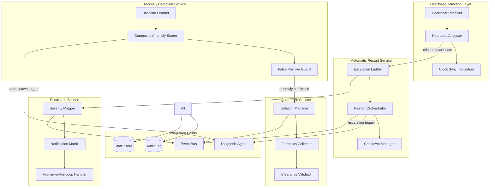
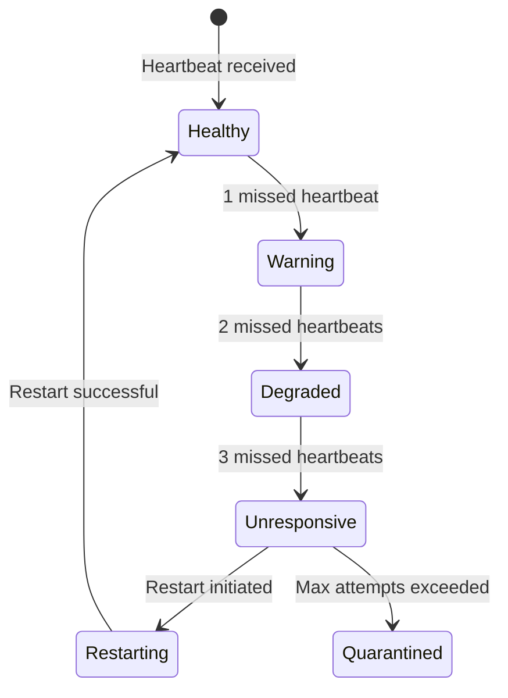
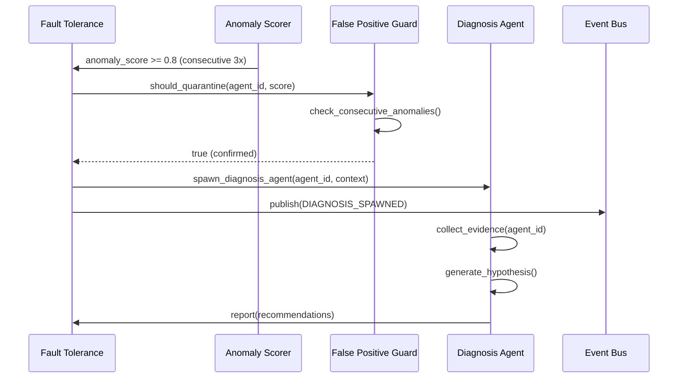

# Fault Tolerance Design Document

**Created**: 2025-11-20
**Status**: Review
**Purpose**: Technical design specification for the fault tolerance system, covering architecture, components, data flows, and integration points.
**Related**: docs/requirements/monitoring/fault_tolerance.md, docs/design/multi_agent_orchestration.md, docs/design/monitoring_architecture.md, docs/requirements/workflows/diagnosis_agent.md, docs/requirements/agents/lifecycle_management.md

---


## Document Overview

**Purpose and Scope**: This design document specifies the architecture, components, data flows, and implementation details for the fault tolerance system that provides heartbeat detection, automatic restart, anomaly detection, escalation, and quarantine protocols for resilient multi-agent operations.

**Target Audience**: AI spec agents (Kiro, Cursor, Cline), platform architects, and implementation teams responsible for ensuring system resilience and automated recovery in multi-agent workflows.

**Related Documents**:
- **Requirements**: [`docs/requirements/monitoring/fault_tolerance.md`](../requirements/monitoring/fault_tolerance.md)
- **Orchestration Design**: [`docs/design/multi_agent_orchestration.md`](./multi_agent_orchestration.md)
- **Monitoring Architecture Design**: [`docs/design/monitoring_architecture.md`](./monitoring_architecture.md)
- **Diagnosis Agent Requirements**: [`docs/requirements/workflows/diagnosis_agent.md`](../requirements/workflows/diagnosis_agent.md)
- **Agent Lifecycle Management Requirements**: [`docs/requirements/agents/lifecycle_management.md`](../requirements/agents/lifecycle_management.md)

---

## Architecture Overview

### High-Level Architecture



### Component Responsibilities

| Component | Layer | Primary Responsibility |
|-----------|-------|----------------------|
| **Heartbeat Receiver** | Detection | Receives and validates bidirectional heartbeats from agents |
| **Heartbeat Analyzer** | Detection | Detects missed heartbeats, sequence gaps, and clock skew |
| **Clock Synchronization** | Detection | Handles distributed clock tolerance and monotonic time comparison |
| **Escalation Ladder** | Restart | Implements 1→2→3 missed heartbeat escalation logic |
| **Restart Orchestrator** | Restart | Executes graceful stop, force terminate, spawn replacement, task reassignment |
| **Cooldown Manager** | Restart | Enforces restart cooldown periods and max attempt limits |
| **Baseline Learner** | Anomaly | Learns per-agent-type and phase baselines with decay after resurrection |
| **Composite Anomaly Scorer** | Anomaly | Computes anomaly_score from latency, error rate, resource skew, queue impact |
| **False Positive Guard** | Anomaly | Requires consecutive readings or peer confirmation before quarantine |
| **Severity Mapper** | Escalation | Maps incidents to SEV-1/2/3 based on impact criteria |
| **Notification Matrix** | Escalation | Publishes to Guardian, on-call channel, incident feed with context |
| **Human-in-the-Loop Handler** | Escalation | Manages SEV-1 acknowledgment SLA and auto-mitigation gates |
| **Isolation Manager** | Quarantine | Prevents new task assignments, checkpoints/aborts current task |
| **Forensics Collector** | Quarantine | Preserves memory, logs, metrics, event stream in immutable bundle |
| **Clearance Validator** | Quarantine | Validates quarantine clearance with smoke test and short TTL |
| **Diagnosis Agent Integration** | Integration | Auto-spawns Diagnosis Agent on anomaly or restart escalation |
| **Event Bus** | Integration | Emits AGENT_RESTARTED, QUARANTINE_INITIATED, ESCALATION_TRIGGERED events |
| **Audit Log** | Integration | Immutable audit trail for all escalations, quarantines, restarts |
| **State Store** | Integration | Persistent storage for heartbeat state, restart history, anomaly baselines |

### System Boundaries

**Inside Scope**:
- Heartbeat detection and analysis (bidirectional, TTL thresholds, gap detection, clock tolerance)
- Automatic restart protocol (escalation ladder, restart steps, cooldown, max attempts)
- Anomaly detection (composite scoring, baseline learning, false positive guards)
- Escalation procedures (severity mapping, notification matrix, human-in-the-loop)
- Quarantine protocol (isolation, forensics, clearance)
- Integration with Diagnosis Agent (auto-spawn triggers)
- Observability and SLO tracking (TTD, MTTR, auditability)

**Outside Scope** (assumed provided by other subsystems):
- Core Agent Registry and lifecycle management (see Agent Lifecycle Management design)
- Monitoring loop and Guardian/Conductor services (see Monitoring Architecture design)
- Task Queue and task reassignment logic (see Task Queue Management design)
- Underlying metrics/logging infrastructure (Prometheus, etc.)

---

## Component Details

### Heartbeat Detection Layer

#### Heartbeat Receiver

**Responsibilities**:
- Receives heartbeat messages from agents per REQ-FT-HB-001 (bidirectional heartbeats)
- Validates heartbeat message structure (agent_id, timestamp, sequence_number, status, checksum)
- Sends acknowledgments back to agents
- Tracks acknowledgment delivery; missing acknowledgments trigger retries and are observable

**Key Methods**:
- `receive_heartbeat(message: HeartbeatMessage) -> HeartbeatAck`
- `send_acknowledgment(agent_id: str, sequence_number: int) -> None`
- `track_acknowledgment_delivery(agent_id: str, ack_id: str) -> None`

**Implementation Pattern**:

```python
class HeartbeatReceiver:
    def __init__(self, event_bus: EventBus, state_store: StateStore):
        self.event_bus = event_bus
        self.state_store = state_store
        self.pending_acks: Dict[str, datetime] = {}

    async def receive_heartbeat(self, message: HeartbeatMessage) -> HeartbeatAck:
        # Validate checksum
        if not self._validate_checksum(message):
            raise InvalidHeartbeatError("Checksum mismatch")
        
        # Update agent heartbeat state
        await self.state_store.update_heartbeat(
            agent_id=message.agent_id,
            timestamp=message.timestamp,
            sequence_number=message.sequence_number,
            status=message.status
        )
        
        # Send acknowledgment
        ack = HeartbeatAck(
            agent_id=message.agent_id,
            sequence_number=message.sequence_number,
            received_at=datetime.utcnow()
        )
        await self._send_ack(ack)
        
        # Track for retry detection
        self.pending_acks[ack.ack_id] = datetime.utcnow()
        
        return ack
```

#### Heartbeat Analyzer

**Responsibilities**:
- Analyzes heartbeat patterns to detect missed heartbeats per REQ-FT-HB-003 (gap detection)
- Applies TTL thresholds per REQ-FT-HB-002 (IDLE: 30s, RUNNING: 15s, MONITOR: 15s)
- Detects sequence number gaps (3 consecutive misses → UNRESPONSIVE)
- Handles clock skew tolerance per REQ-FT-HB-004 (up to 2s, using monotonic time)

**Key Methods**:
- `analyze_heartbeat_gaps(agent_id: str) -> List[HeartbeatGap]`
- `check_ttl_threshold(agent_id: str, status: AgentStatus) -> bool`
- `detect_unresponsive(agent_id: str) -> bool`

**TTL Threshold Logic**:

```python
class HeartbeatAnalyzer:
    TTL_THRESHOLDS = {
        AgentStatus.IDLE: timedelta(seconds=30),
        AgentStatus.RUNNING: timedelta(seconds=15),
        AgentStatus.MONITOR: timedelta(seconds=15),  # watchdog layer
    }
    
    def __init__(self, state_store: StateStore, clock_tolerance: timedelta = timedelta(seconds=2)):
        self.state_store = state_store
        self.clock_tolerance = clock_tolerance
    
    async def check_ttl_threshold(self, agent_id: str) -> bool:
        agent = await self.state_store.get_agent(agent_id)
        if not agent.heartbeat_timestamp:
            return True  # No heartbeat ever received
        
        # Use monotonic time where available for clock skew tolerance
        now = time.monotonic() if hasattr(time, 'monotonic') else datetime.utcnow()
        last_heartbeat = agent.heartbeat_timestamp
        elapsed = now - last_heartbeat
        
        threshold = self.TTL_THRESHOLDS.get(agent.status, self.TTL_THRESHOLDS[AgentStatus.IDLE])
        return elapsed > (threshold + self.clock_tolerance)
    
    async def detect_unresponsive(self, agent_id: str) -> bool:
        gaps = await self.analyze_heartbeat_gaps(agent_id)
        consecutive_misses = sum(1 for gap in gaps[-3:] if gap.is_missed)
        return consecutive_misses >= 3
```

#### Clock Synchronization

**Responsibilities**:
- Handles distributed clock tolerance per REQ-FT-HB-004
- Compares timestamps using monotonic time where available
- Tracks clock skew between monitor and agent nodes

**Implementation**:

```python
class ClockSynchronization:
    MAX_CLOCK_SKEW = timedelta(seconds=2)
    
    def compare_timestamps(self, agent_time: datetime, monitor_time: datetime) -> timedelta:
        """Returns the difference accounting for clock skew tolerance."""
        if hasattr(time, 'monotonic'):
            # Use monotonic time for comparison
            return self._monotonic_diff(agent_time, monitor_time)
        else:
            diff = monitor_time - agent_time
            # Apply tolerance
            if abs(diff) <= self.MAX_CLOCK_SKEW:
                return timedelta(0)
            return diff
```

### Automatic Restart Service

#### Escalation Ladder

**Responsibilities**:
- Implements escalation ladder per REQ-FT-AR-001:
  - 1 missed heartbeat → warn
  - 2 missed heartbeats → DEGRADED status
  - 3 missed heartbeats → UNRESPONSIVE status and initiate restart

**State Machine**:



**Implementation**:

```python
class EscalationLadder:
    def __init__(self, state_store: StateStore, restart_orchestrator: RestartOrchestrator):
        self.state_store = state_store
        self.restart_orchestrator = restart_orchestrator
    
    async def process_missed_heartbeat(self, agent_id: str) -> None:
        agent = await self.state_store.get_agent(agent_id)
        missed_count = agent.consecutive_missed_heartbeats + 1
        
        if missed_count == 1:
            await self._warn(agent_id)
        elif missed_count == 2:
            await self.state_store.update_agent_status(agent_id, AgentStatus.DEGRADED)
            await self.event_bus.publish(AgentStatusChangedEvent(agent_id, AgentStatus.DEGRADED))
        elif missed_count >= 3:
            await self.state_store.update_agent_status(agent_id, AgentStatus.UNRESPONSIVE)
            await self.restart_orchestrator.initiate_restart(agent_id, reason="missed_heartbeats")
```

#### Restart Orchestrator

**Responsibilities**:
- Executes restart steps per REQ-FT-AR-002:
  1. Graceful stop (10s timeout)
  2. Force terminate if graceful fails
  3. Spawn replacement with same config
  4. Reassign incomplete tasks
  5. Emit AGENT_RESTARTED event with cause chain

**Key Methods**:
- `initiate_restart(agent_id: str, reason: str) -> RestartEvent`
- `graceful_stop(agent_id: str, timeout: timedelta) -> bool`
- `force_terminate(agent_id: str) -> None`
- `spawn_replacement(agent_id: str, config: AgentConfig) -> str`
- `reassign_tasks(old_agent_id: str, new_agent_id: str) -> List[str]`

**Implementation**:

```python
class RestartOrchestrator:
    GRACEFUL_STOP_TIMEOUT = timedelta(seconds=10)
    
    def __init__(
        self,
        agent_registry: AgentRegistry,
        task_queue: TaskQueue,
        event_bus: EventBus,
        state_store: StateStore
    ):
        self.agent_registry = agent_registry
        self.task_queue = task_queue
        self.event_bus = event_bus
        self.state_store = state_store
    
    async def initiate_restart(self, agent_id: str, reason: str) -> RestartEvent:
        agent = await self.state_store.get_agent(agent_id)
        
        # Step 1: Graceful stop
        graceful_success = await self.graceful_stop(agent_id, self.GRACEFUL_STOP_TIMEOUT)
        
        # Step 2: Force terminate if needed
        if not graceful_success:
            await self.force_terminate(agent_id)
        
        # Step 3: Spawn replacement
        new_agent_id = await self.spawn_replacement(agent_id, agent.config)
        
        # Step 4: Reassign tasks
        reassigned_tasks = await self.reassign_tasks(agent_id, new_agent_id)
        
        # Step 5: Emit event
        restart_event = RestartEvent(
            agent_id=agent_id,
            reason=reason,
            graceful_attempt_ms=int(self.GRACEFUL_STOP_TIMEOUT.total_seconds() * 1000),
            forced=not graceful_success,
            spawned_agent_id=new_agent_id,
            reassigned_tasks=reassigned_tasks,
            occurred_at=datetime.utcnow()
        )
        
        await self.event_bus.publish(AgentRestartedEvent(restart_event))
        await self.state_store.record_restart(restart_event)
        
        return restart_event
```

#### Cooldown Manager

**Responsibilities**:
- Enforces restart cooldown per REQ-FT-AR-003 (default 60s per lineage)
- Tracks max restart attempts per REQ-FT-AR-004 (default 3 per hour)
- Escalates to guardian when max attempts exceeded

**Implementation**:

```python
class CooldownManager:
    def __init__(self, config: FaultToleranceConfig, state_store: StateStore):
        self.restart_cooldown = config.restart_cooldown
        self.max_restart_attempts = config.max_restart_attempts
        self.escalation_window = config.escalation_window
        self.state_store = state_store
    
    async def can_restart(self, agent_id: str) -> tuple[bool, Optional[str]]:
        """Returns (can_restart, reason_if_not)."""
        agent = await self.state_store.get_agent(agent_id)
        
        # Check cooldown
        if agent.last_restart_at:
            elapsed = datetime.utcnow() - agent.last_restart_at
            if elapsed < self.restart_cooldown:
                return False, f"In cooldown period ({elapsed} < {self.restart_cooldown})"
        
        # Check max attempts
        recent_restarts = await self.state_store.count_restarts_in_window(
            agent_id, self.escalation_window
        )
        if recent_restarts >= self.max_restart_attempts:
            return False, f"Max restart attempts exceeded ({recent_restarts} >= {self.max_restart_attempts})"
        
        return True, None
    
    async def check_escalation(self, agent_id: str) -> bool:
        """Returns True if escalation to guardian is needed."""
        recent_restarts = await self.state_store.count_restarts_in_window(
            agent_id, self.escalation_window
        )
        return recent_restarts >= self.max_restart_attempts
```

### Anomaly Detection Service

#### Baseline Learner

**Responsibilities**:
- Learns per-agent-type and phase baselines per REQ-FT-AN-002
- Decays baselines after agent resurrection
- Maintains separate baselines for different agent phases (IDLE, RUNNING, etc.)

**Key Methods**:
- `learn_baseline(agent_id: str, agent_type: str, phase: str, metrics: Dict[str, float]) -> None`
- `get_baseline(agent_id: str, agent_type: str, phase: str) -> Dict[str, float]`
- `decay_baseline(agent_id: str, decay_factor: float = 0.9) -> None`

**Implementation**:

```python
class BaselineLearner:
    def __init__(self, state_store: StateStore):
        self.state_store = state_store
        self.baseline_decay_factor = 0.9  # Decay after resurrection
    
    async def learn_baseline(self, agent_id: str, agent_type: str, phase: str, metrics: Dict[str, float]) -> None:
        """Updates baseline using exponential moving average."""
        baseline = await self.state_store.get_baseline(agent_id, agent_type, phase)
        
        if baseline is None:
            # Initialize baseline
            baseline = metrics.copy()
        else:
            # EMA update: new_baseline = alpha * metrics + (1 - alpha) * baseline
            alpha = 0.1  # Learning rate
            for key, value in metrics.items():
                baseline[key] = alpha * value + (1 - alpha) * baseline.get(key, value)
        
        await self.state_store.update_baseline(agent_id, agent_type, phase, baseline)
    
    async def decay_baseline(self, agent_id: str) -> None:
        """Decays baseline after resurrection to allow re-learning."""
        baselines = await self.state_store.get_all_baselines(agent_id)
        for key, baseline in baselines.items():
            decayed = {k: v * self.baseline_decay_factor for k, v in baseline.items()}
            await self.state_store.update_baseline(agent_id, key[0], key[1], decayed)
```

#### Composite Anomaly Scorer

**Responsibilities**:
- Computes composite anomaly score per REQ-FT-AN-001 from:
  - Latency deviation (z-score)
  - Error rate trend (EMA)
  - Resource skew (CPU/Memory vs baseline)
  - Queue impact (blocked dependents)
- Threshold configurable (default 0.8)

**Key Methods**:
- `compute_anomaly_score(agent_id: str, metrics: Dict[str, float]) -> float`
- `compute_latency_z_score(agent_id: str, latency: float) -> float`
- `compute_error_rate_ema(agent_id: str, error_rate: float) -> float`
- `compute_resource_skew(agent_id: str, cpu: float, memory: float) -> float`
- `compute_queue_impact(agent_id: str) -> float`

**Implementation**:

```python
class CompositeAnomalyScorer:
    ANOMALY_THRESHOLD = 0.8  # Default from REQ-FT-AN-001
    
    # Weight distribution (sums to 1.0)
    LATENCY_WEIGHT = 0.35
    ERROR_RATE_WEIGHT = 0.30
    RESOURCE_SKEW_WEIGHT = 0.20
    QUEUE_IMPACT_WEIGHT = 0.15
    
    def __init__(self, baseline_learner: BaselineLearner, state_store: StateStore):
        self.baseline_learner = baseline_learner
        self.state_store = state_store
    
    async def compute_anomaly_score(self, agent_id: str, reading: AnomalyReading) -> float:
        """Computes composite anomaly score from reading components."""
        # Normalize each component to [0, 1] range
        latency_score = min(1.0, abs(reading.latency_z) / 3.0)  # z-score > 3 is extreme
        error_rate_score = min(1.0, reading.error_rate_ema)
        resource_score = min(1.0, reading.resource_skew)
        queue_score = min(1.0, reading.queue_impact)
        
        # Weighted combination
        composite = (
            self.LATENCY_WEIGHT * latency_score +
            self.ERROR_RATE_WEIGHT * error_rate_score +
            self.RESOURCE_SKEW_WEIGHT * resource_score +
            self.QUEUE_IMPACT_WEIGHT * queue_score
        )
        
        return min(1.0, composite)
    
    async def compute_latency_z_score(self, agent_id: str, latency: float) -> float:
        """Computes z-score for latency against baseline."""
        agent = await self.state_store.get_agent(agent_id)
        baseline = await self.baseline_learner.get_baseline(
            agent_id, agent.type, agent.status
        )
        
        baseline_latency = baseline.get('latency_ms', 0.0)
        baseline_std = baseline.get('latency_std', 1.0)
        
        if baseline_std == 0:
            return 0.0
        
        return (latency - baseline_latency) / baseline_std
```

#### False Positive Guard

**Responsibilities**:
- Requires consecutive `K` anomalous readings (default 3) OR peer-confirmation (watchdog) before quarantine per REQ-FT-AN-003
- Prevents false positives from transient issues

**Key Methods**:
- `check_consecutive_anomalies(agent_id: str, threshold: int = 3) -> bool`
- `check_peer_confirmation(agent_id: str) -> bool`
- `should_quarantine(agent_id: str, anomaly_score: float) -> bool`

**Implementation**:

```python
class FalsePositiveGuard:
    DEFAULT_CONSECUTIVE_THRESHOLD = 3  # From REQ-FT-AN-003
    
    def __init__(self, state_store: StateStore, watchdog_service: Optional[WatchdogService] = None):
        self.state_store = state_store
        self.watchdog_service = watchdog_service
    
    async def should_quarantine(self, agent_id: str, anomaly_score: float, threshold: float = 0.8) -> bool:
        """Returns True if quarantine should be initiated."""
        if anomaly_score < threshold:
            return False
        
        # Check consecutive readings
        consecutive = await self.check_consecutive_anomalies(agent_id, self.DEFAULT_CONSECUTIVE_THRESHOLD)
        if consecutive:
            return True
        
        # Check peer confirmation (watchdog)
        if self.watchdog_service:
            peer_confirmed = await self.check_peer_confirmation(agent_id)
            if peer_confirmed:
                return True
        
        return False
    
    async def check_consecutive_anomalies(self, agent_id: str, threshold: int) -> bool:
        """Checks if agent has K consecutive anomalous readings."""
        recent_readings = await self.state_store.get_recent_anomaly_readings(agent_id, limit=threshold)
        if len(recent_readings) < threshold:
            return False
        
        return all(
            reading.composite_score >= 0.8
            for reading in recent_readings[-threshold:]
        )
```

### Escalation Service

#### Severity Mapper

**Responsibilities**:
- Maps incidents to severity levels per REQ-FT-ES-001:
  - SEV-1: Multiple CRITICAL tasks blocked or guardian unavailable
  - SEV-2: Repeated restarts > threshold
  - SEV-3: Single agent chronic anomalies

**Key Methods**:
- `map_severity(incident: Incident) -> SeverityEnum`
- `check_critical_tasks_blocked(agent_id: str) -> bool`
- `check_guardian_availability() -> bool`

**Implementation**:

```python
class SeverityMapper:
    def __init__(self, state_store: StateStore, task_queue: TaskQueue):
        self.state_store = state_store
        self.task_queue = task_queue
    
    async def map_severity(self, incident: Incident) -> SeverityEnum:
        """Maps incident to severity level."""
        # SEV-1: Multiple CRITICAL tasks blocked or guardian unavailable
        if await self.check_critical_tasks_blocked(incident.agent_id):
            return SeverityEnum.CRITICAL
        
        if not await self.check_guardian_availability():
            return SeverityEnum.CRITICAL
        
        # SEV-2: Repeated restarts > threshold
        recent_restarts = await self.state_store.count_restarts_in_window(
            incident.agent_id, timedelta(hours=1)
        )
        if recent_restarts >= 3:
            return SeverityEnum.HIGH
        
        # SEV-3: Single agent chronic anomalies
        return SeverityEnum.MEDIUM
```

#### Notification Matrix

**Responsibilities**:
- Publishes notifications per REQ-FT-ES-002 to:
  - Guardian
  - On-call channel
  - Incident feed
- Includes: trace IDs, last N events, config snapshot, remediation hints

**Key Methods**:
- `publish_notification(escalation: EscalationNotice) -> None`
- `collect_context(agent_id: str, n_events: int = 10) -> Dict[str, Any]`

**Implementation**:

```python
class NotificationMatrix:
    def __init__(
        self,
        guardian_client: GuardianClient,
        oncall_client: OnCallClient,
        incident_feed: IncidentFeed,
        event_bus: EventBus
    ):
        self.guardian_client = guardian_client
        self.oncall_client = oncall_client
        self.incident_feed = incident_feed
        self.event_bus = event_bus
    
    async def publish_notification(self, escalation: EscalationNotice) -> None:
        """Publishes escalation to all channels."""
        context = await self.collect_context(escalation.agent_ids[0] if escalation.agent_ids else None)
        
        # Guardian
        await self.guardian_client.notify(escalation, context)
        
        # On-call channel
        await self.oncall_client.send_alert(escalation, context)
        
        # Incident feed
        await self.incident_feed.publish(escalation, context)
        
        # Event bus
        await self.event_bus.publish(EscalationTriggeredEvent(escalation))
    
    async def collect_context(self, agent_id: Optional[str], n_events: int = 10) -> Dict[str, Any]:
        """Collects context for escalation notification."""
        context = {
            'trace_ids': [],
            'recent_events': [],
            'config_snapshot': {},
            'remediation_hints': []
        }
        
        if agent_id:
            # Get trace IDs
            context['trace_ids'] = await self.state_store.get_trace_ids(agent_id)
            
            # Get recent events
            context['recent_events'] = await self.state_store.get_recent_events(agent_id, limit=n_events)
            
            # Get config snapshot
            agent = await self.state_store.get_agent(agent_id)
            context['config_snapshot'] = agent.config.dict() if hasattr(agent.config, 'dict') else {}
            
            # Generate remediation hints
            context['remediation_hints'] = await self._generate_remediation_hints(agent_id)
        
        return context
```

#### Human-in-the-Loop Handler

**Responsibilities**:
- Manages SEV-1 acknowledgment SLA per REQ-FT-ES-003 (default 5m)
- Auto-mitigations proceed regardless to contain blast radius
- Tracks acknowledgment status

**Key Methods**:
- `require_acknowledgment(escalation: EscalationNotice, sla: timedelta) -> None`
- `check_acknowledgment(escalation_id: str) -> bool`
- `proceed_with_auto_mitigation(escalation_id: str) -> None`

**Implementation**:

```python
class HumanInLoopHandler:
    DEFAULT_ACK_SLA = timedelta(minutes=5)  # From REQ-FT-ES-003
    
    def __init__(self, state_store: StateStore, event_bus: EventBus):
        self.state_store = state_store
        self.event_bus = event_bus
    
    async def require_acknowledgment(self, escalation: EscalationNotice, sla: timedelta = None) -> None:
        """Requires human acknowledgment for SEV-1 incidents."""
        if escalation.severity != SeverityEnum.CRITICAL:
            return  # Only SEV-1 requires acknowledgment
        
        sla = sla or self.DEFAULT_ACK_SLA
        deadline = datetime.utcnow() + sla
        
        await self.state_store.create_acknowledgment_request(
            escalation_id=escalation.id,
            deadline=deadline,
            sla=sla
        )
        
        # Start timer for auto-mitigation
        asyncio.create_task(self._wait_for_ack_or_timeout(escalation.id, sla))
    
    async def _wait_for_ack_or_timeout(self, escalation_id: str, sla: timedelta) -> None:
        """Waits for acknowledgment or proceeds with auto-mitigation after SLA."""
        await asyncio.sleep(sla.total_seconds())
        
        acked = await self.check_acknowledgment(escalation_id)
        if not acked:
            # Proceed with auto-mitigation regardless
            await self.proceed_with_auto_mitigation(escalation_id)
```

### Quarantine Service

#### Isolation Manager

**Responsibilities**:
- Prevents new task assignments to quarantined agents per REQ-FT-QN-001
- Checkpoints or aborts current task safely
- Updates agent status to QUARANTINED

**Key Methods**:
- `quarantine_agent(agent_id: str, reason: str) -> QuarantineRecord`
- `checkpoint_current_task(agent_id: str) -> Optional[str]`
- `abort_current_task(agent_id: str) -> None`
- `prevent_new_assignments(agent_id: str) -> None`

**Implementation**:

```python
class IsolationManager:
    def __init__(self, state_store: StateStore, task_queue: TaskQueue, event_bus: EventBus):
        self.state_store = state_store
        self.task_queue = task_queue
        self.event_bus = event_bus
    
    async def quarantine_agent(self, agent_id: str, reason: str) -> QuarantineRecord:
        """Isolates agent and prevents new task assignments."""
        # Update status
        await self.state_store.update_agent_status(agent_id, AgentStatus.QUARANTINED)
        
        # Prevent new assignments
        await self.prevent_new_assignments(agent_id)
        
        # Handle current task
        agent = await self.state_store.get_agent(agent_id)
        if agent.current_task_id:
            # Try checkpoint first, abort if that fails
            checkpoint_id = await self.checkpoint_current_task(agent_id)
            if not checkpoint_id:
                await self.abort_current_task(agent_id)
        
        # Create quarantine record
        quarantine = QuarantineRecord(
            agent_id=agent_id,
            initiated_at=datetime.utcnow(),
            reason=reason,
            evidence_bundle_uri=""  # Will be set by ForensicsCollector
        )
        
        await self.state_store.create_quarantine_record(quarantine)
        await self.event_bus.publish(QuarantineInitiatedEvent(quarantine))
        
        return quarantine
```

#### Forensics Collector

**Responsibilities**:
- Preserves memory, logs, metrics, and recent event stream per REQ-FT-QN-002
- Generates immutable case bundle
- Stores bundle URI in quarantine record

**Key Methods**:
- `collect_forensics(agent_id: str) -> str`  # Returns bundle URI
- `preserve_memory(agent_id: str) -> Dict[str, Any]`
- `preserve_logs(agent_id: str) -> str`
- `preserve_metrics(agent_id: str) -> Dict[str, Any]`
- `preserve_event_stream(agent_id: str) -> List[Dict[str, Any]]`

**Implementation**:

```python
class ForensicsCollector:
    def __init__(self, state_store: StateStore, log_store: LogStore, metric_store: MetricStore):
        self.state_store = state_store
        self.log_store = log_store
        self.metric_store = metric_store
    
    async def collect_forensics(self, agent_id: str) -> str:
        """Collects all forensics data and creates immutable bundle."""
        bundle = {
            'agent_id': agent_id,
            'collected_at': datetime.utcnow().isoformat(),
            'memory': await self.preserve_memory(agent_id),
            'logs': await self.preserve_logs(agent_id),
            'metrics': await self.preserve_metrics(agent_id),
            'event_stream': await self.preserve_event_stream(agent_id)
        }
        
        # Store as immutable bundle (e.g., in object storage)
        bundle_uri = await self._store_bundle(agent_id, bundle)
        
        # Update quarantine record
        await self.state_store.update_quarantine_bundle_uri(agent_id, bundle_uri)
        
        return bundle_uri
    
    async def preserve_memory(self, agent_id: str) -> Dict[str, Any]:
        """Preserves agent memory state."""
        agent = await self.state_store.get_agent(agent_id)
        return {
            'status': agent.status,
            'current_task_id': agent.current_task_id,
            'metadata': agent.metadata,
            'restart_count': agent.restart_count
        }
```

#### Clearance Validator

**Responsibilities**:
- Validates quarantine clearance per REQ-FT-QN-003
- Guardian may clear quarantine with evidence
- System must re-validate upon re-entry (smoke test + short TTL)

**Key Methods**:
- `clear_quarantine(agent_id: str, cleared_by: str, evidence: str) -> None`
- `validate_reentry(agent_id: str) -> bool`
- `run_smoke_test(agent_id: str) -> bool`

**Implementation**:

```python
class ClearanceValidator:
    REENTRY_TTL = timedelta(seconds=15)  # Short TTL for re-entry validation
    
    def __init__(self, state_store: StateStore, agent_registry: AgentRegistry):
        self.state_store = state_store
        self.agent_registry = agent_registry
    
    async def clear_quarantine(self, agent_id: str, cleared_by: str, evidence: str) -> None:
        """Clears quarantine and validates re-entry."""
        quarantine = await self.state_store.get_quarantine_record(agent_id)
        if not quarantine:
            raise ValueError(f"No quarantine record for agent {agent_id}")
        
        # Update quarantine record
        await self.state_store.update_quarantine_clearance(
            agent_id,
            cleared_at=datetime.utcnow(),
            cleared_by=cleared_by,
            evidence=evidence
        )
        
        # Validate re-entry
        if await self.validate_reentry(agent_id):
            # Restore agent to normal operation
            await self.state_store.update_agent_status(agent_id, AgentStatus.IDLE)
            await self.event_bus.publish(QuarantineClearedEvent(agent_id, cleared_by))
        else:
            raise ValidationError("Re-entry validation failed")
    
    async def validate_reentry(self, agent_id: str) -> bool:
        """Validates agent can safely re-enter normal operation."""
        # Run smoke test
        smoke_test_passed = await self.run_smoke_test(agent_id)
        if not smoke_test_passed:
            return False
        
        # Apply short TTL for initial monitoring
        await self.state_store.set_reentry_ttl(agent_id, self.REENTRY_TTL)
        
        return True
```

---

## Data Models

### Database Schemas

#### Heartbeat State Table

```sql
CREATE TABLE heartbeat_state (
    agent_id UUID PRIMARY KEY REFERENCES agents(id),
    last_heartbeat_timestamp TIMESTAMP WITH TIME ZONE NOT NULL,
    last_sequence_number INTEGER NOT NULL,
    consecutive_missed_count INTEGER DEFAULT 0,
    last_acknowledgment_timestamp TIMESTAMP WITH TIME ZONE,
    status VARCHAR(50) NOT NULL,
    clock_skew_ms FLOAT DEFAULT 0.0,
    updated_at TIMESTAMP WITH TIME ZONE DEFAULT NOW(),
    
    INDEX idx_heartbeat_timestamp (last_heartbeat_timestamp),
    INDEX idx_status (status)
);
```

#### Restart History Table

```sql
CREATE TABLE restart_history (
    id UUID PRIMARY KEY DEFAULT gen_random_uuid(),
    agent_id UUID NOT NULL REFERENCES agents(id),
    reason TEXT NOT NULL,
    graceful_attempt_ms INTEGER NOT NULL,
    forced BOOLEAN DEFAULT FALSE,
    spawned_agent_id UUID REFERENCES agents(id),
    reassigned_tasks UUID[] DEFAULT ARRAY[]::UUID[],
    occurred_at TIMESTAMP WITH TIME ZONE DEFAULT NOW(),
    lineage_id UUID,  -- Tracks restart lineage for cooldown
    
    INDEX idx_agent_id (agent_id),
    INDEX idx_occurred_at (occurred_at),
    INDEX idx_lineage_id (lineage_id)
);
```

#### Anomaly Baselines Table

```sql
CREATE TABLE anomaly_baselines (
    id UUID PRIMARY KEY DEFAULT gen_random_uuid(),
    agent_id UUID NOT NULL REFERENCES agents(id),
    agent_type VARCHAR(50) NOT NULL,
    phase VARCHAR(50) NOT NULL,  -- IDLE, RUNNING, etc.
    baseline_metrics JSONB NOT NULL,  -- {latency_ms: 100.0, latency_std: 10.0, error_rate: 0.01, ...}
    learned_at TIMESTAMP WITH TIME ZONE DEFAULT NOW(),
    updated_at TIMESTAMP WITH TIME ZONE DEFAULT NOW(),
    
    UNIQUE(agent_id, agent_type, phase),
    INDEX idx_agent_type_phase (agent_type, phase)
);
```

#### Anomaly Readings Table

```sql
CREATE TABLE anomaly_readings (
    id UUID PRIMARY KEY DEFAULT gen_random_uuid(),
    agent_id UUID NOT NULL REFERENCES agents(id),
    timestamp TIMESTAMP WITH TIME ZONE DEFAULT NOW(),
    latency_z FLOAT DEFAULT 0.0,
    error_rate_ema FLOAT DEFAULT 0.0,
    resource_skew FLOAT DEFAULT 0.0,
    queue_impact FLOAT DEFAULT 0.0,
    composite_score FLOAT NOT NULL,
    is_anomalous BOOLEAN GENERATED ALWAYS AS (composite_score >= 0.8) STORED,
    
    INDEX idx_agent_id_timestamp (agent_id, timestamp DESC),
    INDEX idx_composite_score (composite_score),
    INDEX idx_is_anomalous (is_anomalous)
);
```

#### Escalation Records Table

```sql
CREATE TABLE escalation_records (
    id UUID PRIMARY KEY DEFAULT gen_random_uuid(),
    agent_id UUID NOT NULL REFERENCES agents(id),
    severity VARCHAR(20) NOT NULL,  -- CRITICAL, HIGH, MEDIUM, LOW
    summary TEXT NOT NULL,
    trace_ids UUID[] DEFAULT ARRAY[]::UUID[],
    recent_events JSONB DEFAULT '[]'::JSONB,
    config_snapshot JSONB DEFAULT '{}'::JSONB,
    remediation_hints TEXT[] DEFAULT ARRAY[]::TEXT[],
    acknowledged BOOLEAN DEFAULT FALSE,
    acknowledged_by VARCHAR(255),
    acknowledged_at TIMESTAMP WITH TIME ZONE,
    ack_sla_deadline TIMESTAMP WITH TIME ZONE,
    created_at TIMESTAMP WITH TIME ZONE DEFAULT NOW(),
    
    INDEX idx_agent_id (agent_id),
    INDEX idx_severity (severity),
    INDEX idx_created_at (created_at),
    INDEX idx_acknowledged (acknowledged)
);
```

#### Quarantine Records Table

```sql
CREATE TABLE quarantine_records (
    id UUID PRIMARY KEY DEFAULT gen_random_uuid(),
    agent_id UUID NOT NULL REFERENCES agents(id) UNIQUE,
    initiated_at TIMESTAMP WITH TIME ZONE DEFAULT NOW(),
    reason TEXT NOT NULL,
    evidence_bundle_uri TEXT,
    cleared_at TIMESTAMP WITH TIME ZONE,
    cleared_by VARCHAR(255),
    clearance_evidence TEXT,
    reentry_ttl_seconds INTEGER,
    reentry_validated BOOLEAN DEFAULT FALSE,
    
    INDEX idx_agent_id (agent_id),
    INDEX idx_initiated_at (initiated_at),
    INDEX idx_cleared_at (cleared_at)
);
```

#### Audit Log Table

```sql
CREATE TABLE fault_tolerance_audit_log (
    id UUID PRIMARY KEY DEFAULT gen_random_uuid(),
    event_type VARCHAR(50) NOT NULL,  -- RESTART, QUARANTINE, ESCALATION, CLEARANCE
    agent_id UUID REFERENCES agents(id),
    actor VARCHAR(255),  -- System, Guardian, Human user
    reason TEXT NOT NULL,
    details JSONB DEFAULT '{}'::JSONB,
    occurred_at TIMESTAMP WITH TIME ZONE DEFAULT NOW(),
    
    INDEX idx_event_type (event_type),
    INDEX idx_agent_id (agent_id),
    INDEX idx_occurred_at (occurred_at)
);
```

### Pydantic Models

The following Pydantic models match the requirements document:

```python
from __future__ import annotations
from datetime import datetime, timedelta
from enum import Enum
from typing import Any, Dict, List, Optional
from pydantic import BaseModel, Field
import uuid


class AgentStatus(str, Enum):
    IDLE = "IDLE"
    RUNNING = "RUNNING"
    DEGRADED = "DEGRADED"
    UNRESPONSIVE = "UNRESPONSIVE"
    QUARANTINED = "QUARANTINED"
    TERMINATED = "TERMINATED"


class SeverityEnum(str, Enum):
    CRITICAL = "CRITICAL"
    HIGH = "HIGH"
    MEDIUM = "MEDIUM"
    LOW = "LOW"


class HeartbeatMessage(BaseModel):
    agent_id: str
    timestamp: datetime
    sequence_number: int
    status: AgentStatus
    current_task_id: Optional[str] = None
    health_metrics: Dict[str, Any] = Field(default_factory=dict)
    checksum: str


class HeartbeatAck(BaseModel):
    agent_id: str
    sequence_number: int
    received_at: datetime
    ack_id: str = Field(default_factory=lambda: str(uuid.uuid4()))


class RestartEvent(BaseModel):
    agent_id: str
    reason: str
    graceful_attempt_ms: int = 10000
    forced: bool = False
    spawned_agent_id: Optional[str] = None
    reassigned_tasks: List[str] = Field(default_factory=list)
    occurred_at: datetime


class AnomalyReading(BaseModel):
    agent_id: str
    timestamp: datetime
    latency_z: float = 0.0
    error_rate_ema: float = 0.0
    resource_skew: float = 0.0
    queue_impact: float = 0.0

    @property
    def composite_score(self) -> float:
        """Computes composite anomaly score from components."""
        return min(
            1.0,
            0.35 * abs(self.latency_z) / 3.0 +  # Normalize z-score
            0.30 * self.error_rate_ema +
            0.20 * self.resource_skew +
            0.15 * self.queue_impact
        )


class EscalationNotice(BaseModel):
    severity: SeverityEnum
    agent_ids: List[str] = Field(default_factory=list)
    summary: str
    trace_ids: List[str] = Field(default_factory=list)
    recent_events: List[Dict[str, Any]] = Field(default_factory=list)
    config_snapshot: Dict[str, Any] = Field(default_factory=dict)
    created_at: datetime
    id: str = Field(default_factory=lambda: str(uuid.uuid4()))


class QuarantineRecord(BaseModel):
    agent_id: str
    initiated_at: datetime
    reason: str
    evidence_bundle_uri: str
    cleared_at: Optional[datetime] = None
    cleared_by: Optional[str] = None
    clearance_evidence: Optional[str] = None


class FaultToleranceConfig(BaseModel):
    """Configuration for fault tolerance system."""
    restart_cooldown: timedelta = timedelta(seconds=60)
    max_restart_attempts: int = 3
    escalation_window: timedelta = timedelta(hours=1)
    anomaly_threshold: float = 0.8
    anomaly_consecutive: int = 3
    ack_sla: timedelta = timedelta(minutes=5)
    diag_on_anomaly: bool = True
    diag_on_restart_escalation: bool = True
    
    # TTL thresholds
    idle_ttl: timedelta = timedelta(seconds=30)
    running_ttl: timedelta = timedelta(seconds=15)
    monitor_ttl: timedelta = timedelta(seconds=15)
    clock_tolerance: timedelta = timedelta(seconds=2)
```

---

## API Specifications

### Heartbeat API

#### POST /api/fault-tolerance/heartbeat

Receives heartbeat from agent and returns acknowledgment.

**Request Body**:
```json
{
  "agent_id": "uuid",
  "timestamp": "2025-01-16T10:00:00Z",
  "sequence_number": 42,
  "status": "RUNNING",
  "current_task_id": "uuid",
  "health_metrics": {
    "cpu_percent": 45.2,
    "memory_mb": 512
  },
  "checksum": "sha256_hash"
}
```

**Response**: `200 OK`
```json
{
  "agent_id": "uuid",
  "sequence_number": 42,
  "received_at": "2025-01-16T10:00:00.123Z",
  "ack_id": "uuid"
}
```

**Error Responses**:
- `400 Bad Request`: Invalid heartbeat message (checksum mismatch, missing fields)
- `404 Not Found`: Agent not registered

### Restart API

#### POST /api/fault-tolerance/restart/{agent_id}

Manually trigger restart for an agent (admin only).

**Request Body**:
```json
{
  "reason": "Manual intervention requested",
  "force": false
}
```

**Response**: `202 Accepted`
```json
{
  "restart_event_id": "uuid",
  "agent_id": "uuid",
  "status": "restart_initiated"
}
```

### Quarantine API

#### POST /api/fault-tolerance/quarantine/{agent_id}

Manually quarantine an agent (admin only).

**Request Body**:
```json
{
  "reason": "Suspected security issue"
}
```

**Response**: `200 OK`
```json
{
  "quarantine_id": "uuid",
  "agent_id": "uuid",
  "initiated_at": "2025-01-16T10:00:00Z",
  "evidence_bundle_uri": "s3://bucket/evidence-bundle-uuid.tar.gz"
}
```

#### DELETE /api/fault-tolerance/quarantine/{agent_id}

Clear quarantine for an agent (requires Guardian approval).

**Request Body**:
```json
{
  "cleared_by": "guardian_agent_id",
  "evidence": "Root cause identified and fixed"
}
```

**Response**: `200 OK`
```json
{
  "agent_id": "uuid",
  "cleared_at": "2025-01-16T10:05:00Z",
  "reentry_validated": true
}
```

### Escalation API

#### GET /api/fault-tolerance/escalations

List active escalations.

**Query Parameters**:
- `severity`: Filter by severity (CRITICAL, HIGH, MEDIUM, LOW)
- `agent_id`: Filter by agent ID
- `acknowledged`: Filter by acknowledgment status (true/false)

**Response**: `200 OK`
```json
{
  "escalations": [
    {
      "id": "uuid",
      "agent_id": "uuid",
      "severity": "CRITICAL",
      "summary": "Multiple CRITICAL tasks blocked",
      "created_at": "2025-01-16T10:00:00Z",
      "acknowledged": false,
      "ack_sla_deadline": "2025-01-16T10:05:00Z"
    }
  ]
}
```

#### POST /api/fault-tolerance/escalations/{escalation_id}/acknowledge

Acknowledge a SEV-1 escalation.

**Request Body**:
```json
{
  "acknowledged_by": "user@example.com",
  "notes": "Investigating root cause"
}
```

**Response**: `200 OK`
```json
{
  "escalation_id": "uuid",
  "acknowledged": true,
  "acknowledged_at": "2025-01-16T10:01:00Z"
}
```

### Status API

#### GET /api/fault-tolerance/status/{agent_id}

Get fault tolerance status for an agent.

**Response**: `200 OK`
```json
{
  "agent_id": "uuid",
  "heartbeat_status": {
    "last_heartbeat": "2025-01-16T10:00:00Z",
    "consecutive_missed": 0,
    "status": "HEALTHY"
  },
  "restart_history": {
    "total_restarts": 2,
    "recent_restarts": 1,
    "last_restart": "2025-01-16T09:00:00Z"
  },
  "anomaly_status": {
    "current_score": 0.3,
    "baseline_learned": true,
    "recent_anomalies": 0
  },
  "quarantine_status": {
    "is_quarantined": false
  }
}
```

---

## Integration Points

### Diagnosis Agent Integration

#### REQ-FT-DIAG-001: Auto-Spawn on Anomaly

When `anomaly_score >= ANOMALY_THRESHOLD` for `ANOMALY_CONSECUTIVE` readings AND `DIAG_ON_ANOMALY=true`, the system automatically spawns a Diagnosis Agent.

**Integration Flow**:



**Implementation**:

```python
class DiagnosisAgentIntegration:
    def __init__(self, diagnosis_service: DiagnosisService, config: FaultToleranceConfig):
        self.diagnosis_service = diagnosis_service
        self.config = config
    
    async def handle_anomaly_trigger(self, agent_id: str, anomaly_score: float) -> None:
        """Auto-spawns Diagnosis Agent on persistent anomaly."""
        if not self.config.diag_on_anomaly:
            return
        
        if anomaly_score < self.config.anomaly_threshold:
            return
        
        # Check consecutive readings
        consecutive = await self._check_consecutive_anomalies(agent_id)
        if not consecutive:
            return
        
        # Spawn Diagnosis Agent
        context = await self._build_diagnosis_context(agent_id)
        diagnosis_id = await self.diagnosis_service.start_diagnosis(
            agent_id=agent_id,
            trigger="anomaly_detection",
            context=context
        )
        
        await self.event_bus.publish(
            DiagnosisSpawnedEvent(agent_id, diagnosis_id, "anomaly_detection")
        )
```

#### REQ-FT-DIAG-002: Auto-Spawn on Restart Escalation

When restart attempts exceed `MAX_RESTART_ATTEMPTS` within `ESCALATION_WINDOW` AND `DIAG_ON_RESTART_ESCALATION=true`, the system spawns a Diagnosis Agent focusing on systemic failure causes.

**Implementation**:

```python
async def handle_restart_escalation(self, agent_id: str) -> None:
    """Auto-spawns Diagnosis Agent on restart escalation."""
    if not self.config.diag_on_restart_escalation:
        return
    
    # Check if escalation threshold exceeded
    recent_restarts = await self.state_store.count_restarts_in_window(
        agent_id, self.config.escalation_window
    )
    if recent_restarts < self.config.max_restart_attempts:
        return
    
    # Spawn Diagnosis Agent with systemic focus
    context = await self._build_systemic_diagnosis_context(agent_id)
    diagnosis_id = await self.diagnosis_service.start_diagnosis(
        agent_id=agent_id,
        trigger="restart_escalation",
        context=context,
        focus="systemic_failure"
    )
    
    await self.event_bus.publish(
        DiagnosisSpawnedEvent(agent_id, diagnosis_id, "restart_escalation")
    )
```

### Event Bus Integration

The Fault Tolerance system emits the following events:

| Event Type | Payload | When Emitted |
|------------|---------|--------------|
| `AGENT_RESTARTED` | `RestartEvent` | After successful restart |
| `QUARANTINE_INITIATED` | `QuarantineRecord` | When agent is quarantined |
| `QUARANTINE_CLEARED` | `{agent_id, cleared_by}` | When quarantine is cleared |
| `ESCALATION_TRIGGERED` | `EscalationNotice` | When escalation is created |
| `HEARTBEAT_MISSED` | `{agent_id, missed_count}` | When heartbeat missed |
| `ANOMALY_DETECTED` | `AnomalyReading` | When anomaly score exceeds threshold |
| `DIAGNOSIS_SPAWNED` | `{agent_id, diagnosis_id, trigger}` | When Diagnosis Agent is auto-spawned |

### Monitoring Architecture Integration

The Fault Tolerance system integrates with the Monitoring Architecture:

- **Guardian Service**: Receives escalation notifications and can manually clear quarantines
- **Conductor Service**: Receives system-wide fault tolerance metrics for coherence scoring
- **Trajectory Context Builder**: Includes fault tolerance status (restart count, anomaly score) in agent context

---

## Implementation Details

### Algorithms

#### Composite Anomaly Score Algorithm

```python
def compute_composite_anomaly_score(reading: AnomalyReading) -> float:
    """
    Computes composite anomaly score from multiple signals.
    
    Weights:
    - Latency deviation (z-score): 35%
    - Error rate trend (EMA): 30%
    - Resource skew: 20%
    - Queue impact: 15%
    """
    # Normalize latency z-score (assume > 3 is extreme)
    latency_norm = min(1.0, abs(reading.latency_z) / 3.0)
    
    # Error rate is already normalized [0, 1]
    error_norm = min(1.0, reading.error_rate_ema)
    
    # Resource skew is already normalized [0, 1]
    resource_norm = min(1.0, reading.resource_skew)
    
    # Queue impact is already normalized [0, 1]
    queue_norm = min(1.0, reading.queue_impact)
    
    # Weighted combination
    composite = (
        0.35 * latency_norm +
        0.30 * error_norm +
        0.20 * resource_norm +
        0.15 * queue_norm
    )
    
    return min(1.0, composite)
```

#### Baseline Learning Algorithm

```python
def update_baseline(
    current_baseline: Dict[str, float],
    new_metrics: Dict[str, float],
    alpha: float = 0.1
) -> Dict[str, float]:
    """
    Updates baseline using exponential moving average.
    
    EMA: new_baseline = alpha * new_metrics + (1 - alpha) * current_baseline
    """
    if not current_baseline:
        return new_metrics.copy()
    
    updated = {}
    for key, value in new_metrics.items():
        old_value = current_baseline.get(key, value)
        updated[key] = alpha * value + (1 - alpha) * old_value
    
    return updated
```

### Performance Considerations

1. **Heartbeat Processing**: Use async I/O and connection pooling for high-throughput heartbeat processing
2. **Baseline Learning**: Batch baseline updates to reduce database writes
3. **Anomaly Detection**: Cache recent readings in memory with TTL to avoid repeated database queries
4. **Restart Orchestration**: Parallelize task reassignment where possible
5. **Forensics Collection**: Stream large log/metrics data to object storage rather than loading into memory

### Configuration Reference

All configuration parameters from REQ-FT-* are documented in the `FaultToleranceConfig` Pydantic model. Default values match requirements:

| Parameter | Default | Source Requirement |
|-----------|---------|-------------------|
| `restart_cooldown` | 60s | REQ-FT-AR-003 |
| `max_restart_attempts` | 3 | REQ-FT-AR-004 |
| `escalation_window` | 1h | REQ-FT-AR-004 |
| `anomaly_threshold` | 0.8 | REQ-FT-AN-001 |
| `anomaly_consecutive` | 3 | REQ-FT-AN-003 |
| `ack_sla` | 5m | REQ-FT-ES-003 |
| `idle_ttl` | 30s | REQ-FT-HB-002 |
| `running_ttl` | 15s | REQ-FT-HB-002 |
| `monitor_ttl` | 15s | REQ-FT-HB-002 |
| `clock_tolerance` | 2s | REQ-FT-HB-004 |
| `diag_on_anomaly` | true | REQ-FT-DIAG-001 |
| `diag_on_restart_escalation` | true | REQ-FT-DIAG-002 |

### Error Handling Strategies

1. **Heartbeat Receiver Failures**: Log and continue; missing heartbeats will be detected by analyzer
2. **Restart Orchestration Failures**: Retry with exponential backoff; escalate to guardian after max retries
3. **Anomaly Detection Failures**: Fall back to simple threshold-based detection; log error
4. **Forensics Collection Failures**: Retry with partial data; log what was successfully collected
5. **Database Failures**: Use circuit breaker pattern; queue operations for retry when DB recovers

### Observability and SLOs

#### Time-to-Detect (TTD)

**REQ-FT-OB-001**: P95 TTD for missed heartbeats < 20s (worker), < 10s (monitor by watchdog).

**Implementation**:
- Heartbeat analyzer runs every 5s for monitors, every 10s for workers
- Use efficient database queries with indexes on `last_heartbeat_timestamp`
- Track TTD metrics in Prometheus: `fault_tolerance_ttd_seconds{agent_type}`

#### Mean Time to Recover (MTTR)

**REQ-FT-OB-002**: Mean time to recover from single agent failure < 60s.

**Implementation**:
- Optimize restart steps (parallelize where possible)
- Pre-warm replacement agents when possible
- Track MTTR metrics: `fault_tolerance_mttr_seconds`

#### Auditability

**REQ-FT-OB-003**: All escalations, quarantines, and restarts MUST be audited with actor and reason.

**Implementation**:
- All fault tolerance operations write to `fault_tolerance_audit_log` table
- Include actor (System, Guardian, Human user), reason, and full context
- Immutable audit log with retention policy

---

## Related Documents

- **Requirements**: [`docs/requirements/monitoring/fault_tolerance.md`](../requirements/monitoring/fault_tolerance.md)
- **Orchestration Design**: [`docs/design/multi_agent_orchestration.md`](./multi_agent_orchestration.md)
- **Monitoring Architecture Design**: [`docs/design/monitoring_architecture.md`](./monitoring_architecture.md)
- **Diagnosis Agent Requirements**: [`docs/requirements/workflows/diagnosis_agent.md`](../requirements/workflows/diagnosis_agent.md)
- **Agent Lifecycle Management Requirements**: [`docs/requirements/agents/lifecycle_management.md`](../requirements/agents/lifecycle_management.md)
- **Task Queue Management Design**: [`docs/design/task_queue_management.md`](./task_queue_management.md) (for task reassignment)

---

**Document Status**: Complete  
**Last Updated**: 2025-01-16  
**Version**: 1.0

