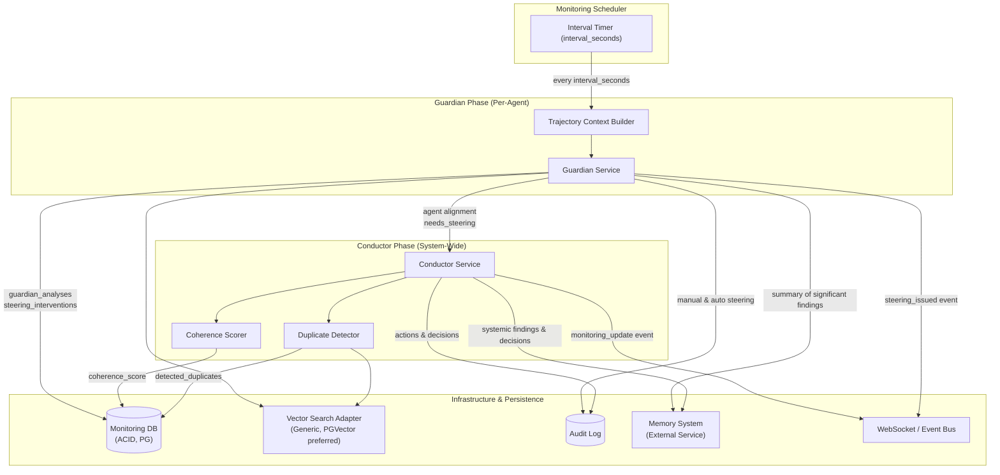

# Monitoring Architecture Design Document

**Created**: 2025-11-20
**Status**: Draft
**Purpose**: Specifies the architecture, components, data flows, and implementation details for the monitoring stack overseeing multi-agent workflows.
**Related**: docs/requirements/monitoring/monitoring_architecture.md, docs/design/multi_agent_orchestration.md, docs/requirements/monitoring/fault_tolerance.md, docs/requirements/workflows/validation_system.md, docs/requirements/workflows/diagnosis_agent.md, docs/design/workspace_isolation_system.md

---


## Document Overview

**Purpose and Scope**: This design document specifies the architecture, components, data flows, and implementation details for the monitoring stack that provides continuous oversight of multi-agent workflows. It covers the periodic monitoring loop, Guardian and Conductor services, data persistence, APIs, WebSocket events, configuration, SLOs, security/audit, and Memory System integration.

**Target Audience**: AI spec agents (Kiro, Cursor, Cline), platform architects, and implementation teams responsible for observability, monitoring, and governance of multi-agent workflows.

**Related Documents**:
- **Requirements**: [`docs/requirements/monitoring/monitoring_architecture.md`](../requirements/monitoring/monitoring_architecture.md)
- **Orchestration Design**: [`docs/design/multi_agent_orchestration.md`](./multi_agent_orchestration.md)
- **Fault Tolerance Requirements**: [`docs/requirements/monitoring/fault_tolerance.md`](../requirements/monitoring/fault_tolerance.md)
- **Validation System Requirements**: [`docs/requirements/workflows/validation_system.md`](../requirements/workflows/validation_system.md)
- **Diagnosis Agent Requirements**: [`docs/requirements/workflows/diagnosis_agent.md`](../requirements/workflows/diagnosis_agent.md)
- **Workspace Isolation Design**: [`docs/design/workspace_isolation_system.md`](./workspace_isolation_system.md) (for deployment/workspace patterns)

---

## Architecture Overview

### High-Level Architecture



### Component Responsibilities

| Component                       | Layer              | Primary Responsibility                                                                 |
|--------------------------------|--------------------|----------------------------------------------------------------------------------------|
| **Monitoring Scheduler**       | Monitoring         | Triggers monitoring loop every `interval_seconds` with failure-tolerant cadence       |
| **Trajectory Context Builder** | Monitoring         | Builds per-agent context from logs, summaries, status, metrics                        |
| **Guardian Service**           | Monitoring         | Per-agent analysis, alignment scoring, steering decisions, per-agent interventions    |
| **Conductor Service**          | Monitoring         | System-wide coherence scoring, duplicate detection, high-level actions                |
| **Duplicate Detector**         | Monitoring         | Detects duplicate or overlapping agent work across resources                          |
| **Vector Search Adapter**      | Infrastructure     | Provider-agnostic semantic similarity, PGVector preferred implementation              |
| **Monitoring DB**              | Infrastructure     | ACID persistence for analyses, interventions, duplicates, coherence results           |
| **Audit Log**                  | Infrastructure     | Immutable audit trail for steering and high-impact decisions                          |
| **Monitoring API Service**     | API Layer          | Exposes `/api/agent_trajectories`, `/api/system_coherence`, `/api/steer_agent`        |
| **WebSocket/Event Bus**        | Observability      | Emits `monitoring_update` and `steering_issued` events                                |
| **Memory Integration Worker**  | Integration        | Summarizes significant Guardian/Conductor findings into Memory System entries         |

### System Boundaries

**Inside Scope**:
- Monitoring loop scheduling and execution
- Guardian and Conductor logic, including vector search and persistence
- HTTP APIs and WebSocket events defined in requirements
- Integration adapters for vector search and Memory System

**Outside Scope** (assumed provided by other subsystems):
- Core Agent Registry, Task Queue, and Orchestrator (see `multi_agent_orchestration.md`)
- Fault tolerance restart/escalation logic (see Fault Tolerance design)
- Underlying logging/metrics infrastructure (Prometheus, etc.)

---

## Component Details

### Monitoring Scheduler

**Responsibilities**:
- Executes the monitoring loop every `monitoring.interval_seconds` (default: 60s) per REQ-MON-LOOP-001
- Orchestrates phases in order: GuardianPhase → ConductorPhase → Persistence per REQ-MON-LOOP-002
- Enforces REQ-MON-LOOP-003: if any phase fails, log and emit alert but do not block next cycle

**Key Behaviors**:
- Uses async tasks or dedicated worker process to run `run_monitoring_cycle()` with bounded runtime
- Records per-cycle metrics (duration, failures) to support SLOs

**Implementation Pattern**:

```python
class MonitoringScheduler:
    def __init__(self, config: MonitoringConfig, guardian: GuardianService, conductor: ConductorService):
        self.config = config
        self.guardian = guardian
        self.conductor = conductor
        self.logger = logger.get(__name__)

    async def run_forever(self) -> None:
        while True:
            start = time.monotonic()
            try:
                await self.run_cycle()
            except Exception as exc:
                self.logger.exception("monitoring.cycle_failed", exc_info=exc)
            elapsed = time.monotonic() - start
            sleep_for = max(0, self.config.interval_seconds - elapsed)
            await asyncio.sleep(sleep_for)

    async def run_cycle(self) -> None:
        ctx = MonitoringContext()
        try:
            await self.guardian.run_phase(ctx)   # per-agent parallel
        except Exception:
            ctx.mark_guardian_failed()

        try:
            await self.conductor.run_phase(ctx)  # system-wide
        except Exception:
            ctx.mark_conductor_failed()

        await self._persist_cycle(ctx)
        await self._emit_events(ctx)
```

### Trajectory Context Builder

**Responsibilities**:
- Builds per-agent context from inputs per REQ-MON-GRD-001:
  - Recent agent logs (tail of log files or log index)
  - Prior summaries (e.g., last N Guardian summaries)
  - Agent status (lifecycle state, task association)
  - Resource metrics (CPU, memory, rate metrics, error counts)

**Outputs**:
- `AgentTrajectoryContext` objects for all active agents

**Data Model**:

```python
class AgentTrajectoryContext(BaseModel):
    agent_id: str
    age_seconds: int
    logs_snippet: str
    prior_summaries: list[str]
    status: str
    resource_metrics: dict[str, float]
```

**Key Behaviors**:
- Enforces `guardian.min_agent_age` grace period by calculating `age_seconds`
- Truncates logs to `guardian.context_history_lines` (default: 200 lines)

### Guardian Service

**Responsibilities**:
- For each agent (parallelizable when `monitoring.parallel_analysis` is true):
  - Analyzes `AgentTrajectoryContext`
  - Produces `GuardianAnalysis` with `alignment_score`, `trajectory_summary`, `needs_steering`, and optional steering suggestion per REQ-MON-GRD-002
- Respects grace period `guardian.min_agent_age` (REQ-MON-GRD-003): before this age, scores are computed but do not trigger actions

**Key Methods**:
- `run_phase(ctx: MonitoringContext)` – orchestrates per-agent analysis
- `analyze_agent(ctx: AgentTrajectoryContext) -> GuardianAnalysis`
- `apply_auto_steering(analysis: GuardianAnalysis)` when allowed by policy

**Data Model**:

```python
class GuardianAnalysis(BaseModel):
    agent_id: str
    alignment_score: float  # 0.0–1.0
    trajectory_summary: str
    needs_steering: bool
    steering_type: Optional[str] = None
    steering_message: Optional[str] = None
    created_at: datetime
```

**Grace Period Handling**:
- If `age_seconds < guardian.min_agent_age`, set `needs_steering = False` even if score is low, but still persist the analysis

**Steering**:
- Auto-steering is an implementation detail governed by configuration; all steering (manual + auto) must be audited per REQ-MON-SEC-001

### Conductor Service

**Responsibilities**:
- Consumes recent Guardian outputs to compute a system coherence score (REQ-MON-CND-001)
- Detects duplicates by comparing agent work descriptions and touched resources (REQ-MON-CND-002); detected duplicates MUST be persisted
- Produces suggested or automated actions (e.g., terminate duplicate tasks, redistribute work, escalate) with full auditability per REQ-MON-CND-003 and REQ-MON-SEC-001

**Key Methods**:
- `run_phase(ctx: MonitoringContext)`
- `compute_coherence(guardian_analyses: list[GuardianAnalysis]) -> float`
- `detect_duplicates(guardian_analyses) -> list[DuplicatePair]`
- `determine_actions(coherence_score, duplicates) -> list[ConductorAction]`

**Data Model**:

```python
class ConductorAction(BaseModel):
    action_type: str  # e.g. "SUGGEST_TERMINATE", "REDISTRIBUTE", "ESCALATE"
    reason: str
    target_agent_ids: list[str]
    metadata: dict[str, Any] = {}
```

**Coherence Scoring**:
- Based on alignment dispersion and semantic similarity of trajectories; exact formula is implementation-specific but must produce 0–1 value

**Duplicates**:
- Uses `VectorSearchAdapter` on work descriptions + resource keys to find high-similarity pairs above `conductor.duplicate_threshold`

### Prompt Loader

**Responsibilities**:
- Manages templates for Guardian and Conductor prompt calls (if LLM-backed analysis is used)
- Injects monitoring configuration, SLO thresholds, and context into prompts

**Interface**:
- `load_template(name: str) -> str`
- `render(name: str, context: dict) -> str`

**Patterns**:
- Templates reside in designated directory or DB; caching and versioning recommended but not required by requirements

### Vector Search Adapter

**Responsibilities** (REQ-MON-DATA-002):
- Provides provider-agnostic way to compute vector similarity for work descriptions, summaries, resource keys
- Prefers PGVector but allows swapping implementations

**Interface**:

```python
class VectorSearchAdapter(Protocol):
    async def index_documents(self, index_name: str, docs: list[dict]) -> None: ...
    async def search_similar(
        self, index_name: str, query_vector: list[float], top_k: int
    ) -> list[dict]: ...
```

**Concrete Implementation**:
- `PgvectorSearchAdapter` uses `pgvector` columns and SQL

### Monitoring API Service

**Responsibilities**:
- Implements HTTP endpoints:
  - `GET /api/agent_trajectories`
  - `GET /api/system_coherence`
  - `POST /api/steer_agent`
- Performs authentication and role-based authorization per REQ-MON-SEC-001
- Serializes responses according to Pydantic reference models

**Error Contract**:
- All error bodies: `{"error": "stable_code", "message": "..."}`

### WebSocket/Event Emitter

**Responsibilities**:
- Emits `monitoring_update` at end of each cycle per REQ-MON-EVENTS
- Emits `steering_issued` whenever steering is performed (manual or automatic)

**Payloads**:
- `monitoring_update`: `{ agents, systemCoherence, duplicates, interventions }` matching `MonitoringData`
- `steering_issued`: `{ agent_id, steering_type }`

### Memory Integration Worker

**Responsibilities** (REQ-MON-MEM-001/002):
- Identifies "significant" Guardian/Conductor findings (chronic misalignment, high-impact duplicates, critical interventions)
- Summarizes them into Memory System entries (`warning`, `decision`, or `codebase_knowledge`)
- Provides Memory-derived context to agents via existing Memory System search/context APIs

---

## Data Models

### Database Schema

```sql
-- Per-agent Guardian analyses
CREATE TABLE guardian_analyses (
    id UUID PRIMARY KEY,
    agent_id VARCHAR(255) NOT NULL,
    alignment_score DOUBLE PRECISION NOT NULL,
    trajectory_summary TEXT NOT NULL,
    needs_steering BOOLEAN NOT NULL DEFAULT FALSE,
    steering_type VARCHAR(64),
    steering_message TEXT,
    cycle_id UUID,
    created_at TIMESTAMPTZ NOT NULL DEFAULT NOW()
);

CREATE INDEX idx_guardian_analyses_agent_created
    ON guardian_analyses(agent_id, created_at DESC);

-- Steering interventions (manual + automated)
CREATE TABLE steering_interventions (
    id UUID PRIMARY KEY,
    agent_id VARCHAR(255) NOT NULL,
    steering_type VARCHAR(64) NOT NULL,
    message TEXT NOT NULL,
    actor_type VARCHAR(32) NOT NULL, -- "human", "guardian_auto", "api"
    actor_id VARCHAR(255),           -- user id or system id
    reason TEXT,
    created_at TIMESTAMPTZ NOT NULL DEFAULT NOW()
);

CREATE INDEX idx_steering_agent_created
    ON steering_interventions(agent_id, created_at DESC);

-- Conductor analyses (per cycle)
CREATE TABLE conductor_analyses (
    id UUID PRIMARY KEY,
    cycle_id UUID NOT NULL,
    coherence_score DOUBLE PRECISION NOT NULL,
    system_status VARCHAR(32) NOT NULL, -- "healthy", "warning", "critical"
    agents_considered INTEGER NOT NULL,
    created_at TIMESTAMPTZ NOT NULL DEFAULT NOW()
);

CREATE INDEX idx_conductor_created
    ON conductor_analyses(created_at DESC);

-- Duplicate detections (pairwise agent duplicates)
CREATE TABLE detected_duplicates (
    id UUID PRIMARY KEY,
    cycle_id UUID NOT NULL,
    agent1_id VARCHAR(255) NOT NULL,
    agent2_id VARCHAR(255) NOT NULL,
    similarity_score DOUBLE PRECISION NOT NULL,
    work_description TEXT,
    resources JSONB, -- e.g. list of file paths / tickets
    created_at TIMESTAMPTZ NOT NULL DEFAULT NOW()
);

CREATE INDEX idx_duplicates_cycle
    ON detected_duplicates(cycle_id);

CREATE INDEX idx_duplicates_agents
    ON detected_duplicates(agent1_id, agent2_id);

-- Optional: vector index table for semantic similarity (PGVector preferred)
CREATE TABLE monitoring_vectors (
    id UUID PRIMARY KEY,
    entity_type VARCHAR(32) NOT NULL, -- "trajectory_summary", "work_description"
    entity_id UUID NOT NULL,
    embedding VECTOR(1536) NOT NULL,
    created_at TIMESTAMPTZ NOT NULL DEFAULT NOW()
);

CREATE INDEX idx_monitoring_vectors_entity
    ON monitoring_vectors(entity_type, entity_id);
```

> These tables satisfy REQ-MON-DATA-001 by providing ACID persistence for analyses, interventions, duplicates, and coherence results.

### Pydantic Models

The requirements document already defines reference models. The monitoring service reuses and extends them:

```python
from __future__ import annotations
from typing import List, Dict, Any, Optional
from pydantic import BaseModel, Field


class AgentTrajectory(BaseModel):
    agent_id: str
    alignment_score: float
    trajectory_summary: str


class DuplicatePair(BaseModel):
    agent1_id: str
    agent2_id: str
    similarity_score: float
    work_description: Optional[str] = None


class MonitoringIntervention(BaseModel):
    id: str
    agent_id: str
    steering_type: str
    message: str
    actor_type: str
    actor_id: Optional[str] = None
    reason: Optional[str] = None


class MonitoringData(BaseModel):
    agents: List[AgentTrajectory] = Field(default_factory=list)
    systemCoherence: float
    duplicates: List[DuplicatePair] = Field(default_factory=list)
    interventions: List[Dict[str, Any]] = Field(default_factory=list)
```

These models underpin both API responses and `monitoring_update` payloads.

### Audit Log Model

```sql
CREATE TABLE monitoring_audit_log (
    id UUID PRIMARY KEY,
    event_type VARCHAR(64) NOT NULL,     -- "STEERING", "ACTION"
    actor_type VARCHAR(32) NOT NULL,     -- "human", "guardian", "conductor"
    actor_id VARCHAR(255),
    target_agent_ids TEXT[] NOT NULL,
    reason TEXT NOT NULL,
    metadata JSONB,
    created_at TIMESTAMPTZ NOT NULL DEFAULT NOW()
);

CREATE INDEX idx_monitoring_audit_created
    ON monitoring_audit_log(created_at DESC);
```

This table satisfies REQ-MON-SEC-001 for auditability.

---

## API Specifications

### Summary Table (from Requirements)

| Endpoint              | Method | Purpose                             | Request                             | Success (200)                                               | Failures                      |
|-----------------------|--------|-------------------------------------|-------------------------------------|-------------------------------------------------------------|-------------------------------|
| `/api/agent_trajectories` | GET    | List agents with latest Guardian metrics | —                                   | `[{ agent_id, alignment_score, trajectory_summary }]`       | 200 only                      |
| `/api/system_coherence`   | GET    | Get Conductor results              | —                                   | `{ coherence_score, duplicates, system_status }`            | 200 only                      |
| `/api/steer_agent`        | POST   | Manual steering                    | `{ agent_id, steering_type, message }` | `{ delivered: true }`                                       | 404 `{ error }` + validation |

All endpoints use JSON and must be behind authenticated, role-based access control per REQ-MON-SEC-001.

### `GET /api/agent_trajectories`

**Purpose**: Provide a snapshot of latest Guardian metrics for each agent.

**Request**:
- Query params (optional):
  - `limit` (int, default 100)
  - `min_alignment` (float, optional)

**Response 200**:

```json
[
  {
    "agent_id": "agent-123",
    "alignment_score": 0.82,
    "trajectory_summary": "Working on ticket #123, implementing monitoring API..."
  }
]
```

**Error Cases**:
- Only 200 responses as per requirements; internal errors mapped to generic 500 with standard body if exposed:
  - `{"error": "internal_error", "message": "temporary failure"}`

### `GET /api/system_coherence`

**Purpose**: Return current Conductor view of system coherence and duplicate work.

**Response 200**:

```json
{
  "coherence_score": 0.65,
  "duplicates": [
    {
      "agent1_id": "agent-123",
      "agent2_id": "agent-456",
      "similarity_score": 0.88,
      "work_description": "Both agents modifying monitoring_architecture.md"
    }
  ],
  "system_status": "warning"
}
```

- `system_status` is derived from `conductor.coherence_thresholds`:
  - `>= healthy`: `"healthy"`
  - `>= warning` and `< healthy`: `"warning"`
  - `< warning`: `"critical"`

### `POST /api/steer_agent`

**Purpose**: Allow authorized users/systems to manually steer an agent.

**Request Body**:

```json
{
  "agent_id": "agent-123",
  "steering_type": "nudge",         // e.g. "nudge", "reprioritize", "stop"
  "message": "Stop working on ticket #42; duplicate of ticket #41"
}
```

**Success Response 200**:

```json
{ "delivered": true }
```

**Error Responses**:
- **404** – Agent not found:
  ```json
  { "error": "agent_not_found", "message": "Agent agent-123 does not exist" }
  ```
- **403** – Unauthorized (REQ-MON-SEC-001):
  ```json
  { "error": "forbidden", "message": "Insufficient privileges to steer agents" }
  ```
- **422** – Validation error:
  ```json
  { "error": "invalid_request", "message": "steering_type must be one of ['nudge','reprioritize','stop']" }
  ```

**Side Effects**:
- Persists a `steering_interventions` row
- Emits `steering_issued` event via WebSockets
- Writes a `monitoring_audit_log` record

---

## WebSocket / Events

### `monitoring_update`

**When**: Emitted at the end of each monitoring cycle after persistence.

**Payload**:

```json
{
  "agents": [
    {
      "agent_id": "agent-123",
      "alignment_score": 0.82,
      "trajectory_summary": "Working on ticket #123..."
    }
  ],
  "systemCoherence": 0.65,
  "duplicates": [
    {
      "agent1_id": "agent-123",
      "agent2_id": "agent-456",
      "similarity_score": 0.88,
      "work_description": "Both agents modifying monitoring_architecture.md"
    }
  ],
  "interventions": [
    {
      "id": "uuid-steer-1",
      "agent_id": "agent-123",
      "steering_type": "nudge",
      "message": "Focus on ticket #101",
      "actor_type": "human",
      "actor_id": "user-42"
    }
  ]
}
```

### `steering_issued`

**When**: Whenever a steering intervention is performed (auto or manual).

**Payload**:

```json
{
  "agent_id": "agent-123",
  "steering_type": "stop"
}
```

---

## Integration Points

### Integration with Multi-Agent Orchestration

**Inputs**:
- Agent registry, task assignments, and resource usage from orchestration layer (`multi_agent_orchestration.md`)
- Agent logs and metrics from monitoring layer and metric store

**Outputs**:
- Coherence and duplicate information may drive:
  - Ticket/task updates (e.g., mark tickets as duplicate)
  - Task queue prioritization (feeding into Task Queue design)
  - Guardian escalation events consumed by Guardian/Watchdog agents

### Memory System Integration (REQ-MON-MEM-001/002)

**Persisting Significant Analyses**:
- Background worker inspects `guardian_analyses`, `conductor_analyses`, `detected_duplicates`, and `steering_interventions`
- For chronic misalignment or repeat duplicates, writes Memory entries summarizing:
  - Problem (e.g., "Agents repeatedly duplicating work on monitoring docs")
  - Decisions (e.g., "Conductor policy now prevents parallel work on same ticket")
  - Remediation success patterns

**Monitoring-Aware Context**:
- When agents call Memory System context APIs, they can retrieve monitoring-derived entries to:
  - Avoid high-risk components
  - Use known remediation strategies
- No direct coupling to monitoring internals; Memory acts as integration boundary

### Vector Search Integration

- Implements `vector_search.provider` as pluggable backend:
  - `"pgvector"` (default and preferred): use Postgres + `pgvector`
  - Future alternatives could be external vector DBs
- Monitoring architecture depends only on `VectorSearchAdapter`, not on specific DB

### Fault Tolerance, Validation, Diagnosis

**Fault Tolerance**:
- Monitoring metrics and misalignment patterns can feed anomaly detection and restart decisions, but actual restart/escalation pipeline is owned by Fault Tolerance subsystem

**Validation System**:
- Monitoring can prioritize validation for agents with low alignment or chronic duplicates

**Diagnosis Agent**:
- Conductor can trigger Diagnosis Agent when coherence falls below `critical` thresholds, passing structured evidence (e.g., duplicates, misaligned agents, interventions)

---

## Implementation Details

### Monitoring Loop Algorithm

```python
async def monitoring_cycle(config: MonitoringConfig, deps: MonitoringDeps) -> None:
    cycle_id = uuid4()
    start_time = time.monotonic()
    ctx = MonitoringContext(cycle_id=cycle_id)

    try:
        # Guardian Phase (parallel per-agent)
        agent_contexts = await deps.context_builder.build_all()
        analyses = await deps.guardian.analyze_all(agent_contexts, ctx)
        ctx.guardian_analyses = analyses
    except Exception as exc:
        ctx.guardian_error = str(exc)

    try:
        # Conductor Phase (system-wide aggregation)
        if len(ctx.guardian_analyses) >= config.conductor.min_agents_for_analysis:
            ctx.coherence_score = deps.conductor.compute_coherence(ctx.guardian_analyses)
            ctx.duplicates = await deps.conductor.detect_duplicates(ctx.guardian_analyses)
            ctx.actions = deps.conductor.determine_actions(ctx.coherence_score, ctx.duplicates)
        else:
            ctx.coherence_score = 1.0
            ctx.duplicates = []
            ctx.actions = []
    except Exception as exc:
        ctx.conductor_error = str(exc)

    # Persistence and events
    await deps.persistence.save_cycle(ctx)
    await deps.events.emit_monitoring_update(ctx)

    elapsed = time.monotonic() - start_time
    deps.metrics.observe_cycle_duration(elapsed)
```

- Satisfies REQ-MON-LOOP-001/002/003: executes every `interval_seconds`, runs phases, logs errors, continues

### Coherence Scoring

- Example approach:
  - Compute mean and variance of alignment scores
  - Penalize high duplicate overlap and low diversity of work
  - Normalize to 0–1 and map to status using `conductor.coherence_thresholds`

```python
def compute_coherence(analyses: list[GuardianAnalysis], duplicates: list[DuplicatePair]) -> float:
    if not analyses:
        return 1.0
    scores = [a.alignment_score for a in analyses]
    mean_alignment = statistics.mean(scores)
    variance_penalty = min(1.0, statistics.pvariance(scores))  # low variance favored
    duplicate_penalty = min(1.0, len(duplicates) / max(1, len(analyses)))

    raw = 0.6 * mean_alignment + 0.2 * (1 - variance_penalty) + 0.2 * (1 - duplicate_penalty)
    return max(0.0, min(1.0, raw))
```

### Duplicate Detection Using Vector Search

**Steps**:
1. Build normalized description for each agent (trajectory summary + current ticket ids + main files)
2. Get or compute embeddings via shared embedding service
3. Store embeddings in `monitoring_vectors`
4. For each agent, query top-k nearest neighbors by cosine similarity
5. Filter pairs with `similarity_score >= conductor.duplicate_threshold`

- Exact embedding model is outside monitoring requirements but should reuse platform-wide embedding service where possible

### Performance Considerations (REQ-MON-SLO-001)

- Ensure:
  - Per-cycle P95 < 5s (excluding external model latency if batched)
  - LLM calls are batched across agents where possible, with concurrency limited by `monitoring.max_concurrent`
  - DB writes are batched:
    - `guardian_analyses` upserts in batches
    - `detected_duplicates` inserts in single batch per cycle
- Metrics:
  - Histogram for cycle duration, LLM latency, DB write latency to validate SLOs

### Configuration Mapping

Requirements YAML:

```yaml
monitoring:
  interval_seconds: 60
  parallel_analysis: true
  max_concurrent: 10
guardian:
  min_agent_age: 60
  past_summaries_limit: 10
  context_history_lines: 200
conductor:
  min_agents_for_analysis: 2
  duplicate_threshold: 0.8
  coherence_thresholds:
    healthy: 0.7
    warning: 0.5
    critical: 0.3
vector_search:
  provider: "pgvector"
  index_name: "agent-summaries"
```

- Implementation uses Pydantic settings class mirroring this structure
- Allows overrides via environment variables
- Defaults must be "sane" and environment-specific overrides supported (dev vs prod)

### Security & Authorization (REQ-MON-SEC-001)

**Authentication**:
- Monitoring APIs protected via existing platform auth (e.g., JWT or session tokens)

**Authorization**:
- Only roles with `monitoring.read` can access GET endpoints
- Only roles with `monitoring.steer` can call `POST /api/steer_agent`

**Audit**:
- Every steering or high-impact action logs:
  - `actor_type`, `actor_id`, `reason`, `target_agent_ids`, `metadata`

---

## Related Documents

**Requirements**:
- [`docs/requirements/monitoring/monitoring_architecture.md`](../requirements/monitoring/monitoring_architecture.md) (source of truth)
- [`docs/requirements/monitoring/fault_tolerance.md`](../requirements/monitoring/fault_tolerance.md)
- [`docs/requirements/workflows/validation_system.md`](../requirements/workflows/validation_system.md)
- [`docs/requirements/workflows/diagnosis_agent.md`](../requirements/workflows/diagnosis_agent.md)

**Design Documents**:
- [`docs/design/multi_agent_orchestration.md`](./multi_agent_orchestration.md) (overall orchestration and monitoring patterns)
- [`docs/design/workspace_isolation_system.md`](./workspace_isolation_system.md) (workspace/Git integration used for deployments)
- Future: [`docs/design/fault_tolerance.md`](./fault_tolerance.md), [`docs/design/validation_system.md`](./validation_system.md), [`docs/design/diagnosis_agent.md`](./diagnosis_agent.md) for deeper integration details

---

**Document Revision History**:

| Version | Date | Author | Changes |
|---------|------|--------|---------|
| 1.0 | 2025-01-XX | AI Spec Agent | Initial design document from requirements |

---

This design document addresses all normative requirements for the monitoring loop, Guardian and Conductor behaviors, data persistence and vector search, APIs and events, configuration and SLOs, security/audit, and Memory System integration, in a style consistent with the existing orchestration and workspace design documents.

