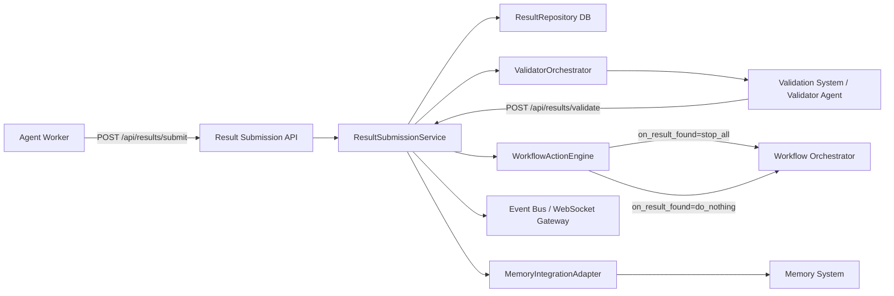

# Enhanced Result Submission Design Document

## Document Overview

**Purpose and Scope**:  
This design document specifies the architecture, components, data models, APIs, and integration patterns for the Enhanced Result Submission subsystem. This system enables agents to declare definitive workflow results, validates them via validator agents, executes deterministic post-validation actions, and maintains full auditability with immutable, versioned records. Includes Memory System integration for persistence and context retrieval.

**Target Audience**:  
AI spec agents (Kiro, Cursor, Cline), implementation engineers, workflow orchestrator developers, system architects

**Related Documents**:
- **Requirements (Source of Truth)**: [`docs/requirements/workflows/result_submission.md`](../requirements/workflows/result_submission.md)
- **Orchestration Design (Style Reference)**: [`docs/design/multi_agent_orchestration.md`](multi_agent_orchestration.md)
- **Validation System Design (Validator Reuse Patterns)**: [`docs/design/validation_system.md`](validation_system.md) (referenced)
- **Other Related Requirements**:
  - [`docs/requirements/workflows/validation_system.md`](../requirements/workflows/validation_system.md)
  - [`docs/requirements/workflows/task_queue_management.md`](../requirements/workflows/task_queue_management.md)
  - [`docs/requirements/workflows/ticket_workflow.md`](../requirements/workflows/ticket_workflow.md)
  - [`docs/requirements/monitoring/fault_tolerance.md`](../requirements/monitoring/fault_tolerance.md)
  - [`docs/requirements/memory/memory_system.md`](../requirements/memory/memory_system.md)

---

## Architecture Overview

### High-Level Workflow



### Component Responsibilities

| Component | Layer | Primary Responsibility |
|-----------|-------|----------------------|
| Result Submission API | API / Edge | Expose `/api/results/submit`, `/api/results/validate`, `/api/workflows/{id}/results` |
| ResultSubmissionService | Application | Orchestrate submission → validation → action pipeline; enforce immutability/versioning; emit events |
| ValidatorOrchestrator | Application | Spawn validator agents or call Validation System API; enforce validator-only access |
| WorkflowActionEngine | Orchestration | Execute post-validation actions (`stop_all` vs `do_nothing`) against Workflow Orchestrator |
| ResultRepository | Persistence | Append-only storage of submissions, validation decisions, versioning, audit data |
| MemoryIntegrationAdapter | Integration | Map validated results to Memory System entries; support context queries (REQ-ERS-MEM-001/002) |
| WebSocket/Event Gateway | Infrastructure | Broadcast `result_submitted`, `result_validated`, `workflow_termination_requested` events |
| AuthN/AuthZ Layer | Cross-cutting | Authenticate submitters; authorize validator agents (REQ-ERS-SEC-001) |

### System Boundaries

**Inside this subsystem**:
- HTTP API endpoints specified in requirements
- Data models and database schema for result submissions
- Validator orchestration call sites (but not full Validation System implementation)
- Workflow-level post-validation actions *as calls* to orchestrator
- Memory System integration adapter (client-side)

**Outside this subsystem**:
- Core Workflow Orchestrator behavior (phase transitions, ticket states)
- Validation System internals (state machine, review lifecycle)
- Memory System storage internals (pgvector, hybrid search)
- Monitoring and Fault Tolerance (only consume/emit events where necessary)

---

## Component Details

### Result Submission API

**Responsibilities**:
- Provide REST endpoints:
  - `POST /api/results/submit`
  - `POST /api/results/validate`
  - `GET /api/workflows/{id}/results`
- Validate request payloads against Pydantic models
- Enforce authentication and basic authorization (validator-only for `/validate`)
- Delegate to `ResultSubmissionService`

**Key Interfaces**:

```python
class ResultSubmissionAPI:
    def __init__(self, service: ResultSubmissionService, auth: AuthBackend):
        self.service = service
        self.auth = auth

    async def submit_result(self, request: SubmitResultRequest, user_ctx: AgentContext) -> SubmitResultResponse:
        self.auth.ensure_authenticated_agent(user_ctx)
        return await self.service.submit_result(request, user_ctx)

    async def validate_result(self, request: ValidateResultRequest, user_ctx: AgentContext) -> ValidateResultResponse:
        self.auth.ensure_authenticated_agent(user_ctx)
        self.auth.ensure_validator_role(user_ctx)  # validator-only
        return await self.service.validate_result(request, user_ctx)

    async def list_results(self, workflow_id: str, user_ctx: AgentContext) -> list[ResultSubmissionDTO]:
        self.auth.ensure_authenticated_agent(user_ctx)
        return await self.service.list_results(workflow_id)
```

### ResultSubmissionService

**Responsibilities**:
- Implement normative behavior from REQ-ERS-001..004 and configuration section
- Create submission records in append-only fashion
- Trigger automatic validation (REQ-ERS-002) via `ValidatorOrchestrator`
- Apply post-validation actions via `WorkflowActionEngine`
- Emit required events via Event Bus/WebSocket

**Control Flow**:

1. **Submit**:
   - Validate `has_result` is enabled for workflow (from phase config)
   - Persist new submission row with `status = "submitted"`, `version` assigned
   - Emit `result_submitted` event
   - Trigger asynchronous validation via `ValidatorOrchestrator`

2. **Validate**:
   - Ensure caller is validator agent
   - Mark submission as validated with `passed`, `feedback`, `validated_at`
   - Emit `result_validated` event
   - Persist to Memory System via `MemoryIntegrationAdapter` (REQ-ERS-MEM-001)
   - Compute and execute post-validation action per `on_result_found` config:
     - If `passed` and `on_result_found="stop_all"` → request workflow termination
     - If `passed` and `on_result_found="do_nothing"` → no orchestration change
     - If `failed` → allow further submissions, no termination
   - For PASS+`stop_all`, emit `workflow_termination_requested`

### ValidatorOrchestrator

**Responsibilities**:
- On submission, spawn or signal a validator agent to evaluate `result_criteria`
- Ensure validator's verdict is delivered via `/api/results/validate`
- Reuse patterns from Validation System design (common validator lifecycle, evidence indexing)

**Interfaces**:

```python
class ValidatorOrchestrator:
    async def spawn_validator_for_submission(self, submission: ResultSubmission, criteria: str) -> str:
        """Spawn validator agent or enqueue validation task; returns validator_id or job_id."""
        ...

    async def notify_validation_dispatched(self, submission_id: str, validator_id: str) -> None:
        """Optional: track validator associated with this submission for audit."""
        ...
```

**Note**: Actual mechanisms (task queue, agent type, Git integration) are defined by Validation System design; Result Submission subsystem only relies on that contract.

### WorkflowActionEngine

**Responsibilities**:
- Implement REQ-ERS-003:
  - PASS + `stop_all` → terminate active agents/tasks for the workflow and finalize
  - PASS + `do_nothing` → record result, workflow continues
  - FAIL → no workflow-level change
- Call into Workflow Orchestrator via stable interface or event bus

**Example Interface**:

```python
class WorkflowActionEngine:
    async def apply_post_validation_action(
        self,
        submission: ResultSubmission,
        passed: bool,
        config: ResultSubmissionConfig,
    ) -> None:
        if not passed:
            return

        if config.on_result_found == "stop_all":
            await self._request_workflow_termination(submission.workflow_id, submission.submission_id)
        # do_nothing → no-op at orchestration level

    async def _request_workflow_termination(self, workflow_id: str, submission_id: str) -> None:
        # Either call orchestrator API or publish event
        await self.orchestrator_client.request_termination(
            workflow_id, reason="result_passed", submission_id=submission_id
        )
```

### ResultRepository

**Responsibilities**:
- Provide append-only storage for submissions and associated validation metadata
- Enforce immutability and versioning (REQ-ERS-004)
- Support efficient listing of results per workflow

**Key Operations**:

```python
class ResultRepository:
    async def create_submission(self, model: ResultSubmission) -> ResultSubmission: ...
    async def mark_validated(self, submission_id: str, passed: bool, feedback: str, evidence_index: dict) -> ResultSubmission: ...
    async def get_submission(self, submission_id: str) -> ResultSubmission | None: ...
    async def list_by_workflow(self, workflow_id: str) -> list[ResultSubmission]: ...
```

### MemoryIntegrationAdapter

**Responsibilities (REQ-ERS-MEM-001/002)**:
- On validation (pass or fail), create Memory System entries capturing:
  - `workflow_id` and ticket/task identifiers
  - link to result artifact (markdown file path or stored blob)
  - validation outcome and feedback
  - result_criteria snapshot used for the decision
- Provide query helper to fetch prior results for a given workflow or component for use as agent context

**Interfaces**:

```python
class MemoryIntegrationAdapter:
    async def persist_validated_result(self, submission: ResultSubmission, criteria_snapshot: str) -> None:
        # Calls Memory System API (e.g., REST or gRPC) to create memory entry
        ...

    async def get_prior_results_context(self, workflow_id: str) -> list[MemoryResultSummary]:
        # Used by agents to avoid duplicate work
        ...
```

### WebSocket/Event Gateway

- Subscribe to domain events from `ResultSubmissionService`
- Push WebSocket messages to connected UIs or agent clients

---

## Data Models

### Database Schemas

**Result Submissions (Append-Only)**:

```sql
CREATE TABLE result_submissions (
    submission_id UUID PRIMARY KEY,
    workflow_id UUID NOT NULL,
    agent_id UUID NOT NULL,
    markdown_file_path TEXT NOT NULL,
    created_at TIMESTAMPTZ NOT NULL DEFAULT NOW(),

    -- Validation metadata (set only once; append-only semantics)
    validated_at TIMESTAMPTZ,
    passed BOOLEAN,
    feedback TEXT,
    evidence_index JSONB DEFAULT '{}'::jsonb,

    -- Versioning per workflow (incremental count of submissions)
    version INTEGER NOT NULL,
    result_criteria_snapshot TEXT NOT NULL,

    -- Status: 'submitted' | 'validated'
    status VARCHAR(32) NOT NULL DEFAULT 'submitted',

    -- Audit
    config_on_result_found VARCHAR(32) NOT NULL,
    created_by_agent_type VARCHAR(64),

    CONSTRAINT uq_workflow_version UNIQUE (workflow_id, version)
);

CREATE INDEX idx_result_submissions_workflow ON result_submissions(workflow_id);
CREATE INDEX idx_result_submissions_status ON result_submissions(status);
CREATE INDEX idx_result_submissions_passed ON result_submissions(passed) WHERE validated_at IS NOT NULL;
```

**Result Submission Audit Log (Optional but Recommended)**:

```sql
CREATE TABLE result_submission_audit_log (
    id UUID PRIMARY KEY,
    submission_id UUID NOT NULL REFERENCES result_submissions(submission_id),
    event_type VARCHAR(64) NOT NULL, -- 'submitted' | 'validated' | 'termination_requested'
    actor_id UUID,
    actor_role VARCHAR(64),
    payload JSONB,
    created_at TIMESTAMPTZ NOT NULL DEFAULT NOW()
);

CREATE INDEX idx_result_audit_submission ON result_submission_audit_log(submission_id);
```

**Immutability & Versioning**:
- Treat `result_submissions` as append-only logically; updates are limited to filling in `validated_at`, `passed`, `feedback`, and `evidence_index` once. Application logic enforces "no second validation mutation".
- `version` provides ordered history of submissions per workflow; each new submission increments version.

### Pydantic Models (Reference)

These extend the requirements' reference models with additional fields used internally:

```python
from __future__ import annotations
from datetime import datetime
from typing import Optional, Dict, Any, List
from pydantic import BaseModel, Field


class ResultSubmission(BaseModel):
    submission_id: str
    workflow_id: str
    agent_id: str
    markdown_file_path: str
    created_at: datetime
    validated_at: Optional[datetime] = None
    passed: Optional[bool] = None
    feedback: Optional[str] = None
    evidence_index: Dict[str, Any] = {}
    version: int
    status: str  # "submitted" | "validated"
    result_criteria_snapshot: str
    config_on_result_found: str  # "stop_all" | "do_nothing"


class SubmitResultRequest(BaseModel):
    workflow_id: str
    markdown_file_path: str
    agent_id: str


class SubmitResultResponse(BaseModel):
    submission_id: str
    status: str = "submitted"


class ValidateResultRequest(BaseModel):
    submission_id: str
    passed: bool
    feedback: str
    evidence_index: Dict[str, Any] = Field(default_factory=dict)


class ValidateResultResponse(BaseModel):
    submission_id: str
    status: str  # "validated"
    passed: bool


class ResultSubmissionDTO(BaseModel):
    submission_id: str
    workflow_id: str
    agent_id: str
    created_at: datetime
    validated_at: Optional[datetime]
    passed: Optional[bool]
    feedback: Optional[str]
    version: int
```

---

## Result Artifact Format (Markdown File Structure)

While requirements only mention a "markdown file path or payload reference", standardizing structure improves validator reliability.

**Recommended Structure (Non-Normative but Strongly Encouraged)**:

```markdown
# Result Summary
- Workflow ID: <workflow-id>
- Ticket: <ticket-id> (optional)
- Author Agent: <agent-id or alias>
- Date: <ISO8601>

## Problem Statement
Short restatement of the original goal or ticket description.

## Proposed Solution
High-level explanation of the solution.

## Implementation Details
- Key changes
- Dependencies
- Rollout considerations

## Evidence
- Links to PRs / commits
- Logs or screenshots
- Metrics or benchmarks

## Risks & Open Questions
- Known limitations
- Future work

## Validation Notes (Agent)
Optional notes by the submitting agent.
```

Validators can be instructed (via `result_criteria`) to inspect specific sections (e.g., ensure Evidence section includes at least N concrete references).

---

## API Specifications

### Endpoints Table (Normative)

| Endpoint | Method | Purpose | Request Body (min) | Success (200) | Failures |
|----------|--------|---------|---------------------|----------------|----------|
| `/api/results/submit` | POST | Submit result | `{ "workflow_id","markdown_file_path","agent_id" }` | `{ "submission_id","status":"submitted" }` | 400 `{ "error","message" }`, 404 `{ "error","message" }` (workflow not found) |
| `/api/results/validate` | POST | Validator-only validation | `{ "submission_id","passed","feedback" }` (+ evidence) | `{ "submission_id","status":"validated","passed":bool }` | 403 `{ "error","message" }` (non-validator), 404 (submission not found) |
| `/api/workflows/{id}/results` | GET | List results for workflow | — | `[ { "submission_id","passed","version",... } ]` | 404 `{ "error","message" }` (workflow not found) |

**Error Contract**:
- All errors follow:
```json
{
  "error": "STABLE_ERROR_CODE",
  "message": "Human-readable description"
}
```
- Examples: `"ERS_WORKFLOW_NOT_FOUND"`, `"ERS_SUBMISSION_NOT_FOUND"`, `"ERS_FORBIDDEN_VALIDATOR_ONLY"`

### Request/Response Models

- `POST /api/results/submit`: Request `SubmitResultRequest`, Response `SubmitResultResponse`
- `POST /api/results/validate`: Request `ValidateResultRequest`, Response `ValidateResultResponse`
- `GET /api/workflows/{id}/results`: Response `List[ResultSubmissionDTO]`

### Authentication & Authorization

- **Submit**: Authenticated agent required; must be associated with given `workflow_id` (enforced via orchestrator or task assignment)
- **Validate**: Authenticated agent with *validator role* required (REQ-ERS-SEC-001); role determined from agent type, JWT claims, or registry
- **List**: Authenticated access; further restrictions can be applied (e.g., only owners, validators, or admins)

---

## Integration Points

### Validation System Integration

- Reuses validator agents and lifecycle defined in Validation System design
- **Patterns Reused**:
  - Validator spawning and tracking
  - Feedback and evidence indexing (the `evidence_index` field is purposely generic JSON)
  - SLO measurements: Validation decision P95 < `validator_timeout_minutes` (REQ-ERS-SLO-001)
- **Contract-Level Behavior**:
  - On submission, `ValidatorOrchestrator` creates a validation task referencing:
    - `workflow_id`
    - `submission_id`
    - `markdown_file_path`
    - `result_criteria`
  - Validator agent consumes this task, reads artifact, and posts result via `/api/results/validate`

### Workflow Orchestrator Integration

- For PASS + `on_result_found="stop_all"`:
  - `WorkflowActionEngine` either:
    - Calls orchestrator API (e.g., `POST /api/workflows/{id}/terminate`), or
    - Publishes event `workflow_termination_requested` to Event Bus, which orchestrator subscribes to
- For PASS + `do_nothing`: No workflow termination is requested; orchestrator continues managing tasks and phases

### Memory System Integration (REQ-ERS-MEM-001, REQ-ERS-MEM-002)

**Persist Final Results**:
- On validation (pass or fail), `MemoryIntegrationAdapter` calls Memory System to create a `ResultMemory` entry capturing:
  - `workflow_id`, `ticket_id`, `task_id` (if available)
  - `submission_id`, `version`
  - `artifact_link` (file path or blob ID)
  - `outcome` (`passed/failed`)
  - `feedback`
  - `result_criteria_snapshot`

**Use Prior Results as Context**:
- Agents or orchestrator can request prior result summaries from Memory System:
  - e.g., `GET /memory/results?workflow_id=...`
- Used to:
  - Avoid duplicate work
  - Align with previous conclusions
  - Reuse successful methodologies and evidence patterns

### WebSocket/Event Contracts

As specified in requirements:

| Event | When Emitted | Payload (min) |
|-------|--------------|---------------|
| `result_submitted` | On submission accepted | `{ "workflow_id","submission_id","agent_id" }` |
| `result_validated` | On pass/fail decision | `{ "workflow_id","submission_id","passed","feedback" }` |
| `workflow_termination_requested` | On PASS + `stop_all` | `{ "workflow_id","submission_id" }` |

**Implementation Detail**: `ResultSubmissionService` publishes domain events; WebSocket gateway translates to WebSocket messages for UI clients.

---

## Implementation Details

### Submission → Validation → Action Workflow

**Pseudocode**:

```python
class ResultSubmissionService:
    async def submit_result(self, req: SubmitResultRequest, ctx: AgentContext) -> SubmitResultResponse:
        config = await self._load_phase_config(req.workflow_id)
        if not config.has_result:
            raise BadRequest("ERS_HAS_RESULT_DISABLED")

        version = await self.repo.next_version_for_workflow(req.workflow_id)

        submission = ResultSubmission(
            submission_id=str(uuid.uuid4()),
            workflow_id=req.workflow_id,
            agent_id=req.agent_id,
            markdown_file_path=req.markdown_file_path,
            created_at=datetime.utcnow(),
            version=version,
            status="submitted",
            result_criteria_snapshot=config.result_criteria,
            config_on_result_found=config.on_result_found,
        )
        await self.repo.create_submission(submission)

        await self.events.publish("result_submitted", {
            "workflow_id": submission.workflow_id,
            "submission_id": submission.submission_id,
            "agent_id": submission.agent_id,
        })

        validator_id = await self.validator_orchestrator.spawn_validator_for_submission(
            submission, config.result_criteria
        )
        await self.validator_orchestrator.notify_validation_dispatched(
            submission.submission_id, validator_id
        )

        return SubmitResultResponse(submission_id=submission.submission_id, status="submitted")

    async def validate_result(self, req: ValidateResultRequest, ctx: AgentContext) -> ValidateResultResponse:
        submission = await self.repo.get_submission(req.submission_id)
        if not submission:
            raise NotFound("ERS_SUBMISSION_NOT_FOUND")

        if submission.validated_at is not None:
            # Optionally prevent double validation
            raise BadRequest("ERS_ALREADY_VALIDATED")

        submission = await self.repo.mark_validated(
            submission_id=req.submission_id,
            passed=req.passed,
            feedback=req.feedback,
            evidence_index=req.evidence_index,
        )

        await self.events.publish("result_validated", {
            "workflow_id": submission.workflow_id,
            "submission_id": submission.submission_id,
            "passed": submission.passed,
            "feedback": submission.feedback,
        })

        await self.memory_adapter.persist_validated_result(
            submission, submission.result_criteria_snapshot
        )

        await self.workflow_actions.apply_post_validation_action(
            submission,
            passed=submission.passed,
            config=ResultSubmissionConfig(
                has_result=True,
                result_criteria=submission.result_criteria_snapshot,
                on_result_found=submission.config_on_result_found,
            )
        )

        return ValidateResultResponse(
            submission_id=submission.submission_id,
            status="validated",
            passed=submission.passed,
        )
```

### Configuration Handling

From requirements:

```yaml
has_result: true
result_criteria: |
  Detailed validation criteria...
on_result_found: stop_all  # or "do_nothing"
```

**Configuration Model**:

```python
class ResultSubmissionConfig(BaseModel):
    has_result: bool = False
    result_criteria: str = ""
    on_result_found: str = "stop_all"  # "stop_all" | "do_nothing"
```

**Config Resolution**:
- Read from per-phase or per-workflow YAML (`phases_config.yaml`)
- Loaded by Workflow Orchestrator and exposed via config service or environment to `ResultSubmissionService`

### Performance Considerations

- **Submission ingestion P95 < 200ms** (REQ-ERS-SLO-001):
  - Keep submission path lightweight: single DB write + event publish + async validation scheduling
- **Validation decision P95 < validator_timeout_minutes**:
  - Leverage existing Validation System SLOs
  - Use queues and timeouts configured for validator agents
- **Termination orchestration P95 < 2s**:
  - `WorkflowActionEngine` should issue termination requests asynchronously and rely on orchestrator's optimized path

**Database Indexing**:
- Indexes on `workflow_id`, `status`, and `passed` support fast listing and reporting

### Error Handling Strategy

- Stable error codes for each class of error (e.g., `ERS_WORKFLOW_NOT_FOUND`, `ERS_FORBIDDEN_VALIDATOR_ONLY`)
- Append-only audit log entries for every:
  - Submission
  - Validation
  - Termination request
- All security-sensitive actions logged with `actor_id` and `actor_role`

---

## Related Documents

- **Requirements (Source of Truth)**:
  - [`docs/requirements/workflows/result_submission.md`](../requirements/workflows/result_submission.md)
- **Related Design Documents**:
  - [`docs/design/multi_agent_orchestration.md`](multi_agent_orchestration.md) (overall orchestration patterns)
  - [`docs/design/validation_system.md`](validation_system.md) (validator reuse patterns, state machine)
  - [`docs/design/task_queue_management.md`](task_queue_management.md) (if validation tasks are queued)
  - [`docs/design/ticket_workflow.md`](ticket_workflow.md) (result submissions as phase gates)
  - [`docs/design/monitoring_architecture.md`](monitoring_architecture.md) and [`docs/design/fault_tolerance.md`](fault_tolerance.md) (SLO monitoring, termination observability)
- **Memory System**:
  - [`docs/design/memory_system.md`](memory_system.md) (for Memory System data model and APIs)

---

## Document Revision History

| Version | Date | Author | Changes |
|---------|------|--------|---------|
| 1.0 | 2025-01-27 | AI Design Agent | Initial design document from requirements |

---

**Related Document**: [Requirements Document](../requirements/workflows/result_submission.md)

