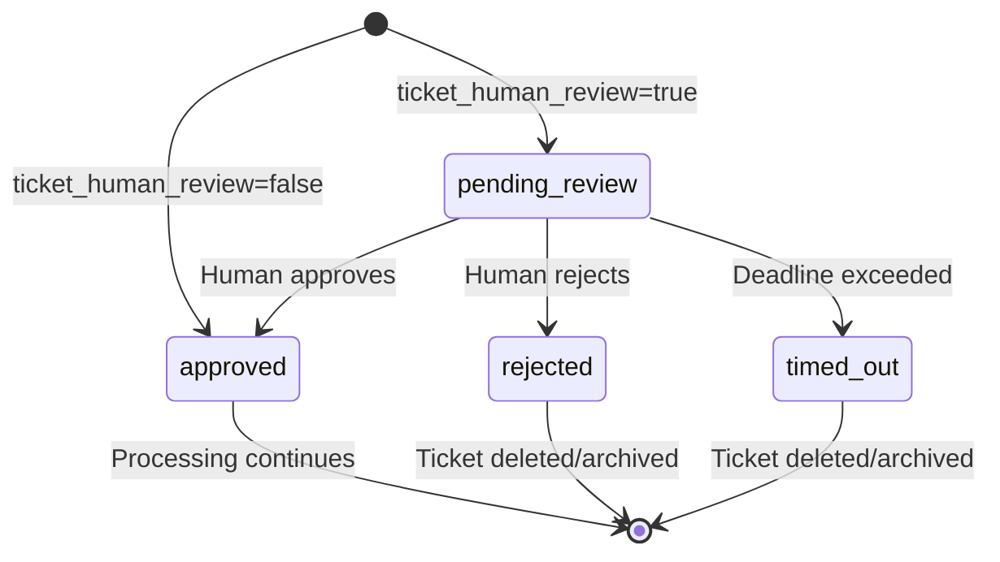

# Ticket Human Approval Design Document

**Created**: 2025-11-20
**Status**: Draft
**Purpose**: Specifies the architecture, components, state machine, and APIs for the ticket human approval system
**Related**: docs/requirements/workflows/ticket_human_approval.md, docs/design/workflows/ticket_workflow.md, docs/design/services/workspace_isolation_system.md, docs/design/integration/multi_agent_orchestration.md

---


## Document Overview

This design document specifies the architecture, components, data models, APIs, and implementation patterns for the ticket human approval system. This system provides a human-in-the-loop approval gate that prevents agent-initiated ticket creation from proceeding until explicitly approved by a human reviewer, preventing unnecessary workspace, branch, and sandbox provisioning.

**Target Audience**: AI spec agents (Kiro, Cursor, Cline), implementation teams, system architects

**Related Documents**:
- [Requirements Document](../requirements/workflows/ticket_human_approval.md) - Source of truth for all requirements
- [Ticket Workflow Design](./ticket_workflow.md) - Related ticket workflow system
- [Workspace Isolation System Design](./workspace_isolation_system.md) - Workspace integration patterns
- [Multi-Agent Orchestration Design](./multi_agent_orchestration.md) - Overall system architecture

---

## Architecture Overview

### High-Level Architecture

```
┌─────────────────────────────────────────────────────────────────┐
│                    APPROVAL LAYER                                │
│  ┌──────────────┐  ┌──────────────┐  ┌──────────────┐          │
│  │  Approval    │  │   Approval   │  │   Timeout    │          │
│  │   Service    │  │   Handler    │  │   Monitor    │          │
│  └──────────────┘  └──────────────┘  └──────────────┘          │
└──────────────────────────┬───────────────────────────────────────┘
                           │
                           ▼
┌─────────────────────────────────────────────────────────────────┐
│                    GATE LAYER                                    │
│  ┌──────────────┐  ┌──────────────┐  ┌──────────────┐          │
│  │  Workspace   │  │    Branch    │  │   Sandbox    │          │
│  │    Gate      │  │     Gate     │  │     Gate     │          │
│  └──────────────┘  └──────────────┘  └──────────────┘          │
└──────────────────────────┬───────────────────────────────────────┘
                           │
                           ▼
┌─────────────────────────────────────────────────────────────────┐
│                    EXECUTION LAYER                               │
│  ┌──────────────┐  ┌──────────────┐  ┌──────────────┐          │
│  │   Agent      │  │   Task       │  │  Workspace   │          │
│  │  Creation    │  │   Queue      │  │   Manager    │          │
│  └──────────────┘  └──────────────┘  └──────────────┘          │
└─────────────────────────────────────────────────────────────────┘
                           │
                           ▼
┌─────────────────────────────────────────────────────────────────┐
│                  INFRASTRUCTURE LAYER                            │
│  ┌─────────┐  ┌─────────┐  ┌─────────┐  ┌─────────┐            │
│  │  Event  │  │  State  │  │   API   │  │   Web   │            │
│  │   Bus   │  │  Store  │  │ Gateway │  │  Socket │            │
│  └─────────┘  └─────────┘  └─────────┘  └─────────┘            │
└─────────────────────────────────────────────────────────────────┘
```

### Component Responsibilities

| Component | Layer | Primary Responsibility |
|-----------|-------|----------------------|
| Approval Service | Approval | Core approval workflow, state management |
| Approval Handler | Approval | Request/response handling, authorization |
| Timeout Monitor | Approval | Deadline tracking, timeout processing |
| Workspace Gate | Gate | Prevent workspace creation until approved |
| Branch Gate | Gate | Prevent branch creation until approved |
| Sandbox Gate | Gate | Prevent sandbox provisioning until approved |
| Event Bus | Infrastructure | Approval event propagation |
| State Store | Infrastructure | Approval status persistence |
| API Gateway | Infrastructure | REST API endpoint handling |
| WebSocket Server | Infrastructure | Real-time approval notifications |

### System Boundaries

The approval system interacts with:
- **Ticket Service**: Creates tickets with `pending_review` status
- **Agent System**: Blocks agent progress when awaiting approval
- **Workspace Manager**: Blocks workspace provisioning until approved
- **Event Bus**: Publishes approval status change events
- **UI/Frontend**: Displays pending approvals and approval controls
- **Audit System**: Logs all approval/rejection actions

---

## State Machine

### Approval Status State Machine



### State Transitions

| From State | To State | Trigger | Actions |
|-----------|----------|---------|---------|
| *(initial)* | `pending_review` | `ticket_human_review=true` | Set deadline, emit `ticket_approval_pending` |
| *(initial)* | `approved` | `ticket_human_review=false` | No gate, immediate processing |
| `pending_review` | `approved` | POST `/api/tickets/approve` | Unblock agent, emit `ticket_approved`, audit |
| `pending_review` | `rejected` | POST `/api/tickets/reject` | Delete/archive ticket, notify agent, audit |
| `pending_review` | `timed_out` | Deadline exceeded | Delete/archive ticket, notify agent, audit |

---

## Component Details

### Approval Service

The core service managing the approval workflow and state transitions.

```python
class ApprovalService:
    """Core service for ticket approval workflow management."""

    def __init__(
        self,
        state_store: StateStore,
        event_bus: EventBus,
        config: ApprovalConfig
    ):
        self.state_store = state_store
        self.event_bus = event_bus
        self.config = config

    async def create_ticket_with_approval(
        self,
        ticket: Ticket,
        board_config: BoardConfig
    ) -> Ticket:
        """Create ticket with approval gate if enabled."""
        if board_config.ticket_human_review:
            # Set approval status to pending
            ticket.approval_status = ApprovalStatusEnum.PENDING_REVIEW
            ticket.approval_deadline_at = (
                datetime.now() + timedelta(
                    seconds=board_config.approval_timeout_seconds
                )
            )
            ticket.requested_by_agent_id = ticket.created_by_agent_id

            # Save ticket
            await self.state_store.create_ticket(ticket)

            # Emit pending event
            await self.event_bus.publish(Event(
                type=EventType.TICKET_APPROVAL_PENDING,
                data={
                    "ticket_id": ticket.id,
                    "deadline_at": ticket.approval_deadline_at.isoformat()
                }
            ))

            # Block agent from proceeding
            await self._block_agent(ticket.requested_by_agent_id)
        else:
            # Skip approval gate
            ticket.approval_status = ApprovalStatusEnum.APPROVED
            await self.state_store.create_ticket(ticket)

        return ticket

    async def approve_ticket(
        self,
        ticket_id: str,
        approver_id: str
    ) -> TicketApprovalState:
        """Approve a pending ticket."""
        ticket = await self.state_store.get_ticket(ticket_id)

        # Validate state
        if ticket.approval_status != ApprovalStatusEnum.PENDING_REVIEW:
            raise InvalidApprovalStateError(
                f"Cannot approve ticket in state: {ticket.approval_status}"
            )

        # Update status
        ticket.approval_status = ApprovalStatusEnum.APPROVED
        ticket.approval_deadline_at = None
        await self.state_store.update_ticket(ticket)

        # Audit log
        await self._audit_approval_action(
            ticket_id=ticket_id,
            actor_id=approver_id,
            action="approved",
            timestamp=datetime.now()
        )

        # Emit approval event
        await self.event_bus.publish(Event(
            type=EventType.TICKET_APPROVED,
            data={"ticket_id": ticket_id}
        ))

        # Unblock agent
        await self._unblock_agent(ticket.requested_by_agent_id)

        return TicketApprovalState(
            ticket_id=ticket_id,
            approval_status=ApprovalStatusEnum.APPROVED,
            approval_deadline_at=None,
            requested_by_agent_id=ticket.requested_by_agent_id,
            rejection_reason=None
        )

    async def reject_ticket(
        self,
        ticket_id: str,
        rejection_reason: str,
        rejector_id: str
    ) -> TicketApprovalState:
        """Reject a pending ticket."""
        ticket = await self.state_store.get_ticket(ticket_id)

        # Validate state
        if ticket.approval_status != ApprovalStatusEnum.PENDING_REVIEW:
            raise InvalidApprovalStateError(
                f"Cannot reject ticket in state: {ticket.approval_status}"
            )

        # Update status
        ticket.approval_status = ApprovalStatusEnum.REJECTED
        ticket.rejection_reason = rejection_reason
        await self.state_store.update_ticket(ticket)

        # Audit log
        await self._audit_approval_action(
            ticket_id=ticket_id,
            actor_id=rejector_id,
            action="rejected",
            reason=rejection_reason,
            timestamp=datetime.now()
        )

        # Emit rejection event
        await self.event_bus.publish(Event(
            type=EventType.TICKET_REJECTED,
            data={
                "ticket_id": ticket_id,
                "reason": rejection_reason
            }
        ))

        # Handle rejection action (delete or archive)
        if self.config.on_reject == "delete":
            await self.state_store.delete_ticket(ticket_id)
        else:  # archive
            await self.state_store.archive_ticket(ticket_id)

        # Notify agent
        await self._notify_agent_rejection(
            ticket.requested_by_agent_id,
            ticket_id,
            rejection_reason
        )

        return TicketApprovalState(
            ticket_id=ticket_id,
            approval_status=ApprovalStatusEnum.REJECTED,
            approval_deadline_at=None,
            requested_by_agent_id=ticket.requested_by_agent_id,
            rejection_reason=rejection_reason
        )

    async def handle_timeout(self, ticket_id: str) -> None:
        """Handle ticket approval timeout."""
        ticket = await self.state_store.get_ticket(ticket_id)

        # Only process if still pending
        if ticket.approval_status != ApprovalStatusEnum.PENDING_REVIEW:
            return

        # Update status to timed out
        ticket.approval_status = ApprovalStatusEnum.TIMED_OUT
        await self.state_store.update_ticket(ticket)

        # Audit log
        await self._audit_approval_action(
            ticket_id=ticket_id,
            actor_id="system",
            action="timed_out",
            timestamp=datetime.now()
        )

        # Emit timeout event
        await self.event_bus.publish(Event(
            type=EventType.TICKET_TIMED_OUT,
            data={"ticket_id": ticket_id}
        ))

        # Delete/archive ticket
        if self.config.on_reject == "delete":
            await self.state_store.delete_ticket(ticket_id)
        else:
            await self.state_store.archive_ticket(ticket_id)

        # Notify agent
        await self._notify_agent_rejection(
            ticket.requested_by_agent_id,
            ticket_id,
            "Approval timeout exceeded"
        )

    async def _block_agent(self, agent_id: str) -> None:
        """Block agent from proceeding with ticket processing."""
        await self.state_store.update_agent_status(
            agent_id,
            AgentStatusEnum.BLOCKED_AWAITING_APPROVAL
        )

    async def _unblock_agent(self, agent_id: str) -> None:
        """Unblock agent to proceed with ticket processing."""
        await self.state_store.update_agent_status(
            agent_id,
            AgentStatusEnum.IDLE
        )

    async def _notify_agent_rejection(
        self,
        agent_id: str,
        ticket_id: str,
        reason: str
    ) -> None:
        """Notify agent of ticket rejection."""
        await self.event_bus.publish(Event(
            type=EventType.AGENT_NOTIFICATION,
            data={
                "agent_id": agent_id,
                "type": "ticket_rejected",
                "ticket_id": ticket_id,
                "reason": reason
            }
        ))

    async def _audit_approval_action(
        self,
        ticket_id: str,
        actor_id: str,
        action: str,
        timestamp: datetime,
        reason: Optional[str] = None
    ) -> None:
        """Log approval action to audit log."""
        await self.state_store.create_audit_log(
            event_type=f"ticket_approval_{action}",
            actor_id=actor_id,
            target_type="ticket",
            target_id=ticket_id,
            old_value={"approval_status": ApprovalStatusEnum.PENDING_REVIEW},
            new_value={
                "approval_status": action,
                "rejection_reason": reason
            },
            timestamp=timestamp
        )
```

### Timeout Monitor

Background service that monitors pending approvals and triggers timeouts.

```python
class TimeoutMonitor:
    """Monitors pending approvals and triggers timeouts."""

    def __init__(
        self,
        approval_service: ApprovalService,
        state_store: StateStore,
        check_interval: int = 10  # seconds
    ):
        self.approval_service = approval_service
        self.state_store = state_store
        self.check_interval = check_interval
        self._running = False

    async def start(self) -> None:
        """Start the timeout monitoring loop."""
        self._running = True
        while self._running:
            await self._check_timeouts()
            await asyncio.sleep(self.check_interval)

    async def stop(self) -> None:
        """Stop the timeout monitoring loop."""
        self._running = False

    async def _check_timeouts(self) -> None:
        """Check for expired approval deadlines."""
        now = datetime.now()
        expired_tickets = await self.state_store.get_tickets_with_expired_deadlines(now)

        for ticket in expired_tickets:
            await self.approval_service.handle_timeout(ticket.id)
```

### Gate Components

Gates prevent resource provisioning until tickets are approved.

#### Workspace Gate

```python
class WorkspaceGate:
    """Gate that prevents workspace creation until ticket is approved."""

    def __init__(
        self,
        approval_service: ApprovalService,
        workspace_manager: WorkspaceManager
    ):
        self.approval_service = approval_service
        self.workspace_manager = workspace_manager

    async def check_approval_before_workspace_creation(
        self,
        ticket_id: str,
        agent_id: str
    ) -> None:
        """Check if ticket is approved before allowing workspace creation."""
        ticket = await self.approval_service.state_store.get_ticket(ticket_id)

        if ticket.approval_status != ApprovalStatusEnum.APPROVED:
            raise WorkspaceCreationBlockedError(
                f"Ticket {ticket_id} not approved. Current status: {ticket.approval_status}"
            )

        # Proceed with workspace creation
        return await self.workspace_manager.create_workspace(
            agent_id=agent_id,
            parent_id=None
        )
```

#### Branch Gate

```python
class BranchGate:
    """Gate that prevents branch creation until ticket is approved."""

    async def check_approval_before_branch_creation(
        self,
        ticket_id: str
    ) -> None:
        """Check if ticket is approved before allowing branch creation."""
        ticket = await self.state_store.get_ticket(ticket_id)

        if ticket.approval_status != ApprovalStatusEnum.APPROVED:
            raise BranchCreationBlockedError(
                f"Ticket {ticket_id} not approved. Current status: {ticket.approval_status}"
            )
```

#### Sandbox Gate

```python
class SandboxGate:
    """Gate that prevents sandbox provisioning until ticket is approved."""

    async def check_approval_before_sandbox_provisioning(
        self,
        ticket_id: str
    ) -> None:
        """Check if ticket is approved before allowing sandbox provisioning."""
        ticket = await self.state_store.get_ticket(ticket_id)

        if ticket.approval_status != ApprovalStatusEnum.APPROVED:
            raise SandboxProvisioningBlockedError(
                f"Ticket {ticket_id} not approved. Current status: {ticket.approval_status}"
            )
```

---

## Data Models

### Database Schema

```sql
-- Extend tickets table with approval fields
ALTER TABLE tickets ADD COLUMN IF NOT EXISTS approval_status VARCHAR(50) DEFAULT 'approved';
ALTER TABLE tickets ADD COLUMN IF NOT EXISTS approval_deadline_at TIMESTAMP WITH TIME ZONE;
ALTER TABLE tickets ADD COLUMN IF NOT EXISTS requested_by_agent_id VARCHAR(255);
ALTER TABLE tickets ADD COLUMN IF NOT EXISTS rejection_reason TEXT;

-- Create index for pending reviews query
CREATE INDEX IF NOT EXISTS idx_tickets_pending_review 
ON tickets(approval_status, approval_deadline_at) 
WHERE approval_status = 'pending_review';

-- Create index for timeout monitoring
CREATE INDEX IF NOT EXISTS idx_tickets_deadline 
ON tickets(approval_deadline_at) 
WHERE approval_status = 'pending_review' AND approval_deadline_at IS NOT NULL;

-- Audit log table (if not exists)
CREATE TABLE IF NOT EXISTS audit_log (
    id UUID PRIMARY KEY DEFAULT gen_random_uuid(),
    event_type VARCHAR(100) NOT NULL,
    actor_id VARCHAR(255),
    target_type VARCHAR(50),
    target_id UUID,
    old_value JSONB,
    new_value JSONB,
    timestamp TIMESTAMP WITH TIME ZONE DEFAULT NOW(),
    metadata JSONB,
    correlation_id UUID
);

CREATE INDEX IF NOT EXISTS idx_audit_log_ticket_approval 
ON audit_log(event_type, target_id) 
WHERE event_type LIKE 'ticket_approval_%';

CREATE INDEX IF NOT EXISTS idx_audit_log_timestamp 
ON audit_log(timestamp DESC);
```

### Pydantic Models

```python
from __future__ import annotations
from datetime import datetime
from enum import Enum
from typing import Optional
from pydantic import BaseModel, Field


class ApprovalStatusEnum(str, Enum):
    """Approval status values."""
    PENDING_REVIEW = "pending_review"
    APPROVED = "approved"
    REJECTED = "rejected"
    TIMED_OUT = "timed_out"


class TicketApprovalState(BaseModel):
    """Approval state for a ticket."""
    ticket_id: str
    approval_status: ApprovalStatusEnum
    approval_deadline_at: Optional[datetime] = None
    requested_by_agent_id: str
    rejection_reason: Optional[str] = None


class ApproveTicketRequest(BaseModel):
    """Request to approve a ticket."""
    ticket_id: str = Field(..., description="Ticket ID to approve")


class ApproveTicketResponse(BaseModel):
    """Response from approval request."""
    ticket_id: str
    status: ApprovalStatusEnum = Field(..., description="Will be 'approved'")


class RejectTicketRequest(BaseModel):
    """Request to reject a ticket."""
    ticket_id: str = Field(..., description="Ticket ID to reject")
    rejection_reason: str = Field(..., min_length=1, description="Reason for rejection")


class RejectTicketResponse(BaseModel):
    """Response from rejection request."""
    ticket_id: str
    status: ApprovalStatusEnum = Field(..., description="Will be 'rejected'")


class PendingReviewCountResponse(BaseModel):
    """Response with count of pending reviews."""
    pending_count: int = Field(..., ge=0, description="Number of tickets pending review")


class ApprovalStatusResponse(BaseModel):
    """Response with approval status."""
    ticket_id: str
    approval_status: ApprovalStatusEnum
    deadline_at: Optional[datetime] = None


class ApprovalConfig(BaseModel):
    """Configuration for approval system."""
    ticket_human_review: bool = False
    approval_timeout_seconds: int = Field(default=1800, ge=60, le=86400)
    on_reject: str = Field(default="delete", pattern="^(delete|archive)$")


class BoardConfig(BaseModel):
    """Board-level configuration."""
    ticket_human_review: bool = False
    approval_timeout_seconds: int = 1800
```

---

## API Specifications

### Endpoint Tables

| Endpoint | Method | Purpose | Request Body (min) | Success (200) | Failures |
|----------|--------|---------|--------------------|---------------|----------|
| `/api/tickets/approve` | POST | Approve ticket | `{ "ticket_id": "string" }` | `{ "ticket_id":"...", "status":"approved" }` | 400 `{ "error":"..." }`, 404 `{ "error":"not_found" }` |
| `/api/tickets/reject` | POST | Reject ticket | `{ "ticket_id":"string", "rejection_reason":"string" }` | `{ "ticket_id":"...", "status":"rejected" }` | 400, 404 |
| `/api/tickets/pending-review-count` | GET | Count pending | queryless | `{ "pending_count": 3 }` | 200 only |
| `/api/tickets/approval-status` | GET | Get status | `?ticket_id=...` | `{ "ticket_id":"...", "approval_status":"...", "deadline_at": "ISO8601\|null" }` | 404 |

### Request/Response Models

#### Approve Ticket

**Request:**
```json
{
  "ticket_id": "550e8400-e29b-41d4-a716-446655440000"
}
```

**Success Response (200):**
```json
{
  "ticket_id": "550e8400-e29b-41d4-a716-446655440000",
  "status": "approved"
}
```

**Error Responses:**

- **400 Bad Request:**
```json
{
  "error": "invalid_state",
  "message": "Cannot approve ticket in state: approved"
}
```

- **404 Not Found:**
```json
{
  "error": "not_found",
  "message": "Ticket not found: 550e8400-e29b-41d4-a716-446655440000"
}
```

#### Reject Ticket

**Request:**
```json
{
  "ticket_id": "550e8400-e29b-41d4-a716-446655440000",
  "rejection_reason": "This ticket duplicates work already in progress"
}
```

**Success Response (200):**
```json
{
  "ticket_id": "550e8400-e29b-41d4-a716-446655440000",
  "status": "rejected"
}
```

**Error Responses:**

- **400 Bad Request:**
```json
{
  "error": "invalid_state",
  "message": "Cannot reject ticket in state: approved"
}
```

- **404 Not Found:**
```json
{
  "error": "not_found",
  "message": "Ticket not found: 550e8400-e29b-41d4-a716-446655440000"
}
```

#### Pending Review Count

**Request:**
```
GET /api/tickets/pending-review-count
```

**Success Response (200):**
```json
{
  "pending_count": 3
}
```

#### Approval Status

**Request:**
```
GET /api/tickets/approval-status?ticket_id=550e8400-e29b-41d4-a716-446655440000
```

**Success Response (200):**
```json
{
  "ticket_id": "550e8400-e29b-41d4-a716-446655440000",
  "approval_status": "pending_review",
  "deadline_at": "2025-11-16T15:30:00Z"
}
```

**Error Responses:**

- **404 Not Found:**
```json
{
  "error": "not_found",
  "message": "Ticket not found: 550e8400-e29b-41d4-a716-446655440000"
}
```

### Error Handling

All error responses follow this format:

```json
{
  "error": "stable_error_code",
  "message": "Human readable error message"
}
```

**Error Codes:**

| Code | HTTP Status | Description |
|------|-------------|-------------|
| `invalid_state` | 400 | Ticket is not in a state that allows this operation |
| `not_found` | 404 | Ticket not found |
| `unauthorized` | 401 | User not authorized to perform this action |
| `validation_error` | 400 | Request validation failed |

### Authentication/Authorization

- All endpoints require authentication (Bearer token or session)
- Only users with `approve_tickets` permission can approve/reject tickets
- Approval status read endpoints are available to ticket creators and approvers

---

## Integration Points

### Workspace Isolation System Integration

The approval system integrates with the Workspace Isolation System to prevent workspace creation until tickets are approved.

**Integration Pattern:**
```python
class WorkspaceManager:
    """Workspace manager with approval gate integration."""

    def __init__(
        self,
        workspace_gate: WorkspaceGate,
        approval_service: ApprovalService
    ):
        self.workspace_gate = workspace_gate
        self.approval_service = approval_service

    async def create_workspace(
        self,
        agent_id: str,
        ticket_id: str,
        parent_id: Optional[str] = None
    ) -> WorkspaceInfo:
        """Create workspace only if ticket is approved."""
        # Check approval gate
        await self.workspace_gate.check_approval_before_workspace_creation(
            ticket_id=ticket_id,
            agent_id=agent_id
        )

        # Proceed with workspace creation
        return await self._create_workspace_impl(agent_id, parent_id)
```

**Workspace Gate Enforcement:**
- Workspace creation MUST check ticket approval status
- If `approval_status != approved`, raise `WorkspaceCreationBlockedError`
- Workspace Manager MUST NOT create workspaces for unapproved tickets
- Refer to [Workspace Isolation System Design](./workspace_isolation_system.md) for workspace creation patterns

### Agent System Integration

The approval system blocks agents from proceeding when awaiting approval.

**Agent Blocking Pattern:**
```python
class AgentManager:
    """Agent manager with approval blocking."""

    async def create_agent_for_ticket(
        self,
        ticket: Ticket,
        board_config: BoardConfig
    ) -> Agent:
        """Create agent and handle approval gate."""
        # Create ticket with approval service
        approved_ticket = await self.approval_service.create_ticket_with_approval(
            ticket=ticket,
            board_config=board_config
        )

        # If pending, block agent
        if approved_ticket.approval_status == ApprovalStatusEnum.PENDING_REVIEW:
            agent = await self._create_agent(ticket.created_by_agent_id)
            await self._set_agent_status(agent.id, AgentStatusEnum.BLOCKED_AWAITING_APPROVAL)
            return agent

        # If approved, proceed normally
        agent = await self._create_agent(ticket.created_by_agent_id)
        return agent

    async def handle_approval_event(self, event: Event) -> None:
        """Handle approval status change events."""
        if event.type == EventType.TICKET_APPROVED:
            ticket_id = event.data["ticket_id"]
            ticket = await self.state_store.get_ticket(ticket_id)
            
            # Unblock agent
            await self._set_agent_status(
                ticket.requested_by_agent_id,
                AgentStatusEnum.IDLE
            )
            
            # Resume agent workflow
            await self._resume_agent_workflow(ticket.requested_by_agent_id)

        elif event.type == EventType.TICKET_REJECTED:
            ticket_id = event.data["ticket_id"]
            ticket = await self.state_store.get_ticket(ticket_id)
            
            # Notify agent of rejection
            await self._notify_agent(
                ticket.requested_by_agent_id,
                f"Ticket {ticket_id} rejected: {event.data.get('reason', 'No reason provided')}"
            )
```

### Event Bus Integration

The approval system publishes events to notify other systems of approval status changes.

**Event Types:**
- `ticket_approval_pending`: Ticket enters pending review state
- `ticket_approved`: Ticket is approved by human
- `ticket_rejected`: Ticket is rejected by human
- `ticket_timed_out`: Ticket approval deadline exceeded

**Event Subscription Pattern:**
```python
class ApprovalEventHandler:
    """Handles approval-related events."""

    def __init__(self, event_bus: EventBus):
        self.event_bus = event_bus
        self._setup_subscriptions()

    def _setup_subscriptions(self) -> None:
        """Subscribe to approval events."""
        self.event_bus.subscribe(
            EventType.TICKET_APPROVED,
            self._on_ticket_approved
        )
        self.event_bus.subscribe(
            EventType.TICKET_REJECTED,
            self._on_ticket_rejected
        )
        self.event_bus.subscribe(
            EventType.TICKET_TIMED_OUT,
            self._on_ticket_timed_out
        )

    async def _on_ticket_approved(self, event: Event) -> None:
        """Handle ticket approval."""
        ticket_id = event.data["ticket_id"]
        # Notify downstream systems (Workspace Manager, Task Queue, etc.)
        await self._notify_downstream_systems(ticket_id, "approved")

    async def _on_ticket_rejected(self, event: Event) -> None:
        """Handle ticket rejection."""
        ticket_id = event.data["ticket_id"]
        reason = event.data.get("reason", "")
        # Clean up any partially created resources
        await self._cleanup_ticket_resources(ticket_id)

    async def _on_ticket_timed_out(self, event: Event) -> None:
        """Handle ticket timeout."""
        ticket_id = event.data["ticket_id"]
        # Same cleanup as rejection
        await self._cleanup_ticket_resources(ticket_id)
```

---

## WebSocket/Event Contracts

### WebSocket Events

The approval system emits WebSocket events for real-time UI updates.

#### Ticket Approval Pending

**Event:** `ticket_approval_pending`

**Payload:**
```json
{
  "ticket_id": "550e8400-e29b-41d4-a716-446655440000",
  "deadline_at": "2025-11-16T15:30:00Z"
}
```

**When Emitted:** When a ticket enters `pending_review` state

**Subscribers:** UI/Frontend, Agent Manager, Notification Service

#### Ticket Approved

**Event:** `ticket_approved`

**Payload:**
```json
{
  "ticket_id": "550e8400-e29b-41d4-a716-446655440000"
}
```

**When Emitted:** When a ticket is approved by human

**Subscribers:** UI/Frontend, Agent Manager, Workspace Manager, Task Queue

#### Ticket Rejected

**Event:** `ticket_rejected`

**Payload:**
```json
{
  "ticket_id": "550e8400-e29b-41d4-a716-446655440000",
  "reason": "This ticket duplicates work already in progress"
}
```

**When Emitted:** When a ticket is rejected by human

**Subscribers:** UI/Frontend, Agent Manager, Notification Service

#### Ticket Timed Out

**Event:** `ticket_timed_out`

**Payload:**
```json
{
  "ticket_id": "550e8400-e29b-41d4-a716-446655440000"
}
```

**When Emitted:** When approval deadline is exceeded

**Subscribers:** UI/Frontend, Agent Manager, Notification Service

### WebSocket Event Flow

```
┌──────────────┐         ┌──────────────┐         ┌──────────────┐
│  Approval    │         │   Event      │         │   WebSocket  │
│   Service    │────────>│     Bus      │────────>│   Server     │
└──────────────┘         └──────────────┘         └──────┬───────┘
                                                          │
                          ┌──────────────────────────────┴───────┐
                          │                                      │
                          ▼                                      ▼
                   ┌──────────────┐                      ┌──────────────┐
                   │     UI       │                      │    Agent     │
                   │  (Frontend)  │                      │   Manager    │
                   └──────────────┘                      └──────────────┘
```

---

## Implementation Details

### Approval Workflow Algorithm

```python
async def approval_workflow(
    ticket: Ticket,
    board_config: BoardConfig,
    approval_service: ApprovalService
) -> TicketApprovalState:
    """
    Pseudocode for approval workflow.
    
    1. Check if approval is required
    2. If yes, set pending status and block agent
    3. If no, set approved status and continue
    4. Wait for human decision or timeout
    5. Process decision and unblock/notify agent
    """
    # Step 1: Check if approval is required
    if not board_config.ticket_human_review:
        ticket.approval_status = ApprovalStatusEnum.APPROVED
        return TicketApprovalState(...)
    
    # Step 2: Set pending status
    ticket.approval_status = ApprovalStatusEnum.PENDING_REVIEW
    ticket.approval_deadline_at = (
        datetime.now() + timedelta(seconds=board_config.approval_timeout_seconds)
    )
    
    # Step 3: Block agent
    await approval_service._block_agent(ticket.requested_by_agent_id)
    
    # Step 4: Emit pending event
    await approval_service.event_bus.publish(Event(
        type=EventType.TICKET_APPROVAL_PENDING,
        data={"ticket_id": ticket.id, "deadline_at": ticket.approval_deadline_at}
    ))
    
    # Step 5: Wait for decision (handled by API endpoints or timeout monitor)
    # This is asynchronous - workflow continues when approved/rejected/timeout event occurs
```

### Timeout Processing Algorithm

```python
async def timeout_processing(
    timeout_monitor: TimeoutMonitor,
    approval_service: ApprovalService
) -> None:
    """
    Pseudocode for timeout processing.
    
    1. Query tickets with expired deadlines
    2. For each expired ticket, process timeout
    3. Update status, emit event, cleanup resources
    """
    while True:
        # Step 1: Find expired tickets
        now = datetime.now()
        expired_tickets = await state_store.get_tickets_with_expired_deadlines(now)
        
        # Step 2: Process each expired ticket
        for ticket in expired_tickets:
            # Only process if still pending (may have been approved in the meantime)
            if ticket.approval_status != ApprovalStatusEnum.PENDING_REVIEW:
                continue
            
            # Step 3: Update status
            ticket.approval_status = ApprovalStatusEnum.TIMED_OUT
            await state_store.update_ticket(ticket)
            
            # Step 4: Emit timeout event
            await event_bus.publish(Event(
                type=EventType.TICKET_TIMED_OUT,
                data={"ticket_id": ticket.id}
            ))
            
            # Step 5: Cleanup (delete or archive)
            if config.on_reject == "delete":
                await state_store.delete_ticket(ticket.id)
            else:
                await state_store.archive_ticket(ticket.id)
            
            # Step 6: Notify agent
            await approval_service._notify_agent_rejection(
                ticket.requested_by_agent_id,
                ticket.id,
                "Approval timeout exceeded"
            )
        
        # Wait before next check
        await asyncio.sleep(timeout_monitor.check_interval)
```

### Gate Check Algorithm

```python
async def gate_check(
    gate: Union[WorkspaceGate, BranchGate, SandboxGate],
    ticket_id: str,
    resource_type: str
) -> None:
    """
    Pseudocode for gate check before resource provisioning.
    
    1. Retrieve ticket from state store
    2. Check approval status
    3. If not approved, raise blocking error
    4. If approved, allow resource provisioning
    """
    # Step 1: Get ticket
    ticket = await state_store.get_ticket(ticket_id)
    
    if not ticket:
        raise ResourceNotFoundError(f"Ticket not found: {ticket_id}")
    
    # Step 2: Check approval status
    if ticket.approval_status != ApprovalStatusEnum.APPROVED:
        # Step 3: Raise blocking error
        error_class = {
            "workspace": WorkspaceCreationBlockedError,
            "branch": BranchCreationBlockedError,
            "sandbox": SandboxProvisioningBlockedError
        }[resource_type]
        
        raise error_class(
            f"Ticket {ticket_id} not approved. "
            f"Current status: {ticket.approval_status}. "
            f"Cannot provision {resource_type} until approved."
        )
    
    # Step 4: Approved - proceed with provisioning
    # This is handled by the caller
```

### Performance Considerations

**Database Query Optimization:**
- Use indexed queries for pending reviews: `idx_tickets_pending_review`
- Use indexed queries for timeout checks: `idx_tickets_deadline`
- Batch timeout processing to avoid N+1 queries

**Event Emission Performance:**
- Batch event emissions when possible
- Use async/await for non-blocking event publishing
- Implement event queue with backpressure handling

**Timeout Monitor Performance:**
- Use configurable check interval (default: 10 seconds)
- Process timeouts in batches
- Use database query with `WHERE` clause to filter expired tickets efficiently

**API Response Time:**
- Cache approval status in Redis for frequently accessed tickets
- Use database connection pooling
- Implement request rate limiting to prevent abuse

### Error Handling Strategies

**Invalid State Transitions:**
```python
class InvalidApprovalStateError(Exception):
    """Raised when approval state transition is invalid."""
    pass

# Example usage
if ticket.approval_status != ApprovalStatusEnum.PENDING_REVIEW:
    raise InvalidApprovalStateError(
        f"Cannot approve ticket in state: {ticket.approval_status}"
    )
```

**Resource Blocking Errors:**
```python
class WorkspaceCreationBlockedError(Exception):
    """Raised when workspace creation is blocked by approval gate."""
    pass

class BranchCreationBlockedError(Exception):
    """Raised when branch creation is blocked by approval gate."""
    pass

class SandboxProvisioningBlockedError(Exception):
    """Raised when sandbox provisioning is blocked by approval gate."""
    pass
```

**Retry Strategy:**
- Do NOT retry approval/rejection operations (idempotency not required)
- Retry timeout processing with exponential backoff if database errors occur
- Retry event emission with dead letter queue for failed events

---

## UI Integration Patterns

### Visual Indicators

The UI should display clear visual indicators for ticket approval status:

**Pending Review:**
- Badge/indicator: "Pending Review" with yellow/orange color
- Deadline countdown: "Time remaining: 25 minutes"
- Action buttons: "Approve" and "Reject"

**Approved:**
- Badge/indicator: "Approved" with green color
- Status: "Ready for processing"

**Rejected:**
- Badge/indicator: "Rejected" with red color
- Rejection reason display

**Timed Out:**
- Badge/indicator: "Timed Out" with gray color
- Status: "Approval deadline exceeded"

### Real-Time Updates

The UI should subscribe to WebSocket events for real-time updates:

```javascript
// Example WebSocket subscription
const ws = new WebSocket('wss://api.example.com/events');

ws.onmessage = (event) => {
  const data = JSON.parse(event.data);
  
  if (data.type === 'ticket_approval_pending') {
    // Add ticket to pending reviews list
    addToPendingList(data.ticket_id, data.deadline_at);
    showNotification(`New ticket pending review: ${data.ticket_id}`);
  }
  
  if (data.type === 'ticket_approved') {
    // Update ticket status in UI
    updateTicketStatus(data.ticket_id, 'approved');
    showNotification(`Ticket ${data.ticket_id} approved`);
  }
  
  if (data.type === 'ticket_rejected') {
    // Update ticket status in UI
    updateTicketStatus(data.ticket_id, 'rejected', data.reason);
    showNotification(`Ticket ${data.ticket_id} rejected`);
  }
  
  if (data.type === 'ticket_timed_out') {
    // Update ticket status in UI
    updateTicketStatus(data.ticket_id, 'timed_out');
    showNotification(`Ticket ${data.ticket_id} timed out`);
  }
};
```

### Approval UI Components

**Pending Reviews List:**
- Display all tickets with `approval_status = pending_review`
- Sort by deadline (earliest first)
- Show ticket details, requester, deadline countdown
- Quick approve/reject actions

**Approval Modal:**
- Display full ticket details
- Require rejection reason if rejecting
- Confirm action before submitting
- Show audit log for ticket

---

## Configuration

### Board-Level Configuration

Configuration is defined at the board/phase level:

```json
{
  "board_config": {
    "ticket_human_review": true,
    "approval_timeout_seconds": 1800,
    "on_reject": "delete"
  }
}
```

**Configuration Parameters:**

| Parameter | Type | Default | Range | Description |
|-----------|------|---------|-------|-------------|
| `ticket_human_review` | bool | `false` | - | Enable approval gate |
| `approval_timeout_seconds` | int | `1800` | 60-86400 | Time to wait before timeout (seconds) |
| `on_reject` | string | `"delete"` | `"delete"\|"archive"` | Behavior for rejected tickets |

### System-Level Configuration

```python
class ApprovalSystemConfig(BaseSettings):
    """System-level configuration for approval system."""
    
    # Timeout monitoring
    TIMEOUT_CHECK_INTERVAL: int = 10  # seconds
    TIMEOUT_PROCESSING_BATCH_SIZE: int = 100
    
    # Performance
    APPROVAL_STATUS_CACHE_TTL: int = 300  # seconds
    EVENT_EMISSION_TIMEOUT: int = 5  # seconds
    
    # Security
    MAX_REJECTION_REASON_LENGTH: int = 1000
    AUDIT_LOG_RETENTION_DAYS: int = 365
    
    class Config:
        env_prefix = "APPROVAL_"
        env_file = ".env"
```

---

## Related Documents

### Requirements

- [Ticket Human Approval Requirements](../requirements/workflows/ticket_human_approval.md) - Source of truth for all requirements (REQ-THA-*)

### Related Design Documents

- [Ticket Workflow Design](./ticket_workflow.md) - Related ticket workflow system
- [Workspace Isolation System Design](./workspace_isolation_system.md) - Workspace integration patterns
- [Multi-Agent Orchestration Design](./multi_agent_orchestration.md) - Overall system architecture
- [Task Queue Management Design](./task_queue_management.md) - Task queue integration

### Cross-References

- **REQ-THA-001**: Approval Statuses (see State Machine section)
- **REQ-THA-002**: Default Behavior (see Approval Service section)
- **REQ-THA-003**: Blocking Semantics (see Agent System Integration section)
- **REQ-THA-004**: Resolution Paths (see State Machine section)
- **REQ-THA-005**: Ticket Fields (see Data Models section)
- **REQ-THA-006**: Audit Fields (see Approval Service section)
- **REQ-THA-007**: Workspace Gate (see Gate Components section)
- **REQ-THA-008**: Approval Grant Behavior (see Gate Check Algorithm section)
- **REQ-THA-009**: SLOs (see Performance Considerations section)
- **REQ-THA-010**: Security & Audit (see Authentication/Authorization section)

---

## Document Revision History

| Version | Date | Author | Changes |
|---------|------|--------|---------|
| 1.0 | 2025-11-16 | AI Design Agent | Initial design document from requirements |

---

**Related Document**: [Requirements Document](../requirements/workflows/ticket_human_approval.md)

**Implementation Guide**: See implementation instructions for detailed coding guidelines
