# User Flows & Page Flows - Mermaid Diagrams

**Created**: 2025-01-30  
**Status**: Complete  
**Purpose**: Visual representation of all user flows and page flows using Mermaid diagrams

---

## 1. High-Level User Journey Flow

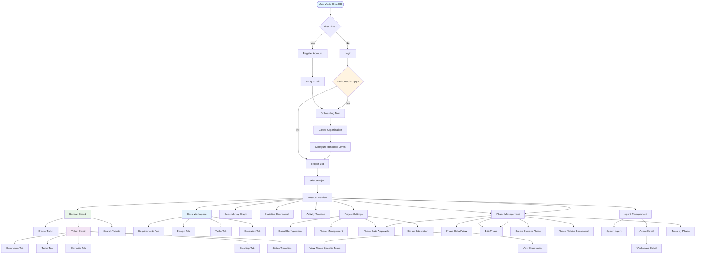
```mermaid
flowchart TD
    Start([User Visits OmoiOS]) --> Landing{First Time?}
    Landing -->|Yes| Register[Register Account]
    Landing -->|No| Login[Login]
    
    Register --> VerifyEmail[Verify Email]
    VerifyEmail --> Onboarding[Onboarding Tour]
    
    Login --> Dashboard{Dashboard Empty?}
    Dashboard -->|Yes| Onboarding
    Dashboard -->|No| ProjectList[Project List]
    
    Onboarding --> CreateOrg[Create Organization]
    CreateOrg --> SetLimits[Configure Resource Limits]
    SetLimits --> ProjectList
    
    ProjectList --> SelectProject[Select Project]
    SelectProject --> ProjectOverview[Project Overview]
    
    ProjectOverview --> Board[Kanban Board]
    ProjectOverview --> Specs[Spec Workspace]
    ProjectOverview --> Graph[Dependency Graph]
    ProjectOverview --> Stats[Statistics Dashboard]
    ProjectOverview --> Activity[Activity Timeline]
    ProjectOverview --> Phases[Phase Overview Dashboard]
    
    Board --> CreateTicket[Create Ticket]
    Board --> TicketDetail[Ticket Detail]
    Board --> SearchTickets[Search Tickets]
    
    TicketDetail --> Comments[Comments Tab]
    TicketDetail --> Tasks[Tasks Tab]
    TicketDetail --> Commits[Commits Tab]
    TicketDetail --> Blocking[Blocking Tab]
    TicketDetail --> Transition[Status Transition]
    
    Specs --> Requirements[Requirements Tab]
    Specs --> Design[Design Tab]
    Specs --> TasksTab[Tasks Tab]
    Specs --> Execution[Execution Tab]
    
    ProjectOverview --> Settings[Project Settings]
    Settings --> BoardConfig[Board Configuration]
    Settings --> PhaseConfig[Phase Management]
    Settings --> PhaseGates[Phase Gate Approvals]
    Settings --> GitHub[GitHub Integration]
    
    Phases --> PhaseDetail[Phase Detail View]
    Phases --> PhaseEdit[Edit Phase Configuration]
    Phases --> PhaseCreate[Create Custom Phase]
    Phases --> PhaseMetrics[Phase Metrics Dashboard]
    
    PhaseDetail --> PhaseTasks[View Phase-Specific Tasks]
    PhaseDetail --> PhaseDiscoveries[View Discoveries]
    
    ProjectOverview --> Agents[Agent Management]
    Agents --> SpawnAgent[Spawn Agent]
    Agents --> AgentDetail[Agent Detail]
    AgentDetail --> Workspace[Workspace Detail]
    
    ProjectOverview --> Phases[Phase Management]
    Phases --> PhaseEdit[Edit Phase]
    Phases --> TaskPhases[Tasks by Phase]
    Phases --> PhaseGates[Phase Gate Approvals]
    
    style Start fill:#e1f5ff
    style Dashboard fill:#fff4e1
    style Board fill:#e8f5e9
    style TicketDetail fill:#f3e5f5
    style Specs fill:#e3f2fd
```

---

## 2. Authentication & Onboarding Flow

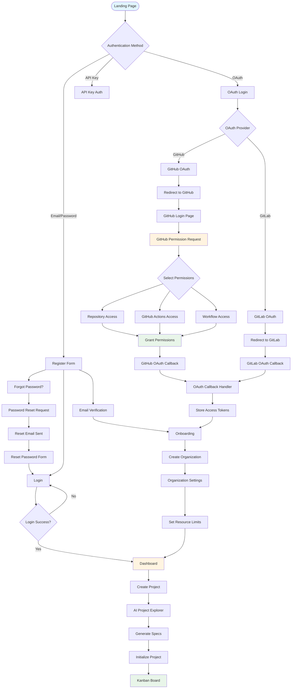
```mermaid
flowchart TD
    Start([Landing Page]) --> AuthChoice{Authentication Method}
    
    AuthChoice -->|Email/Password| Register[Register Form]
    AuthChoice -->|OAuth| OAuth[OAuth Login]
    AuthChoice -->|API Key| APIKey[API Key Auth]
    
    Register --> EmailVerify[Email Verification]
    EmailVerify --> Onboarding[Onboarding]
    
    OAuth --> OAuthProvider{OAuth Provider}
    OAuthProvider -->|GitHub| GitHubOAuth[GitHub OAuth]
    OAuthProvider -->|GitLab| GitLabOAuth[GitLab OAuth]
    
    GitHubOAuth --> GitHubAuth[Redirect to GitHub]
    GitHubAuth --> GitHubLogin[GitHub Login Page]
    GitHubLogin --> GitHubPermissions[GitHub Permission Request]
    
    GitHubPermissions --> PermissionScope{Select Permissions}
    PermissionScope --> RepoAccess[Repository Access]
    PermissionScope --> ActionsAccess[GitHub Actions Access]
    PermissionScope --> WorkflowAccess[Workflow Access]
    
    RepoAccess --> GrantPermissions[Grant Permissions]
    ActionsAccess --> GrantPermissions
    WorkflowAccess --> GrantPermissions
    
    GrantPermissions --> GitHubCallback[GitHub OAuth Callback]
    GitHubCallback --> OAuthCallback[OAuth Callback Handler]
    OAuthCallback --> StoreTokens[Store Access Tokens]
    StoreTokens --> Onboarding
    
    GitLabOAuth --> GitLabAuth[Redirect to GitLab]
    GitLabAuth --> GitLabCallback[GitLab OAuth Callback]
    GitLabCallback --> OAuthCallback
    
    Register --> ForgotPassword[Forgot Password?]
    ForgotPassword --> ResetRequest[Password Reset Request]
    ResetRequest --> ResetEmail[Reset Email Sent]
    ResetEmail --> ResetForm[Reset Password Form]
    ResetForm --> Login[Login]
    
    Register --> Login
    Login --> LoginSuccess{Login Success?}
    LoginSuccess -->|No| Login
    LoginSuccess -->|Yes| Dashboard[Dashboard]
    
    Onboarding --> CreateOrg[Create Organization]
    CreateOrg --> OrgSettings[Organization Settings]
    OrgSettings --> SetLimits[Set Resource Limits]
    SetLimits --> Dashboard
    
    Dashboard --> CreateProject[Create Project]
    CreateProject --> ProjectExplorer[AI Project Explorer]
    ProjectExplorer --> GenerateSpecs[Generate Specs]
    GenerateSpecs --> Initialize[Initialize Project]
    Initialize --> Board[Kanban Board]
    
    style Start fill:#e1f5ff
    style Dashboard fill:#fff4e1
    style Board fill:#e8f5e9
    style GitHubPermissions fill:#fff3e0
    style GrantPermissions fill:#e8f5e9
```

---

## 3. Ticket Management Flow

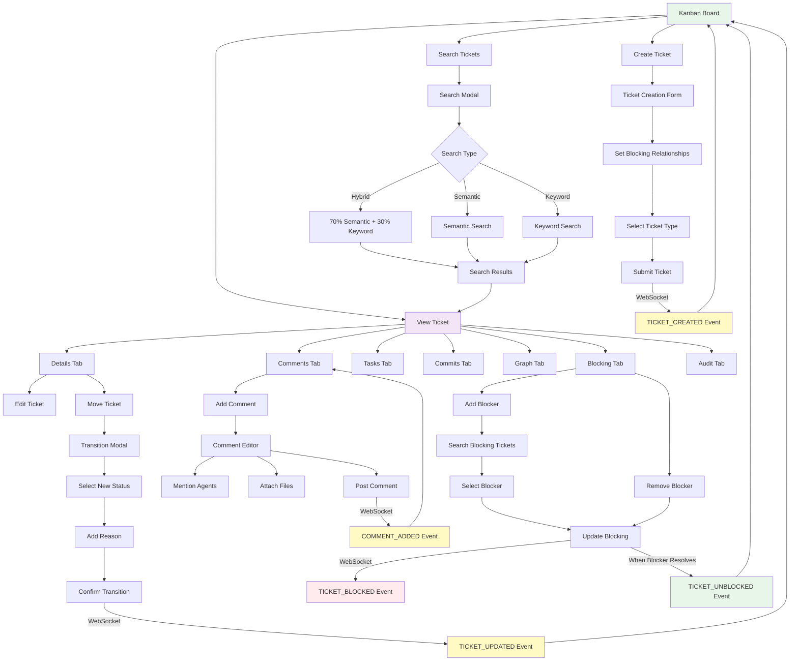
```mermaid
flowchart TD
    Board[Kanban Board] --> ViewTicket[View Ticket]
    Board --> CreateTicket[Create Ticket]
    Board --> SearchTickets[Search Tickets]
    
    CreateTicket --> TicketForm[Ticket Creation Form]
    TicketForm --> SetBlockers[Set Blocking Relationships]
    SetBlockers --> SetType[Select Ticket Type]
    SetType --> SubmitTicket[Submit Ticket]
    SubmitTicket -->|WebSocket| TicketCreated[TICKET_CREATED Event]
    TicketCreated --> Board
    
    SearchTickets --> SearchModal[Search Modal]
    SearchModal --> SearchType{Search Type}
    SearchType -->|Hybrid| HybridSearch[70% Semantic + 30% Keyword]
    SearchType -->|Semantic| SemanticSearch[Semantic Search]
    SearchType -->|Keyword| KeywordSearch[Keyword Search]
    HybridSearch --> Results[Search Results]
    SemanticSearch --> Results
    KeywordSearch --> Results
    Results --> ViewTicket
    
    ViewTicket --> Details[Details Tab]
    ViewTicket --> CommentsTab[Comments Tab]
    ViewTicket --> TasksTab[Tasks Tab]
    ViewTicket --> CommitsTab[Commits Tab]
    ViewTicket --> GraphTab[Graph Tab]
    ViewTicket --> BlockingTab[Blocking Tab]
    ViewTicket --> AuditTab[Audit Tab]
    
    Details --> EditTicket[Edit Ticket]
    Details --> MoveTicket[Move Ticket]
    MoveTicket --> TransitionModal[Transition Modal]
    TransitionModal --> SelectStatus[Select New Status]
    SelectStatus --> AddReason[Add Reason]
    AddReason --> ConfirmTransition[Confirm Transition]
    ConfirmTransition -->|WebSocket| TicketUpdated[TICKET_UPDATED Event]
    TicketUpdated --> Board
    
    CommentsTab --> AddComment[Add Comment]
    AddComment --> CommentEditor[Comment Editor]
    CommentEditor --> MentionAgents[Mention Agents]
    CommentEditor --> AttachFiles[Attach Files]
    CommentEditor --> PostComment[Post Comment]
    PostComment -->|WebSocket| CommentAdded[COMMENT_ADDED Event]
    CommentAdded --> CommentsTab
    
    BlockingTab --> AddBlocker[Add Blocker]
    BlockingTab --> RemoveBlocker[Remove Blocker]
    AddBlocker --> SearchBlockers[Search Blocking Tickets]
    SearchBlockers --> SelectBlocker[Select Blocker]
    SelectBlocker --> UpdateBlocking[Update Blocking]
    UpdateBlocking -->|WebSocket| TicketBlocked[TICKET_BLOCKED Event]
    
    RemoveBlocker --> UpdateBlocking
    UpdateBlocking -->|When Blocker Resolves| TicketUnblocked[TICKET_UNBLOCKED Event]
    TicketUnblocked --> Board
    
    style Board fill:#e8f5e9
    style ViewTicket fill:#f3e5f5
    style TicketCreated fill:#fff9c4
    style TicketUpdated fill:#fff9c4
    style CommentAdded fill:#fff9c4
    style TicketBlocked fill:#ffebee
    style TicketUnblocked fill:#e8f5e9
```

---

## 4. Agent-Driven Ticket Workflow

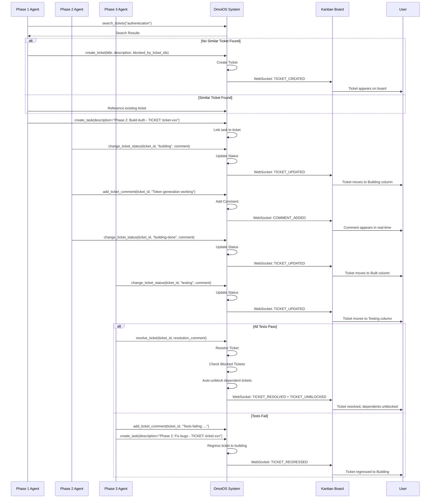
```mermaid
sequenceDiagram
    participant Agent1 as Phase 1 Agent
    participant Agent2 as Phase 2 Agent
    participant Agent3 as Phase 3 Agent
    participant System as OmoiOS System
    participant Board as Kanban Board
    participant User as User
    
    Agent1->>System: search_tickets("authentication")
    System-->>Agent1: Search Results
    
    alt No Similar Ticket Found
        Agent1->>System: create_ticket(title, description, blocked_by_ticket_ids)
        System->>System: Create Ticket
        System->>Board: WebSocket: TICKET_CREATED
        Board->>User: Ticket appears on board
    else Similar Ticket Found
        Agent1->>System: Reference existing ticket
    end
    
    Agent1->>System: create_task(description="Phase 2: Build Auth - TICKET: ticket-xxx")
    System->>System: Link task to ticket
    
    Agent2->>System: change_ticket_status(ticket_id, "building", comment)
    System->>System: Update Status
    System->>Board: WebSocket: TICKET_UPDATED
    Board->>User: Ticket moves to Building column
    
    Agent2->>System: add_ticket_comment(ticket_id, "Token generation working")
    System->>System: Add Comment
    System->>Board: WebSocket: COMMENT_ADDED
    Board->>User: Comment appears in real-time
    
    Agent2->>System: change_ticket_status(ticket_id, "building-done", comment)
    System->>System: Update Status
    System->>Board: WebSocket: TICKET_UPDATED
    Board->>User: Ticket moves to Built column
    
    Agent3->>System: change_ticket_status(ticket_id, "testing", comment)
    System->>System: Update Status
    System->>Board: WebSocket: TICKET_UPDATED
    Board->>User: Ticket moves to Testing column
    
    alt All Tests Pass
        Agent3->>System: resolve_ticket(ticket_id, resolution_comment)
        System->>System: Resolve Ticket
        System->>System: Check Blocked Tickets
        System->>System: Auto-unblock dependent tickets
        System->>Board: WebSocket: TICKET_RESOLVED + TICKET_UNBLOCKED
        Board->>User: Ticket resolved, dependents unblocked
    else Tests Fail
        Agent3->>System: add_ticket_comment(ticket_id, "Tests failing: ...")
        Agent3->>System: create_task(description="Phase 2: Fix bugs - TICKET: ticket-xxx")
        System->>System: Regress ticket to building
        System->>Board: WebSocket: TICKET_REGRESSED
        Board->>User: Ticket regressed to Building
    end
```

---

## 5. Page Flow Navigation Map

```mermaid
graph TB
    subgraph "Authentication Pages"
        Landing[Landing]
        Register[register]
        Login[login]
        VerifyEmail[verify-email]
        ForgotPassword[forgot-password]
        ResetPassword[reset-password]
    end
    
    subgraph "Organization Pages"
        OrgList[organizations]
        OrgNew[organizations/new]
        OrgDetail[organizations/:id]
        OrgSettings[organizations/:id/settings]
    end
    
    subgraph "Project Pages"
        Projects[projects]
        ProjectNew[projects/new]
        ProjectDetail[projects/:id]
        ProjectExplore[projects/:id/explore]
        ProjectSpecs[projects/:id/specs]
        ProjectSpecDetail[projects/:id/specs/:specId]
        ProjectStats[projects/:id/stats]
        ProjectActivity[projects/:id/activity]
        ProjectPhases[projects/:id/phases]
        ProjectPhaseEdit[projects/:id/phases/:phaseId]
        ProjectTaskPhases[projects/:id/tasks/phases]
        ProjectPhaseGates[projects/:id/phase-gates]
        ProjectSettings[projects/:id/settings]
    end
    
    subgraph "Board Pages"
        Board[board/:projectId]
        TicketDetail[board/:projectId/:ticketId]
    end
    
    subgraph "Graph Pages"
        Graph[graph/:projectId]
        TicketGraph[graph/:projectId/:ticketId]
    end
    
    subgraph "Agent Pages"
        Agents[agents]
        AgentSpawn[agents/spawn]
        AgentDetail[agents/:agentId]
        AgentWorkspace[agents/:agentId/workspace]
    end
    
    subgraph "Settings Pages"
        Settings[settings]
        Profile[settings/profile]
        APIKeys[settings/api-keys]
        Sessions[settings/sessions]
    end
    
    subgraph "GitHub Integration Pages"
        GitHubAuth[GitHub OAuth Authorization]
        GitHubCallback[GitHub OAuth Callback]
        GitHubSettings[projects/:id/settings/github]
    end
    
    Landing --> Register
    Landing --> Login
    Register --> VerifyEmail
    Login --> ForgotPassword
    Login --> GitHubAuth
    ForgotPassword --> ResetPassword
    
    GitHubAuth --> GitHubCallback
    GitHubCallback --> OrgList
    
    VerifyEmail --> OrgList
    OrgList --> OrgNew
    OrgList --> OrgDetail
    OrgDetail --> OrgSettings
    
    OrgDetail --> Projects
    Projects --> ProjectNew
    Projects --> ProjectDetail
    ProjectDetail --> ProjectExplore
    ProjectDetail --> ProjectSpecs
    ProjectSpecs --> ProjectSpecDetail
    ProjectDetail --> ProjectStats
    ProjectDetail --> ProjectActivity
    ProjectDetail --> ProjectPhases
    ProjectPhases --> ProjectPhaseEdit
    ProjectDetail --> ProjectTaskPhases
    ProjectDetail --> ProjectPhaseGates
    ProjectDetail --> ProjectSettings
    ProjectSettings --> GitHubSettings
    
    ProjectDetail --> Board
    Board --> TicketDetail
    Board --> Graph
    Graph --> TicketGraph
    
    ProjectDetail --> Agents
    Agents --> AgentSpawn
    Agents --> AgentDetail
    AgentDetail --> AgentWorkspace
    
    ProjectDetail --> Settings
    Settings --> Profile
    Settings --> APIKeys
    Settings --> Sessions
    
    style Landing fill:#e1f5ff
    style Board fill:#e8f5e9
    style TicketDetail fill:#f3e5f5
    style Graph fill:#e3f2fd
    style ProjectSpecDetail fill:#fff3e0
```

---

## 6. Phase Management Flow

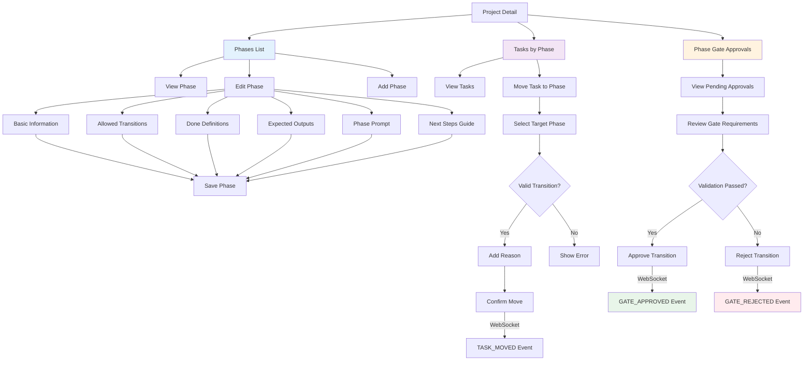
```mermaid
flowchart TD
    ProjectDetail[Project Detail] --> Phases[Phases List]
    
    Phases --> ViewPhase[View Phase]
    Phases --> EditPhase[Edit Phase]
    Phases --> AddPhase[Add Phase]
    
    EditPhase --> BasicInfo[Basic Information]
    EditPhase --> Transitions[Allowed Transitions]
    EditPhase --> DoneDefs[Done Definitions]
    EditPhase --> ExpectedOutputs[Expected Outputs]
    EditPhase --> PhasePrompt[Phase Prompt]
    EditPhase --> NextSteps[Next Steps Guide]
    
    BasicInfo --> SavePhase[Save Phase]
    Transitions --> SavePhase
    DoneDefs --> SavePhase
    ExpectedOutputs --> SavePhase
    PhasePrompt --> SavePhase
    NextSteps --> SavePhase
    
    ProjectDetail --> TaskPhases[Tasks by Phase]
    TaskPhases --> ViewTasks[View Tasks]
    TaskPhases --> MoveTask[Move Task to Phase]
    
    MoveTask --> SelectTarget[Select Target Phase]
    SelectTarget --> ValidateTransition{Valid Transition?}
    ValidateTransition -->|Yes| AddReason[Add Reason]
    ValidateTransition -->|No| ShowError[Show Error]
    AddReason --> ConfirmMove[Confirm Move]
    ConfirmMove -->|WebSocket| TaskMoved[TASK_MOVED Event]
    
    ProjectDetail --> PhaseGates[Phase Gate Approvals]
    PhaseGates --> ViewPending[View Pending Approvals]
    ViewPending --> ReviewGate[Review Gate Requirements]
    ReviewGate --> CheckValidation{Validation Passed?}
    CheckValidation -->|Yes| Approve[Approve Transition]
    CheckValidation -->|No| Reject[Reject Transition]
    Approve -->|WebSocket| GateApproved[GATE_APPROVED Event]
    Reject -->|WebSocket| GateRejected[GATE_REJECTED Event]
    
    style Phases fill:#e3f2fd
    style TaskPhases fill:#f3e5f5
    style PhaseGates fill:#fff3e0
    style GateApproved fill:#e8f5e9
    style GateRejected fill:#ffebee
```

---

## 7. Real-Time Updates Flow

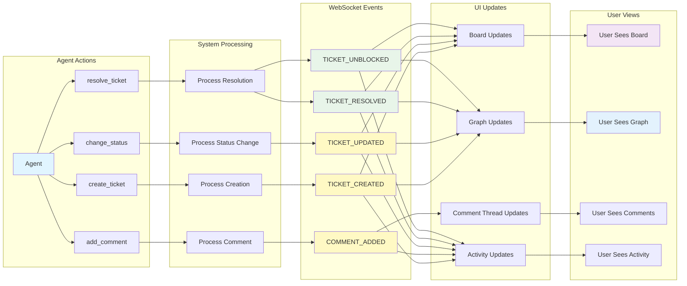
```mermaid
flowchart LR
    subgraph "Agent Actions"
        Agent[Agent] --> CreateTicket[create_ticket]
        Agent --> AddComment[add_comment]
        Agent --> ChangeStatus[change_status]
        Agent --> ResolveTicket[resolve_ticket]
    end
    
    subgraph "System Processing"
        CreateTicket --> ProcessCreate[Process Creation]
        AddComment --> ProcessComment[Process Comment]
        ChangeStatus --> ProcessStatus[Process Status Change]
        ResolveTicket --> ProcessResolve[Process Resolution]
    end
    
    subgraph "WebSocket Events"
        ProcessCreate --> WSTicketCreated[TICKET_CREATED]
        ProcessComment --> WSCommentAdded[COMMENT_ADDED]
        ProcessStatus --> WSTicketUpdated[TICKET_UPDATED]
        ProcessResolve --> WSTicketResolved[TICKET_RESOLVED]
        ProcessResolve --> WSTicketUnblocked[TICKET_UNBLOCKED]
    end
    
    subgraph "UI Updates"
        WSTicketCreated --> BoardUpdate[Board Updates]
        WSTicketCreated --> GraphUpdate[Graph Updates]
        WSTicketCreated --> ActivityUpdate[Activity Updates]
        
        WSCommentAdded --> CommentThread[Comment Thread Updates]
        WSCommentAdded --> ActivityUpdate
        
        WSTicketUpdated --> BoardUpdate
        WSTicketUpdated --> GraphUpdate
        WSTicketUpdated --> ActivityUpdate
        
        WSTicketResolved --> BoardUpdate
        WSTicketResolved --> GraphUpdate
        WSTicketResolved --> ActivityUpdate
        
        WSTicketUnblocked --> BoardUpdate
        WSTicketUnblocked --> GraphUpdate
        WSTicketUnblocked --> ActivityUpdate
    end
    
    subgraph "User Views"
        BoardUpdate --> UserBoard[User Sees Board]
        GraphUpdate --> UserGraph[User Sees Graph]
        CommentThread --> UserComments[User Sees Comments]
        ActivityUpdate --> UserActivity[User Sees Activity]
    end
    
    style Agent fill:#e1f5ff
    style WSTicketCreated fill:#fff9c4
    style WSCommentAdded fill:#fff9c4
    style WSTicketUpdated fill:#fff9c4
    style WSTicketResolved fill:#e8f5e9
    style WSTicketUnblocked fill:#e8f5e9
    style UserBoard fill:#f3e5f5
    style UserGraph fill:#e3f2fd
```

---

## 8. Complete Ticket Lifecycle Flow

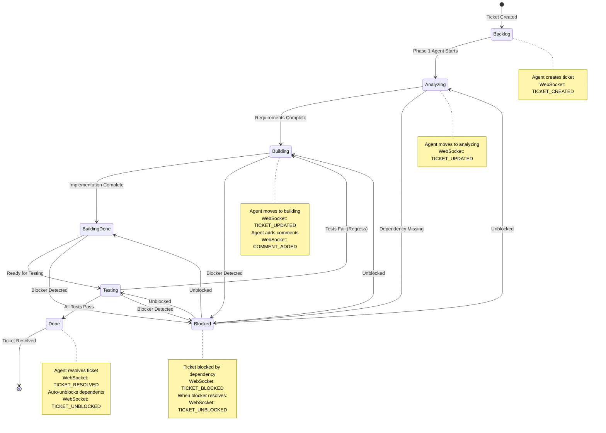
```mermaid
stateDiagram-v2
    [*] --> Backlog: Ticket Created
    
    Backlog --> Analyzing: Phase 1 Agent Starts
    Analyzing --> Building: Requirements Complete
    Analyzing --> Blocked: Dependency Missing
    
    Building --> BuildingDone: Implementation Complete
    Building --> Blocked: Blocker Detected
    
    BuildingDone --> Testing: Ready for Testing
    BuildingDone --> Blocked: Blocker Detected
    
    Testing --> Done: All Tests Pass
    Testing --> Building: Tests Fail (Regress)
    Testing --> Blocked: Blocker Detected
    
    Blocked --> Analyzing: Unblocked
    Blocked --> Building: Unblocked
    Blocked --> BuildingDone: Unblocked
    Blocked --> Testing: Unblocked
    
    Done --> [*]: Ticket Resolved
    
    note right of Backlog
        Agent creates ticket
        WebSocket: TICKET_CREATED
    end note
    
    note right of Analyzing
        Agent moves to analyzing
        WebSocket: TICKET_UPDATED
    end note
    
    note right of Building
        Agent moves to building
        WebSocket: TICKET_UPDATED
        Agent adds comments
        WebSocket: COMMENT_ADDED
    end note
    
    note right of Blocked
        Ticket blocked by dependency
        WebSocket: TICKET_BLOCKED
        When blocker resolves:
        WebSocket: TICKET_UNBLOCKED
    end note
    
    note right of Done
        Agent resolves ticket
        WebSocket: TICKET_RESOLVED
        Auto-unblocks dependents
        WebSocket: TICKET_UNBLOCKED
    end note
```

---

## 9. Spec-Driven Workflow Flow

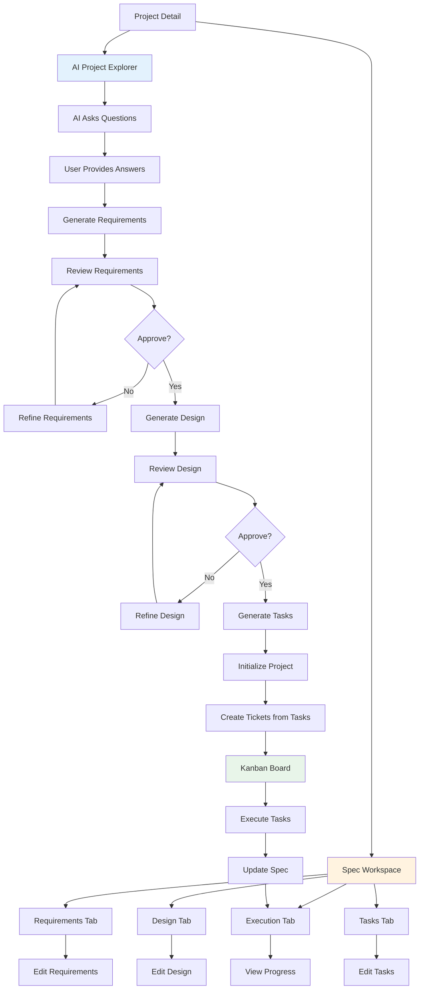
```mermaid
flowchart TD
    ProjectDetail[Project Detail] --> Explore[AI Project Explorer]
    
    Explore --> Questions[AI Asks Questions]
    Questions --> Answers[User Provides Answers]
    Answers --> GenerateReq[Generate Requirements]
    
    GenerateReq --> ReviewReq[Review Requirements]
    ReviewReq --> ApproveReq{Approve?}
    ApproveReq -->|No| RefineReq[Refine Requirements]
    RefineReq --> ReviewReq
    ApproveReq -->|Yes| GenerateDesign[Generate Design]
    
    GenerateDesign --> ReviewDesign[Review Design]
    ReviewDesign --> ApproveDesign{Approve?}
    ApproveDesign -->|No| RefineDesign[Refine Design]
    RefineDesign --> ReviewDesign
    ApproveDesign -->|Yes| GenerateTasks[Generate Tasks]
    
    GenerateTasks --> Initialize[Initialize Project]
    Initialize --> CreateTickets[Create Tickets from Tasks]
    CreateTickets --> Board[Kanban Board]
    
    ProjectDetail --> Specs[Spec Workspace]
    Specs --> RequirementsTab[Requirements Tab]
    Specs --> DesignTab[Design Tab]
    Specs --> TasksTab[Tasks Tab]
    Specs --> ExecutionTab[Execution Tab]
    
    RequirementsTab --> EditReq[Edit Requirements]
    DesignTab --> EditDesign[Edit Design]
    TasksTab --> EditTasks[Edit Tasks]
    ExecutionTab --> ViewProgress[View Progress]
    
    Board --> ExecuteTasks[Execute Tasks]
    ExecuteTasks --> UpdateSpec[Update Spec]
    UpdateSpec --> ExecutionTab
    
    style Explore fill:#e3f2fd
    style Specs fill:#fff3e0
    style Board fill:#e8f5e9
```

---

## 10. Workspace Isolation Flow

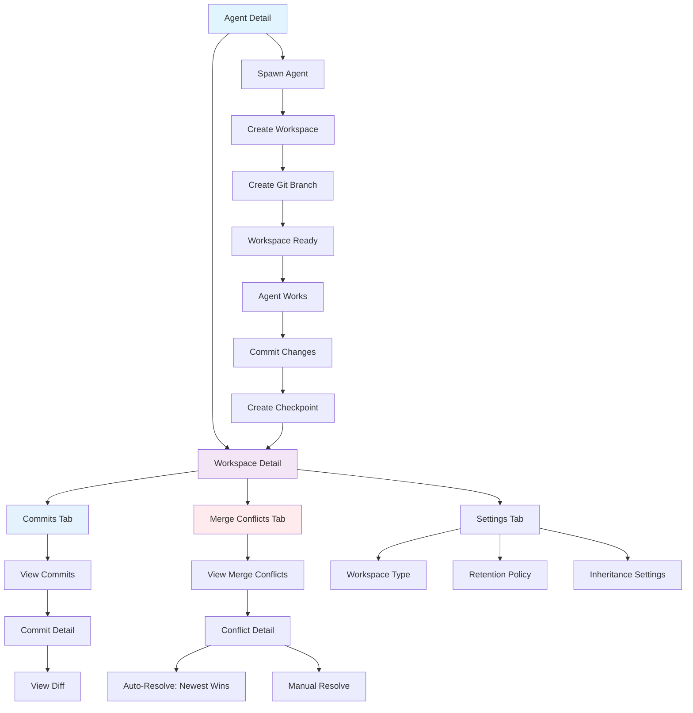
```mermaid
flowchart TD
    AgentDetail[Agent Detail] --> Workspace[Workspace Detail]
    
    Workspace --> CommitsTab[Commits Tab]
    Workspace --> ConflictsTab[Merge Conflicts Tab]
    Workspace --> SettingsTab[Settings Tab]
    
    CommitsTab --> ViewCommits[View Commits]
    ViewCommits --> CommitDetail[Commit Detail]
    CommitDetail --> ViewDiff[View Diff]
    
    ConflictsTab --> ViewConflicts[View Merge Conflicts]
    ViewConflicts --> ConflictDetail[Conflict Detail]
    ConflictDetail --> AutoResolve[Auto-Resolve: Newest Wins]
    ConflictDetail --> ManualResolve[Manual Resolve]
    
    SettingsTab --> WorkspaceType[Workspace Type]
    SettingsTab --> RetentionPolicy[Retention Policy]
    SettingsTab --> InheritanceSettings[Inheritance Settings]
    
    AgentDetail --> SpawnAgent[Spawn Agent]
    SpawnAgent --> CreateWorkspace[Create Workspace]
    CreateWorkspace --> GitBranch[Create Git Branch]
    GitBranch --> WorkspaceReady[Workspace Ready]
    
    WorkspaceReady --> AgentWork[Agent Works]
    AgentWork --> CommitChanges[Commit Changes]
    CommitChanges --> Checkpoint[Create Checkpoint]
    Checkpoint --> Workspace
    
    style AgentDetail fill:#e1f5ff
    style Workspace fill:#f3e5f5
    style CommitsTab fill:#e3f2fd
    style ConflictsTab fill:#ffebee
```

---

## 11. GitHub OAuth Integration Flow

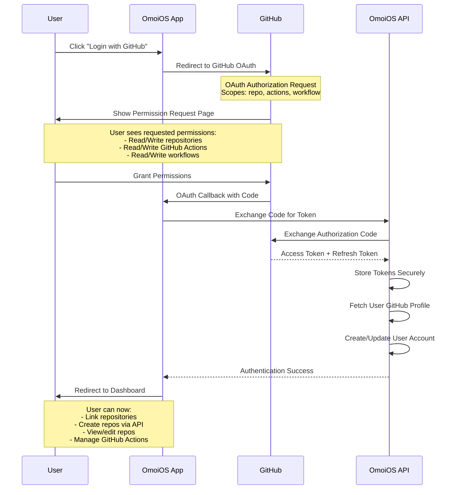
```mermaid
sequenceDiagram
    participant User as User
    participant App as OmoiOS App
    participant GitHub as GitHub
    participant API as OmoiOS API
    
    User->>App: Click "Login with GitHub"
    App->>GitHub: Redirect to GitHub OAuth
    Note over GitHub: OAuth Authorization Request<br/>Scopes: repo, actions, workflow
    
    GitHub->>User: Show Permission Request Page
    Note over User,GitHub: User sees requested permissions:<br/>- Read/Write repositories<br/>- Read/Write GitHub Actions<br/>- Read/Write workflows
    
    User->>GitHub: Grant Permissions
    GitHub->>App: OAuth Callback with Code
    App->>API: Exchange Code for Token
    API->>GitHub: Exchange Authorization Code
    GitHub-->>API: Access Token + Refresh Token
    
    API->>API: Store Tokens Securely
    API->>API: Fetch User GitHub Profile
    API->>API: Create/Update User Account
    API-->>App: Authentication Success
    App->>User: Redirect to Dashboard
    
    Note over User,App: User can now:<br/>- Link repositories<br/>- Create repos via API<br/>- View/edit repos<br/>- Manage GitHub Actions
```

---

## 12. GitHub Integration Setup Flow

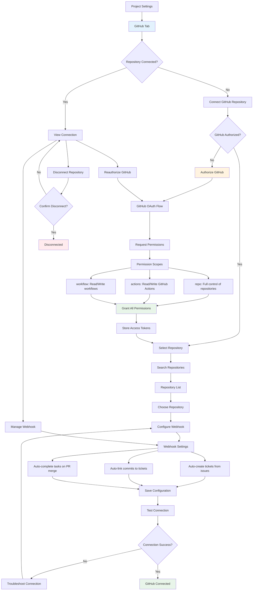
```mermaid
flowchart TD
    ProjectSettings[Project Settings] --> GitHubTab[GitHub Tab]
    
    GitHubTab --> ConnectRepo{Repository Connected?}
    ConnectRepo -->|No| ConnectGitHub[Connect GitHub Repository]
    ConnectRepo -->|Yes| ViewConnection[View Connection]
    
    ConnectGitHub --> CheckAuth{GitHub Authorized?}
    CheckAuth -->|No| AuthorizeGitHub[Authorize GitHub]
    CheckAuth -->|Yes| SelectRepo[Select Repository]
    
    AuthorizeGitHub --> GitHubOAuth[GitHub OAuth Flow]
    GitHubOAuth --> RequestPermissions[Request Permissions]
    
    RequestPermissions --> PermissionList[Permission Scopes]
    PermissionList --> RepoScope[repo: Full control of repositories]
    PermissionList --> ActionsScope[actions: Read/Write GitHub Actions]
    PermissionList --> WorkflowScope[workflow: Read/Write workflows]
    
    RepoScope --> GrantAll[Grant All Permissions]
    ActionsScope --> GrantAll
    WorkflowScope --> GrantAll
    
    GrantAll --> StoreTokens[Store Access Tokens]
    StoreTokens --> SelectRepo
    
    SelectRepo --> SearchRepos[Search Repositories]
    SearchRepos --> RepoList[Repository List]
    RepoList --> ChooseRepo[Choose Repository]
    ChooseRepo --> ConfigureWebhook[Configure Webhook]
    
    ConfigureWebhook --> WebhookSettings[Webhook Settings]
    WebhookSettings --> AutoCreateTickets[Auto-create tickets from issues]
    WebhookSettings --> AutoLinkCommits[Auto-link commits to tickets]
    WebhookSettings --> AutoCompleteTasks[Auto-complete tasks on PR merge]
    
    AutoCreateTickets --> SaveConfig[Save Configuration]
    AutoLinkCommits --> SaveConfig
    AutoCompleteTasks --> SaveConfig
    
    SaveConfig --> TestConnection[Test Connection]
    TestConnection --> ConnectionSuccess{Connection Success?}
    ConnectionSuccess -->|No| Troubleshoot[Troubleshoot Connection]
    Troubleshoot --> ConfigureWebhook
    ConnectionSuccess -->|Yes| Connected[GitHub Connected]
    
    ViewConnection --> ManageWebhook[Manage Webhook]
    ViewConnection --> Disconnect[Disconnect Repository]
    ViewConnection --> Reauthorize[Reauthorize GitHub]
    
    ManageWebhook --> WebhookSettings
    Reauthorize --> GitHubOAuth
    Disconnect --> ConfirmDisconnect{Confirm Disconnect?}
    ConfirmDisconnect -->|Yes| Disconnected[Disconnected]
    ConfirmDisconnect -->|No| ViewConnection
    
    style GitHubTab fill:#e3f2fd
    style AuthorizeGitHub fill:#fff3e0
    style GrantAll fill:#e8f5e9
    style Connected fill:#e8f5e9
    style Disconnected fill:#ffebee
```

---

## 13. GitHub Repository Management Flow

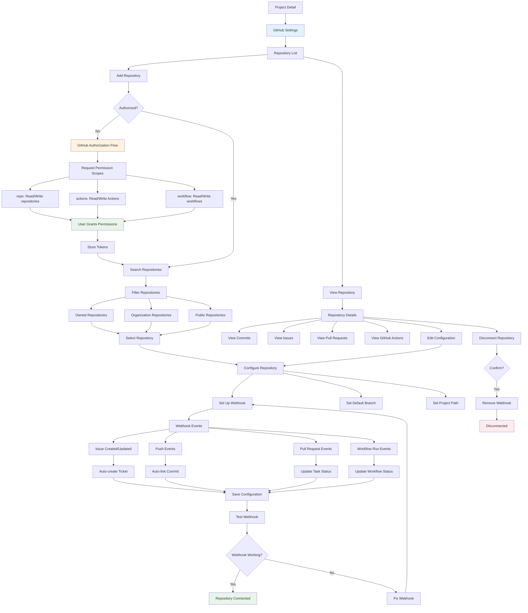
```mermaid
flowchart TD
    ProjectDetail[Project Detail] --> GitHubSettings[GitHub Settings]
    
    GitHubSettings --> RepoList[Repository List]
    RepoList --> AddRepo[Add Repository]
    RepoList --> ViewRepo[View Repository]
    
    AddRepo --> AuthCheck{Authorized?}
    AuthCheck -->|No| AuthFlow[GitHub Authorization Flow]
    AuthCheck -->|Yes| SearchRepos[Search Repositories]
    
    AuthFlow --> RequestScopes[Request Permission Scopes]
    RequestScopes --> RepoScope[repo: Read/Write repositories]
    RequestScopes --> ActionsScope[actions: Read/Write Actions]
    RequestScopes --> WorkflowScope[workflow: Read/Write workflows]
    
    RepoScope --> UserGrants[User Grants Permissions]
    ActionsScope --> UserGrants
    WorkflowScope --> UserGrants
    
    UserGrants --> StoreTokens[Store Tokens]
    StoreTokens --> SearchRepos
    
    SearchRepos --> FilterRepos[Filter Repositories]
    FilterRepos --> OwnedRepos[Owned Repositories]
    FilterRepos --> OrgRepos[Organization Repositories]
    FilterRepos --> PublicRepos[Public Repositories]
    
    OwnedRepos --> SelectRepo[Select Repository]
    OrgRepos --> SelectRepo
    PublicRepos --> SelectRepo
    
    SelectRepo --> ConfigureRepo[Configure Repository]
    ConfigureRepo --> SetWebhook[Set Up Webhook]
    ConfigureRepo --> SetBranch[Set Default Branch]
    ConfigureRepo --> SetPath[Set Project Path]
    
    SetWebhook --> WebhookEvents[Webhook Events]
    WebhookEvents --> IssueEvents[Issue Created/Updated]
    WebhookEvents --> PushEvents[Push Events]
    WebhookEvents --> PREvents[Pull Request Events]
    WebhookEvents --> WorkflowEvents[Workflow Run Events]
    
    IssueEvents --> AutoCreateTicket[Auto-create Ticket]
    PushEvents --> AutoLinkCommit[Auto-link Commit]
    PREvents --> UpdateTaskStatus[Update Task Status]
    WorkflowEvents --> UpdateWorkflowStatus[Update Workflow Status]
    
    AutoCreateTicket --> SaveConfig[Save Configuration]
    AutoLinkCommit --> SaveConfig
    UpdateTaskStatus --> SaveConfig
    UpdateWorkflowStatus --> SaveConfig
    
    SaveConfig --> TestWebhook[Test Webhook]
    TestWebhook --> WebhookSuccess{Webhook Working?}
    WebhookSuccess -->|Yes| RepoConnected[Repository Connected]
    WebhookSuccess -->|No| FixWebhook[Fix Webhook]
    FixWebhook --> SetWebhook
    
    ViewRepo --> RepoDetails[Repository Details]
    RepoDetails --> ViewCommits[View Commits]
    RepoDetails --> ViewIssues[View Issues]
    RepoDetails --> ViewPRs[View Pull Requests]
    RepoDetails --> ViewActions[View GitHub Actions]
    RepoDetails --> EditConfig[Edit Configuration]
    RepoDetails --> DisconnectRepo[Disconnect Repository]
    
    EditConfig --> ConfigureRepo
    DisconnectRepo --> ConfirmDisconnect{Confirm?}
    ConfirmDisconnect -->|Yes| RemoveWebhook[Remove Webhook]
    RemoveWebhook --> Disconnected[Disconnected]
    
    style GitHubSettings fill:#e3f2fd
    style AuthFlow fill:#fff3e0
    style UserGrants fill:#e8f5e9
    style RepoConnected fill:#e8f5e9
    style Disconnected fill:#ffebee
```

---

## 14. Diagnostic Reasoning Flow

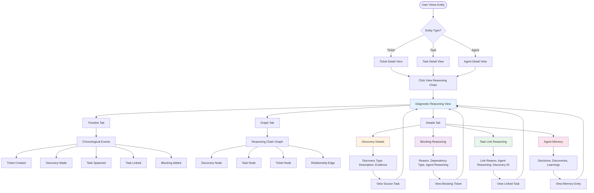
```mermaid
flowchart TD
    Start([User Views Entity]) --> EntityType{Entity Type?}
    
    EntityType -->|Ticket| TicketDetail[Ticket Detail View]
    EntityType -->|Task| TaskDetail[Task Detail View]
    EntityType -->|Agent| AgentDetail[Agent Detail View]
    
    TicketDetail --> ViewReasoning[Click View Reasoning Chain]
    TaskDetail --> ViewReasoning
    AgentDetail --> ViewReasoning
    
    ViewReasoning --> DiagnosticView[Diagnostic Reasoning View]
    
    DiagnosticView --> TimelineTab[Timeline Tab]
    DiagnosticView --> GraphTab[Graph Tab]
    DiagnosticView --> DetailsTab[Details Tab]
    
    TimelineTab --> TimelineEvents[Chronological Events]
    TimelineEvents --> Event1[Ticket Created]
    TimelineEvents --> Event2[Discovery Made]
    TimelineEvents --> Event3[Task Spawned]
    TimelineEvents --> Event4[Task Linked]
    TimelineEvents --> Event5[Blocking Added]
    
    GraphTab --> ReasoningGraph[Reasoning Chain Graph]
    ReasoningGraph --> DiscoveryNode[Discovery Node]
    ReasoningGraph --> TaskNode[Task Node]
    ReasoningGraph --> TicketNode[Ticket Node]
    ReasoningGraph --> RelationshipEdge[Relationship Edge]
    
    DetailsTab --> DiscoveryPanel[Discovery Details]
    DetailsTab --> BlockingPanel[Blocking Reasoning]
    DetailsTab --> LinkPanel[Task Link Reasoning]
    DetailsTab --> MemoryPanel[Agent Memory]
    
    DiscoveryPanel --> DiscoveryInfo[Discovery Type, Description, Evidence]
    BlockingPanel --> BlockingInfo[Reason, Dependency Type, Agent Reasoning]
    LinkPanel --> LinkInfo[Link Reason, Agent Reasoning, Discovery ID]
    MemoryPanel --> MemoryEntries[Decisions, Discoveries, Learnings]
    
    DiscoveryInfo --> ViewSource[View Source Task]
    BlockingInfo --> ViewBlocking[View Blocking Ticket]
    LinkInfo --> ViewTask[View Linked Task]
    MemoryEntries --> ViewMemory[View Memory Entry]
    
    ViewSource --> DiagnosticView
    ViewBlocking --> DiagnosticView
    ViewTask --> DiagnosticView
    ViewMemory --> DiagnosticView
    
    style DiagnosticView fill:#e3f2fd
    style DiscoveryPanel fill:#fff3e0
    style BlockingPanel fill:#f3e5f5
    style LinkPanel fill:#e8f5e9
    style MemoryPanel fill:#fce4ec
```

---

## 15. Phase Management & Configuration Flow

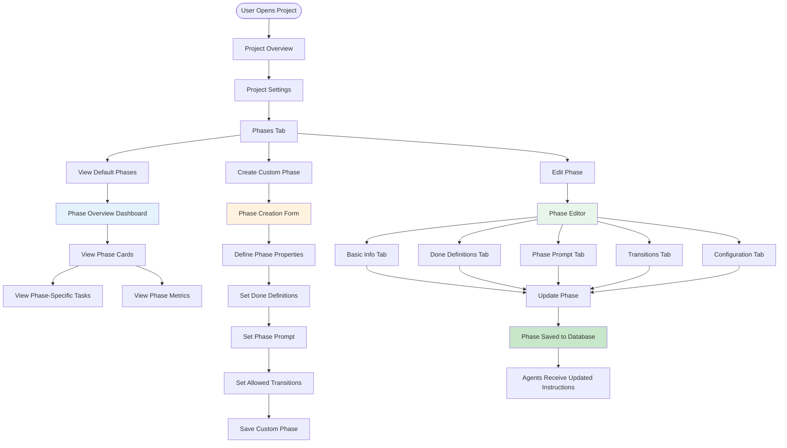
```mermaid
flowchart TD
    Start([User Opens Project]) --> ProjectOverview[Project Overview]
    
    ProjectOverview --> Settings[Project Settings]
    Settings --> PhasesTab[Phases Tab]
    
    PhasesTab --> ViewPhases[View Default Phases]
    PhasesTab --> CreatePhase[Create Custom Phase]
    PhasesTab --> EditPhase[Edit Phase]
    
    ViewPhases --> PhaseOverview[Phase Overview Dashboard]
    PhaseOverview --> PhaseCards[View Phase Cards]
    PhaseCards --> PhaseTasks[View Phase-Specific Tasks]
    PhaseCards --> PhaseMetrics[View Phase Metrics]
    
    CreatePhase --> PhaseForm[Phase Creation Form]
    PhaseForm --> DefineProperties[Define Phase Properties]
    DefineProperties --> SetDoneDefs[Set Done Definitions]
    SetDoneDefs --> SetPrompt[Set Phase Prompt]
    SetPrompt --> SetTransitions[Set Allowed Transitions]
    SetTransitions --> SavePhase[Save Custom Phase]
    
    EditPhase --> PhaseEditor[Phase Editor]
    PhaseEditor --> BasicInfo[Basic Info Tab]
    PhaseEditor --> DoneDefs[Done Definitions Tab]
    PhaseEditor --> PhasePrompt[Phase Prompt Tab]
    PhaseEditor --> Transitions[Transitions Tab]
    PhaseEditor --> Config[Configuration Tab]
    
    BasicInfo --> UpdatePhase[Update Phase]
    DoneDefs --> UpdatePhase
    PhasePrompt --> UpdatePhase
    Transitions --> UpdatePhase
    Config --> UpdatePhase
    
    UpdatePhase --> PhaseSaved[Phase Saved to Database]
    PhaseSaved --> AgentsUpdated[Agents Receive Updated Instructions]
    
    style PhaseOverview fill:#e3f2fd
    style PhaseForm fill:#fff3e0
    style PhaseEditor fill:#e8f5e9
    style PhaseSaved fill:#c8e6c9
```

---

## 16. Phasor System: Adaptive Phase Orchestration Flow

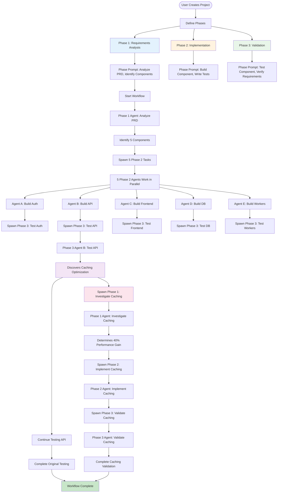
```mermaid
flowchart TD
    Start([User Creates Project]) --> DefinePhases[Define Phases]
    
    DefinePhases --> Phase1[Phase 1: Requirements Analysis]
    DefinePhases --> Phase2[Phase 2: Implementation]
    DefinePhases --> Phase3[Phase 3: Validation]
    
    Phase1 --> Phase1Prompt[Phase Prompt: Analyze PRD, Identify Components]
    Phase2 --> Phase2Prompt[Phase Prompt: Build Component, Write Tests]
    Phase3 --> Phase3Prompt[Phase Prompt: Test Component, Verify Requirements]
    
    Phase1Prompt --> StartWorkflow[Start Workflow]
    StartWorkflow --> Phase1Agent[Phase 1 Agent: Analyze PRD]
    
    Phase1Agent --> IdentifyComponents[Identify 5 Components]
    IdentifyComponents --> SpawnPhase2[Spawn 5 Phase 2 Tasks]
    
    SpawnPhase2 --> ParallelBuild[5 Phase 2 Agents Work in Parallel]
    ParallelBuild --> AgentA[Agent A: Build Auth]
    ParallelBuild --> AgentB[Agent B: Build API]
    ParallelBuild --> AgentC[Agent C: Build Frontend]
    ParallelBuild --> AgentD[Agent D: Build DB]
    ParallelBuild --> AgentE[Agent E: Build Workers]
    
    AgentA --> SpawnPhase3A[Spawn Phase 3: Test Auth]
    AgentB --> SpawnPhase3B[Spawn Phase 3: Test API]
    AgentC --> SpawnPhase3C[Spawn Phase 3: Test Frontend]
    AgentD --> SpawnPhase3D[Spawn Phase 3: Test DB]
    AgentE --> SpawnPhase3E[Spawn Phase 3: Test Workers]
    
    SpawnPhase3B --> Phase3AgentB[Phase 3 Agent B: Test API]
    Phase3AgentB --> DiscoverOptimization[Discovers Caching Optimization]
    
    DiscoverOptimization --> ContinueTesting[Continue Testing API]
    DiscoverOptimization --> SpawnPhase1Investigation[Spawn Phase 1: Investigate Caching]
    
    SpawnPhase1Investigation --> Phase1InvestigationAgent[Phase 1 Agent: Investigate Caching]
    Phase1InvestigationAgent --> DetermineValue[Determines 40% Performance Gain]
    DetermineValue --> SpawnPhase2Caching[Spawn Phase 2: Implement Caching]
    
    SpawnPhase2Caching --> Phase2CachingAgent[Phase 2 Agent: Implement Caching]
    Phase2CachingAgent --> SpawnPhase3Caching[Spawn Phase 3: Validate Caching]
    
    SpawnPhase3Caching --> Phase3CachingAgent[Phase 3 Agent: Validate Caching]
    
    ContinueTesting --> CompleteOriginal[Complete Original Testing]
    Phase3CachingAgent --> CompleteCaching[Complete Caching Validation]
    
    CompleteOriginal --> WorkflowComplete[Workflow Complete]
    CompleteCaching --> WorkflowComplete
    
    style Phase1 fill:#e3f2fd
    style Phase2 fill:#fff3e0
    style Phase3 fill:#e8f5e9
    style DiscoverOptimization fill:#f3e5f5
    style SpawnPhase1Investigation fill:#fce4ec
    style WorkflowComplete fill:#c8e6c9
```

---

## 17. Phase Gate Approval Flow

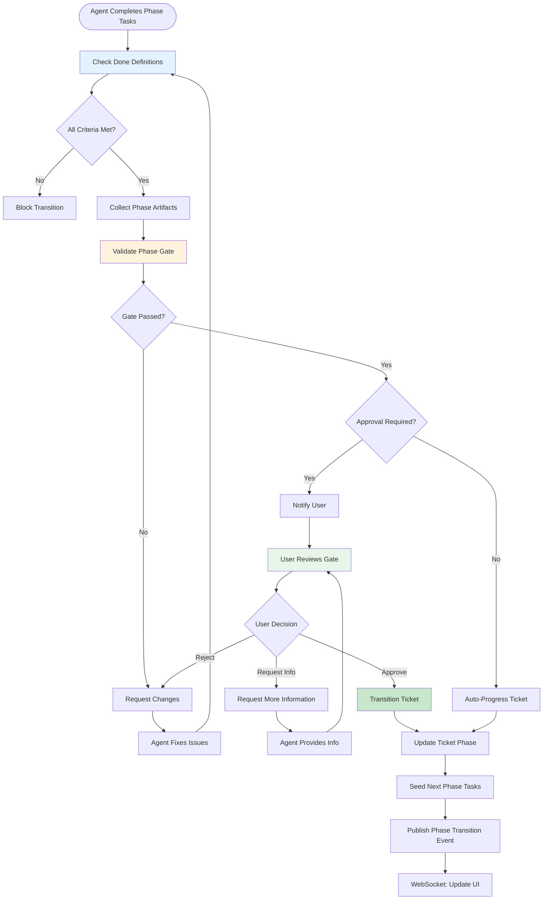
```mermaid
flowchart TD
    Start([Agent Completes Phase Tasks]) --> CheckDoneDefs[Check Done Definitions]
    
    CheckDoneDefs --> AllMet{All Criteria Met?}
    AllMet -->|No| BlockTransition[Block Transition]
    AllMet -->|Yes| CollectArtifacts[Collect Phase Artifacts]
    
    CollectArtifacts --> ValidateGate[Validate Phase Gate]
    ValidateGate --> GatePassed{Gate Passed?}
    
    GatePassed -->|No| RequestChanges[Request Changes]
    RequestChanges --> AgentFixes[Agent Fixes Issues]
    AgentFixes --> CheckDoneDefs
    
    GatePassed -->|Yes| ApprovalRequired{Approval Required?}
    ApprovalRequired -->|No| AutoProgress[Auto-Progress Ticket]
    ApprovalRequired -->|Yes| NotifyUser[Notify User]
    
    NotifyUser --> UserReviews[User Reviews Gate]
    UserReviews --> UserDecision{User Decision}
    
    UserDecision -->|Approve| TransitionTicket[Transition Ticket]
    UserDecision -->|Reject| RequestChanges
    UserDecision -->|Request Info| RequestMoreInfo[Request More Information]
    RequestMoreInfo --> AgentProvides[Agent Provides Info]
    AgentProvides --> UserReviews
    
    TransitionTicket --> UpdatePhase[Update Ticket Phase]
    UpdatePhase --> SeedTasks[Seed Next Phase Tasks]
    SeedTasks --> PublishEvent[Publish Phase Transition Event]
    PublishEvent --> WebSocketUpdate[WebSocket: Update UI]
    
    AutoProgress --> UpdatePhase
    
    style CheckDoneDefs fill:#e3f2fd
    style ValidateGate fill:#fff3e0
    style UserReviews fill:#e8f5e9
    style TransitionTicket fill:#c8e6c9
```

---

## 18. Complete System Flow Overview

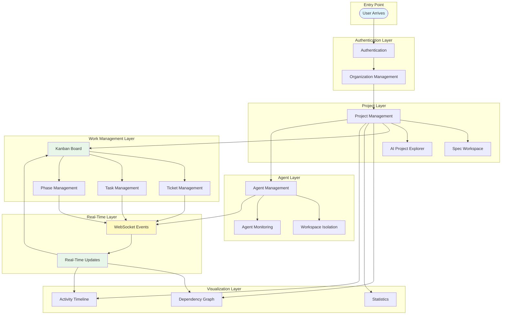
```mermaid
graph TB
    subgraph "Entry Point"
        Start([User Arrives])
    end
    
    subgraph "Authentication Layer"
        Auth[Authentication]
        Org[Organization Management]
    end
    
    subgraph "Project Layer"
        Projects[Project Management]
        Specs[Spec Workspace]
        Explore[AI Project Explorer]
    end
    
    subgraph "Work Management Layer"
        Board[Kanban Board]
        Tickets[Ticket Management]
        Tasks[Task Management]
        Phases[Phase Management]
    end
    
    subgraph "Visualization Layer"
        Graph[Dependency Graph]
        Stats[Statistics]
        Activity[Activity Timeline]
    end
    
    subgraph "Agent Layer"
        Agents[Agent Management]
        Workspaces[Workspace Isolation]
        Monitoring[Agent Monitoring]
    end
    
    subgraph "Real-Time Layer"
        WebSocket[WebSocket Events]
        Updates[Real-Time Updates]
    end
    
    Start --> Auth
    Auth --> Org
    Org --> Projects
    Projects --> Specs
    Projects --> Explore
    Projects --> Board
    Board --> Tickets
    Board --> Tasks
    Board --> Phases
    Projects --> Graph
    Projects --> Stats
    Projects --> Activity
    Projects --> Agents
    Agents --> Workspaces
    Agents --> Monitoring
    
    Tickets --> WebSocket
    Tasks --> WebSocket
    Phases --> WebSocket
    Agents --> WebSocket
    WebSocket --> Updates
    Updates --> Board
    Updates --> Graph
    Updates --> Activity
    
    style Start fill:#e1f5ff
    style Board fill:#e8f5e9
    style WebSocket fill:#fff9c4
    style Updates fill:#e8f5e9
```

---

## Diagram Usage Notes

### Viewing These Diagrams

These Mermaid diagrams can be viewed in:
1. **GitHub/GitLab**: Renders automatically in markdown files
2. **VS Code**: Install "Markdown Preview Mermaid Support" extension
3. **Mermaid Live Editor**: https://mermaid.live/ (copy/paste diagram code)
4. **Documentation Sites**: Most static site generators support Mermaid

### Diagram Types

1. **Flowcharts** (`flowchart TD/LR`) - Show step-by-step processes
2. **Sequence Diagrams** (`sequenceDiagram`) - Show agent-system interactions over time
3. **State Diagrams** (`stateDiagram-v2`) - Show ticket lifecycle states
4. **Graph Diagrams** (`graph TB`) - Show page navigation structure

### Key Conventions

- **Blue nodes** (`fill:#e1f5ff`) - Entry points
- **Green nodes** (`fill:#e8f5e9`) - Success/completion states
- **Yellow nodes** (`fill:#fff9c4`) - WebSocket events/real-time updates
- **Purple nodes** (`fill:#f3e5f5`) - Detail views
- **Red nodes** (`fill:#ffebee`) - Errors/blocked states
- **Orange nodes** (`fill:#fff3e0`) - Configuration/settings

### Real-Time Updates

All diagrams that include WebSocket events show:
- **Agent actions** → **System processing** → **WebSocket events** → **UI updates**
- This ensures users see changes instantly as agents work

---

## Related Documentation

- [User Journey](./user_journey.md) - Detailed user journey documentation
- [Page Flow](./page_flow.md) - Detailed page-by-page flows
- [User Flows Summary](./user_flows_summary.md) - Summary of all flows

