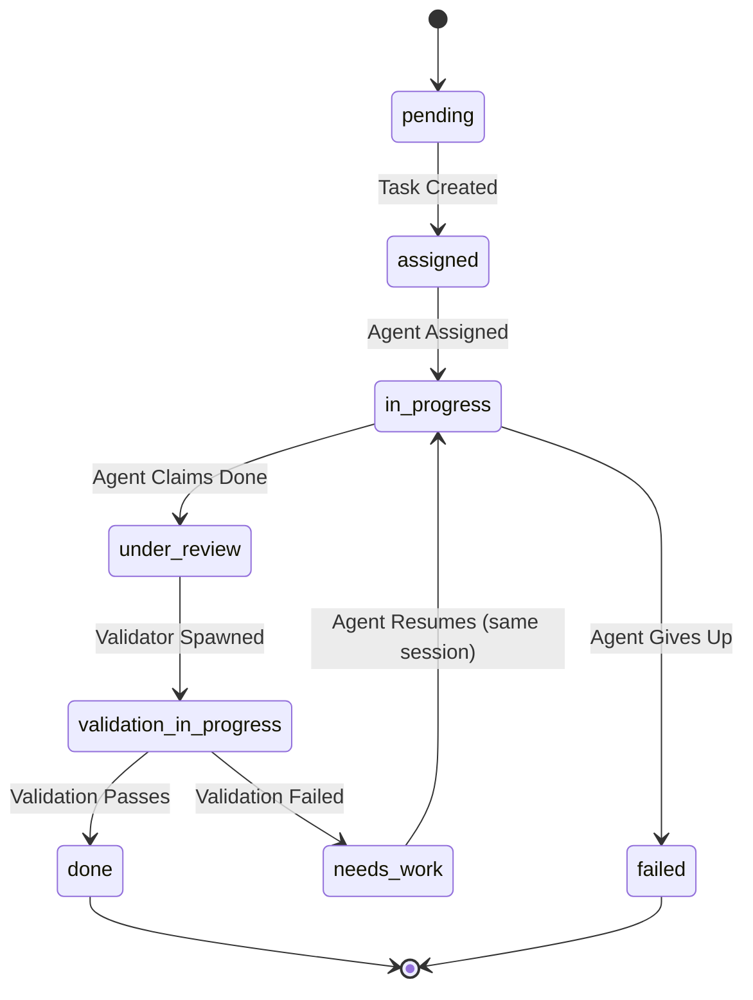

# Validation System Requirements

## Document Overview

This document defines normative requirements for the Validation Agent System, including state machine extensions, database artifacts, API contracts, configuration, events, and Pydantic reference models.

**Parent Document**: [Multi-Agent Orchestration Requirements](../multi_agent_orchestration.md)

---

## 1. State Machine Extensions

#### REQ-VAL-SM-001: Validation States
THE SYSTEM SHALL support the following validation states and transitions:



#### REQ-VAL-SM-002: Guards
- Transition to `under_review` requires agent to publish completion signal and commit SHA (if applicable).
- Transition to `validation_in_progress` requires successful validator spawn.
- Transition to `done` requires `validation_passed==true`.
- Transition to `needs_work` requires `validation_passed==false` and feedback present.

---

## 2. Data Model Requirements

### 2.1 Task Model Extensions
#### REQ-VAL-DM-001
Add the following fields to Task:
- `validation_enabled: bool` (default: false)
- `validation_iteration: int` (default: 0)
- `last_validation_feedback: str | null`
- `review_done: bool` (default: false)

Update rules:
- On entering `under_review`, increment `validation_iteration` by 1.
- On `validation_in_progress → done`, set `review_done=true`.
- On `needs_work`, set `last_validation_feedback`.

### 2.2 Agent Model Extensions
#### REQ-VAL-DM-002
Add to Agent:
- `agent_type: Enum(phase|validator|monitor)`
- `kept_alive_for_validation: bool` (default: false)

### 2.3 ValidationReview Artifact (DB Table)
#### REQ-VAL-DM-003
The system SHALL persist validation reviews with at least the following fields and constraints:
- `id TEXT PK`
- `task_id TEXT NOT NULL FK -> tasks(id)`
- `validator_agent_id TEXT NOT NULL FK -> agents(id)`
- `iteration_number INT NOT NULL`
- `validation_passed BOOLEAN NOT NULL`
- `feedback TEXT NOT NULL`
- `evidence JSON`
- `recommendations JSON`
- `created_at TIMESTAMP DEFAULT CURRENT_TIMESTAMP`
Foreign keys must be enforced; `iteration_number` must match task’s current iteration.

---

## 3. Validator Lifecycle

#### REQ-VAL-LC-001: Spawn Validator
WHEN a task enters `under_review` AND `validation_enabled=true`, THE SYSTEM SHALL spawn a validator agent and transition to `validation_in_progress`.

#### REQ-VAL-LC-002: Feedback Delivery
THE SYSTEM SHALL deliver validator feedback to the originating agent via a transport-agnostic messaging channel (e.g., in-process callbacks, IPC, HTTP, or event bus), without assuming tmux.

#### REQ-VAL-LC-003: Git Integration
Each validation attempt SHOULD create a commit capturing validation artifacts (diffs, evidence) for traceability.

---

## 4. Configuration (Normative)

| Parameter | Default | Range | Description |
|-----------|---------|-------|-------------|
| enabled_by_default | false | bool | Enables validation for new tasks |
| max_iterations | 10 | 1–50 | Maximum validation loops per task |
| iteration_timeout_minutes | 30 | 1–240 | Timeout for a single iteration |
| validator_timeout_minutes | 10 | 1–120 | Timeout for validator agent work |
| keep_failed_iterations | true | bool | Preserve failed review records |
| auto_create_followups | true | bool | Auto-create fix tasks when failed |

---

## 5. API (Normative)

### 5.1 Endpoints Table

| Endpoint | Method | Purpose | Request Body (min) | Responses |
|---------|--------|---------|--------------------|-----------|
| /api/validation/give_review | POST | Submit validation review for a task | `{ task_id, validator_agent_id, validation_passed, feedback, evidence?, recommendations? }` | 200 OK: `{ status: "completed"|"needs_work", message, iteration }`; 400: `{ error }`; 403: `{ error }` (non-validator); 404: `{ error }` |
| /api/validation/spawn_validator | POST | Spawn validator for task | `{ task_id, commit_sha? }` | 200 OK: `{ validator_agent_id }`; 409: `{ error }` (already running); 404: `{ error }` |
| /api/validation/send_feedback | POST | Deliver feedback to agent | `{ agent_id, feedback }` | 200 OK: `{ delivered: true }`; 404: `{ error }` |
| /api/validation/status | GET | Fetch validation status for task | `?task_id=...` | 200 OK: `{ task_id, state, iteration, review_done, last_feedback }`; 404: `{ error }` |

Notes:
- All responses MUST include a stable `error` field on failure.
- `give_review` MUST enforce “validator agents only.”

### 5.2 WebSocket/Event Contracts

| Event | When Emitted | Payload (min) |
|-------|---------------|---------------|
| validation_started | Task enters `validation_in_progress` | `{ task_id, iteration }` |
| validation_review_submitted | Review saved | `{ task_id, iteration, passed, validator_agent_id }` |
| validation_passed | Task marked `done` | `{ task_id, iteration }` |
| validation_failed | Task marked `needs_work` | `{ task_id, iteration, feedback }` |

---

## 6. SLOs & Performance

#### REQ-VAL-SLO-001
Validation cycle should add 2–10 minutes per task under normal conditions; single iteration timeout enforced by configuration.

#### REQ-VAL-SLO-002
Validator agent startup P95 < 30s; review persistence P95 < 200ms.

---

## 7. Security & Audit

#### REQ-VAL-SEC-001
Only agents with `agent_type=validator` MAY call review endpoints; all actions MUST be audited with actor, task_id, iteration, and result.

---

## 8. Memory Integration

#### REQ-VAL-MEM-001: Persist Validation Outcomes
For each validation iteration, THE SYSTEM SHOULD create or update a memory entry via the Agent Memory System capturing:
- task_id and ticket_id,
- validation_passed flag,
- feedback text,
- evidence and recommendations (if present),
- iteration number.

#### REQ-VAL-MEM-002: Use Memory for Validator Context
Validator agents MAY retrieve prior validation memories and playbook entries for the same ticket or component to:
- avoid repeating failed approaches,
- reuse prior evidence and patterns,
- refine result_criteria when gaps are identified.

---
## 9. Diagnosis Integration

#### REQ-VAL-DIAG-001: Auto-Spawn on Repeated Failures
If the same task records `consecutive_validation_failures >= DIAG_VALIDATION_FAILURES_THRESHOLD` (default 2), THE SYSTEM SHALL start a Diagnosis Agent for the task and attach the resulting report to the ticket.

#### REQ-VAL-DIAG-002: Auto-Spawn on Iteration Timeout
If a validation iteration exceeds `validator_timeout_minutes`, and `DIAG_ON_VALIDATION_TIMEOUT=true`, THE SYSTEM SHALL start a Diagnosis Agent focused on timeout causes (environment, dependency, or criteria ambiguity).

### 9.1 Configuration

| Parameter | Default | Range | Description |
|-----------|---------|-------|-------------|
| DIAG_ON_VALIDATION_FAILURES | true | bool | Enable diagnosis on repeated fails |
| DIAG_VALIDATION_FAILURES_THRESHOLD | 2 | 1–10 | Consecutive failures before spawn |
| DIAG_ON_VALIDATION_TIMEOUT | true | bool | Enable diagnosis on validation timeout |

---

## 8. Pydantic Reference Models

```python
from __future__ import annotations
from datetime import datetime
from enum import Enum
from typing import Any, Dict, List, Optional
from pydantic import BaseModel, Field


class ValidationState(str, Enum):
    PENDING = "pending"
    ASSIGNED = "assigned"
    IN_PROGRESS = "in_progress"
    UNDER_REVIEW = "under_review"
    VALIDATION_IN_PROGRESS = "validation_in_progress"
    NEEDS_WORK = "needs_work"
    DONE = "done"
    FAILED = "failed"


class ValidationReview(BaseModel):
    id: str
    task_id: str
    validator_agent_id: str
    iteration_number: int
    validation_passed: bool
    feedback: str
    evidence: Optional[Dict[str, Any]] = None
    recommendations: Optional[List[str]] = None
    created_at: datetime


class ValidationReviewRequest(BaseModel):
    task_id: str
    validator_agent_id: str
    validation_passed: bool
    feedback: str
    evidence: Optional[Dict[str, Any]] = None
    recommendations: Optional[List[str]] = None


class ValidationReviewResponse(BaseModel):
    status: str  # "completed" | "needs_work"
    message: str
    iteration: int
```

---

## Related Documents

- [Task Queue Management Requirements](./task_queue_management.md)
- [Monitoring & Fault Tolerance Requirements](../monitoring/fault_tolerance.md)
- [MCP Integration Requirements](../integration/mcp_servers.md)

---

## Revision History

| Version | Date | Author | Changes |
|---------|------|--------|---------|
| 1.0 | 2025-11-16 | AI Spec Agent | Initial draft |


