import { Callout } from 'fumadocs-ui/components/callout';
import { Card, Cards } from 'fumadocs-ui/components/card';
import { Step, Steps } from 'fumadocs-ui/components/steps';

# Welcome to OmoiOS

OmoiOS is a spec-driven, multi-agent orchestration system that combines autonomous agent execution with structured workflows for scalable software development.

<Callout type="info">
  **New to OmoiOS?** Start with the [Quick Start](/docs/getting-started/quick-start) guide to deploy your first agent in 5 minutes.
</Callout>

## What is OmoiOS?

OmoiOS enables teams to:

- **Scale development without scaling headcount** - Autonomous agents handle routine development tasks
- **Maintain quality through structured workflows** - Specs flow through Requirements → Design → Tasks → Execution
- **Stay in control with phase gates** - Human oversight at critical decision points
- **Track everything with dependency graphs** - Visualize and manage complex project dependencies

## Getting Started

<Cards>
  <Card
    icon={🚀}
    title="Quick Start"
    description="Deploy your first agent and create a spec in 5 minutes"
    href="/docs/getting-started/quick-start"
  />
  <Card
    icon={⚙️}
    title="Installation"
    description="Set up OmoiOS locally with Docker and configure your environment"
    href="/docs/getting-started/installation"
  />
  <Card
    icon={💡}
    title="Core Concepts"
    description="Learn about specs, phases, agents, and how they work together"
    href="/docs/getting-started/concepts"
  />
</Cards>

## Core Features

### Spec-Driven Development

Every feature starts with a spec that flows through structured phases:

<Steps>
  <Step>
    **Explore** - Research and understand the problem space
  </Step>
  <Step>
    **Requirements** - Define what needs to be built
  </Step>
  <Step>
    **Design** - Create technical architecture
  </Step>
  <Step>
    **Tasks** - Break down into actionable work items
  </Step>
  <Step>
    **Execution** - Agents implement the solution
  </Step>
</Steps>

### Multi-Agent Orchestration

OmoiOS coordinates multiple AI agents working in parallel:

<Cards>
  <Card icon={📋} title="Task Queue">
    Priority-based assignment with dependency tracking
  </Card>
  <Card icon={💓} title="Health Monitoring">
    Real-time agent status with automatic recovery
  </Card>
  <Card icon={⚡} title="Event-Driven">
    Redis pub/sub for state synchronization
  </Card>
</Cards>

### Phase Gates

Quality checkpoints between workflow phases:

<Cards>
  <Card icon={🔍} title="Automated Checks">
    Run quality validations automatically at each gate
  </Card>
  <Card icon={✅} title="Manual Approval">
    Human review and approval workflows when needed
  </Card>
  <Card icon={⚙️} title="Configurable">
    Define custom conditions and criteria per project
  </Card>
</Cards>

## Architecture Overview

```mermaid
flowchart LR
    subgraph platform["OmoiOS Platform"]
        specs["📋 Specs"]
        tasks["📝 Tasks"]
        agents["🤖 Agents"]
        eventbus[("⚡ Event Bus")]

        specs -->|"define"| tasks
        tasks -->|"assign"| agents
        agents -->|"complete"| specs

        specs -.->|"publish"| eventbus
        tasks -.->|"publish"| eventbus
        agents -.->|"publish"| eventbus
    end
```

## Need Help?

<Cards>
  <Card
    icon={📚}
    title="Guides"
    description="Step-by-step tutorials for common workflows"
    href="/docs/guides"
  />
  <Card
    icon={✨}
    title="Features"
    description="Detailed documentation for all features"
    href="/docs/features"
  />
  <Card
    icon={🔧}
    title="API Reference"
    description="Technical API documentation and endpoints"
    href="/docs/api-reference"
  />
</Cards>
